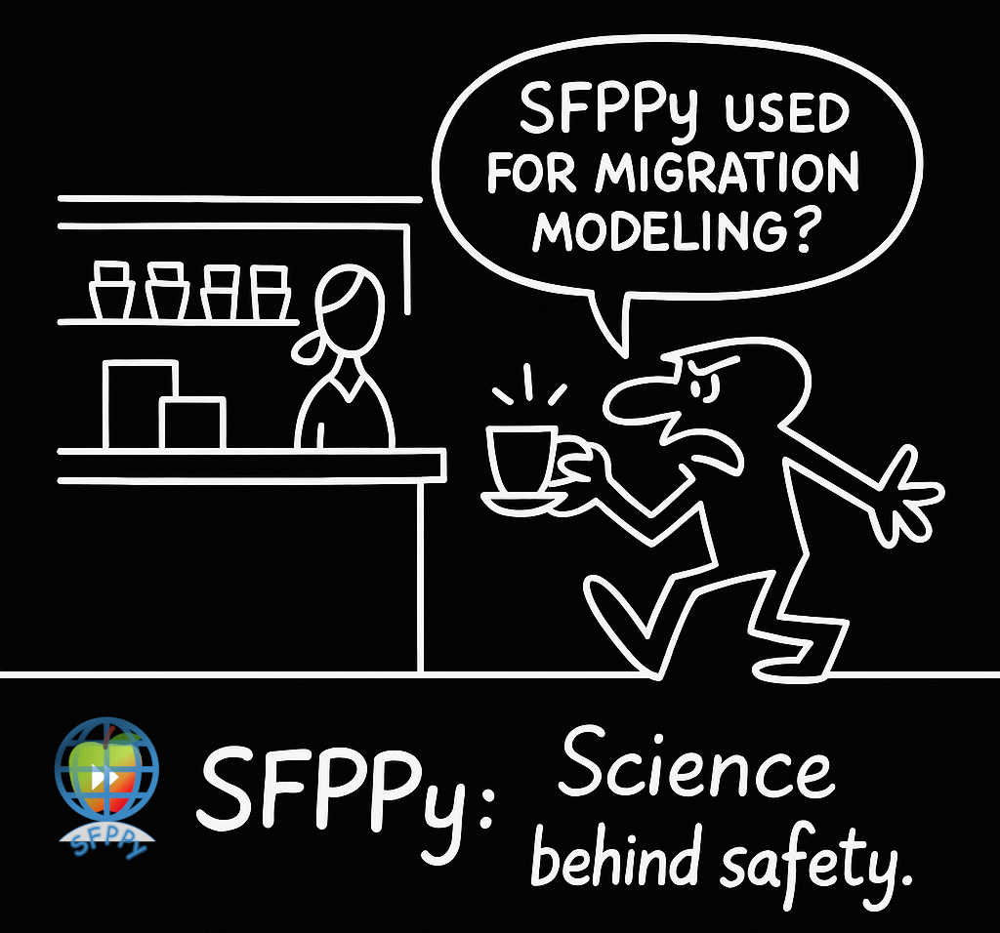
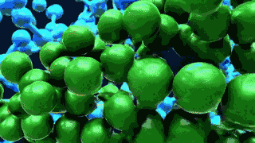
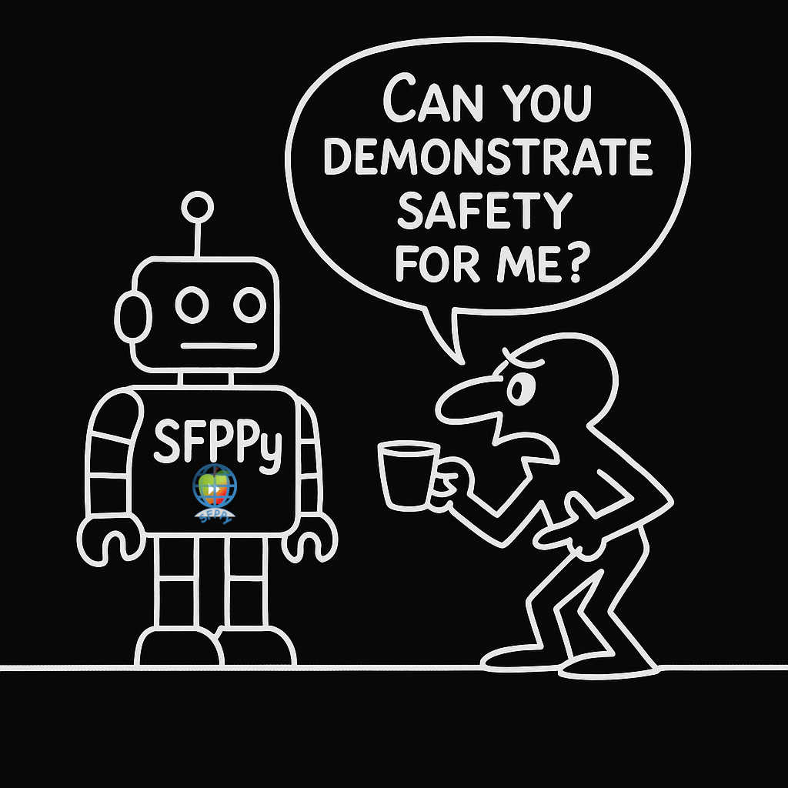
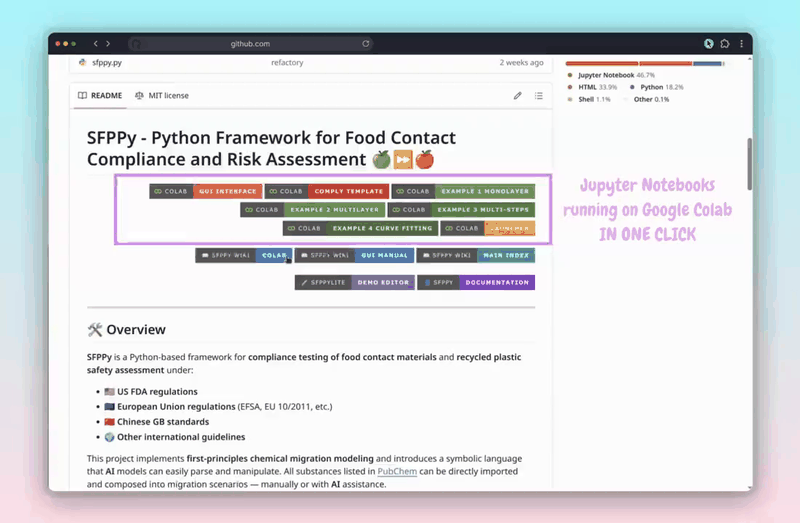
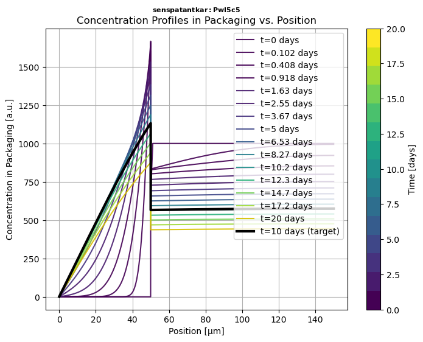

# **SFPPy** - Python Framework for Food Contact Compliance and Risk Assessment 🍏⏩🍎

<div align="center">

|  | This project is part of the <br />[Generative Simulation](https://github.com/ovitrac/generativeSimulation) demonstrators | Say it.<br />Simulate it with AI. |  |
| :--------------------------------------------- | ------------------------------------------------------------ | --------------------------------- | -----------------------------------------------------------: |

</div>

---

<div align="center">



</div>

---


<div align="right">
<!-- Colab Badges -->
<a href="https://colab.research.google.com/github/ovitrac/SFPPy/blob/main/notebooks/gui.ipynb" target="_blank" title="Try SFPPy with a graphical interface on Google Colab"></a>
<a href="https://colab.research.google.com/github/ovitrac/SFPPy/blob/main/notebooks/comply.ipynb" target="_blank" title="Edit your compliance SFPPy notebook on Google Colab"></a>
<a href="https://colab.research.google.com/github/ovitrac/SFPPy/blob/main/notebooks/example1.ipynb" target="_blank" title="Run example 1 on Google Colab"></a>
<a href="https://colab.research.google.com/github/ovitrac/SFPPy/blob/main/notebooks/example2.ipynb" target="_blank" title="Run example 2 on Google Colab"></a>
<a href="https://colab.research.google.com/github/ovitrac/SFPPy/blob/main/notebooks/example3.ipynb" target="_blank" title="Run example 3 on Google Colab"></a>
<a href="https://colab.research.google.com/github/ovitrac/SFPPy/blob/main/notebooks/example4.ipynb" target="_blank" title="Run example 4 on Google Colab"></a>
<a href="https://colab.research.google.com/github/ovitrac/SFPPy/blob/main/index.ipynb" target="_blank" title="Our collection of tools on Google Colab"></a>
<!-- Wiki Badges -->
<a href="https://ovitrac.github.io/SFPPy/wikipages/colab/colab.html" target="_blank" title="SFPPy Wiki: Colab"></a>
<a href="https://ovitrac.github.io/SFPPy/wikipages/gui/gui_manual.html" target="_blank" title="SFPPy Wiki: GUI Manual"></a>
<a href="https://ovitrac.github.io/SFPPy/wikipages/" target="_blank" title="SFPPy Wiki: Main Index"></a>
<!-- Lite & Docs -->
<a href="https://ovitrac.github.io/SFPPylite/lab/index.html?path=demo.ipynb" target="_blank" title="SFPPyLite Demo – edit and run notebooks directly in your browser">
  
</a>
<a href="https://ovitrac.github.io/SFPPy/" target="_blank" title="SFPPy Documentation Website"></a>
</div>


---

<div align="center">

|  | [](https://chatgpt.com/g/g-6780fa0b1180819198ea1d962dd4064c-sfppy) <br/> 🔥A custom AI assistant 🤖 extensively trained on **SFPPy** 🏋🏻. It helps you explore and use the framework: from the **principles of migration modeling** ⚙️ to **first simulations** 📈, **regulatory compliance** ✅, **interpretation** 📊, and **reporting**📝. |
| :----------------------------------------------------------: | :----------------------------------------------------------- |
|  | 🧠🛡️ **SFPPy 1.5** brings **design-for-compliance** to packaging with tiers **M0–M3** , *explicit performance indicators*, *open data*, *AI-assisted reasoning*. It automates **risk assessment** for the 100s of chromatogram peaks in **recycled-material extracts**.<br /><small>**Read our 📄 technical paper [here](https://ovitrac.github.io/SFPPy/wikipages/SafeByDesign/sfppydesign.html)**.</small> |

</div>


---

## 🛠️ Overview

**SFPPy** is a Python-based framework with *ready-to-use* [Notebooks](https://en.wikipedia.org/wiki/Notebook_interface) for **compliance testing of food contact materials** and **recycled plastic safety assessment** under:

- 🇺🇸 **[US FDA regulations](https://www.fda.gov/food/food-ingredients-packaging/packaging-food-contact-substances-fcs)** | The last [FCN list](https://www.fda.gov/food/packaging-food-contact-substances-fcs/inventory-effective-food-contact-substance-fcs-notifications) <kbd>1698 records</kbd> is shipped with SFPPy.
- 🇪🇺 **[European Union regulations](https://food.ec.europa.eu/food-safety/chemical-safety/food-contact-materials_en)** (EFSA, EU 10/2011, etc.) | The last [Annex I](https://echa.europa.eu/plastic-material-food-contact) <kbd>1194 records</kbd> is shipped with SFPPy .
- 🇨🇳 **[Chinese GB standards](https://www.sdtdata.com/fx/fmoa/tsLibCard/163514.html)** | The [Positive lists A1-A7](http://down.foodmate.net/standard/sort/3/49855.html)  <kbd>1293 records</kbd> are shipped with SFPPy.
- 🌍 **Other international guidelines** | SFPPy is already shipped with <kbd>2566 substances</kbd>.

This project implements **first-principles chemical migration modeling** and introduces a symbolic language and pipelines that **AI** models can easily parse and manipulate. All substances listed in [PubChem](https://pubchem.ncbi.nlm.nih.gov/) can be directly imported and composed into migration scenarios — manually or with **AI** assistance.

> [!NOTE]
>
> ⋆.˚☁️⋆ You can use **SFPPy** entirely through **Google Colab**, with <u>no installation</u> and minimal code. **GUI**-based tools, complete templates, and progressively complex examples are all available through the **Colab badges** above ( [🎬 full video](https://ovitrac.github.io/SFPPy/wikipages/colab/colab_demo.html)).
>
> A sister project — [**SFPPyLite 🌐**](https://github.com/ovitrac/SFPPylite) — lets you run **SFPPy notebooks directly in your browser**, with no installation or server required. 
> 
> 
> 
> 📥 **SFPPy** can be installed locally in any Python (>3.8) environment and work with any notebook manager ([see section Quick Start](#-quick-start)).

#### Why Notebooks?

<details>
    <summary>Click to expand</summary>

📚Notebooks offer a literate and dynamic way to evaluate food safety. They unify **problem description**, **parameterization**, **simulation**, **evaluation**, and **reporting** into a single, shareable document. This workflow is ideal for traceability and regulatory validation.  
🗣️**AI assistants** also understand notebooks surprisingly well and can help you interactively. Below is how Gemini (Google's LLM) described the `comply.ipynb` notebook directly from [this link](https://colab.research.google.com/github/ovitrac/SFPPy/blob/main/notebooks/comply.ipynb):

>📖 **Notebook Description | case of `notebooks/comply.ipynb`**
>
> This notebook demonstrates how to evaluate substance migration from a polymeric sleeve into a packaged food simulant using SFPPy. The notebook automates key tasks, including retrieving chemical properties, defining package geometries, applying polymer parameters, and running mass transfer models. It also captures all results and underlying assumptions, providing a clear and traceable record of the simulation process for validation and regulatory assessment.
>
>📌  **Short Manual**
>
> To demonstrate compliance for a list of substances, a given packaging, and food application using this notebook, follow these steps:
>
> 1. **Define the migrants.** Create a list of `migrant` objects, one for each substance you want to evaluate. You can use the `migrant` class to retrieve chemical properties and regulatory data from internal databases.
> 2. **Define the packaging.** Use the `Packaging3D` class to define the geometry of the packaging. You can specify the dimensions and material properties of the packaging.
> 3. **Define the food simulant.** Use the `food` class to define the food simulant. You can specify the type of food, the contact time, and the contact temperature.
> 4. **Run the simulations.** Use the `%`, `<<`, and `>>` operators to run the simulations. The `%` operator injects a substance into the simulation, the `<<` operator inherits properties from the packaging and food simulant, and the `>>` operator propagates the simulation.
> 5. **Evaluate the results.** The results of the simulations are stored in the `CF` variable. You can use this variable to evaluate the concentration of each substance in the food simulant at the end of the contact time.
>
>📌  **Reasoning**
>
> These steps are necessary to demonstrate compliance because they ensure that all relevant factors are considered when evaluating the risk of substance migration. By following these steps, you can generate a clear and traceable record of the simulation process that can be used for validation and regulatory assessment

</details>

## 📁 Main Modules (Located in `patankar/`)

- **`migration.py`** 🏗️ - Core solver using a Patankar finite-volume method for mass transfer modeling.
- **`geometry.py`** 📐 - Defines 3D packaging geometries and calculates volume/surface area.
- **`food.py`** 🍎 - Models food layers and their interactions with packaging.
- **`layer.py`** 📜 - Defines materials and layers for multilayer packaging.
- **`property.py`** 📊 - Computes physical and chemical properties (e.g., diffusion, partitioning).
- **`loadpubchem.py`** 🔬 - Retrieves molecular properties from [PubChem](https://pubchem.ncbi.nlm.nih.gov/) (cached locally) and toxicological data from [ToxTree](https://toxtree.sourceforge.net/).

#### Why Patankar?

<details>
  <summary>📜 Click to expand</summary>


> 📌 The `patankar` folder is named in honor of **Suhas V. Patankar**, who developed and popularized the **[finite volume method](https://catatanstudi.wordpress.com/wp-content/uploads/2010/02/numerical-heat-transfer-and-fluid-flow.pdf)**, which this project adapts for **mass transfer problems with an arbitrary number of Rankine discontinuities**.
>
> 📌 The modules include **a knowledge management system** via extensible classes, allowing easy expansion to cover additional cases and implement new prediction methods.

</details>


***

## 🚀 Quick Start

```bash
# Clone the repository
git clone https://github.com/ovitrac/SFPPy.git
cd SFPPy

# Install dependencies
pip install -r requirements.txt
```


> [!TIP]
>
> 🧭 **New to SFPPy? Start with the [Wiki Pages](https://ovitrac.github.io/SFPPy/wikipages/)** for examples, documentation, and guidance.
>
> All examples (`example1` to `example4`) are provided as both **Python scripts** and **Jupyter notebooks**.
> For compliance workflows, **notebooks are recommended** as they allow you to document your assumptions, inputs, results, and interpretations in one place.
>
> ☁️ You can run everything online for free using [**Google Colab**](https://colab.research.google.com/).
> See [installation instructions](https://ovitrac.github.io/SFPPy/wikipages/#installation/googlecolab.html) and the full [Colab manual](https://ovitrac.github.io/SFPPy/wikipages/#colab/colab.html) in the wiki.
>
> 💻 Prefer local work? Use [**Jupyter**](https://jupyter.org/) on your machine.
>
> 💫 Need a lightweight web version? Try [**SFPPyLite🌐**](https://ovitrac.github.io/SFPPylite/l) in your browser — no setup required — for editing and from basic to advanced calculations.  ⚠️ *Note: Toxicological assessment via ToxTree is not available and the connectivity to PubChem is more limited*.


***

## 💡 Usage Snippets

`SFPPy` is fully object-oriented and supports multiple syntax styles, ranging from a *functional approach* to a more abstract, *operator-driven paradigm*—all in a **Pythonic** manner. The snippets below demonstrate both approaches.


### Snippet 1️⃣ | Simple Migration Simulation

<details>
  <summary>📜 Click to expand</summary>


```python
from patankar.food import ethanol  # food database
from patankar.layer import layer  # material database

# Define the food contact medium and layers
simulant = ethanol() # here a food simulant
A = layer(layername="layer 1 (contact)", D=1e-15, l=50e-6, C0=0, k=1)  # SI units
B = layer(layername="layer 2", D=(1e-9, "cm**2/s"), l=(100, "um"),k=2)
multilayer = A + B  # layer A is contact (food is on the left)

# Run solver, plot the migration kinetics CF(t) and concentration profiles in P Cx(x,t)
solution = simulant.migration(multilayer)
hCF = solution.plotCF()  # concentration kinetic in the simulant (F) for default times
hCx = solution.plotCx()  # concentration profile in the multilayer packaging
# Print in PDF and PNG, export to Excel
hCF.print("myresult")
solution.comparison.save_as_csv("myresult.csv") # CSV format
solution.comparison.save_as_excel("myresult.xlsx") # Excel format
```

> 📌 $D$ is the diffusivity, $l$ is the thickness layer, and $C_0$ is the initial concentration.





</details>

***

### Snippet 2️⃣ | Retrieving Molecular Properties and Toxicological Data

<details>
  <summary>🔍 Click to expand</summary>


```python
from patankar.loadpubchem import migrant  # connect to pubchem for missing substances
from patankar.food import oliveoil,water  # food simulants 
from patankar.layer import gPET           # "glassy" PET (i.e., T<Tg)
m = migrant("bisphenol A")                # bisphenol A = BPA
# Print basic properties
print(m.M, m.logP, m.polarityindex)       # Molecular weight, logP value, polarity Index P'
print(m.smiles)                           # CC(C)(C1=CC=C(C=C1)O)C2=CC=C(C=C2)O

# Add BPA to material (P) and food simulants (F1,F2) to calculate binary properties
F1 = oliveoil(migrant=m)                  # F1 = food simulant oliver oil with BPA
F2 = water(migrant=m)                     # F2 = water with BPA
P = gPET(migrant=m)                       # P = PET with BPA
KFP1 = P.k / F1.k     # F-to-P1 partition coefficient, k= Henry-like coefficients
KFP2 = P.k / F2.k     # F-to-P2 partition coefficient, k= Henry-like coefficients
# Print partition coefficients, with k values calculated from Flory-Huggins theory
print(KFP1,KFP2)      # [0.93498524] [0.00093499]
```

>📌 The examples show how to inject `m` into  $F$=`food` (*various classes* ) and $P$=polymer `layer` (*various classes*) to get customized and conservative simulations for specific substances and polymers. All properties, diffusivities $D$, Henry-like coefficients $k$ are calculated automatically based from their names. 

**Add toxicological data from Toxtree**

```python
from patankar.loadpubchem import migrantToxtree # combine PubChem and ToxTree
substance = migrantToxtree("formaldehyde")
```

`output`

```
<migrantToxtree object>
               Compound: formaldehyde
                   Name: formaldehyde
                    cid: 712
                    CAS: 50-00-0
                M (min): 30.026
                M_array: [30.026]
                formula: CH2O
                 smiles: C=O
               InChiKey: WSFSSNUMVMOOMR-UHFFFAOYSA-N
                   logP: [1.2]
              P' (calc): [3.91591487]
       ---🇪🇺 EC 10/2011: ---------------
                    SML: 15.0 [mg/kg]
           part a group: of 3 substances
             EC|FCM|REF: 200-001-8|98|1726054880
      ---🇺🇸 US FCN list: ---------------
                 FCM No: 1380
               Notifier: Troy Corporation
           Manufacturer: Troy Corporation
                N. Date: 05/15/2014
   ---🇨🇳 CN GB9685-2016: ---------------
                 FCA No: 0895
          authorized in: ['coatings', 'adhesi [...] , 'paper and board']
          ---𖣂︎ ToxTree: ---------------
            𖣂Toxicology: Low (Class I)
                   𖣂TTC: 1.5 [µg/kg bw/day]
                𖣂CF TTC: 0.09 [mg/kg food intake]
              ⚠️ Alert 1: Alert For Schiff Bas [...] Formation Identified
Out: <migrantToxtree: UN2209 - M=30.026 g/mol>
```

> 📌 A local installation of Toxtree (java) is included with SFPPy.
> 
> 📌 The [Annex I](https://echa.europa.eu/plastic-material-food-contact) of the  European FCM and Articles Regulation is integrated as a full database in SFPPy 


</details>

***


### Snippet 3️⃣ | Defining a Custom Packaging Shape

<details>
  <summary>📦 Click to expand</summary>


```python
from patankar.geometry import Packaging3D  # import basic shapes
pkg = Packaging3D('bottle', # bottle is a composite shape
                  body_radius=(5, 'cm'), body_height=(0.2, 'm'),
                  neck_radius=(19, "mm"), neck_height=(40, "mm"))
vol, area = pkg.get_volume_and_area() # extract volume and surface area
print("Volume (m³):", vol)
print("Surface Area (m²):", area)
```

> 📌 The examples show how to use either `pkg` or its properties to achieve mass transfer simulation for a specific geometry.
>
> 📌 To efficiently simulate the migration of substances from packaging materials, SFPPy **unfolds complex 3D packaging geometries** into an equivalent **1D representation**. This transformation assumes that **substance desorption is predominantly governed by diffusion within the walls** of the packaging.
>
> 📌 The `geometry.py` module provides tools to compute **surface-area-to-volume ratios**, extract wall thicknesses, and generate equivalent **1D models** for mass transfer simulations.


</details>

***

### Snippet 4️⃣ | Using  **⏩**  as Mass Transfer Operator in Chained Simulations

<details>
 <summary>📦 Click to expand</summary>


> 📌 **SFPPy** leverages **multiple inheritance** to define food contact conditions by combining **storage conditions**, **food types**, and **physical properties**.  
>
> 📌 Additionally, **three operators** play a key role in SFPPy’s intuitive syntax:  
>
>  - **➕** for **combining layers** and **merging results**  
>  - **⏩** for naturally representing **mass transfer**  
>  - **%** for introducing a **new substance** in the pipeline assessed  
>
> With these operators, **mass transfer** can be abstracted into a simple, visual representation:  
> 
> 1. **🍏⏩🍎**  
>    _(Direct transfer from green to red, symbolizing migration.)_  
> 
> 2. **🍏⏩🟠⏩🍎**  
>    _(Includes an intermediate step, depicting progressive migration.)_  
> 
> 3. **🍏⏩🟡⏩🟠⏩🍎**  
>    _(More detailed, illustrating **multiple contamination stages** over time.)_  
> 
> 4. **⌬%🍏⏩🍎**  
>    _(Emphasizes **new substance**.)_  

🌟 **SFPPy** makes this abstraction possible with simple, expressive code.

```python
from patankar.layer import gPET, PP
from patankar.food import ambient, hotfilled, realfood, fat, liquid, stacked
from patankar.loadpubchem import migrant

# Define migrant and packaging layers (ABA: PET-PP-PET)
m = migrant("limonene")
m2 = migrant("toluene") # alternative substance
A = gPET(l=(20, "um"), migrant=m, C0=0)
B = PP(l=(500, "um"), migrant=m, C0=200)  
ABA = A + B + A  # the most left layer is contact (food on the left)

# Define storage and processing conditions:
# 1:storage in stacks >> 2:hot-filled container >> 3:long-term storage of packaged food
class contact1(stacked, ambient): name = "1:setoff"; contacttime = (4, "months")
class contact2(hotfilled, realfood, liquid, fat): name = "2:hotfilling"
class contact3(ambient, realfood, liquid, fat): name = "3:storage"; contacttime = (6, "months")

# Instantiate and simulate with ⏩
medium1, medium2, medium3 = contact1(), contact2(), contact3()
m2 % medium1 >> ABA >> medium1 >> medium2 >> medium3  # Automatic chaining with m2 replacing m

# Merge all kinetics into a single one and plot the migration kinetics
sol123 = medium1.lastsimulation + medium2.lastsimulation + medium3.lastsimulation
sol123.plotCF()

```


### **🧩 How It Works**

Each **contact class** inherits attributes from **multiple base classes**, allowing flexible combinations of:

1. **📌 Storage Conditions**:  

   - `ambient`: Defines standard storage at room temperature  
   - `hotfilled`: Represents high-temperature filling processes  
   - `stacked`: Models setoff migration when packaging layers are stacked  

2. **🥘 Food Types & Interactions**:  

   - `realfood`: Represents actual food matrices  
   - `liquid`: Specifies that the food is a liquid  
   - `fat`: Indicates a fatty food, influencing partitioning behavior  


> 📌 **By combining classes**, SFPPy allows streamlined, physics-based simulations with minimal code and facilitates the global understanding of the framework by AI.


</details>

***

### Snippet 5️⃣ | Parameter linking **🔗** via `layerLink`

<details>
 <summary>📦 Click to expand</summary>


```python
# Any numeric property can be attached to a simulation with layerLink
from patankar.layer import layerLink
# Attach a variable function barrier thickness to ABA
fb_thickness = layerLink("l",indices=0) # index 0 = layer 1 (A) in contact with F
# Reuse ABA from Snippet 3 [...]
ABA.llink = fb_thicknesses
# Change dynamically the simulation by changing fb_thicknesses[0]
fb_thicknesses[0] = 12e-6 # 12 µm
medium1.lastsimulation.rerun()
# [...]
```

> 📌 **Dynamic parameter binding** using `layerLink` connections allows: 
>
> ✅ Dynamic updates of $D$, $k$, $l$, $C_0$ abd $T$ for specific layers only ( index `[i]` refers to the layer `i+1`).  
> ✅ Seamless integration of simulation and optimization tasks.  
> ✅ Robust handling of parameter uncertainties in complex simulation scenarios. 


</details>

***

### Snippet 6️⃣ | Ask Scientific Questions using RAG 🧠📚

<details>
 <summary>📦 Click to expand</summary>

```python
# Ask scientific or regulatory questions to a local LLM using your own knowledge base
from llama_index.core import SimpleDirectoryReader, VectorStoreIndex
from llama_index.embeddings.huggingface import HuggingFaceEmbedding
from llama_index.llms.ollama import Ollama

# Load your documentation folder (e.g. Markdown files from docs/KB)
documents = SimpleDirectoryReader(input_dir="./docs/KB", recursive=True).load_data()

# Embed and index documents (no API key needed)
embed_model = HuggingFaceEmbedding(model_name="BAAI/bge-small-en-v1.5")
index = VectorStoreIndex.from_documents(documents, embed_model=embed_model)

# Query with a local open-source LLM (e.g. mistral, phi3, llama3)
llm = Ollama(model="mistral")
query_engine = index.as_query_engine(llm=llm)

# Ask your question
response = query_engine.query("What is the definition of a functional barrier in EU Regulation 10/2011?")
print(response.response)
```

> 💡 This example illustrates how to implement a **Retrieval-Augmented Generation (RAG)** strategy with:
>
> ✅ Plain Markdown files or exported documentation
>  ✅ A local LLM such as Mistral via Ollama
>  ✅ Embeddings from HuggingFace models (no API keys)
>
> 🔐 Your KB remains local and auditable. A prebuilt ZIP file of a sample KB is included in `docs/KB.zip`.


</details>

***

## 📖 Case Studies

The project includes four detailed examples (`example1.py`, `example2.py`, `example3.py`, and `example4.py`), showcasing real-world scenarios with various materials, substances, food types, geometries, and usage conditions.

### [Example <kbd>1</kbd>](https://ovitrac.github.io/SFPPy/wikipages/#examples/example1.html): | **Mass Transfer from** ♶ **Monolayer Materials**

- 🥪 Simulates the migration of <kbd>**Irganox 1076**</kbd> and <kbd>**Irgafos 168**</kbd> from a **100 µm <kbd>LDPE</kbd>film** into a **fatty <kbd>sandwich</kbd>** 🥖over **10 days at 7°C**.
- 📈 Evaluates **migration kinetics** and their implications for food safety.

***

### [Example <kbd>2</kbd>](https://ovitrac.github.io/SFPPy/wikipages/#examples/example2.html)|  **Mass Transfer in ♻️ Recycled <kbd>PP</kbd> Bottles**

- 🍼 Investigates **<kbd>toluene</kbd> migration** from a **300 µm thick recycled <kbd>PP</kbd> bottle** into a **<kbd>fatty liquid</kbd> food**.
- 🛡️ Assesses the **effect of a <kbd>PET</kbd> functional barrier** (<kbd>FB</kbd>) of varying thickness on reducing migration.

***

### [Example <kbd>3</kbd>](https://ovitrac.github.io/SFPPy/wikipages/#examples/example3.html) |  **Advanced Migration Simulation ⛓️ with Variants**

- 📦 Simulates migration in a **trilayer (<kbd>ABA</kbd>) multilayer system**, with **<kbd>PET</kbd> (<kbd>A</kbd>) and recycled <kbd>PP</kbd> (<kbd>B</kbd>)**.
- 🔥 Evaluates migration behavior across **<kbd>storage with set-off</kbd>, <kbd>hot-filling</kbd>, and <kbd>long-term storage</kbd> conditions**.
- ⚙️ Explores **variants** where the migrant and layer thickness are modified to assess performance.
- 🍏⏩🍎 Example 3 showcases the mass transfer operator ⏩.

***

### [Example <kbd>4</kbd>](https://ovitrac.github.io/SFPPy/wikipages/#examples/example4.html) | **Parameter Fitting and Optimization** ⚙️

- ✅ **Fit diffusivities ($D$) and partitioning coefficients ($\frac{k}{k_0}$)** from migration kinetic data 📈.
- ✅ Utilize **dynamic parameter linking** 🔗🧲 with `layerLink`.
- ✅ Integrate simulation results directly with experiments for sensitivity analysis and optimization

***

### [Example <kbd>5</kbd>](https://ovitrac.github.io/SFPPy/wikipages/#examples/example5.html) |  **Regulatory QA using Local RAG 🧠📘**

- 🔍 Ask **domain-specific questions** for your organization (e.g., *What is the migration of substance XXX?* or *Do we use this substance?*) using a local LLM over your own **knowledge base**.
- 🧰 Uses **Ollama** to serve a compact and efficient open-source LLM (**Mistral**), with **HuggingFace embeddings** for semantic grounding.
- 💾 The KB resides in `docs/KB/` (an example is provided as `docs/KB.zip`) and is indexed using **ChromaDB** for reuse, versioning, and auditability.
- 🧠 Demonstrates how a **Retrieval-Augmented Generation (RAG)** pipeline can enhance regulatory and scientific reasoning using your curated Markdown corpus.

✅ **Why it matters:**

- A **local model** (under 8 GB VRAM) can answer **nontrivial, regulation-specific questions** when grounded in a structured KB.
- **No internet, no tokens, no vendor lock-in** – SFPPy becomes entirely **self-hosted, private, and auditable**.
- Your KB can include **confidential reports, regulatory texts, or internal documentation**, queried naturally and locally.

***


> [!CAUTION]
>
> These examples do not discuss sources of uncertainty. Please refer to our publications and this [link](https://ovitrac.github.io/SFPPy/MigrationModeling/) for details on the limitations of the presented approaches and assumptions.


## 

## 🌟 Why **SFPPy**?

✔️ **Free & Open Source** — No licensing, no lock-in. Use it, adapt it, share it.

✔️ **AI-Ready Design** — Symbolic, structured data and a clean Python API make `SFPPy` naturally suited for integration with AI assistants and LLMs. As part of the *Generative Simulation Initiative* 🌱, it supports **agentic SAG** (*Simulation-Augmented Generation*), combining scientific simulation with LLM reasoning to address complex **risk assessment** and **risk management** challenges.

✔️ **Chemically-oriented** — `SFPPy` is designed to use chemical information and molecular models without requiring you to estimate diffusion and partitioning properties. The connection with PubChem server extends theoretically the possibilities to any single substance.

✔️ **Chemical databases** — Parsed US (🇺🇸), EU (🇪🇺), and GB (🇨🇳) databases are included in `SFPPy` and open source.

✔️ **Flexible Unit Handling** — Supports any unit via `("unit", value)` or `(["val1", "val2"], "unit")` formats.

✔️ **Chained Operators** — Use  `>>`  to model automatic **mass transfer and property propagation** across layers and conditions. A same calculation pipe can be instantiated with different substances using the operator `%`: `substance % food << geometry >> packaging >> step1 >> step2 >> step3...`  

✔️ **Minimal Code, Maximum Expressiveness** — Concise syntax using `+` to combine materials, simulate stacks, or switch storage scenarios. Combine also results with `+`: `allsteps = step1.lastsimulation+step2.lastsimulation+step3.lastsimulation`

✔️ **Powerful Abstractions** — Integrates with **PubChem**, **ToxTree**, built-in **polymer libraries**, and **3D packaging geometries**.

✔️ **Built-in Visualization & Export** — Export results to **Excel (.xlsx)**, **CSV**, **PDF**, **PNG**, and even **MATLAB** (if you must 😉).

✔️ **Compliance Notebooks Included** — Templates and real-case notebooks guide you through regulatory testing and reporting.

✔️ **GUI-Ready Components** — Build your own graphical tools using included widgets and high-level interfaces.


***

## 📜 License

**MIT License**


***

## 🤝 Contributors

**INRAE** | **Generative Simulation Initiative** 🌱🌿🌳🍃🍂- [Olivier Vitrac](mailto:olivier.vitrac@agroparistech.fr)  
*This project is part of the SFPPy initiative, aiming to bring the SafeFoodPackaging Portal version 3 ([SFPP3](https://sfpp3-simulation.contactalimentaire.fr/cgi-bin/login.cgi)) to the general public.*

$2025-09-12$


---

*For further details, consult the [online documentation](https://ovitrac.github.io/SFPPy/) and the [release page](https://github.com/ovitrac/SFPPy/releases) for new capabilities.*

***

<pre>
🍽️🍽️🍽️🍽️🍽️🍽️🍽️🍽️🍽️🍽️🍽️🍽️🍽️🍽️🍽️🍽️🍽️🍽️🍽️🍽️🍽️🍽️🍽️🍽️🍽️🍽️🍽️🍽️🍽️🍽️🍽️🍽️🍽️🍽️🍽️
🍽️🍽️🍎🍎🍎🍎🍽️🍽️🍎🍎🍎🍎🍎🍽️🍽️🍏🍏🍏🍏🍽️🍽️🍽️🍎🍎🍎🍎🍽️🍽️🍽️🍽️🍽️🍽️🍽️🍽️🍽️
🍽️🍎🍽️🍽️🍽️🍽️🍽️🍽️🍎🍽️🍽️🍽️🍽️🍽️🍽️🍏🍽️🍽️🍽️🍏🍽️🍽️🍎🍽️🍽️🍽️🍎🍽️🍽️🐍🍽️🍽️🍽️🐍🍽️
🍽️🍽️🍎🍎🍎🍽️🍽️🍽️🍎🍎🍎🍎🍽️🍽️🍽️🍏🍏🍏🍏🍽️🍽️🍽️🍎🍎🍎🍎🍽️🍽️🍽️🍽️🐍🍽️🐍🍽️🍽️
🍽️🍽️🍽️🍽️🍽️🍎🍽️🍽️🍎🍽️🍽️🍽️🍽️🍽️🍽️🍏🍽️🍽️🍽️🍽️🍽️🍽️🍎🍽️🍽️🍽️🍽️🍽️🍽️🍽️🍽️🐍🍽️🍽️🍽️
🍽️🍎🍎🍎🍎🍽️🍽️🍽️🍎🍽️🍽️🍽️🍽️🍽️🍽️🍏🍽️🍽️🍽️🍽️🍽️🍽️🍎🍽️🍽️🍽️🍽️🍽️🍽️🍽️🍽️🐍🍽️🍽️🍽️
🍽️🍽️🍽️🍽️🍽️🍽️🍽️🍽️🍽️🍽️🍽️🍽️🍽️🍽️🍽️🍽️🍽️🍽️🍽️🍽️🍽️🍽️🍽️🍽️🍽️🍽️🍽️🍽️🍽️🍽️🍽️🍽️🍽️🍽️🍽️ $v1.50$<br/>
</pre>


---

> [!IMPORTANT]
>
> <a href="https://github.com/ovitrac/SFPPylite" target="_blank" title="SFPPyLite GitHub Repository">
> </a> is a  lightweight, browser-based sister project of <strong>SFPPy</strong>.  It runs entirely in your browser (via <a href="https://jupyterlite.readthedocs.io/" title="JupyterLite official website" target="_blank">JupyterLite</a>) — no installation, no Python backend — and is ideal for <strong>editing files</strong>, <strong>exploring materials</strong>, or performing <strong>basic compliance calculations</strong> on the go.
>
> <a href="https://ovitrac.github.io/SFPPylite/" target="_blank" title="Launch SFPPyLite in your browser"></a>


---

### 🍏⏩🍎 `SFPPy`: Built for AI. Ready for Simulation.

🤖 +⚖️ *Can robots like **GPT** really evaluate food contact compliance using **SFPPy**?* *Check out the intriguing answers from two GPT-powered experts [here](https://github.com/ovitrac/SFPPy/wiki/🤖-Ask-GPT-to-demonstrate-compliance-with-SFPPy)!*.

| [](https://github.com/ovitrac/generativeSimulation)<small>☝🏻Click on the image to learn more.</small> | 🔮**Explore the future.**  Coding is a language—and with generative AI, we can bridge real-world problems to simulation-ready computer code. Python is the medium of choice, as it remains the most fluent language for AI systems.<br /><br />╰┈➤***Prompts accelerate simulation prototyping** and the design of complex case scenarios. Thanks to the abstract nature of this interface, there are no constraints on the level of complexity: it operates independently of the underlying mathematical or numerical methods.*<br /> |
| :----------------------------------------------------------- | :----------------------------------------------------------- |
| <small>Credits: [Olivier Vitrac](mailto:olivier.vitrac@gmail.com)</small> | 🤔**With respect to regulatory compliance**, AI assists you by generating informed scenarios and interpretations—but **you remain the decision-maker**.<br /> |

