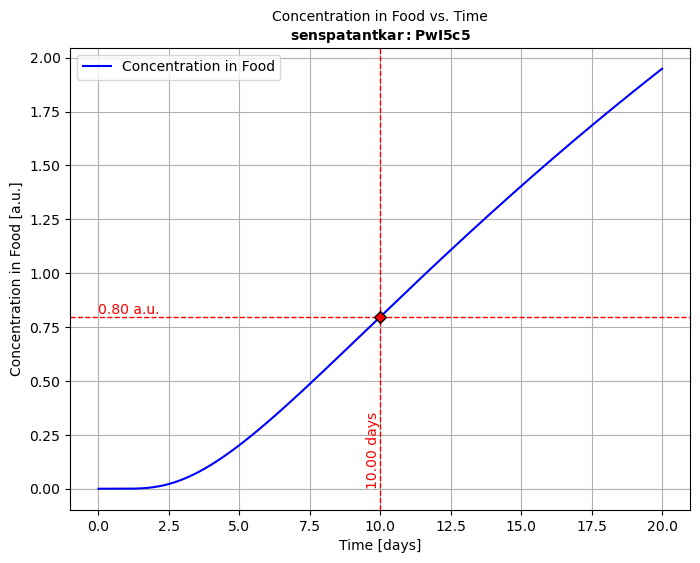
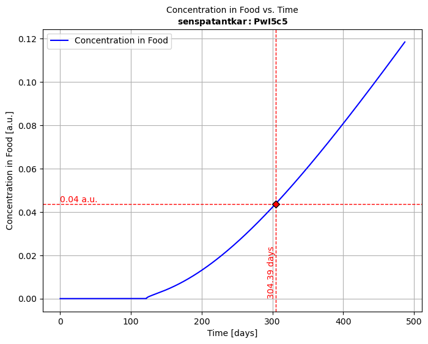

# SFPPy - Python Framework for Food Contact Compliance and Risk Assessment 🍏⏩🍎

## 🛠️ Overview

SFPPy is a Python-based framework for **compliance testing of food contact materials** and **recycled plastic safety assessment** under:

- 🇺🇸 **US FDA regulations**
- 🇪🇺 **European Union regulations** (EFSA, EU 10/2011, etc.)
- 🇨🇳 **Chinese GB standards**
- 🌍 **Other international guidelines**

This project **translates well-established chemical migration models** from MATLAB and other languages to **pure Python**, ensuring minimal dependencies.

## 📁 Main Modules (Located in `patankar/`)

- **`migration.py`** 🏗️ - Core solver using a Patankar finite-volume method for mass transfer modeling.
- **`geometry.py`** 📐 - Defines 3D packaging geometries and calculates volume/surface area.
- **`food.py`** 🍎 - Models food layers and their interactions with packaging.
- **`layer.py`** 📜 - Defines materials and layers for multilayer packaging.
- **`property.py`** 📊 - Computes physical and chemical properties (e.g., diffusion, partitioning).
- **`loadpubchem.py`** 🔬 - Retrieves molecular properties from PubChem (cached locally).

### Why Patankar?

<details>
  <summary>📜 Click to expand</summary>

> 💡 The `patankar` folder is named in honor of **Suhas V. Patankar**, who developed and popularized the **[finite volume method](https://catatanstudi.wordpress.com/wp-content/uploads/2010/02/numerical-heat-transfer-and-fluid-flow.pdf)**, which this project adapts for **mass transfer problems with an arbitrary number of Rankine discontinuities**.
>
> 🔧 The modules include a knowledge management system via extensible classes, allowing easy expansion to cover additional cases and implement new prediction methods.

</details>


***

## 🚀 Quick Start

```bash
# Clone the repository
git clone https://github.com/ovitrac/SFPPy.git
cd SFPPy

# Install dependencies
pip install -r requirements.txt
```

> **🧭 Learn how to use `SFPPy` from [Wiki Pages](https://ovitrac.github.io/SFPPy/wikipages/).**


---

***

## 💡 Usage Snippets

SFPPy is fully object-oriented and supports multiple syntax styles, ranging from a functional approach to a more abstract, operator-driven paradigm—all in a **Pythonic** manner. The snippets below demonstrate both approaches.


### Snippet 1️⃣ | Simple Migration Simulation

<details>
  <summary>📜 Click to expand</summary>

```python
from patankar.food import ethanol  # food database
from patankar.layer import layer  # material database

# Define the food contact medium and layers
simulant = ethanol() # here a food simulant
A = layer(layername="layer 1 (contact)", D=1e-15, l=50e-6, C0=0, k=1)  # SI units
B = layer(layername="layer 2", D=(1e-9, "cm**2/s"), l=(100, "um"),k=2)
multilayer = A + B  # layer A is contact (food is on the left)

# Run solver, plot the migration kinetics CF(t) and concentration profiles in P Cx(x,t)
solution = simulant.migration(multilayer)
hCF = solution.plotCF()  # concentration kinetic in the simulant (F) for default times
hCx = solution.plotCx()  # concentration profile in the multilayer packaging
# Print in PDF and PNG, export to Excel
hCF.print("myresult")
solution.comparison.save_as_csv("myresult.csv") # CSV format
solution.comparison.save_as_excel("myresult.xlsx") # Excel format
```

📝 **Notations**: $D$ is the diffusivity, $l$ is the thickness layer, and $C_0$ is the initial concentration.




</details>

***

### Snippet 2️⃣ | Retrieving Molecular Properties and Toxicological Data

<details>
  <summary>🔍 Click to expand</summary>

```python
from patankar.loadpubchem import migrant  # connect to pubchem for missing substances
from patankar.food import oliveoil,water  # food simulants 
from patankar.layer import gPET           # "glassy" PET (i.e., T<Tg)
m = migrant("bisphenol A")                # bisphenol A = BPA
# Print basic properties
print(m.M, m.logP, m.polarityindex)       # Molecular weight, logP value, polarity Index P'
print(m.smiles)                           # CC(C)(C1=CC=C(C=C1)O)C2=CC=C(C=C2)O

# Add BPA to material (P) and food simulants (F1,F2) to calculate binary properties
F1 = oliveoil(migrant=m)                  # F1 = food simulant oliver oil with BPA
F2 = water(migrant=m)                     # F2 = water with BPA
P = gPET(migrant=m)                       # P = PET with BPA
KFP1 = P.k / F1.k     # F-to-P1 partition coefficient, k= Henry-like coefficients
KFP2 = P.k / F2.k     # F-to-P2 partition coefficient, k= Henry-like coefficients
# Print partition coefficients, with k values calculated from Flory-Huggins theory
print(KFP1,KFP2)      # [0.93498524] [0.00093499]
```

<small>💡 The examples show how to inject `m` into  $F$=`food` (*various classes* ) and $P$=polymer `layer` (*various classes*) to get customized and conservative simulations for specific substances and polymers. All properties, diffusivities $D$, Henry-like coefficients $k$ are calculated automatically based from their names.</small> 

**Add toxicological data from Toxtree**

```python
from patankar.loadpubchem import migrantToxtree # combine PubChem and ToxTree
substance = migrantToxtree("formaldehyde")
```

`output`

```python
<migrantToxtree object>
     Compound: formaldehyde
         Name: formaldehyde
          cid: 712
          CAS: ['50-00-0', '8013-13 [...] 80-5', '30525-89-4']
      M (min): 30.026
      M_array: [30.026]
      formula: CH2O
       smiles: C=O
         logP: [1.2]
    P' (calc): [3.91591487]
   Toxicology: Low (Class I)
          TTC: 1.5 [µg/kg bw/day]
       CF TTC: 0.09 [mg/kg food intake]
      alert 1: Alert For Schiff Bas [...] Formation Identified
Out: <migrantToxtree: Oplossin [...]  [Dutch] - M=30.026 g/mol>
```
<small>💡 A local installation of Toxtree (java) is included with SFPPy</small> 

> For the European FCM and Articles Regulation, Annex I - Authorised Substances, use the ECHA [webpage](https://echa.europa.eu/plastic-material-food-contact)


</details>

***


### Snippet 3️⃣ | Defining a Custom Packaging Shape

<details>
  <summary>📦 Click to expand</summary>

```python
from patankar.geometry import Packaging3D  # import basic shapes
pkg = Packaging3D('bottle', # bottle is a composite shape
                  body_radius=(5, 'cm'), body_height=(0.2, 'm'),
                  neck_radius=(19, "mm"), neck_height=(40, "mm"))
vol, area = pkg.get_volume_and_area() # extract volume and surface area
print("Volume (m³):", vol)
print("Surface Area (m²):", area)
```

<small>💡 The examples show how to use either `pkg` or its properties to achieve mass transfer simulation for a specific geometry.</small>

<small>⚠️ **Note**: To efficiently simulate the migration of substances from packaging materials, SFPPy **unfolds complex 3D packaging geometries** into an equivalent **1D representation**. This transformation assumes that **substance desorption is predominantly governed by diffusion within the walls** of the packaging.</small>

<small>🔍 The `geometry.py` module provides tools to compute **surface-area-to-volume ratios**, extract wall thicknesses, and generate equivalent **1D models** for mass transfer simulations.</small>


</details>

***

### Snippet 4️⃣ | Using  **⏩**  as Mass Transfer Operator in Chained Simulations
<details>
 <summary>📦 Click to expand</summary>

📌 **SFPPy** leverages **multiple inheritance** to define food contact conditions by combining **storage conditions**, **food types**, and **physical properties**.  

📌 Additionally, **two operators** play a key role in SFPPy’s intuitive syntax:  

- **➕** for **combining layers** and **merging results**  
- **⏩** for naturally representing **mass transfer**  

With these operators, **mass transfer** can be abstracted into a simple, visual representation:  

1. **🍏⏩🍎**  
   _(Direct transfer from green to red, symbolizing migration.)_  

2. **🍏⏩🟠⏩🍎**  
   _(Includes an intermediate step, depicting progressive migration.)_  

3. **🍏⏩🟡⏩🟠⏩🍎**  
   _(More detailed, illustrating multiple contamination stages over time.)_  

4. **🍏⚡⏩🍎**  
   _(Emphasizes **active food transformation**, with accelerated mass transfer.)_  

🌟 **SFPPy** makes this abstraction possible with simple, expressive code.

```python
from patankar.layer import gPET, PP
from patankar.food import ambient, hotfilled, realfood, fat, liquid, stacked
from patankar.loadpubchem import migrant

# Define migrant and packaging layers (ABA: PET-PP-PET)
m = migrant("limonene")
A = gPET(l=(20, "um"), migrant=m, C0=0)
B = PP(l=(500, "um"), migrant=m, C0=200)  
ABA = A + B + A  # the most left layer is contact (food on the left)

# Define storage and processing conditions:
# 1:storage in stacks >> 2:hot-filled container >> 3:long-term storage of packaged food
class contact1(stacked, ambient): name = "1:setoff"; contacttime = (4, "months")
class contact2(hotfilled, realfood, liquid, fat): name = "2:hotfilling"
class contact3(ambient, realfood, liquid, fat): name = "3:storage"; contacttime = (6, "months")

# Instantiate and simulate with ⏩
medium1, medium2, medium3 = contact1(), contact2(), contact3()
medium1 >> ABA >> medium1 >> medium2 >> medium3  # Automatic chaining

# Merge all kinetics into a single one and plot the migration kinetics
sol123 = medium1.lastsimulation + medium2.lastsimulation + medium3.lastsimulation
sol123.plotCF()

```


### **🧩 How It Works**

Each **contact class** inherits attributes from **multiple base classes**, allowing flexible combinations of:

1. **📌 Storage Conditions**:  
   - `ambient`: Defines standard storage at room temperature  
   - `hotfilled`: Represents high-temperature filling processes  
   - `stacked`: Models setoff migration when packaging layers are stacked  

2. **🥘 Food Types & Interactions**:  
   - `realfood`: Represents actual food matrices  
   - `liquid`: Specifies that the food is a liquid  
   - `fat`: Indicates a fatty food, influencing partitioning behavior  

<small>🔬 **By combining these components, SFPPy allows streamlined, physics-based simulations with minimal code.** 🚀</small>


</details>

***

### Snippet 5️⃣ | Parameter linking **🔗** via `layerLink`

<details>
 <summary>📦 Click to expand</summary>

```python
# Any numeric property can be attached to a simulation with layerLink
from patankar.layer import layerLink
# Attach a variable function barrier thickness to ABA
fb_thickness = layerLink("l",indices=0) # index 0 = layer 1 (A) in contact with F
# Reuse ABA from Snippet 3 [...]
ABA.llink = fb_thicknesses
# Change dynamically the simulation by changing fb_thicknesses[0]
fb_thicknesses[0] = 12e-6 # 12 µm
medium1.lastsimulation.rerun()
# [...]
```
<small>💡 Dynamic parameter binding using `layerLink` connections allows: 
✅ Dynamic updates of $D$, $k$, $l$, $C_0$ abd $T$ for specific layers only ( index `[i]` refers to the layer `i+1`).
✅ Seamless integration of simulation and optimization tasks.
✅ Robust handling of parameter uncertainties in complex simulation scenarios.
</small> 


</details>

---

---

## 📖 Case Studies

The project includes four detailed examples (`example1.py`, `example2.py`, `example3.py`, and `**example4.py**`), showcasing real-world scenarios with various materials, substances, food types, geometries, and usage conditions.

### [Example <kbd>1</kbd>](https://ovitrac.github.io/SFPPy/wikipages/#examples/example1.html): | **Mass Transfer from** ♶ **Monolayer Materials**

- 🥪 Simulates the migration of <kbd>**Irganox 1076**</kbd> and <kbd>**Irgafos 168**</kbd> from a **100 µm <kbd>LDPE</kbd>film** into a **fatty <kbd>sandwich</kbd>** 🥖over **10 days at 7°C**.
- 📈 Evaluates **migration kinetics** and their implications for food safety.

***

### [Example <kbd>2</kbd>](https://ovitrac.github.io/SFPPy/wikipages/#examples/example2.html)|  **Mass Transfer in ♻️ Recycled <kbd>PP</kbd> Bottles**

- 🍼 Investigates **<kbd>toluene</kbd>kbd< migration** from a **300 µm thick recycled <kbd>PP</kbd> bottle** into a **<kbd>fatty liquid</kbd> food**.
- 🛡️ Assesses the **effect of a <kbd>PET</kbd> functional barrier** (<kbd>FB</kbd>) of varying thickness on reducing migration.

***

### [Example <kbd>3</kbd>](https://ovitrac.github.io/SFPPy/wikipages/#examples/example3.html) |  **Advanced Migration Simulation ⛓️ with Variants**

- 📦 Simulates migration in a **trilayer (<kbd>ABA</kbd>) multilayer system**, with **<kbd>PET</kbd> (<kbd>A</kbd>) and recycled <kbd>PP</kbd> (<kbd>B</kbd>)**.
- 🔥 Evaluates migration behavior across **<kbd>storage with set-off</kbd>, <kbd>hot-filling</kbd>, and <kbd>long-term storage</kbd> conditions**.
- ⚙️ Explores **variants** where the migrant and layer thickness are modified to assess performance.
- 🍏⏩🍎 Example 3 showcases the mass transfer operator ⏩.

***

### [Example <kbd>4</kbd>](https://ovitrac.github.io/SFPPy/wikipages/#examples/example4.html) | **Parameter Fitting and Optimization** ⚙️

- ✅ **Fit diffusivities ($D$) and partitioning coefficients ($\frac{k}{k_0}$)** from migration kinetic data 📈.
- ✅ Utilize **dynamic parameter linking** 🔗🧲 with `layerLink`.
- ✅ Integrate simulation results directly with experiments for sensitivity analysis and optimization


***


> ⚠️ **Disclaimer**: These examples do not discuss sources of uncertainty. Please refer to our publications for details on the limitations of the presented approaches and assumptions.


---

***

## **🌟 Why SFPPy?**

✔ **`SFPPy`:** is **free** and **opensource**. 
✔ **`SFPPy`:** accepts any unit as `(value,"unit")` or `([value1,value2...],"unit")`. 
✔ **Operator-based chaining:** `>>` handles **automatic mass transfer and property propagation**
✔ **Minimal code for complex simulations:** `+` joins layers and merges results across storage conditions
✔ **Pythonic abstraction:** Works with **PubChem**, **ToxTree**, predefined **polymer materials**, and **3D packaging geometries**
✔ **Built-in visualization & export:** Supports **Excel (`.xlsx`), CSV, PDF, PNG** and **Matlab** (if its really needed)

🔬 **`SFPPy` powers scalable, real-world safe food packaging simulations.**


***

## 📜 License

**MIT License**


***

## 🤝 Contributors

**INRAE** - [Olivier Vitrac](mailto:olivier.vitrac@agroparistech.fr)  
*This project is part of the SFPPy initiative, aiming to bring the SafeFoodPackaging Portal version 3 (SFPP3) to the general public.*

$2025-02-12$


---
*For further details, consult the [online documentation](https://ovitrac.github.io/SFPPy/) and the [release page](https://github.com/ovitrac/SFPPy/releases) for new capabilities.*

***


🍽️🍽️🍽️🍽️🍽️🍽️🍽️🍽️🍽️🍽️🍽️🍽️🍽️🍽️🍽️🍽️🍽️🍽️🍽️🍽️🍽️🍽️🍽️🍽️🍽️🍽️🍽️🍽️🍽️🍽️🍽️🍽️🍽️🍽️🍽️<br/>
🍽️🍽️🍎🍎🍎🍎🍽️🍽️🍎🍎🍎🍎🍎🍽️🍽️🍏🍏🍏🍏🍽️🍽️🍽️🍎🍎🍎🍎🍽️🍽️🍽️🍽️🍽️🍽️🍽️🍽️🍽️<br/>
🍽️🍎🍽️🍽️🍽️🍽️🍽️🍽️🍎🍽️🍽️🍽️🍽️🍽️🍽️🍏🍽️🍽️🍽️🍏🍽️🍽️🍎🍽️🍽️🍽️🍎🍽️🍽️🐍🍽️🍽️🍽️🐍🍽️<br/>
🍽️🍽️🍎🍎🍎🍽️🍽️🍽️🍎🍎🍎🍎🍽️🍽️🍽️🍏🍏🍏🍏🍽️🍽️🍽️🍎🍎🍎🍎🍽️🍽️🍽️🍽️🐍🍽️🐍🍽️🍽️<br/>
🍽️🍽️🍽️🍽️🍽️🍎🍽️🍽️🍎🍽️🍽️🍽️🍽️🍽️🍽️🍏🍽️🍽️🍽️🍽️🍽️🍽️🍎🍽️🍽️🍽️🍽️🍽️🍽️🍽️🍽️🐍🍽️🍽️🍽️<br/>
🍽️🍎🍎🍎🍎🍽️🍽️🍽️🍎🍽️🍽️🍽️🍽️🍽️🍽️🍏🍽️🍽️🍽️🍽️🍽️🍽️🍎🍽️🍽️🍽️🍽️🍽️🍽️🍽️🍽️🐍🍽️🍽️🍽️<br/>
🍽️🍽️🍽️🍽️🍽️🍽️🍽️🍽️🍽️🍽️🍽️🍽️🍽️🍽️🍽️🍽️🍽️🍽️🍽️🍽️🍽️🍽️🍽️🍽️🍽️🍽️🍽️🍽️🍽️🍽️🍽️🍽️🍽️🍽️🍽️ $v1.30$<br/>

*<small>Enlarge your window if you cannot read the logo. The snake is the totem for Python</small>*
