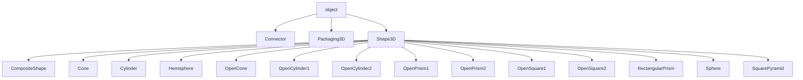
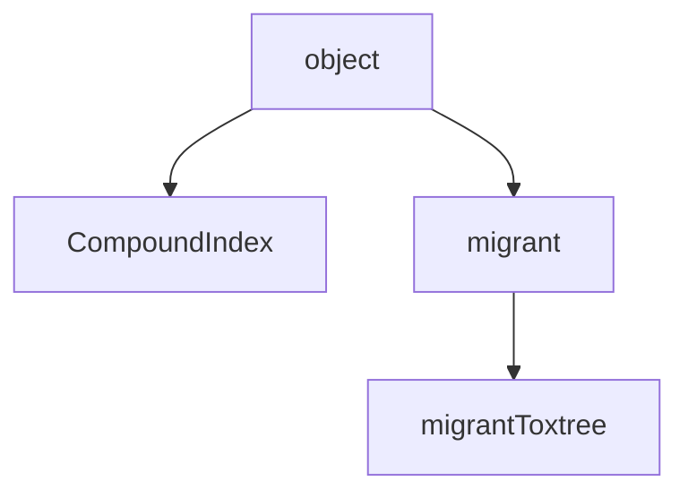
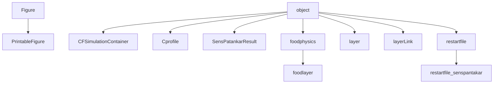
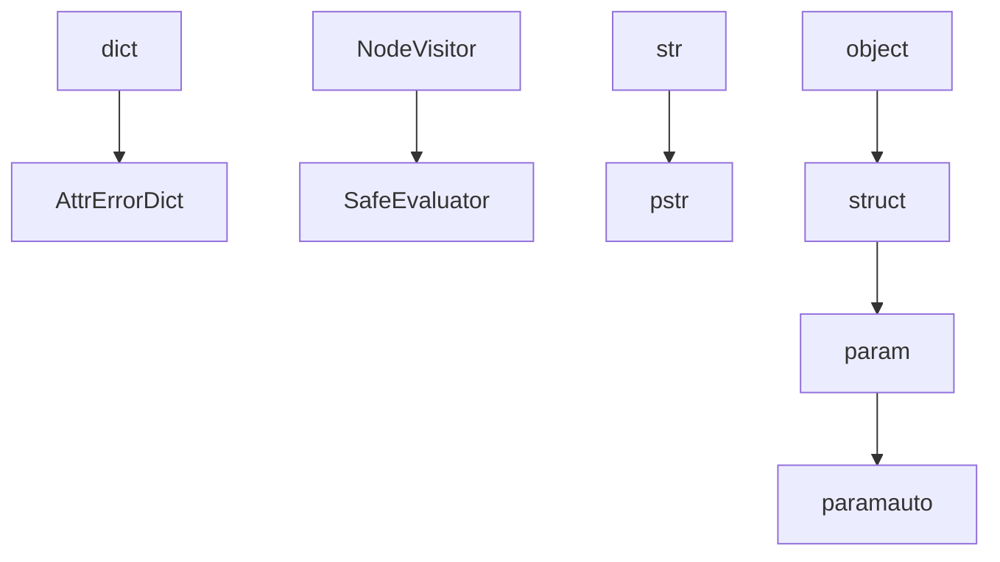
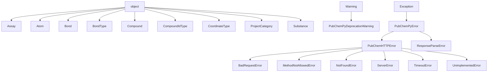
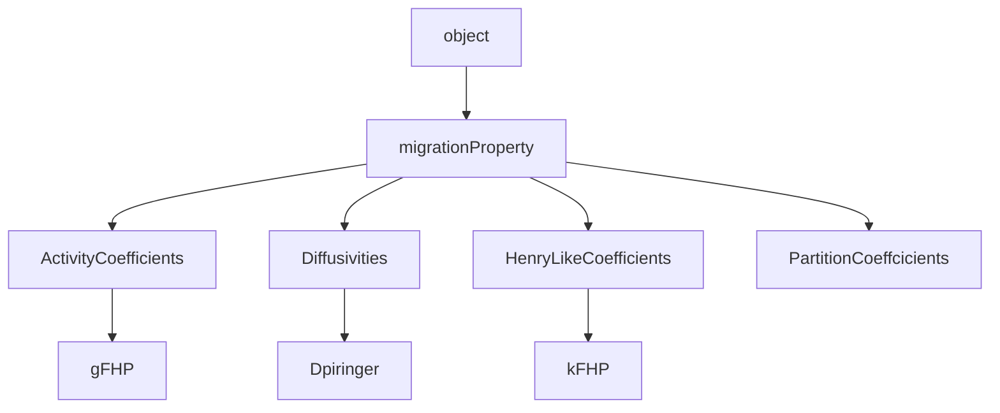

# SFPPy Modules Documentation

Generated on: **2025-03-07 17:31:54**

<hr style="border: none; height: 1px; background-color: #e0e0e0;" />


## **Running SFPPy**

> **SFPPy** enables the **compliance assessment of food contact materials** and facilitates **risk assessments** through **migration modeling**.  
> The term *"[Migration Modeling]("MigrationModeling/")"* refers to the **simulation of mass transfer** (primarily diffusive) from packaging materials into food.

#### **What this guide covers:**
1. **Running SFPPy/example1.py** (or `example2.py`, `example3.py`) immediately after cloning the repository.
2. **Using the object-oriented `patankar` library** to solve custom migration modeling problems.

SFPPy runs on **Windows, Linux, macOS**, and any system supporting **Python 3.x**.  
For the best experience, we recommend using [Jupyter](https://docs.jupyter.org/en/latest/) notebooks, which allow you to execute and document your workflow in a single document—especially useful for compliance testing.

---

### **📌 Prerequisites**
Before running SFPPy, make sure you have:

✅ **A basic understanding of Migration Modeling** → Read this [document]("MigrationModeling/").  
✅ **Python 3.x (≥3.8) installed**.  
✅ **Dependencies installed**:
   - If your Python distribution does **not include scientific libraries** (NumPy, SciPy, Matplotlib, Pandas), install them using:
     ```bash
     pip install -r requirements.txt
     ```
   - Alternatively, follow the **[installation guide](installation.html)** for Conda-based setup.  
✅ **An interactive environment** (recommended):
   - Install [Jupyter](https://docs.jupyter.org/en/latest/) or [Spyder](https://docs.spyder-ide.org/current/index.html) for a better experience.

---

### **📌 Running a Script with SFPPy**

This section explains how to **run `SFPPy/yourscript.py`**, assuming your scripts are stored inside the `SFPPy` directory alongside the example scripts (`example1.py`, `example2.py`, `example3.py`).

Using this approach **avoids system-wide modifications** and ensures that all SFPPy modules are found.

---

#### **🔹 Step 1: Navigate to the SFPPy directory**
```bash
cd SFPPy
```
This ensures that you are inside the **SFPPy project folder** before running a script.

---

#### **🔹 Step 2: Run Your Script**

##### **Option A: Standard Python Execution**
Use the appropriate command based on your operating system:

| **OS**                   | **Shell**      | **Command** ^(*)^                                   |
| ------------------------ | -------------- | --------------------------------------------------- |
| **Linux/macOS**          | `bash`         | `export PYTHONPATH=$(pwd) && python3 yourscript.py` |
| **Windows (cmd.exe)**    | Command Prompt | `set PYTHONPATH=%CD% && py -3 yourscript.py`        |
| **Windows (PowerShell)** | PowerShell     | `$env:PYTHONPATH="$PWD"; & py -3 yourscript.py`     |

<small>^*^ Replace `yourscript.py` with your script (e.g., `example1.py`).</small>

---

#### **🔹 Alternative: Running SFPPy Inside a Conda Environment**

**Option B: Standard Python Execution**. If you installed SFPPy via Conda, follow these steps:

##### **Step 2a: Create the SFPPy Conda Environment**
Run the following command **from the `SFPPy` directory**:
```bash
conda env create -f environment.yml
```
This creates a Conda environment named **`sfppy`** with all required dependencies.

##### **Step 2b: Activate the Environment**
```bash
conda activate sfppy
```

Once the environment is activated, run your script:
```bash
python yourscript.py # or `conda activate sfppy && python yourscript.py`
```


<hr style="border: none; height: 3px; background-color: #4CAF50;" />


<a id="table_of_contents" name="table_of_contents"></a>
## Main Classes

<div id="table_of_contents" style="display: flex; flex-wrap: wrap; gap: 20px; justify-content: space-between; overflow-x: auto; padding: 10px;">
<div style="flex: 1 1 calc(33.33% - 20px); min-width: 200px;">
<a href="#patankar_food" style="text-decoration: none; font-weight: bold;">
1. patankar.food
</a>
</div>
<div style="flex: 1 1 calc(33.33% - 20px); min-width: 200px;">
<a href="#patankar_geometry" style="text-decoration: none; font-weight: bold;">
2. patankar.geometry
</a>
</div>
<div style="flex: 1 1 calc(33.33% - 20px); min-width: 200px;">
<a href="#patankar_layer" style="text-decoration: none; font-weight: bold;">
3. patankar.layer
</a>
</div>
<div style="flex: 1 1 calc(33.33% - 20px); min-width: 200px;">
<a href="#patankar_loadpubchem" style="text-decoration: none; font-weight: bold;">
4. patankar.loadpubchem
</a>
</div>
<div style="flex: 1 1 calc(33.33% - 20px); min-width: 200px;">
<a href="#patankar_migration" style="text-decoration: none; font-weight: bold;">
5. patankar.migration
</a>
</div>
<div style="flex: 1 1 calc(33.33% - 20px); min-width: 200px;">
<a href="#patankar_private_mstruct" style="text-decoration: none; font-weight: bold;">
6. patankar.private.mstruct
</a>
</div>
<div style="flex: 1 1 calc(33.33% - 20px); min-width: 200px;">
<a href="#patankar_private_pubchempy" style="text-decoration: none; font-weight: bold;">
7. patankar.private.pubchempy
</a>
</div>
<div style="flex: 1 1 calc(33.33% - 20px); min-width: 200px;">
<a href="#patankar_property" style="text-decoration: none; font-weight: bold;">
8. patankar.property
</a>
</div>
</div>

<a id="patankar_food" name="patankar_food"></a>
<div style="display: flex; justify-content: space-between; align-items: center; margin-bottom: 20px; font-size: 0.8em;"><span></span>
<a href="#table_of_contents" title="Back to Table of Contents" style="text-decoration: none;">⬆️ TOC</a>
<a href="#patankar_geometry" title="Go to Next Module: patankar.geometry" style="text-decoration: none;">➡️ Next</a>
</div>

## Module `patankar.food`

### Class Inheritance Diagram

```mermaid
graph TD;
acetonitrile
ambient
aqueous
boiling
chemicalaffinity
chilled
ethanol
ethanol50
ethanol95
fat
foodlayer
foodphysics
foodproperty
frozen
frying
hotambient
hotfilled
hotoven
intermediate
isooctane
layer
liquid
methanol
microwave
migrant
nofood
oil
oliveoil
oven
panfrying
pasteurization
perfectlymixed
realcontact
realfood
rolled
semisolid
setoff
simulant
solid
stacked
sterilization
tenax
testcontact
texture
transportation
water
water3aceticacid
yogurt
aqueous --> acetonitrile
aqueous --> methanol
aqueous --> water
aqueous --> water3aceticacid
chemicalaffinity --> aqueous
chemicalaffinity --> fat
chemicalaffinity --> intermediate
ethanol --> ethanol95
ethanol50 --> yogurt
fat --> ethanol
fat --> isooctane
fat --> oliveoil
fat --> tenax
foodlayer --> foodproperty
foodphysics --> chemicalaffinity
foodphysics --> foodlayer
foodphysics --> nofood
foodphysics --> realcontact
foodphysics --> setoff
foodphysics --> testcontact
foodphysics --> texture
foodproperty --> realfood
foodproperty --> simulant
foodproperty --> solid
intermediate --> ethanol50
object --> foodphysics
object --> layer
object --> migrant
oliveoil --> oil
perfectlymixed --> acetonitrile
perfectlymixed --> ethanol
perfectlymixed --> ethanol50
perfectlymixed --> isooctane
perfectlymixed --> methanol
perfectlymixed --> oliveoil
perfectlymixed --> water
perfectlymixed --> water3aceticacid
realcontact --> ambient
realcontact --> boiling
realcontact --> chilled
realcontact --> frozen
realcontact --> frying
realcontact --> hotambient
realcontact --> hotfilled
realcontact --> hotoven
realcontact --> microwave
realcontact --> oven
realcontact --> panfrying
realcontact --> pasteurization
realcontact --> sterilization
realcontact --> transportation
realfood --> yogurt
semisolid --> yogurt
setoff --> rolled
setoff --> stacked
simulant --> acetonitrile
simulant --> ethanol
simulant --> ethanol50
simulant --> isooctane
simulant --> methanol
simulant --> oliveoil
simulant --> tenax
simulant --> water
simulant --> water3aceticacid
solid --> tenax
texture --> liquid
texture --> perfectlymixed
texture --> semisolid
```

**[Class Examples for `patankar/food.py` (2)](class_examples.html#patankar_food)**

### Methods Table

| Class | Method | Docstring First Paragraph | # Lines | __version__ |
|-------|---------|---------------------------|---------|-------------|
| (module-level) | `get_defined_init_params` | Returns which parameters from parametersWithUnits are defined in the instance. | 3 | 1.22 |
| (module-level) | `help_food` | Prints all food-related classes with relevant attributes in a **formatted Markdown table**. | 38 | 1.22 |
| (module-level) | `is_valid_classname` | Returns True if class name is valid (not private/internal). | 3 | 1.22 |
| (module-level) | `list_food_classes` | Lists all classes in the 'food' module with: - name and description - level (class attribute) - Inheritance details - Parameters from parametersWithUnits that are set in the instance | 44 | 1.22 |
| (module-level) | `wrap_text` | Wraps text within a specified width and returns a list of wrapped lines. | 5 | 1.22 |
| `acetonitrile` | `__init__` | general constructor | 52 | 1.22 |
| `acetonitrile` | `__matmul__` | Overload @: equivalent to >> if other is a layer. | 5 | 1.22 |
| `acetonitrile` | `__repr__` | Formatted string representation of the FOODlayer object. | 37 | 1.22 |
| `acetonitrile` | `__rshift__` | Overloads >> to propagate to other. | 8 | 1.22 |
| `acetonitrile` | `__str__` | Formatted string representation of the property | 4 | 1.22 |
| `acetonitrile` | `_to` | Transfers inherited properties to another object based on predefined rules. | 58 | 1.22 |
| `acetonitrile` | `acknowledge` | Register inherited properties under a given category. | 30 | 1.22 |
| `acetonitrile` | `contact` | alias to migration method | 3 | 1.22 |
| `acetonitrile` | `copy` | Creates a deep copy of the current food instance. | 3 | 1.22 |
| `acetonitrile` | `get_param` | Retrieve instance attribute with a default fallback if enabled. | 27 | 1.22 |
| `acetonitrile` | `migration` | interface to simulation engine: senspantankar | 9 | 1.22 |
| `acetonitrile` | `refresh` | refresh all physcal paramaters after instantiation | 10 | 1.22 |
| `acetonitrile` | `update` | Update modifiable parameters of the foodphysics object. | 62 | 1.22 |
| `ambient` | `__init__` | general constructor | 52 | 1.22 |
| `ambient` | `__matmul__` | Overload @: equivalent to >> if other is a layer. | 5 | 1.22 |
| `ambient` | `__repr__` | Formatted string representation of the FOODlayer object. | 37 | 1.22 |
| `ambient` | `__rshift__` | Overloads >> to propagate to other. | 8 | 1.22 |
| `ambient` | `__str__` | Formatted string representation of the property | 4 | 1.22 |
| `ambient` | `_to` | Transfers inherited properties to another object based on predefined rules. | 58 | 1.22 |
| `ambient` | `acknowledge` | Register inherited properties under a given category. | 30 | 1.22 |
| `ambient` | `contact` | alias to migration method | 3 | 1.22 |
| `ambient` | `copy` | Creates a deep copy of the current food instance. | 3 | 1.22 |
| `ambient` | `get_param` | Retrieve instance attribute with a default fallback if enabled. | 27 | 1.22 |
| `ambient` | `migration` | interface to simulation engine: senspantankar | 9 | 1.22 |
| `ambient` | `refresh` | refresh all physcal paramaters after instantiation | 10 | 1.22 |
| `ambient` | `update` | Update modifiable parameters of the foodphysics object. | 62 | 1.22 |
| `aqueous` | `__init__` | general constructor | 52 | 1.22 |
| `aqueous` | `__matmul__` | Overload @: equivalent to >> if other is a layer. | 5 | 1.22 |
| `aqueous` | `__repr__` | Formatted string representation of the FOODlayer object. | 37 | 1.22 |
| `aqueous` | `__rshift__` | Overloads >> to propagate to other. | 8 | 1.22 |
| `aqueous` | `__str__` | Formatted string representation of the property | 4 | 1.22 |
| `aqueous` | `_to` | Transfers inherited properties to another object based on predefined rules. | 58 | 1.22 |
| `aqueous` | `acknowledge` | Register inherited properties under a given category. | 30 | 1.22 |
| `aqueous` | `contact` | alias to migration method | 3 | 1.22 |
| `aqueous` | `copy` | Creates a deep copy of the current food instance. | 3 | 1.22 |
| `aqueous` | `get_param` | Retrieve instance attribute with a default fallback if enabled. | 27 | 1.22 |
| `aqueous` | `migration` | interface to simulation engine: senspantankar | 9 | 1.22 |
| `aqueous` | `refresh` | refresh all physcal paramaters after instantiation | 10 | 1.22 |
| `aqueous` | `update` | Update modifiable parameters of the foodphysics object. | 62 | 1.22 |
| `boiling` | `__init__` | general constructor | 52 | 1.22 |
| `boiling` | `__matmul__` | Overload @: equivalent to >> if other is a layer. | 5 | 1.22 |
| `boiling` | `__repr__` | Formatted string representation of the FOODlayer object. | 37 | 1.22 |
| `boiling` | `__rshift__` | Overloads >> to propagate to other. | 8 | 1.22 |
| `boiling` | `__str__` | Formatted string representation of the property | 4 | 1.22 |
| `boiling` | `_to` | Transfers inherited properties to another object based on predefined rules. | 58 | 1.22 |
| `boiling` | `acknowledge` | Register inherited properties under a given category. | 30 | 1.22 |
| `boiling` | `contact` | alias to migration method | 3 | 1.22 |
| `boiling` | `copy` | Creates a deep copy of the current food instance. | 3 | 1.22 |
| `boiling` | `get_param` | Retrieve instance attribute with a default fallback if enabled. | 27 | 1.22 |
| `boiling` | `migration` | interface to simulation engine: senspantankar | 9 | 1.22 |
| `boiling` | `refresh` | refresh all physcal paramaters after instantiation | 10 | 1.22 |
| `boiling` | `update` | Update modifiable parameters of the foodphysics object. | 62 | 1.22 |
| `chemicalaffinity` | `__init__` | general constructor | 52 | 1.22 |
| `chemicalaffinity` | `__matmul__` | Overload @: equivalent to >> if other is a layer. | 5 | 1.22 |
| `chemicalaffinity` | `__repr__` | Formatted string representation of the FOODlayer object. | 37 | 1.22 |
| `chemicalaffinity` | `__rshift__` | Overloads >> to propagate to other. | 8 | 1.22 |
| `chemicalaffinity` | `__str__` | Formatted string representation of the property | 4 | 1.22 |
| `chemicalaffinity` | `_to` | Transfers inherited properties to another object based on predefined rules. | 58 | 1.22 |
| `chemicalaffinity` | `acknowledge` | Register inherited properties under a given category. | 30 | 1.22 |
| `chemicalaffinity` | `contact` | alias to migration method | 3 | 1.22 |
| `chemicalaffinity` | `copy` | Creates a deep copy of the current food instance. | 3 | 1.22 |
| `chemicalaffinity` | `get_param` | Retrieve instance attribute with a default fallback if enabled. | 27 | 1.22 |
| `chemicalaffinity` | `migration` | interface to simulation engine: senspantankar | 9 | 1.22 |
| `chemicalaffinity` | `refresh` | refresh all physcal paramaters after instantiation | 10 | 1.22 |
| `chemicalaffinity` | `update` | Update modifiable parameters of the foodphysics object. | 62 | 1.22 |
| `chilled` | `__init__` | general constructor | 52 | 1.22 |
| `chilled` | `__matmul__` | Overload @: equivalent to >> if other is a layer. | 5 | 1.22 |
| `chilled` | `__repr__` | Formatted string representation of the FOODlayer object. | 37 | 1.22 |
| `chilled` | `__rshift__` | Overloads >> to propagate to other. | 8 | 1.22 |
| `chilled` | `__str__` | Formatted string representation of the property | 4 | 1.22 |
| `chilled` | `_to` | Transfers inherited properties to another object based on predefined rules. | 58 | 1.22 |
| `chilled` | `acknowledge` | Register inherited properties under a given category. | 30 | 1.22 |
| `chilled` | `contact` | alias to migration method | 3 | 1.22 |
| `chilled` | `copy` | Creates a deep copy of the current food instance. | 3 | 1.22 |
| `chilled` | `get_param` | Retrieve instance attribute with a default fallback if enabled. | 27 | 1.22 |
| `chilled` | `migration` | interface to simulation engine: senspantankar | 9 | 1.22 |
| `chilled` | `refresh` | refresh all physcal paramaters after instantiation | 10 | 1.22 |
| `chilled` | `update` | Update modifiable parameters of the foodphysics object. | 62 | 1.22 |
| `ethanol` | `__init__` | general constructor | 52 | 1.22 |
| `ethanol` | `__matmul__` | Overload @: equivalent to >> if other is a layer. | 5 | 1.22 |
| `ethanol` | `__repr__` | Formatted string representation of the FOODlayer object. | 37 | 1.22 |
| `ethanol` | `__rshift__` | Overloads >> to propagate to other. | 8 | 1.22 |
| `ethanol` | `__str__` | Formatted string representation of the property | 4 | 1.22 |
| `ethanol` | `_to` | Transfers inherited properties to another object based on predefined rules. | 58 | 1.22 |
| `ethanol` | `acknowledge` | Register inherited properties under a given category. | 30 | 1.22 |
| `ethanol` | `contact` | alias to migration method | 3 | 1.22 |
| `ethanol` | `copy` | Creates a deep copy of the current food instance. | 3 | 1.22 |
| `ethanol` | `get_param` | Retrieve instance attribute with a default fallback if enabled. | 27 | 1.22 |
| `ethanol` | `migration` | interface to simulation engine: senspantankar | 9 | 1.22 |
| `ethanol` | `refresh` | refresh all physcal paramaters after instantiation | 10 | 1.22 |
| `ethanol` | `update` | Update modifiable parameters of the foodphysics object. | 62 | 1.22 |
| `ethanol50` | `__init__` | general constructor | 52 | 1.22 |
| `ethanol50` | `__matmul__` | Overload @: equivalent to >> if other is a layer. | 5 | 1.22 |
| `ethanol50` | `__repr__` | Formatted string representation of the FOODlayer object. | 37 | 1.22 |
| `ethanol50` | `__rshift__` | Overloads >> to propagate to other. | 8 | 1.22 |
| `ethanol50` | `__str__` | Formatted string representation of the property | 4 | 1.22 |
| `ethanol50` | `_to` | Transfers inherited properties to another object based on predefined rules. | 58 | 1.22 |
| `ethanol50` | `acknowledge` | Register inherited properties under a given category. | 30 | 1.22 |
| `ethanol50` | `contact` | alias to migration method | 3 | 1.22 |
| `ethanol50` | `copy` | Creates a deep copy of the current food instance. | 3 | 1.22 |
| `ethanol50` | `get_param` | Retrieve instance attribute with a default fallback if enabled. | 27 | 1.22 |
| `ethanol50` | `migration` | interface to simulation engine: senspantankar | 9 | 1.22 |
| `ethanol50` | `refresh` | refresh all physcal paramaters after instantiation | 10 | 1.22 |
| `ethanol50` | `update` | Update modifiable parameters of the foodphysics object. | 62 | 1.22 |
| `ethanol95` | `__init__` | general constructor | 52 | 1.22 |
| `ethanol95` | `__matmul__` | Overload @: equivalent to >> if other is a layer. | 5 | 1.22 |
| `ethanol95` | `__repr__` | Formatted string representation of the FOODlayer object. | 37 | 1.22 |
| `ethanol95` | `__rshift__` | Overloads >> to propagate to other. | 8 | 1.22 |
| `ethanol95` | `__str__` | Formatted string representation of the property | 4 | 1.22 |
| `ethanol95` | `_to` | Transfers inherited properties to another object based on predefined rules. | 58 | 1.22 |
| `ethanol95` | `acknowledge` | Register inherited properties under a given category. | 30 | 1.22 |
| `ethanol95` | `contact` | alias to migration method | 3 | 1.22 |
| `ethanol95` | `copy` | Creates a deep copy of the current food instance. | 3 | 1.22 |
| `ethanol95` | `get_param` | Retrieve instance attribute with a default fallback if enabled. | 27 | 1.22 |
| `ethanol95` | `migration` | interface to simulation engine: senspantankar | 9 | 1.22 |
| `ethanol95` | `refresh` | refresh all physcal paramaters after instantiation | 10 | 1.22 |
| `ethanol95` | `update` | Update modifiable parameters of the foodphysics object. | 62 | 1.22 |
| `fat` | `__init__` | general constructor | 52 | 1.22 |
| `fat` | `__matmul__` | Overload @: equivalent to >> if other is a layer. | 5 | 1.22 |
| `fat` | `__repr__` | Formatted string representation of the FOODlayer object. | 37 | 1.22 |
| `fat` | `__rshift__` | Overloads >> to propagate to other. | 8 | 1.22 |
| `fat` | `__str__` | Formatted string representation of the property | 4 | 1.22 |
| `fat` | `_to` | Transfers inherited properties to another object based on predefined rules. | 58 | 1.22 |
| `fat` | `acknowledge` | Register inherited properties under a given category. | 30 | 1.22 |
| `fat` | `contact` | alias to migration method | 3 | 1.22 |
| `fat` | `copy` | Creates a deep copy of the current food instance. | 3 | 1.22 |
| `fat` | `get_param` | Retrieve instance attribute with a default fallback if enabled. | 27 | 1.22 |
| `fat` | `migration` | interface to simulation engine: senspantankar | 9 | 1.22 |
| `fat` | `refresh` | refresh all physcal paramaters after instantiation | 10 | 1.22 |
| `fat` | `update` | Update modifiable parameters of the foodphysics object. | 62 | 1.22 |
| `foodlayer` | `__init__` | general constructor | 52 | 1.22 |
| `foodlayer` | `__matmul__` | Overload @: equivalent to >> if other is a layer. | 5 | 1.22 |
| `foodlayer` | `__repr__` | Formatted string representation of the FOODlayer object. | 37 | 1.22 |
| `foodlayer` | `__rshift__` | Overloads >> to propagate to other. | 8 | 1.22 |
| `foodlayer` | `__str__` | Formatted string representation of the property | 4 | 1.22 |
| `foodlayer` | `_to` | Transfers inherited properties to another object based on predefined rules. | 58 | 1.22 |
| `foodlayer` | `acknowledge` | Register inherited properties under a given category. | 30 | 1.22 |
| `foodlayer` | `contact` | alias to migration method | 3 | 1.22 |
| `foodlayer` | `copy` | Creates a deep copy of the current food instance. | 3 | 1.22 |
| `foodlayer` | `get_param` | Retrieve instance attribute with a default fallback if enabled. | 27 | 1.22 |
| `foodlayer` | `migration` | interface to simulation engine: senspantankar | 9 | 1.22 |
| `foodlayer` | `refresh` | refresh all physcal paramaters after instantiation | 10 | 1.22 |
| `foodlayer` | `update` | Update modifiable parameters of the foodphysics object. | 62 | 1.22 |
| `foodphysics` | `__init__` | general constructor | 52 | 1.22 |
| `foodphysics` | `__matmul__` | Overload @: equivalent to >> if other is a layer. | 5 | 1.22 |
| `foodphysics` | `__repr__` | Formatted string representation of the FOODlayer object. | 37 | 1.22 |
| `foodphysics` | `__rshift__` | Overloads >> to propagate to other. | 8 | 1.22 |
| `foodphysics` | `__str__` | Formatted string representation of the property | 4 | 1.22 |
| `foodphysics` | `_to` | Transfers inherited properties to another object based on predefined rules. | 58 | 1.22 |
| `foodphysics` | `acknowledge` | Register inherited properties under a given category. | 30 | 1.22 |
| `foodphysics` | `contact` | alias to migration method | 3 | 1.22 |
| `foodphysics` | `copy` | Creates a deep copy of the current food instance. | 3 | 1.22 |
| `foodphysics` | `get_param` | Retrieve instance attribute with a default fallback if enabled. | 27 | 1.22 |
| `foodphysics` | `migration` | interface to simulation engine: senspantankar | 9 | 1.22 |
| `foodphysics` | `refresh` | refresh all physcal paramaters after instantiation | 10 | 1.22 |
| `foodphysics` | `update` | Update modifiable parameters of the foodphysics object. | 62 | 1.22 |
| `foodproperty` | `__init__` | general constructor | 52 | 1.22 |
| `foodproperty` | `__matmul__` | Overload @: equivalent to >> if other is a layer. | 5 | 1.22 |
| `foodproperty` | `__repr__` | Formatted string representation of the FOODlayer object. | 37 | 1.22 |
| `foodproperty` | `__rshift__` | Overloads >> to propagate to other. | 8 | 1.22 |
| `foodproperty` | `__str__` | Formatted string representation of the property | 4 | 1.22 |
| `foodproperty` | `_to` | Transfers inherited properties to another object based on predefined rules. | 58 | 1.22 |
| `foodproperty` | `acknowledge` | Register inherited properties under a given category. | 30 | 1.22 |
| `foodproperty` | `contact` | alias to migration method | 3 | 1.22 |
| `foodproperty` | `copy` | Creates a deep copy of the current food instance. | 3 | 1.22 |
| `foodproperty` | `get_param` | Retrieve instance attribute with a default fallback if enabled. | 27 | 1.22 |
| `foodproperty` | `migration` | interface to simulation engine: senspantankar | 9 | 1.22 |
| `foodproperty` | `refresh` | refresh all physcal paramaters after instantiation | 10 | 1.22 |
| `foodproperty` | `update` | Update modifiable parameters of the foodphysics object. | 62 | 1.22 |
| `frozen` | `__init__` | general constructor | 52 | 1.22 |
| `frozen` | `__matmul__` | Overload @: equivalent to >> if other is a layer. | 5 | 1.22 |
| `frozen` | `__repr__` | Formatted string representation of the FOODlayer object. | 37 | 1.22 |
| `frozen` | `__rshift__` | Overloads >> to propagate to other. | 8 | 1.22 |
| `frozen` | `__str__` | Formatted string representation of the property | 4 | 1.22 |
| `frozen` | `_to` | Transfers inherited properties to another object based on predefined rules. | 58 | 1.22 |
| `frozen` | `acknowledge` | Register inherited properties under a given category. | 30 | 1.22 |
| `frozen` | `contact` | alias to migration method | 3 | 1.22 |
| `frozen` | `copy` | Creates a deep copy of the current food instance. | 3 | 1.22 |
| `frozen` | `get_param` | Retrieve instance attribute with a default fallback if enabled. | 27 | 1.22 |
| `frozen` | `migration` | interface to simulation engine: senspantankar | 9 | 1.22 |
| `frozen` | `refresh` | refresh all physcal paramaters after instantiation | 10 | 1.22 |
| `frozen` | `update` | Update modifiable parameters of the foodphysics object. | 62 | 1.22 |
| `frying` | `__init__` | general constructor | 52 | 1.22 |
| `frying` | `__matmul__` | Overload @: equivalent to >> if other is a layer. | 5 | 1.22 |
| `frying` | `__repr__` | Formatted string representation of the FOODlayer object. | 37 | 1.22 |
| `frying` | `__rshift__` | Overloads >> to propagate to other. | 8 | 1.22 |
| `frying` | `__str__` | Formatted string representation of the property | 4 | 1.22 |
| `frying` | `_to` | Transfers inherited properties to another object based on predefined rules. | 58 | 1.22 |
| `frying` | `acknowledge` | Register inherited properties under a given category. | 30 | 1.22 |
| `frying` | `contact` | alias to migration method | 3 | 1.22 |
| `frying` | `copy` | Creates a deep copy of the current food instance. | 3 | 1.22 |
| `frying` | `get_param` | Retrieve instance attribute with a default fallback if enabled. | 27 | 1.22 |
| `frying` | `migration` | interface to simulation engine: senspantankar | 9 | 1.22 |
| `frying` | `refresh` | refresh all physcal paramaters after instantiation | 10 | 1.22 |
| `frying` | `update` | Update modifiable parameters of the foodphysics object. | 62 | 1.22 |
| `hotambient` | `__init__` | general constructor | 52 | 1.22 |
| `hotambient` | `__matmul__` | Overload @: equivalent to >> if other is a layer. | 5 | 1.22 |
| `hotambient` | `__repr__` | Formatted string representation of the FOODlayer object. | 37 | 1.22 |
| `hotambient` | `__rshift__` | Overloads >> to propagate to other. | 8 | 1.22 |
| `hotambient` | `__str__` | Formatted string representation of the property | 4 | 1.22 |
| `hotambient` | `_to` | Transfers inherited properties to another object based on predefined rules. | 58 | 1.22 |
| `hotambient` | `acknowledge` | Register inherited properties under a given category. | 30 | 1.22 |
| `hotambient` | `contact` | alias to migration method | 3 | 1.22 |
| `hotambient` | `copy` | Creates a deep copy of the current food instance. | 3 | 1.22 |
| `hotambient` | `get_param` | Retrieve instance attribute with a default fallback if enabled. | 27 | 1.22 |
| `hotambient` | `migration` | interface to simulation engine: senspantankar | 9 | 1.22 |
| `hotambient` | `refresh` | refresh all physcal paramaters after instantiation | 10 | 1.22 |
| `hotambient` | `update` | Update modifiable parameters of the foodphysics object. | 62 | 1.22 |
| `hotfilled` | `__init__` | general constructor | 52 | 1.22 |
| `hotfilled` | `__matmul__` | Overload @: equivalent to >> if other is a layer. | 5 | 1.22 |
| `hotfilled` | `__repr__` | Formatted string representation of the FOODlayer object. | 37 | 1.22 |
| `hotfilled` | `__rshift__` | Overloads >> to propagate to other. | 8 | 1.22 |
| `hotfilled` | `__str__` | Formatted string representation of the property | 4 | 1.22 |
| `hotfilled` | `_to` | Transfers inherited properties to another object based on predefined rules. | 58 | 1.22 |
| `hotfilled` | `acknowledge` | Register inherited properties under a given category. | 30 | 1.22 |
| `hotfilled` | `contact` | alias to migration method | 3 | 1.22 |
| `hotfilled` | `copy` | Creates a deep copy of the current food instance. | 3 | 1.22 |
| `hotfilled` | `get_param` | Retrieve instance attribute with a default fallback if enabled. | 27 | 1.22 |
| `hotfilled` | `migration` | interface to simulation engine: senspantankar | 9 | 1.22 |
| `hotfilled` | `refresh` | refresh all physcal paramaters after instantiation | 10 | 1.22 |
| `hotfilled` | `update` | Update modifiable parameters of the foodphysics object. | 62 | 1.22 |
| `hotoven` | `__init__` | general constructor | 52 | 1.22 |
| `hotoven` | `__matmul__` | Overload @: equivalent to >> if other is a layer. | 5 | 1.22 |
| `hotoven` | `__repr__` | Formatted string representation of the FOODlayer object. | 37 | 1.22 |
| `hotoven` | `__rshift__` | Overloads >> to propagate to other. | 8 | 1.22 |
| `hotoven` | `__str__` | Formatted string representation of the property | 4 | 1.22 |
| `hotoven` | `_to` | Transfers inherited properties to another object based on predefined rules. | 58 | 1.22 |
| `hotoven` | `acknowledge` | Register inherited properties under a given category. | 30 | 1.22 |
| `hotoven` | `contact` | alias to migration method | 3 | 1.22 |
| `hotoven` | `copy` | Creates a deep copy of the current food instance. | 3 | 1.22 |
| `hotoven` | `get_param` | Retrieve instance attribute with a default fallback if enabled. | 27 | 1.22 |
| `hotoven` | `migration` | interface to simulation engine: senspantankar | 9 | 1.22 |
| `hotoven` | `refresh` | refresh all physcal paramaters after instantiation | 10 | 1.22 |
| `hotoven` | `update` | Update modifiable parameters of the foodphysics object. | 62 | 1.22 |
| `intermediate` | `__init__` | general constructor | 52 | 1.22 |
| `intermediate` | `__matmul__` | Overload @: equivalent to >> if other is a layer. | 5 | 1.22 |
| `intermediate` | `__repr__` | Formatted string representation of the FOODlayer object. | 37 | 1.22 |
| `intermediate` | `__rshift__` | Overloads >> to propagate to other. | 8 | 1.22 |
| `intermediate` | `__str__` | Formatted string representation of the property | 4 | 1.22 |
| `intermediate` | `_to` | Transfers inherited properties to another object based on predefined rules. | 58 | 1.22 |
| `intermediate` | `acknowledge` | Register inherited properties under a given category. | 30 | 1.22 |
| `intermediate` | `contact` | alias to migration method | 3 | 1.22 |
| `intermediate` | `copy` | Creates a deep copy of the current food instance. | 3 | 1.22 |
| `intermediate` | `get_param` | Retrieve instance attribute with a default fallback if enabled. | 27 | 1.22 |
| `intermediate` | `migration` | interface to simulation engine: senspantankar | 9 | 1.22 |
| `intermediate` | `refresh` | refresh all physcal paramaters after instantiation | 10 | 1.22 |
| `intermediate` | `update` | Update modifiable parameters of the foodphysics object. | 62 | 1.22 |
| `isooctane` | `__init__` | general constructor | 52 | 1.22 |
| `isooctane` | `__matmul__` | Overload @: equivalent to >> if other is a layer. | 5 | 1.22 |
| `isooctane` | `__repr__` | Formatted string representation of the FOODlayer object. | 37 | 1.22 |
| `isooctane` | `__rshift__` | Overloads >> to propagate to other. | 8 | 1.22 |
| `isooctane` | `__str__` | Formatted string representation of the property | 4 | 1.22 |
| `isooctane` | `_to` | Transfers inherited properties to another object based on predefined rules. | 58 | 1.22 |
| `isooctane` | `acknowledge` | Register inherited properties under a given category. | 30 | 1.22 |
| `isooctane` | `contact` | alias to migration method | 3 | 1.22 |
| `isooctane` | `copy` | Creates a deep copy of the current food instance. | 3 | 1.22 |
| `isooctane` | `get_param` | Retrieve instance attribute with a default fallback if enabled. | 27 | 1.22 |
| `isooctane` | `migration` | interface to simulation engine: senspantankar | 9 | 1.22 |
| `isooctane` | `refresh` | refresh all physcal paramaters after instantiation | 10 | 1.22 |
| `isooctane` | `update` | Update modifiable parameters of the foodphysics object. | 62 | 1.22 |
| `liquid` | `__init__` | general constructor | 52 | 1.22 |
| `liquid` | `__matmul__` | Overload @: equivalent to >> if other is a layer. | 5 | 1.22 |
| `liquid` | `__repr__` | Formatted string representation of the FOODlayer object. | 37 | 1.22 |
| `liquid` | `__rshift__` | Overloads >> to propagate to other. | 8 | 1.22 |
| `liquid` | `__str__` | Formatted string representation of the property | 4 | 1.22 |
| `liquid` | `_to` | Transfers inherited properties to another object based on predefined rules. | 58 | 1.22 |
| `liquid` | `acknowledge` | Register inherited properties under a given category. | 30 | 1.22 |
| `liquid` | `contact` | alias to migration method | 3 | 1.22 |
| `liquid` | `copy` | Creates a deep copy of the current food instance. | 3 | 1.22 |
| `liquid` | `get_param` | Retrieve instance attribute with a default fallback if enabled. | 27 | 1.22 |
| `liquid` | `migration` | interface to simulation engine: senspantankar | 9 | 1.22 |
| `liquid` | `refresh` | refresh all physcal paramaters after instantiation | 10 | 1.22 |
| `liquid` | `update` | Update modifiable parameters of the foodphysics object. | 62 | 1.22 |
| `methanol` | `__init__` | general constructor | 52 | 1.22 |
| `methanol` | `__matmul__` | Overload @: equivalent to >> if other is a layer. | 5 | 1.22 |
| `methanol` | `__repr__` | Formatted string representation of the FOODlayer object. | 37 | 1.22 |
| `methanol` | `__rshift__` | Overloads >> to propagate to other. | 8 | 1.22 |
| `methanol` | `__str__` | Formatted string representation of the property | 4 | 1.22 |
| `methanol` | `_to` | Transfers inherited properties to another object based on predefined rules. | 58 | 1.22 |
| `methanol` | `acknowledge` | Register inherited properties under a given category. | 30 | 1.22 |
| `methanol` | `contact` | alias to migration method | 3 | 1.22 |
| `methanol` | `copy` | Creates a deep copy of the current food instance. | 3 | 1.22 |
| `methanol` | `get_param` | Retrieve instance attribute with a default fallback if enabled. | 27 | 1.22 |
| `methanol` | `migration` | interface to simulation engine: senspantankar | 9 | 1.22 |
| `methanol` | `refresh` | refresh all physcal paramaters after instantiation | 10 | 1.22 |
| `methanol` | `update` | Update modifiable parameters of the foodphysics object. | 62 | 1.22 |
| `microwave` | `__init__` | general constructor | 52 | 1.22 |
| `microwave` | `__matmul__` | Overload @: equivalent to >> if other is a layer. | 5 | 1.22 |
| `microwave` | `__repr__` | Formatted string representation of the FOODlayer object. | 37 | 1.22 |
| `microwave` | `__rshift__` | Overloads >> to propagate to other. | 8 | 1.22 |
| `microwave` | `__str__` | Formatted string representation of the property | 4 | 1.22 |
| `microwave` | `_to` | Transfers inherited properties to another object based on predefined rules. | 58 | 1.22 |
| `microwave` | `acknowledge` | Register inherited properties under a given category. | 30 | 1.22 |
| `microwave` | `contact` | alias to migration method | 3 | 1.22 |
| `microwave` | `copy` | Creates a deep copy of the current food instance. | 3 | 1.22 |
| `microwave` | `get_param` | Retrieve instance attribute with a default fallback if enabled. | 27 | 1.22 |
| `microwave` | `migration` | interface to simulation engine: senspantankar | 9 | 1.22 |
| `microwave` | `refresh` | refresh all physcal paramaters after instantiation | 10 | 1.22 |
| `microwave` | `update` | Update modifiable parameters of the foodphysics object. | 62 | 1.22 |
| `nofood` | `__init__` | general constructor | 52 | 1.22 |
| `nofood` | `__matmul__` | Overload @: equivalent to >> if other is a layer. | 5 | 1.22 |
| `nofood` | `__repr__` | Formatted string representation of the FOODlayer object. | 37 | 1.22 |
| `nofood` | `__rshift__` | Overloads >> to propagate to other. | 8 | 1.22 |
| `nofood` | `__str__` | Formatted string representation of the property | 4 | 1.22 |
| `nofood` | `_to` | Transfers inherited properties to another object based on predefined rules. | 58 | 1.22 |
| `nofood` | `acknowledge` | Register inherited properties under a given category. | 30 | 1.22 |
| `nofood` | `contact` | alias to migration method | 3 | 1.22 |
| `nofood` | `copy` | Creates a deep copy of the current food instance. | 3 | 1.22 |
| `nofood` | `get_param` | Retrieve instance attribute with a default fallback if enabled. | 27 | 1.22 |
| `nofood` | `migration` | interface to simulation engine: senspantankar | 9 | 1.22 |
| `nofood` | `refresh` | refresh all physcal paramaters after instantiation | 10 | 1.22 |
| `nofood` | `update` | Update modifiable parameters of the foodphysics object. | 62 | 1.22 |
| `oil` | `__init__` | general constructor | 52 | 1.22 |
| `oil` | `__matmul__` | Overload @: equivalent to >> if other is a layer. | 5 | 1.22 |
| `oil` | `__repr__` | Formatted string representation of the FOODlayer object. | 37 | 1.22 |
| `oil` | `__rshift__` | Overloads >> to propagate to other. | 8 | 1.22 |
| `oil` | `__str__` | Formatted string representation of the property | 4 | 1.22 |
| `oil` | `_to` | Transfers inherited properties to another object based on predefined rules. | 58 | 1.22 |
| `oil` | `acknowledge` | Register inherited properties under a given category. | 30 | 1.22 |
| `oil` | `contact` | alias to migration method | 3 | 1.22 |
| `oil` | `copy` | Creates a deep copy of the current food instance. | 3 | 1.22 |
| `oil` | `get_param` | Retrieve instance attribute with a default fallback if enabled. | 27 | 1.22 |
| `oil` | `migration` | interface to simulation engine: senspantankar | 9 | 1.22 |
| `oil` | `refresh` | refresh all physcal paramaters after instantiation | 10 | 1.22 |
| `oil` | `update` | Update modifiable parameters of the foodphysics object. | 62 | 1.22 |
| `oliveoil` | `__init__` | general constructor | 52 | 1.22 |
| `oliveoil` | `__matmul__` | Overload @: equivalent to >> if other is a layer. | 5 | 1.22 |
| `oliveoil` | `__repr__` | Formatted string representation of the FOODlayer object. | 37 | 1.22 |
| `oliveoil` | `__rshift__` | Overloads >> to propagate to other. | 8 | 1.22 |
| `oliveoil` | `__str__` | Formatted string representation of the property | 4 | 1.22 |
| `oliveoil` | `_to` | Transfers inherited properties to another object based on predefined rules. | 58 | 1.22 |
| `oliveoil` | `acknowledge` | Register inherited properties under a given category. | 30 | 1.22 |
| `oliveoil` | `contact` | alias to migration method | 3 | 1.22 |
| `oliveoil` | `copy` | Creates a deep copy of the current food instance. | 3 | 1.22 |
| `oliveoil` | `get_param` | Retrieve instance attribute with a default fallback if enabled. | 27 | 1.22 |
| `oliveoil` | `migration` | interface to simulation engine: senspantankar | 9 | 1.22 |
| `oliveoil` | `refresh` | refresh all physcal paramaters after instantiation | 10 | 1.22 |
| `oliveoil` | `update` | Update modifiable parameters of the foodphysics object. | 62 | 1.22 |
| `oven` | `__init__` | general constructor | 52 | 1.22 |
| `oven` | `__matmul__` | Overload @: equivalent to >> if other is a layer. | 5 | 1.22 |
| `oven` | `__repr__` | Formatted string representation of the FOODlayer object. | 37 | 1.22 |
| `oven` | `__rshift__` | Overloads >> to propagate to other. | 8 | 1.22 |
| `oven` | `__str__` | Formatted string representation of the property | 4 | 1.22 |
| `oven` | `_to` | Transfers inherited properties to another object based on predefined rules. | 58 | 1.22 |
| `oven` | `acknowledge` | Register inherited properties under a given category. | 30 | 1.22 |
| `oven` | `contact` | alias to migration method | 3 | 1.22 |
| `oven` | `copy` | Creates a deep copy of the current food instance. | 3 | 1.22 |
| `oven` | `get_param` | Retrieve instance attribute with a default fallback if enabled. | 27 | 1.22 |
| `oven` | `migration` | interface to simulation engine: senspantankar | 9 | 1.22 |
| `oven` | `refresh` | refresh all physcal paramaters after instantiation | 10 | 1.22 |
| `oven` | `update` | Update modifiable parameters of the foodphysics object. | 62 | 1.22 |
| `panfrying` | `__init__` | general constructor | 52 | 1.22 |
| `panfrying` | `__matmul__` | Overload @: equivalent to >> if other is a layer. | 5 | 1.22 |
| `panfrying` | `__repr__` | Formatted string representation of the FOODlayer object. | 37 | 1.22 |
| `panfrying` | `__rshift__` | Overloads >> to propagate to other. | 8 | 1.22 |
| `panfrying` | `__str__` | Formatted string representation of the property | 4 | 1.22 |
| `panfrying` | `_to` | Transfers inherited properties to another object based on predefined rules. | 58 | 1.22 |
| `panfrying` | `acknowledge` | Register inherited properties under a given category. | 30 | 1.22 |
| `panfrying` | `contact` | alias to migration method | 3 | 1.22 |
| `panfrying` | `copy` | Creates a deep copy of the current food instance. | 3 | 1.22 |
| `panfrying` | `get_param` | Retrieve instance attribute with a default fallback if enabled. | 27 | 1.22 |
| `panfrying` | `migration` | interface to simulation engine: senspantankar | 9 | 1.22 |
| `panfrying` | `refresh` | refresh all physcal paramaters after instantiation | 10 | 1.22 |
| `panfrying` | `update` | Update modifiable parameters of the foodphysics object. | 62 | 1.22 |
| `pasteurization` | `__init__` | general constructor | 52 | 1.22 |
| `pasteurization` | `__matmul__` | Overload @: equivalent to >> if other is a layer. | 5 | 1.22 |
| `pasteurization` | `__repr__` | Formatted string representation of the FOODlayer object. | 37 | 1.22 |
| `pasteurization` | `__rshift__` | Overloads >> to propagate to other. | 8 | 1.22 |
| `pasteurization` | `__str__` | Formatted string representation of the property | 4 | 1.22 |
| `pasteurization` | `_to` | Transfers inherited properties to another object based on predefined rules. | 58 | 1.22 |
| `pasteurization` | `acknowledge` | Register inherited properties under a given category. | 30 | 1.22 |
| `pasteurization` | `contact` | alias to migration method | 3 | 1.22 |
| `pasteurization` | `copy` | Creates a deep copy of the current food instance. | 3 | 1.22 |
| `pasteurization` | `get_param` | Retrieve instance attribute with a default fallback if enabled. | 27 | 1.22 |
| `pasteurization` | `migration` | interface to simulation engine: senspantankar | 9 | 1.22 |
| `pasteurization` | `refresh` | refresh all physcal paramaters after instantiation | 10 | 1.22 |
| `pasteurization` | `update` | Update modifiable parameters of the foodphysics object. | 62 | 1.22 |
| `perfectlymixed` | `__init__` | general constructor | 52 | 1.22 |
| `perfectlymixed` | `__matmul__` | Overload @: equivalent to >> if other is a layer. | 5 | 1.22 |
| `perfectlymixed` | `__repr__` | Formatted string representation of the FOODlayer object. | 37 | 1.22 |
| `perfectlymixed` | `__rshift__` | Overloads >> to propagate to other. | 8 | 1.22 |
| `perfectlymixed` | `__str__` | Formatted string representation of the property | 4 | 1.22 |
| `perfectlymixed` | `_to` | Transfers inherited properties to another object based on predefined rules. | 58 | 1.22 |
| `perfectlymixed` | `acknowledge` | Register inherited properties under a given category. | 30 | 1.22 |
| `perfectlymixed` | `contact` | alias to migration method | 3 | 1.22 |
| `perfectlymixed` | `copy` | Creates a deep copy of the current food instance. | 3 | 1.22 |
| `perfectlymixed` | `get_param` | Retrieve instance attribute with a default fallback if enabled. | 27 | 1.22 |
| `perfectlymixed` | `migration` | interface to simulation engine: senspantankar | 9 | 1.22 |
| `perfectlymixed` | `refresh` | refresh all physcal paramaters after instantiation | 10 | 1.22 |
| `perfectlymixed` | `update` | Update modifiable parameters of the foodphysics object. | 62 | 1.22 |
| `realcontact` | `__init__` | general constructor | 52 | 1.22 |
| `realcontact` | `__matmul__` | Overload @: equivalent to >> if other is a layer. | 5 | 1.22 |
| `realcontact` | `__repr__` | Formatted string representation of the FOODlayer object. | 37 | 1.22 |
| `realcontact` | `__rshift__` | Overloads >> to propagate to other. | 8 | 1.22 |
| `realcontact` | `__str__` | Formatted string representation of the property | 4 | 1.22 |
| `realcontact` | `_to` | Transfers inherited properties to another object based on predefined rules. | 58 | 1.22 |
| `realcontact` | `acknowledge` | Register inherited properties under a given category. | 30 | 1.22 |
| `realcontact` | `contact` | alias to migration method | 3 | 1.22 |
| `realcontact` | `copy` | Creates a deep copy of the current food instance. | 3 | 1.22 |
| `realcontact` | `get_param` | Retrieve instance attribute with a default fallback if enabled. | 27 | 1.22 |
| `realcontact` | `migration` | interface to simulation engine: senspantankar | 9 | 1.22 |
| `realcontact` | `refresh` | refresh all physcal paramaters after instantiation | 10 | 1.22 |
| `realcontact` | `update` | Update modifiable parameters of the foodphysics object. | 62 | 1.22 |
| `realfood` | `__init__` | general constructor | 52 | 1.22 |
| `realfood` | `__matmul__` | Overload @: equivalent to >> if other is a layer. | 5 | 1.22 |
| `realfood` | `__repr__` | Formatted string representation of the FOODlayer object. | 37 | 1.22 |
| `realfood` | `__rshift__` | Overloads >> to propagate to other. | 8 | 1.22 |
| `realfood` | `__str__` | Formatted string representation of the property | 4 | 1.22 |
| `realfood` | `_to` | Transfers inherited properties to another object based on predefined rules. | 58 | 1.22 |
| `realfood` | `acknowledge` | Register inherited properties under a given category. | 30 | 1.22 |
| `realfood` | `contact` | alias to migration method | 3 | 1.22 |
| `realfood` | `copy` | Creates a deep copy of the current food instance. | 3 | 1.22 |
| `realfood` | `get_param` | Retrieve instance attribute with a default fallback if enabled. | 27 | 1.22 |
| `realfood` | `migration` | interface to simulation engine: senspantankar | 9 | 1.22 |
| `realfood` | `refresh` | refresh all physcal paramaters after instantiation | 10 | 1.22 |
| `realfood` | `update` | Update modifiable parameters of the foodphysics object. | 62 | 1.22 |
| `rolled` | `__init__` | general constructor | 52 | 1.22 |
| `rolled` | `__matmul__` | Overload @: equivalent to >> if other is a layer. | 5 | 1.22 |
| `rolled` | `__repr__` | Formatted string representation of the FOODlayer object. | 37 | 1.22 |
| `rolled` | `__rshift__` | Overloads >> to propagate to other. | 8 | 1.22 |
| `rolled` | `__str__` | Formatted string representation of the property | 4 | 1.22 |
| `rolled` | `_to` | Transfers inherited properties to another object based on predefined rules. | 58 | 1.22 |
| `rolled` | `acknowledge` | Register inherited properties under a given category. | 30 | 1.22 |
| `rolled` | `contact` | alias to migration method | 3 | 1.22 |
| `rolled` | `copy` | Creates a deep copy of the current food instance. | 3 | 1.22 |
| `rolled` | `get_param` | Retrieve instance attribute with a default fallback if enabled. | 27 | 1.22 |
| `rolled` | `migration` | interface to simulation engine: senspantankar | 9 | 1.22 |
| `rolled` | `refresh` | refresh all physcal paramaters after instantiation | 10 | 1.22 |
| `rolled` | `update` | Update modifiable parameters of the foodphysics object. | 62 | 1.22 |
| `semisolid` | `__init__` | general constructor | 52 | 1.22 |
| `semisolid` | `__matmul__` | Overload @: equivalent to >> if other is a layer. | 5 | 1.22 |
| `semisolid` | `__repr__` | Formatted string representation of the FOODlayer object. | 37 | 1.22 |
| `semisolid` | `__rshift__` | Overloads >> to propagate to other. | 8 | 1.22 |
| `semisolid` | `__str__` | Formatted string representation of the property | 4 | 1.22 |
| `semisolid` | `_to` | Transfers inherited properties to another object based on predefined rules. | 58 | 1.22 |
| `semisolid` | `acknowledge` | Register inherited properties under a given category. | 30 | 1.22 |
| `semisolid` | `contact` | alias to migration method | 3 | 1.22 |
| `semisolid` | `copy` | Creates a deep copy of the current food instance. | 3 | 1.22 |
| `semisolid` | `get_param` | Retrieve instance attribute with a default fallback if enabled. | 27 | 1.22 |
| `semisolid` | `migration` | interface to simulation engine: senspantankar | 9 | 1.22 |
| `semisolid` | `refresh` | refresh all physcal paramaters after instantiation | 10 | 1.22 |
| `semisolid` | `update` | Update modifiable parameters of the foodphysics object. | 62 | 1.22 |
| `setoff` | `__init__` | general constructor | 52 | 1.22 |
| `setoff` | `__matmul__` | Overload @: equivalent to >> if other is a layer. | 5 | 1.22 |
| `setoff` | `__repr__` | Formatted string representation of the FOODlayer object. | 37 | 1.22 |
| `setoff` | `__rshift__` | Overloads >> to propagate to other. | 8 | 1.22 |
| `setoff` | `__str__` | Formatted string representation of the property | 4 | 1.22 |
| `setoff` | `_to` | Transfers inherited properties to another object based on predefined rules. | 58 | 1.22 |
| `setoff` | `acknowledge` | Register inherited properties under a given category. | 30 | 1.22 |
| `setoff` | `contact` | alias to migration method | 3 | 1.22 |
| `setoff` | `copy` | Creates a deep copy of the current food instance. | 3 | 1.22 |
| `setoff` | `get_param` | Retrieve instance attribute with a default fallback if enabled. | 27 | 1.22 |
| `setoff` | `migration` | interface to simulation engine: senspantankar | 9 | 1.22 |
| `setoff` | `refresh` | refresh all physcal paramaters after instantiation | 10 | 1.22 |
| `setoff` | `update` | Update modifiable parameters of the foodphysics object. | 62 | 1.22 |
| `simulant` | `__init__` | general constructor | 52 | 1.22 |
| `simulant` | `__matmul__` | Overload @: equivalent to >> if other is a layer. | 5 | 1.22 |
| `simulant` | `__repr__` | Formatted string representation of the FOODlayer object. | 37 | 1.22 |
| `simulant` | `__rshift__` | Overloads >> to propagate to other. | 8 | 1.22 |
| `simulant` | `__str__` | Formatted string representation of the property | 4 | 1.22 |
| `simulant` | `_to` | Transfers inherited properties to another object based on predefined rules. | 58 | 1.22 |
| `simulant` | `acknowledge` | Register inherited properties under a given category. | 30 | 1.22 |
| `simulant` | `contact` | alias to migration method | 3 | 1.22 |
| `simulant` | `copy` | Creates a deep copy of the current food instance. | 3 | 1.22 |
| `simulant` | `get_param` | Retrieve instance attribute with a default fallback if enabled. | 27 | 1.22 |
| `simulant` | `migration` | interface to simulation engine: senspantankar | 9 | 1.22 |
| `simulant` | `refresh` | refresh all physcal paramaters after instantiation | 10 | 1.22 |
| `simulant` | `update` | Update modifiable parameters of the foodphysics object. | 62 | 1.22 |
| `solid` | `__init__` | general constructor | 52 | 1.22 |
| `solid` | `__matmul__` | Overload @: equivalent to >> if other is a layer. | 5 | 1.22 |
| `solid` | `__repr__` | Formatted string representation of the FOODlayer object. | 37 | 1.22 |
| `solid` | `__rshift__` | Overloads >> to propagate to other. | 8 | 1.22 |
| `solid` | `__str__` | Formatted string representation of the property | 4 | 1.22 |
| `solid` | `_to` | Transfers inherited properties to another object based on predefined rules. | 58 | 1.22 |
| `solid` | `acknowledge` | Register inherited properties under a given category. | 30 | 1.22 |
| `solid` | `contact` | alias to migration method | 3 | 1.22 |
| `solid` | `copy` | Creates a deep copy of the current food instance. | 3 | 1.22 |
| `solid` | `get_param` | Retrieve instance attribute with a default fallback if enabled. | 27 | 1.22 |
| `solid` | `migration` | interface to simulation engine: senspantankar | 9 | 1.22 |
| `solid` | `refresh` | refresh all physcal paramaters after instantiation | 10 | 1.22 |
| `solid` | `update` | Update modifiable parameters of the foodphysics object. | 62 | 1.22 |
| `stacked` | `__init__` | general constructor | 52 | 1.22 |
| `stacked` | `__matmul__` | Overload @: equivalent to >> if other is a layer. | 5 | 1.22 |
| `stacked` | `__repr__` | Formatted string representation of the FOODlayer object. | 37 | 1.22 |
| `stacked` | `__rshift__` | Overloads >> to propagate to other. | 8 | 1.22 |
| `stacked` | `__str__` | Formatted string representation of the property | 4 | 1.22 |
| `stacked` | `_to` | Transfers inherited properties to another object based on predefined rules. | 58 | 1.22 |
| `stacked` | `acknowledge` | Register inherited properties under a given category. | 30 | 1.22 |
| `stacked` | `contact` | alias to migration method | 3 | 1.22 |
| `stacked` | `copy` | Creates a deep copy of the current food instance. | 3 | 1.22 |
| `stacked` | `get_param` | Retrieve instance attribute with a default fallback if enabled. | 27 | 1.22 |
| `stacked` | `migration` | interface to simulation engine: senspantankar | 9 | 1.22 |
| `stacked` | `refresh` | refresh all physcal paramaters after instantiation | 10 | 1.22 |
| `stacked` | `update` | Update modifiable parameters of the foodphysics object. | 62 | 1.22 |
| `sterilization` | `__init__` | general constructor | 52 | 1.22 |
| `sterilization` | `__matmul__` | Overload @: equivalent to >> if other is a layer. | 5 | 1.22 |
| `sterilization` | `__repr__` | Formatted string representation of the FOODlayer object. | 37 | 1.22 |
| `sterilization` | `__rshift__` | Overloads >> to propagate to other. | 8 | 1.22 |
| `sterilization` | `__str__` | Formatted string representation of the property | 4 | 1.22 |
| `sterilization` | `_to` | Transfers inherited properties to another object based on predefined rules. | 58 | 1.22 |
| `sterilization` | `acknowledge` | Register inherited properties under a given category. | 30 | 1.22 |
| `sterilization` | `contact` | alias to migration method | 3 | 1.22 |
| `sterilization` | `copy` | Creates a deep copy of the current food instance. | 3 | 1.22 |
| `sterilization` | `get_param` | Retrieve instance attribute with a default fallback if enabled. | 27 | 1.22 |
| `sterilization` | `migration` | interface to simulation engine: senspantankar | 9 | 1.22 |
| `sterilization` | `refresh` | refresh all physcal paramaters after instantiation | 10 | 1.22 |
| `sterilization` | `update` | Update modifiable parameters of the foodphysics object. | 62 | 1.22 |
| `tenax` | `__init__` | general constructor | 52 | 1.22 |
| `tenax` | `__matmul__` | Overload @: equivalent to >> if other is a layer. | 5 | 1.22 |
| `tenax` | `__repr__` | Formatted string representation of the FOODlayer object. | 37 | 1.22 |
| `tenax` | `__rshift__` | Overloads >> to propagate to other. | 8 | 1.22 |
| `tenax` | `__str__` | Formatted string representation of the property | 4 | 1.22 |
| `tenax` | `_to` | Transfers inherited properties to another object based on predefined rules. | 58 | 1.22 |
| `tenax` | `acknowledge` | Register inherited properties under a given category. | 30 | 1.22 |
| `tenax` | `contact` | alias to migration method | 3 | 1.22 |
| `tenax` | `copy` | Creates a deep copy of the current food instance. | 3 | 1.22 |
| `tenax` | `get_param` | Retrieve instance attribute with a default fallback if enabled. | 27 | 1.22 |
| `tenax` | `migration` | interface to simulation engine: senspantankar | 9 | 1.22 |
| `tenax` | `refresh` | refresh all physcal paramaters after instantiation | 10 | 1.22 |
| `tenax` | `update` | Update modifiable parameters of the foodphysics object. | 62 | 1.22 |
| `testcontact` | `__init__` | general constructor | 52 | 1.22 |
| `testcontact` | `__matmul__` | Overload @: equivalent to >> if other is a layer. | 5 | 1.22 |
| `testcontact` | `__repr__` | Formatted string representation of the FOODlayer object. | 37 | 1.22 |
| `testcontact` | `__rshift__` | Overloads >> to propagate to other. | 8 | 1.22 |
| `testcontact` | `__str__` | Formatted string representation of the property | 4 | 1.22 |
| `testcontact` | `_to` | Transfers inherited properties to another object based on predefined rules. | 58 | 1.22 |
| `testcontact` | `acknowledge` | Register inherited properties under a given category. | 30 | 1.22 |
| `testcontact` | `contact` | alias to migration method | 3 | 1.22 |
| `testcontact` | `copy` | Creates a deep copy of the current food instance. | 3 | 1.22 |
| `testcontact` | `get_param` | Retrieve instance attribute with a default fallback if enabled. | 27 | 1.22 |
| `testcontact` | `migration` | interface to simulation engine: senspantankar | 9 | 1.22 |
| `testcontact` | `refresh` | refresh all physcal paramaters after instantiation | 10 | 1.22 |
| `testcontact` | `update` | Update modifiable parameters of the foodphysics object. | 62 | 1.22 |
| `texture` | `__init__` | general constructor | 52 | 1.22 |
| `texture` | `__matmul__` | Overload @: equivalent to >> if other is a layer. | 5 | 1.22 |
| `texture` | `__repr__` | Formatted string representation of the FOODlayer object. | 37 | 1.22 |
| `texture` | `__rshift__` | Overloads >> to propagate to other. | 8 | 1.22 |
| `texture` | `__str__` | Formatted string representation of the property | 4 | 1.22 |
| `texture` | `_to` | Transfers inherited properties to another object based on predefined rules. | 58 | 1.22 |
| `texture` | `acknowledge` | Register inherited properties under a given category. | 30 | 1.22 |
| `texture` | `contact` | alias to migration method | 3 | 1.22 |
| `texture` | `copy` | Creates a deep copy of the current food instance. | 3 | 1.22 |
| `texture` | `get_param` | Retrieve instance attribute with a default fallback if enabled. | 27 | 1.22 |
| `texture` | `migration` | interface to simulation engine: senspantankar | 9 | 1.22 |
| `texture` | `refresh` | refresh all physcal paramaters after instantiation | 10 | 1.22 |
| `texture` | `update` | Update modifiable parameters of the foodphysics object. | 62 | 1.22 |
| `transportation` | `__init__` | general constructor | 52 | 1.22 |
| `transportation` | `__matmul__` | Overload @: equivalent to >> if other is a layer. | 5 | 1.22 |
| `transportation` | `__repr__` | Formatted string representation of the FOODlayer object. | 37 | 1.22 |
| `transportation` | `__rshift__` | Overloads >> to propagate to other. | 8 | 1.22 |
| `transportation` | `__str__` | Formatted string representation of the property | 4 | 1.22 |
| `transportation` | `_to` | Transfers inherited properties to another object based on predefined rules. | 58 | 1.22 |
| `transportation` | `acknowledge` | Register inherited properties under a given category. | 30 | 1.22 |
| `transportation` | `contact` | alias to migration method | 3 | 1.22 |
| `transportation` | `copy` | Creates a deep copy of the current food instance. | 3 | 1.22 |
| `transportation` | `get_param` | Retrieve instance attribute with a default fallback if enabled. | 27 | 1.22 |
| `transportation` | `migration` | interface to simulation engine: senspantankar | 9 | 1.22 |
| `transportation` | `refresh` | refresh all physcal paramaters after instantiation | 10 | 1.22 |
| `transportation` | `update` | Update modifiable parameters of the foodphysics object. | 62 | 1.22 |
| `water` | `__init__` | general constructor | 52 | 1.22 |
| `water` | `__matmul__` | Overload @: equivalent to >> if other is a layer. | 5 | 1.22 |
| `water` | `__repr__` | Formatted string representation of the FOODlayer object. | 37 | 1.22 |
| `water` | `__rshift__` | Overloads >> to propagate to other. | 8 | 1.22 |
| `water` | `__str__` | Formatted string representation of the property | 4 | 1.22 |
| `water` | `_to` | Transfers inherited properties to another object based on predefined rules. | 58 | 1.22 |
| `water` | `acknowledge` | Register inherited properties under a given category. | 30 | 1.22 |
| `water` | `contact` | alias to migration method | 3 | 1.22 |
| `water` | `copy` | Creates a deep copy of the current food instance. | 3 | 1.22 |
| `water` | `get_param` | Retrieve instance attribute with a default fallback if enabled. | 27 | 1.22 |
| `water` | `migration` | interface to simulation engine: senspantankar | 9 | 1.22 |
| `water` | `refresh` | refresh all physcal paramaters after instantiation | 10 | 1.22 |
| `water` | `update` | Update modifiable parameters of the foodphysics object. | 62 | 1.22 |
| `water3aceticacid` | `__init__` | general constructor | 52 | 1.22 |
| `water3aceticacid` | `__matmul__` | Overload @: equivalent to >> if other is a layer. | 5 | 1.22 |
| `water3aceticacid` | `__repr__` | Formatted string representation of the FOODlayer object. | 37 | 1.22 |
| `water3aceticacid` | `__rshift__` | Overloads >> to propagate to other. | 8 | 1.22 |
| `water3aceticacid` | `__str__` | Formatted string representation of the property | 4 | 1.22 |
| `water3aceticacid` | `_to` | Transfers inherited properties to another object based on predefined rules. | 58 | 1.22 |
| `water3aceticacid` | `acknowledge` | Register inherited properties under a given category. | 30 | 1.22 |
| `water3aceticacid` | `contact` | alias to migration method | 3 | 1.22 |
| `water3aceticacid` | `copy` | Creates a deep copy of the current food instance. | 3 | 1.22 |
| `water3aceticacid` | `get_param` | Retrieve instance attribute with a default fallback if enabled. | 27 | 1.22 |
| `water3aceticacid` | `migration` | interface to simulation engine: senspantankar | 9 | 1.22 |
| `water3aceticacid` | `refresh` | refresh all physcal paramaters after instantiation | 10 | 1.22 |
| `water3aceticacid` | `update` | Update modifiable parameters of the foodphysics object. | 62 | 1.22 |
| `yogurt` | `__init__` | general constructor | 52 | 1.22 |
| `yogurt` | `__matmul__` | Overload @: equivalent to >> if other is a layer. | 5 | 1.22 |
| `yogurt` | `__repr__` | Formatted string representation of the FOODlayer object. | 37 | 1.22 |
| `yogurt` | `__rshift__` | Overloads >> to propagate to other. | 8 | 1.22 |
| `yogurt` | `__str__` | Formatted string representation of the property | 4 | 1.22 |
| `yogurt` | `_to` | Transfers inherited properties to another object based on predefined rules. | 58 | 1.22 |
| `yogurt` | `acknowledge` | Register inherited properties under a given category. | 30 | 1.22 |
| `yogurt` | `contact` | alias to migration method | 3 | 1.22 |
| `yogurt` | `copy` | Creates a deep copy of the current food instance. | 3 | 1.22 |
| `yogurt` | `get_param` | Retrieve instance attribute with a default fallback if enabled. | 27 | 1.22 |
| `yogurt` | `migration` | interface to simulation engine: senspantankar | 9 | 1.22 |
| `yogurt` | `refresh` | refresh all physcal paramaters after instantiation | 10 | 1.22 |
| `yogurt` | `update` | Update modifiable parameters of the foodphysics object. | 62 | 1.22 |

<a id="patankar_geometry" name="patankar_geometry"></a>
<div style="display: flex; justify-content: space-between; align-items: center; margin-bottom: 20px; font-size: 0.8em;"><a href="#patankar_food" title="Go to Previous Module: patankar.food" style="text-decoration: none;">⬅️ Previous</a>
<a href="#table_of_contents" title="Back to Table of Contents" style="text-decoration: none;">⬆️ TOC</a>
<a href="#patankar_layer" title="Go to Next Module: patankar.layer" style="text-decoration: none;">➡️ Next</a>
</div>

## Module `patankar.geometry`

### Class Inheritance Diagram

```mermaid
graph TD;
CompositeShape
Cone
Connector
Cylinder
Hemisphere
OpenCone
OpenCylinder1
OpenCylinder2
OpenPrism1
OpenPrism2
OpenSquare1
OpenSquare2
Packaging3D
RectangularPrism
Shape3D
Sphere
SquarePyramid
Shape3D --> CompositeShape
Shape3D --> Cone
Shape3D --> Cylinder
Shape3D --> Hemisphere
Shape3D --> OpenCone
Shape3D --> OpenCylinder1
Shape3D --> OpenCylinder2
Shape3D --> OpenPrism1
Shape3D --> OpenPrism2
Shape3D --> OpenSquare1
Shape3D --> OpenSquare2
Shape3D --> RectangularPrism
Shape3D --> Sphere
Shape3D --> SquarePyramid
object --> Connector
object --> Packaging3D
object --> Shape3D
```

**[Class Examples for `patankar/geometry.py` (3)](class_examples.html#patankar_geometry)**

### Methods Table

| Class | Method | Docstring First Paragraph | # Lines | __version__ |
|-------|---------|---------------------------|---------|-------------|
| (module-level) | `_axes_almost_equal` | Check if two unit vectors are nearly the same (or exactly opposite). Because connectors are face normals, we consider "matching" to be an axis that is within tolerance of the negative direction or the same, depending on your design rules. | 14 | 1.2 |
| (module-level) | `_compute_min_overlap` | The overlap area is the minimum of the two connectable faces, since you can't overlap more than the smaller face area. | 6 | 1.2 |
| (module-level) | `_to_m` | Convert a dimension value to meters using check_units if it's a tuple. Otherwise assume the value is already in meters. | 10 | 1.2 |
| (module-level) | `create_shape_by_name` | Factory function to create either a single shape or a known composite shape. | 46 | 1.2 |
| (module-level) | `get_all_shapes_info` | Returns a dictionary that combines synonyms, required parameters, and doc strings for each shape class. | 33 | 1.2 |
| (module-level) | `get_geometries_and_synonyms` | Returns a dictionary mapping each shape class name to a sorted list of all registry keys (synonyms) that point to it. | 22 | 1.2 |
| (module-level) | `help_geometry` | Returns a pretty-formatted string showing all shape classes, their synonyms, required parameters, and documentation. | 31 | 1.2 |
| `CompositeShape` | `__init__` | Initialize self.  See help(type(self)) for accurate signature. | 4 | 1.2 |
| `CompositeShape` | `__repr__` | String representation of the Shape3D object. | 26 | 1.2 |
| `CompositeShape` | `__str__` | Formatted string representing the 3D shape | 4 | 1.2 |
| `CompositeShape` | `_compute_connectors` | As a composite, its external connectors might be complicated. Here we return an empty list, or you could gather connectors that are not overlapped. | 7 | 1.2 |
| `CompositeShape` | `_compute_surface_area` | Sum of the sub-shapes’ surface areas minus 2 * sum of each overlapping face area. | 14 | 1.2 |
| `CompositeShape` | `_compute_volume` |  | 2 | 1.2 |
| `CompositeShape` | `add_shape` | Add a new shape to this composite. If connect_axis is provided, we attempt to find a connector on 'new_shape' that matches a connector on an existing shape in self.shapes. | 57 | 1.2 |
| `CompositeShape` | `connectors` |  | 2 | 1.2 |
| `CompositeShape` | `surface_area` |  | 2 | 1.2 |
| `CompositeShape` | `volume` |  | 2 | 1.2 |
| `Cone` | `__init__` | Initialize self.  See help(type(self)) for accurate signature. | 3 | 1.2 |
| `Cone` | `__repr__` | String representation of the Shape3D object. | 26 | 1.2 |
| `Cone` | `__str__` | Formatted string representing the 3D shape | 4 | 1.2 |
| `Cone` | `_compute_connectors` | Return a list of Connector objects that represent the shape’s possible connections. By default, shapes with no flat faces return []. | 5 | 1.2 |
| `Cone` | `_compute_surface_area` |  | 7 | 1.2 |
| `Cone` | `_compute_volume` |  | 4 | 1.2 |
| `Cone` | `connectors` |  | 2 | 1.2 |
| `Cone` | `surface_area` |  | 2 | 1.2 |
| `Cone` | `volume` |  | 2 | 1.2 |
| `Connector` | `__init__` | Initialize self.  See help(type(self)) for accurate signature. | 9 | 1.2 |
| `Connector` | `__repr__` | String representation of the Connector object. | 6 | 1.2 |
| `Connector` | `__str__` | Formatted representation of the connector | 3 | 1.2 |
| `Cylinder` | `__init__` | Initialize self.  See help(type(self)) for accurate signature. | 3 | 1.2 |
| `Cylinder` | `__repr__` | String representation of the Shape3D object. | 26 | 1.2 |
| `Cylinder` | `__str__` | Formatted string representing the 3D shape | 4 | 1.2 |
| `Cylinder` | `_compute_connectors` | Two circular faces: top (normal +z), bottom (normal -z). | 9 | 1.2 |
| `Cylinder` | `_compute_surface_area` |  | 5 | 1.2 |
| `Cylinder` | `_compute_volume` |  | 4 | 1.2 |
| `Cylinder` | `connectors` |  | 2 | 1.2 |
| `Cylinder` | `surface_area` |  | 2 | 1.2 |
| `Cylinder` | `volume` |  | 2 | 1.2 |
| `Hemisphere` | `__init__` | Initialize self.  See help(type(self)) for accurate signature. | 3 | 1.2 |
| `Hemisphere` | `__repr__` | String representation of the Shape3D object. | 26 | 1.2 |
| `Hemisphere` | `__str__` | Formatted string representing the 3D shape | 4 | 1.2 |
| `Hemisphere` | `_compute_connectors` | Return a list of Connector objects that represent the shape’s possible connections. By default, shapes with no flat faces return []. | 3 | 1.2 |
| `Hemisphere` | `_compute_surface_area` |  | 7 | 1.2 |
| `Hemisphere` | `_compute_volume` |  | 3 | 1.2 |
| `Hemisphere` | `connectors` |  | 2 | 1.2 |
| `Hemisphere` | `surface_area` |  | 2 | 1.2 |
| `Hemisphere` | `volume` |  | 2 | 1.2 |
| `OpenCone` | `__init__` | Initialize self.  See help(type(self)) for accurate signature. | 3 | 1.2 |
| `OpenCone` | `__repr__` | String representation of the Shape3D object. | 26 | 1.2 |
| `OpenCone` | `__str__` | Formatted string representing the 3D shape | 4 | 1.2 |
| `OpenCone` | `_compute_connectors` | Return a list of Connector objects that represent the shape’s possible connections. By default, shapes with no flat faces return []. | 5 | 1.2 |
| `OpenCone` | `_compute_surface_area` |  | 6 | 1.2 |
| `OpenCone` | `_compute_volume` |  | 4 | 1.2 |
| `OpenCone` | `connectors` |  | 2 | 1.2 |
| `OpenCone` | `surface_area` |  | 2 | 1.2 |
| `OpenCone` | `volume` |  | 2 | 1.2 |
| `OpenCylinder1` | `__init__` | Initialize self.  See help(type(self)) for accurate signature. | 3 | 1.2 |
| `OpenCylinder1` | `__repr__` | String representation of the Shape3D object. | 26 | 1.2 |
| `OpenCylinder1` | `__str__` | Formatted string representing the 3D shape | 4 | 1.2 |
| `OpenCylinder1` | `_compute_connectors` | Return a list of Connector objects that represent the shape’s possible connections. By default, shapes with no flat faces return []. | 4 | 1.2 |
| `OpenCylinder1` | `_compute_surface_area` |  | 6 | 1.2 |
| `OpenCylinder1` | `_compute_volume` |  | 4 | 1.2 |
| `OpenCylinder1` | `connectors` |  | 2 | 1.2 |
| `OpenCylinder1` | `surface_area` |  | 2 | 1.2 |
| `OpenCylinder1` | `volume` |  | 2 | 1.2 |
| `OpenCylinder2` | `__init__` | Initialize self.  See help(type(self)) for accurate signature. | 3 | 1.2 |
| `OpenCylinder2` | `__repr__` | String representation of the Shape3D object. | 26 | 1.2 |
| `OpenCylinder2` | `__str__` | Formatted string representing the 3D shape | 4 | 1.2 |
| `OpenCylinder2` | `_compute_connectors` | Return a list of Connector objects that represent the shape’s possible connections. By default, shapes with no flat faces return []. | 7 | 1.2 |
| `OpenCylinder2` | `_compute_surface_area` |  | 5 | 1.2 |
| `OpenCylinder2` | `_compute_volume` |  | 4 | 1.2 |
| `OpenCylinder2` | `connectors` |  | 2 | 1.2 |
| `OpenCylinder2` | `surface_area` |  | 2 | 1.2 |
| `OpenCylinder2` | `volume` |  | 2 | 1.2 |
| `OpenPrism1` | `__init__` | Initialize self.  See help(type(self)) for accurate signature. | 3 | 1.2 |
| `OpenPrism1` | `__repr__` | String representation of the Shape3D object. | 26 | 1.2 |
| `OpenPrism1` | `__str__` | Formatted string representing the 3D shape | 4 | 1.2 |
| `OpenPrism1` | `_compute_connectors` | The open face is the top: area = l*w, normal +z. | 8 | 1.2 |
| `OpenPrism1` | `_compute_surface_area` |  | 7 | 1.2 |
| `OpenPrism1` | `_compute_volume` |  | 5 | 1.2 |
| `OpenPrism1` | `connectors` |  | 2 | 1.2 |
| `OpenPrism1` | `surface_area` |  | 2 | 1.2 |
| `OpenPrism1` | `volume` |  | 2 | 1.2 |
| `OpenPrism2` | `__init__` | Initialize self.  See help(type(self)) for accurate signature. | 3 | 1.2 |
| `OpenPrism2` | `__repr__` | String representation of the Shape3D object. | 26 | 1.2 |
| `OpenPrism2` | `__str__` | Formatted string representing the 3D shape | 4 | 1.2 |
| `OpenPrism2` | `_compute_connectors` | Return a list of Connector objects that represent the shape’s possible connections. By default, shapes with no flat faces return []. | 7 | 1.2 |
| `OpenPrism2` | `_compute_surface_area` |  | 7 | 1.2 |
| `OpenPrism2` | `_compute_volume` |  | 5 | 1.2 |
| `OpenPrism2` | `connectors` |  | 2 | 1.2 |
| `OpenPrism2` | `surface_area` |  | 2 | 1.2 |
| `OpenPrism2` | `volume` |  | 2 | 1.2 |
| `OpenSquare1` | `__init__` | Initialize self.  See help(type(self)) for accurate signature. | 3 | 1.2 |
| `OpenSquare1` | `__repr__` | String representation of the Shape3D object. | 26 | 1.2 |
| `OpenSquare1` | `__str__` | Formatted string representing the 3D shape | 4 | 1.2 |
| `OpenSquare1` | `_compute_connectors` | The open face is the top: area = side^2, normal +z | 7 | 1.2 |
| `OpenSquare1` | `_compute_surface_area` |  | 6 | 1.2 |
| `OpenSquare1` | `_compute_volume` |  | 4 | 1.2 |
| `OpenSquare1` | `connectors` |  | 2 | 1.2 |
| `OpenSquare1` | `surface_area` |  | 2 | 1.2 |
| `OpenSquare1` | `volume` |  | 2 | 1.2 |
| `OpenSquare2` | `__init__` | Initialize self.  See help(type(self)) for accurate signature. | 3 | 1.2 |
| `OpenSquare2` | `__repr__` | String representation of the Shape3D object. | 26 | 1.2 |
| `OpenSquare2` | `__str__` | Formatted string representing the 3D shape | 4 | 1.2 |
| `OpenSquare2` | `_compute_connectors` | Return a list of Connector objects that represent the shape’s possible connections. By default, shapes with no flat faces return []. | 6 | 1.2 |
| `OpenSquare2` | `_compute_surface_area` |  | 5 | 1.2 |
| `OpenSquare2` | `_compute_volume` |  | 4 | 1.2 |
| `OpenSquare2` | `connectors` |  | 2 | 1.2 |
| `OpenSquare2` | `surface_area` |  | 2 | 1.2 |
| `OpenSquare2` | `volume` |  | 2 | 1.2 |
| `Packaging3D` | `__init__` | Initialize self.  See help(type(self)) for accurate signature. | 3 | 1.2 |
| `Packaging3D` | `__repr__` | String representation of Packaging3D, including the nested shape. | 4 | 1.2 |
| `Packaging3D` | `__rshift__` | Overloads >> to propagate to other. | 4 | 1.2 |
| `Packaging3D` | `__str__` | Formatted string representation of the Packaging 3D | 3 | 1.2 |
| `Packaging3D` | `_to` | Propagates volume and area to a food instance | 9 | 1.2 |
| `Packaging3D` | `get_volume_and_area` | Returns: (volume_in_m3, surface_area_in_m2) | 5 | 1.2 |
| `RectangularPrism` | `__init__` | Initialize self.  See help(type(self)) for accurate signature. | 3 | 1.2 |
| `RectangularPrism` | `__repr__` | String representation of the Shape3D object. | 26 | 1.2 |
| `RectangularPrism` | `__str__` | Formatted string representing the 3D shape | 4 | 1.2 |
| `RectangularPrism` | `_compute_connectors` | Return a list of Connector objects that represent the shape’s possible connections. By default, shapes with no flat faces return []. | 20 | 1.2 |
| `RectangularPrism` | `_compute_surface_area` |  | 5 | 1.2 |
| `RectangularPrism` | `_compute_volume` |  | 5 | 1.2 |
| `RectangularPrism` | `connectors` |  | 2 | 1.2 |
| `RectangularPrism` | `surface_area` |  | 2 | 1.2 |
| `RectangularPrism` | `volume` |  | 2 | 1.2 |
| `Shape3D` | `__init__` | Initialize self.  See help(type(self)) for accurate signature. | 3 | 1.2 |
| `Shape3D` | `__repr__` | String representation of the Shape3D object. | 26 | 1.2 |
| `Shape3D` | `__str__` | Formatted string representing the 3D shape | 4 | 1.2 |
| `Shape3D` | `_compute_connectors` | Return a list of Connector objects that represent the shape’s possible connections. By default, shapes with no flat faces return []. | 6 | 1.2 |
| `Shape3D` | `_compute_surface_area` |  | 2 | 1.2 |
| `Shape3D` | `_compute_volume` |  | 2 | 1.2 |
| `Shape3D` | `connectors` |  | 2 | 1.2 |
| `Shape3D` | `surface_area` |  | 2 | 1.2 |
| `Shape3D` | `volume` |  | 2 | 1.2 |
| `Sphere` | `__init__` | Initialize self.  See help(type(self)) for accurate signature. | 3 | 1.2 |
| `Sphere` | `__repr__` | String representation of the Shape3D object. | 26 | 1.2 |
| `Sphere` | `__str__` | Formatted string representing the 3D shape | 4 | 1.2 |
| `Sphere` | `_compute_connectors` | Return a list of Connector objects that represent the shape’s possible connections. By default, shapes with no flat faces return []. | 3 | 1.2 |
| `Sphere` | `_compute_surface_area` |  | 3 | 1.2 |
| `Sphere` | `_compute_volume` |  | 3 | 1.2 |
| `Sphere` | `connectors` |  | 2 | 1.2 |
| `Sphere` | `surface_area` |  | 2 | 1.2 |
| `Sphere` | `volume` |  | 2 | 1.2 |
| `SquarePyramid` | `__init__` | Initialize self.  See help(type(self)) for accurate signature. | 3 | 1.2 |
| `SquarePyramid` | `__repr__` | String representation of the Shape3D object. | 26 | 1.2 |
| `SquarePyramid` | `__str__` | Formatted string representing the 3D shape | 4 | 1.2 |
| `SquarePyramid` | `_compute_connectors` | Return a list of Connector objects that represent the shape’s possible connections. By default, shapes with no flat faces return []. | 4 | 1.2 |
| `SquarePyramid` | `_compute_surface_area` |  | 9 | 1.2 |
| `SquarePyramid` | `_compute_volume` |  | 4 | 1.2 |
| `SquarePyramid` | `connectors` |  | 2 | 1.2 |
| `SquarePyramid` | `surface_area` |  | 2 | 1.2 |
| `SquarePyramid` | `volume` |  | 2 | 1.2 |

<a id="patankar_layer" name="patankar_layer"></a>
<div style="display: flex; justify-content: space-between; align-items: center; margin-bottom: 20px; font-size: 0.8em;"><a href="#patankar_geometry" title="Go to Previous Module: patankar.geometry" style="text-decoration: none;">⬅️ Previous</a>
<a href="#table_of_contents" title="Back to Table of Contents" style="text-decoration: none;">⬆️ TOC</a>
<a href="#patankar_loadpubchem" title="Go to Next Module: patankar.loadpubchem" style="text-decoration: none;">➡️ Next</a>
</div>

## Module `patankar.layer`

### Class Inheritance Diagram

```mermaid
graph TD;
AdhesiveAcrylate
AdhesiveEVA
AdhesiveNaturalRubber
AdhesivePU
AdhesivePVAC
AdhesiveSyntheticRubber
AdhesiveVAE
BaseRegistry
Cardboard
ContextRegistry
HDPE
HIPS
LDPE
LLDPE
NonMultiplicativeRegistry
PA6
PA66
PBT
PEN
PP
PPrubber
PS
Paper
Quantity
SBS
SystemRegistry
UnitRegistry
air
gPET
layer
layerLink
mesh
migrant
oPP
plasticizedPVC
rPET
rigidPVC
BaseRegistry --> ContextRegistry
BaseRegistry --> NonMultiplicativeRegistry
BaseRegistry --> SystemRegistry
ContextRegistry --> UnitRegistry
NonMultiplicativeRegistry --> UnitRegistry
Quantity --> Quantity
SystemRegistry --> UnitRegistry
layer --> AdhesiveAcrylate
layer --> AdhesiveEVA
layer --> AdhesiveNaturalRubber
layer --> AdhesivePU
layer --> AdhesivePVAC
layer --> AdhesiveSyntheticRubber
layer --> AdhesiveVAE
layer --> Cardboard
layer --> HDPE
layer --> HIPS
layer --> LDPE
layer --> LLDPE
layer --> PA6
layer --> PA66
layer --> PBT
layer --> PEN
layer --> PP
layer --> PPrubber
layer --> PS
layer --> Paper
layer --> SBS
layer --> air
layer --> gPET
layer --> oPP
layer --> plasticizedPVC
layer --> rPET
layer --> rigidPVC
object --> BaseRegistry
object --> layer
object --> layerLink
object --> mesh
object --> migrant
```

**[Class Examples for `patankar/layer.py` (5)](class_examples.html#patankar_layer)**

### Methods Table

| Class | Method | Docstring First Paragraph | # Lines | __version__ |
|-------|---------|---------------------------|---------|-------------|
| (module-level) | `_toSI` | return an SI value from (value,"unit") | 7 | 1.24 |
| (module-level) | `check_units` | check numeric inputs and convert them to SI units | 28 | 1.24 |
| (module-level) | `format_scientific_latex` | Formats a number in scientific notation only when necessary, using LaTeX. | 53 | 1.24 |
| (module-level) | `help_layer` | Print all subclasses with their type/material info in a Markdown table with dynamic column widths. | 19 | 1.24 |
| (module-level) | `list_layer_subclasses` | Lists all classes in this module that derive from 'layer', along with their layertype and layermaterial properties. | 28 | 1.24 |
| (module-level) | `toSI` |  | 1 | 1.24 |
| `AdhesiveAcrylate` | `C0latex` | Returns Initial Concentratoin values (C0) formatted in LaTeX scientific notation. | 3 | 1.24 |
| `AdhesiveAcrylate` | `Dlatex` | Returns diffusivity values (D) formatted in LaTeX scientific notation. | 3 | 1.24 |
| `AdhesiveAcrylate` | `__add__` | C = A + B | overload + operator | 51 | 1.24 |
| `AdhesiveAcrylate` | `__eq__` | Return self==value. | 7 | 1.24 |
| `AdhesiveAcrylate` | `__ge__` | Return self>=value. | 7 | 1.24 |
| `AdhesiveAcrylate` | `__getitem__` | get indexing method | 20 | 1.24 |
| `AdhesiveAcrylate` | `__gt__` | Return self>value. | 7 | 1.24 |
| `AdhesiveAcrylate` | `__hash__` | hash layer-object (assembly) method | 10 | 1.24 |
| `AdhesiveAcrylate` | `__init__` | Parameters ---------- | 12 | 1.24 |
| `AdhesiveAcrylate` | `__le__` | Return self<=value. | 7 | 1.24 |
| `AdhesiveAcrylate` | `__len__` | length method | 3 | 1.24 |
| `AdhesiveAcrylate` | `__lshift__` | Overloads << to propagate contact conditions from food. | 3 | 1.24 |
| `AdhesiveAcrylate` | `__lt__` | Return self<value. | 7 | 1.24 |
| `AdhesiveAcrylate` | `__matmul__` | Overloads @ to propagate contact conditions from food. | 3 | 1.24 |
| `AdhesiveAcrylate` | `__mul__` | nA = A*n | overload * operator | 8 | 1.24 |
| `AdhesiveAcrylate` | `__ne__` | Return self!=value. | 7 | 1.24 |
| `AdhesiveAcrylate` | `__repr__` | disp method | 40 | 1.24 |
| `AdhesiveAcrylate` | `__rshift__` | Overloads >> to propagate migration to food. | 6 | 1.24 |
| `AdhesiveAcrylate` | `__setitem__` | set indexing method | 39 | 1.24 |
| `AdhesiveAcrylate` | `__str__` | Formatted string representation of layer | 5 | 1.24 |
| `AdhesiveAcrylate` | `_from` | Propagates contact conditions from food instance | 16 | 1.24 |
| `AdhesiveAcrylate` | `_initialize_link` | Initializes and validates a layerLink attribute. | 30 | 1.24 |
| `AdhesiveAcrylate` | `_todict` | returns the equivalent dictionary from an object | 3 | 1.24 |
| `AdhesiveAcrylate` | `acknowledge` | Register inherited properties under a given category. | 22 | 1.24 |
| `AdhesiveAcrylate` | `checknumvalue` | returns a validate value to set properties | 16 | 1.24 |
| `AdhesiveAcrylate` | `checktextvalue` | returns a validate value to set properties | 12 | 1.24 |
| `AdhesiveAcrylate` | `contact` | alias to migration method | 3 | 1.24 |
| `AdhesiveAcrylate` | `copy` | Creates a deep copy of the current layer instance. | 8 | 1.24 |
| `AdhesiveAcrylate` | `density` | typical density ~1000 kg/m^3 | 4 | 1.24 |
| `AdhesiveAcrylate` | `klatex` | Returns Henry-like values (k) formatted in LaTeX scientific notation. | 3 | 1.24 |
| `AdhesiveAcrylate` | `llatex` | Returns thickness values (k) formatted in LaTeX scientific notation. | 3 | 1.24 |
| `AdhesiveAcrylate` | `mesh` | nmesh() generates mesh based on nmesh and nmeshmin, nmesh(nmesh=value,nmeshmin=value) | 18 | 1.24 |
| `AdhesiveAcrylate` | `migration` | interface to simulation engine: senspantankar | 13 | 1.24 |
| `AdhesiveAcrylate` | `simplify` | merge continuous layers of the same type | 17 | 1.24 |
| `AdhesiveAcrylate` | `split` | split layers | 7 | 1.24 |
| `AdhesiveAcrylate` | `struct` | returns the equivalent dictionary from an object | 3 | 1.24 |
| `AdhesiveAcrylate` | `update` | Update layer parameters following strict validation rules. | 104 | 1.24 |
| `AdhesiveEVA` | `C0latex` | Returns Initial Concentratoin values (C0) formatted in LaTeX scientific notation. | 3 | 1.24 |
| `AdhesiveEVA` | `Dlatex` | Returns diffusivity values (D) formatted in LaTeX scientific notation. | 3 | 1.24 |
| `AdhesiveEVA` | `__add__` | C = A + B | overload + operator | 51 | 1.24 |
| `AdhesiveEVA` | `__eq__` | Return self==value. | 7 | 1.24 |
| `AdhesiveEVA` | `__ge__` | Return self>=value. | 7 | 1.24 |
| `AdhesiveEVA` | `__getitem__` | get indexing method | 20 | 1.24 |
| `AdhesiveEVA` | `__gt__` | Return self>value. | 7 | 1.24 |
| `AdhesiveEVA` | `__hash__` | hash layer-object (assembly) method | 10 | 1.24 |
| `AdhesiveEVA` | `__init__` | Parameters ---------- | 12 | 1.24 |
| `AdhesiveEVA` | `__le__` | Return self<=value. | 7 | 1.24 |
| `AdhesiveEVA` | `__len__` | length method | 3 | 1.24 |
| `AdhesiveEVA` | `__lshift__` | Overloads << to propagate contact conditions from food. | 3 | 1.24 |
| `AdhesiveEVA` | `__lt__` | Return self<value. | 7 | 1.24 |
| `AdhesiveEVA` | `__matmul__` | Overloads @ to propagate contact conditions from food. | 3 | 1.24 |
| `AdhesiveEVA` | `__mul__` | nA = A*n | overload * operator | 8 | 1.24 |
| `AdhesiveEVA` | `__ne__` | Return self!=value. | 7 | 1.24 |
| `AdhesiveEVA` | `__repr__` | disp method | 40 | 1.24 |
| `AdhesiveEVA` | `__rshift__` | Overloads >> to propagate migration to food. | 6 | 1.24 |
| `AdhesiveEVA` | `__setitem__` | set indexing method | 39 | 1.24 |
| `AdhesiveEVA` | `__str__` | Formatted string representation of layer | 5 | 1.24 |
| `AdhesiveEVA` | `_from` | Propagates contact conditions from food instance | 16 | 1.24 |
| `AdhesiveEVA` | `_initialize_link` | Initializes and validates a layerLink attribute. | 30 | 1.24 |
| `AdhesiveEVA` | `_todict` | returns the equivalent dictionary from an object | 3 | 1.24 |
| `AdhesiveEVA` | `acknowledge` | Register inherited properties under a given category. | 22 | 1.24 |
| `AdhesiveEVA` | `checknumvalue` | returns a validate value to set properties | 16 | 1.24 |
| `AdhesiveEVA` | `checktextvalue` | returns a validate value to set properties | 12 | 1.24 |
| `AdhesiveEVA` | `contact` | alias to migration method | 3 | 1.24 |
| `AdhesiveEVA` | `copy` | Creates a deep copy of the current layer instance. | 8 | 1.24 |
| `AdhesiveEVA` | `density` | typical density ~930 kg/m^3 | 4 | 1.24 |
| `AdhesiveEVA` | `klatex` | Returns Henry-like values (k) formatted in LaTeX scientific notation. | 3 | 1.24 |
| `AdhesiveEVA` | `llatex` | Returns thickness values (k) formatted in LaTeX scientific notation. | 3 | 1.24 |
| `AdhesiveEVA` | `mesh` | nmesh() generates mesh based on nmesh and nmeshmin, nmesh(nmesh=value,nmeshmin=value) | 18 | 1.24 |
| `AdhesiveEVA` | `migration` | interface to simulation engine: senspantankar | 13 | 1.24 |
| `AdhesiveEVA` | `simplify` | merge continuous layers of the same type | 17 | 1.24 |
| `AdhesiveEVA` | `split` | split layers | 7 | 1.24 |
| `AdhesiveEVA` | `struct` | returns the equivalent dictionary from an object | 3 | 1.24 |
| `AdhesiveEVA` | `update` | Update layer parameters following strict validation rules. | 104 | 1.24 |
| `AdhesiveNaturalRubber` | `C0latex` | Returns Initial Concentratoin values (C0) formatted in LaTeX scientific notation. | 3 | 1.24 |
| `AdhesiveNaturalRubber` | `Dlatex` | Returns diffusivity values (D) formatted in LaTeX scientific notation. | 3 | 1.24 |
| `AdhesiveNaturalRubber` | `__add__` | C = A + B | overload + operator | 51 | 1.24 |
| `AdhesiveNaturalRubber` | `__eq__` | Return self==value. | 7 | 1.24 |
| `AdhesiveNaturalRubber` | `__ge__` | Return self>=value. | 7 | 1.24 |
| `AdhesiveNaturalRubber` | `__getitem__` | get indexing method | 20 | 1.24 |
| `AdhesiveNaturalRubber` | `__gt__` | Return self>value. | 7 | 1.24 |
| `AdhesiveNaturalRubber` | `__hash__` | hash layer-object (assembly) method | 10 | 1.24 |
| `AdhesiveNaturalRubber` | `__init__` | constructor for a natural rubber-based adhesive layer | 13 | 1.24 |
| `AdhesiveNaturalRubber` | `__le__` | Return self<=value. | 7 | 1.24 |
| `AdhesiveNaturalRubber` | `__len__` | length method | 3 | 1.24 |
| `AdhesiveNaturalRubber` | `__lshift__` | Overloads << to propagate contact conditions from food. | 3 | 1.24 |
| `AdhesiveNaturalRubber` | `__lt__` | Return self<value. | 7 | 1.24 |
| `AdhesiveNaturalRubber` | `__matmul__` | Overloads @ to propagate contact conditions from food. | 3 | 1.24 |
| `AdhesiveNaturalRubber` | `__mul__` | nA = A*n | overload * operator | 8 | 1.24 |
| `AdhesiveNaturalRubber` | `__ne__` | Return self!=value. | 7 | 1.24 |
| `AdhesiveNaturalRubber` | `__repr__` | disp method | 40 | 1.24 |
| `AdhesiveNaturalRubber` | `__rshift__` | Overloads >> to propagate migration to food. | 6 | 1.24 |
| `AdhesiveNaturalRubber` | `__setitem__` | set indexing method | 39 | 1.24 |
| `AdhesiveNaturalRubber` | `__str__` | Formatted string representation of layer | 5 | 1.24 |
| `AdhesiveNaturalRubber` | `_from` | Propagates contact conditions from food instance | 16 | 1.24 |
| `AdhesiveNaturalRubber` | `_initialize_link` | Initializes and validates a layerLink attribute. | 30 | 1.24 |
| `AdhesiveNaturalRubber` | `_todict` | returns the equivalent dictionary from an object | 3 | 1.24 |
| `AdhesiveNaturalRubber` | `acknowledge` | Register inherited properties under a given category. | 22 | 1.24 |
| `AdhesiveNaturalRubber` | `checknumvalue` | returns a validate value to set properties | 16 | 1.24 |
| `AdhesiveNaturalRubber` | `checktextvalue` | returns a validate value to set properties | 12 | 1.24 |
| `AdhesiveNaturalRubber` | `contact` | alias to migration method | 3 | 1.24 |
| `AdhesiveNaturalRubber` | `copy` | Creates a deep copy of the current layer instance. | 8 | 1.24 |
| `AdhesiveNaturalRubber` | `density` | typical density ~910 kg/m^3, adjust as needed | 4 | 1.24 |
| `AdhesiveNaturalRubber` | `klatex` | Returns Henry-like values (k) formatted in LaTeX scientific notation. | 3 | 1.24 |
| `AdhesiveNaturalRubber` | `llatex` | Returns thickness values (k) formatted in LaTeX scientific notation. | 3 | 1.24 |
| `AdhesiveNaturalRubber` | `mesh` | nmesh() generates mesh based on nmesh and nmeshmin, nmesh(nmesh=value,nmeshmin=value) | 18 | 1.24 |
| `AdhesiveNaturalRubber` | `migration` | interface to simulation engine: senspantankar | 13 | 1.24 |
| `AdhesiveNaturalRubber` | `simplify` | merge continuous layers of the same type | 17 | 1.24 |
| `AdhesiveNaturalRubber` | `split` | split layers | 7 | 1.24 |
| `AdhesiveNaturalRubber` | `struct` | returns the equivalent dictionary from an object | 3 | 1.24 |
| `AdhesiveNaturalRubber` | `update` | Update layer parameters following strict validation rules. | 104 | 1.24 |
| `AdhesivePU` | `C0latex` | Returns Initial Concentratoin values (C0) formatted in LaTeX scientific notation. | 3 | 1.24 |
| `AdhesivePU` | `Dlatex` | Returns diffusivity values (D) formatted in LaTeX scientific notation. | 3 | 1.24 |
| `AdhesivePU` | `__add__` | C = A + B | overload + operator | 51 | 1.24 |
| `AdhesivePU` | `__eq__` | Return self==value. | 7 | 1.24 |
| `AdhesivePU` | `__ge__` | Return self>=value. | 7 | 1.24 |
| `AdhesivePU` | `__getitem__` | get indexing method | 20 | 1.24 |
| `AdhesivePU` | `__gt__` | Return self>value. | 7 | 1.24 |
| `AdhesivePU` | `__hash__` | hash layer-object (assembly) method | 10 | 1.24 |
| `AdhesivePU` | `__init__` | Parameters ---------- | 12 | 1.24 |
| `AdhesivePU` | `__le__` | Return self<=value. | 7 | 1.24 |
| `AdhesivePU` | `__len__` | length method | 3 | 1.24 |
| `AdhesivePU` | `__lshift__` | Overloads << to propagate contact conditions from food. | 3 | 1.24 |
| `AdhesivePU` | `__lt__` | Return self<value. | 7 | 1.24 |
| `AdhesivePU` | `__matmul__` | Overloads @ to propagate contact conditions from food. | 3 | 1.24 |
| `AdhesivePU` | `__mul__` | nA = A*n | overload * operator | 8 | 1.24 |
| `AdhesivePU` | `__ne__` | Return self!=value. | 7 | 1.24 |
| `AdhesivePU` | `__repr__` | disp method | 40 | 1.24 |
| `AdhesivePU` | `__rshift__` | Overloads >> to propagate migration to food. | 6 | 1.24 |
| `AdhesivePU` | `__setitem__` | set indexing method | 39 | 1.24 |
| `AdhesivePU` | `__str__` | Formatted string representation of layer | 5 | 1.24 |
| `AdhesivePU` | `_from` | Propagates contact conditions from food instance | 16 | 1.24 |
| `AdhesivePU` | `_initialize_link` | Initializes and validates a layerLink attribute. | 30 | 1.24 |
| `AdhesivePU` | `_todict` | returns the equivalent dictionary from an object | 3 | 1.24 |
| `AdhesivePU` | `acknowledge` | Register inherited properties under a given category. | 22 | 1.24 |
| `AdhesivePU` | `checknumvalue` | returns a validate value to set properties | 16 | 1.24 |
| `AdhesivePU` | `checktextvalue` | returns a validate value to set properties | 12 | 1.24 |
| `AdhesivePU` | `contact` | alias to migration method | 3 | 1.24 |
| `AdhesivePU` | `copy` | Creates a deep copy of the current layer instance. | 8 | 1.24 |
| `AdhesivePU` | `density` | typical density ~1100 kg/m^3 | 4 | 1.24 |
| `AdhesivePU` | `klatex` | Returns Henry-like values (k) formatted in LaTeX scientific notation. | 3 | 1.24 |
| `AdhesivePU` | `llatex` | Returns thickness values (k) formatted in LaTeX scientific notation. | 3 | 1.24 |
| `AdhesivePU` | `mesh` | nmesh() generates mesh based on nmesh and nmeshmin, nmesh(nmesh=value,nmeshmin=value) | 18 | 1.24 |
| `AdhesivePU` | `migration` | interface to simulation engine: senspantankar | 13 | 1.24 |
| `AdhesivePU` | `simplify` | merge continuous layers of the same type | 17 | 1.24 |
| `AdhesivePU` | `split` | split layers | 7 | 1.24 |
| `AdhesivePU` | `struct` | returns the equivalent dictionary from an object | 3 | 1.24 |
| `AdhesivePU` | `update` | Update layer parameters following strict validation rules. | 104 | 1.24 |
| `AdhesivePVAC` | `C0latex` | Returns Initial Concentratoin values (C0) formatted in LaTeX scientific notation. | 3 | 1.24 |
| `AdhesivePVAC` | `Dlatex` | Returns diffusivity values (D) formatted in LaTeX scientific notation. | 3 | 1.24 |
| `AdhesivePVAC` | `__add__` | C = A + B | overload + operator | 51 | 1.24 |
| `AdhesivePVAC` | `__eq__` | Return self==value. | 7 | 1.24 |
| `AdhesivePVAC` | `__ge__` | Return self>=value. | 7 | 1.24 |
| `AdhesivePVAC` | `__getitem__` | get indexing method | 20 | 1.24 |
| `AdhesivePVAC` | `__gt__` | Return self>value. | 7 | 1.24 |
| `AdhesivePVAC` | `__hash__` | hash layer-object (assembly) method | 10 | 1.24 |
| `AdhesivePVAC` | `__init__` | Parameters ---------- | 12 | 1.24 |
| `AdhesivePVAC` | `__le__` | Return self<=value. | 7 | 1.24 |
| `AdhesivePVAC` | `__len__` | length method | 3 | 1.24 |
| `AdhesivePVAC` | `__lshift__` | Overloads << to propagate contact conditions from food. | 3 | 1.24 |
| `AdhesivePVAC` | `__lt__` | Return self<value. | 7 | 1.24 |
| `AdhesivePVAC` | `__matmul__` | Overloads @ to propagate contact conditions from food. | 3 | 1.24 |
| `AdhesivePVAC` | `__mul__` | nA = A*n | overload * operator | 8 | 1.24 |
| `AdhesivePVAC` | `__ne__` | Return self!=value. | 7 | 1.24 |
| `AdhesivePVAC` | `__repr__` | disp method | 40 | 1.24 |
| `AdhesivePVAC` | `__rshift__` | Overloads >> to propagate migration to food. | 6 | 1.24 |
| `AdhesivePVAC` | `__setitem__` | set indexing method | 39 | 1.24 |
| `AdhesivePVAC` | `__str__` | Formatted string representation of layer | 5 | 1.24 |
| `AdhesivePVAC` | `_from` | Propagates contact conditions from food instance | 16 | 1.24 |
| `AdhesivePVAC` | `_initialize_link` | Initializes and validates a layerLink attribute. | 30 | 1.24 |
| `AdhesivePVAC` | `_todict` | returns the equivalent dictionary from an object | 3 | 1.24 |
| `AdhesivePVAC` | `acknowledge` | Register inherited properties under a given category. | 22 | 1.24 |
| `AdhesivePVAC` | `checknumvalue` | returns a validate value to set properties | 16 | 1.24 |
| `AdhesivePVAC` | `checktextvalue` | returns a validate value to set properties | 12 | 1.24 |
| `AdhesivePVAC` | `contact` | alias to migration method | 3 | 1.24 |
| `AdhesivePVAC` | `copy` | Creates a deep copy of the current layer instance. | 8 | 1.24 |
| `AdhesivePVAC` | `density` | typical density ~1100 kg/m^3 | 4 | 1.24 |
| `AdhesivePVAC` | `klatex` | Returns Henry-like values (k) formatted in LaTeX scientific notation. | 3 | 1.24 |
| `AdhesivePVAC` | `llatex` | Returns thickness values (k) formatted in LaTeX scientific notation. | 3 | 1.24 |
| `AdhesivePVAC` | `mesh` | nmesh() generates mesh based on nmesh and nmeshmin, nmesh(nmesh=value,nmeshmin=value) | 18 | 1.24 |
| `AdhesivePVAC` | `migration` | interface to simulation engine: senspantankar | 13 | 1.24 |
| `AdhesivePVAC` | `simplify` | merge continuous layers of the same type | 17 | 1.24 |
| `AdhesivePVAC` | `split` | split layers | 7 | 1.24 |
| `AdhesivePVAC` | `struct` | returns the equivalent dictionary from an object | 3 | 1.24 |
| `AdhesivePVAC` | `update` | Update layer parameters following strict validation rules. | 104 | 1.24 |
| `AdhesiveSyntheticRubber` | `C0latex` | Returns Initial Concentratoin values (C0) formatted in LaTeX scientific notation. | 3 | 1.24 |
| `AdhesiveSyntheticRubber` | `Dlatex` | Returns diffusivity values (D) formatted in LaTeX scientific notation. | 3 | 1.24 |
| `AdhesiveSyntheticRubber` | `__add__` | C = A + B | overload + operator | 51 | 1.24 |
| `AdhesiveSyntheticRubber` | `__eq__` | Return self==value. | 7 | 1.24 |
| `AdhesiveSyntheticRubber` | `__ge__` | Return self>=value. | 7 | 1.24 |
| `AdhesiveSyntheticRubber` | `__getitem__` | get indexing method | 20 | 1.24 |
| `AdhesiveSyntheticRubber` | `__gt__` | Return self>value. | 7 | 1.24 |
| `AdhesiveSyntheticRubber` | `__hash__` | hash layer-object (assembly) method | 10 | 1.24 |
| `AdhesiveSyntheticRubber` | `__init__` | constructor for a synthetic rubber-based adhesive layer | 13 | 1.24 |
| `AdhesiveSyntheticRubber` | `__le__` | Return self<=value. | 7 | 1.24 |
| `AdhesiveSyntheticRubber` | `__len__` | length method | 3 | 1.24 |
| `AdhesiveSyntheticRubber` | `__lshift__` | Overloads << to propagate contact conditions from food. | 3 | 1.24 |
| `AdhesiveSyntheticRubber` | `__lt__` | Return self<value. | 7 | 1.24 |
| `AdhesiveSyntheticRubber` | `__matmul__` | Overloads @ to propagate contact conditions from food. | 3 | 1.24 |
| `AdhesiveSyntheticRubber` | `__mul__` | nA = A*n | overload * operator | 8 | 1.24 |
| `AdhesiveSyntheticRubber` | `__ne__` | Return self!=value. | 7 | 1.24 |
| `AdhesiveSyntheticRubber` | `__repr__` | disp method | 40 | 1.24 |
| `AdhesiveSyntheticRubber` | `__rshift__` | Overloads >> to propagate migration to food. | 6 | 1.24 |
| `AdhesiveSyntheticRubber` | `__setitem__` | set indexing method | 39 | 1.24 |
| `AdhesiveSyntheticRubber` | `__str__` | Formatted string representation of layer | 5 | 1.24 |
| `AdhesiveSyntheticRubber` | `_from` | Propagates contact conditions from food instance | 16 | 1.24 |
| `AdhesiveSyntheticRubber` | `_initialize_link` | Initializes and validates a layerLink attribute. | 30 | 1.24 |
| `AdhesiveSyntheticRubber` | `_todict` | returns the equivalent dictionary from an object | 3 | 1.24 |
| `AdhesiveSyntheticRubber` | `acknowledge` | Register inherited properties under a given category. | 22 | 1.24 |
| `AdhesiveSyntheticRubber` | `checknumvalue` | returns a validate value to set properties | 16 | 1.24 |
| `AdhesiveSyntheticRubber` | `checktextvalue` | returns a validate value to set properties | 12 | 1.24 |
| `AdhesiveSyntheticRubber` | `contact` | alias to migration method | 3 | 1.24 |
| `AdhesiveSyntheticRubber` | `copy` | Creates a deep copy of the current layer instance. | 8 | 1.24 |
| `AdhesiveSyntheticRubber` | `density` | typical density ~920 kg/m^3, adjust as needed | 4 | 1.24 |
| `AdhesiveSyntheticRubber` | `klatex` | Returns Henry-like values (k) formatted in LaTeX scientific notation. | 3 | 1.24 |
| `AdhesiveSyntheticRubber` | `llatex` | Returns thickness values (k) formatted in LaTeX scientific notation. | 3 | 1.24 |
| `AdhesiveSyntheticRubber` | `mesh` | nmesh() generates mesh based on nmesh and nmeshmin, nmesh(nmesh=value,nmeshmin=value) | 18 | 1.24 |
| `AdhesiveSyntheticRubber` | `migration` | interface to simulation engine: senspantankar | 13 | 1.24 |
| `AdhesiveSyntheticRubber` | `simplify` | merge continuous layers of the same type | 17 | 1.24 |
| `AdhesiveSyntheticRubber` | `split` | split layers | 7 | 1.24 |
| `AdhesiveSyntheticRubber` | `struct` | returns the equivalent dictionary from an object | 3 | 1.24 |
| `AdhesiveSyntheticRubber` | `update` | Update layer parameters following strict validation rules. | 104 | 1.24 |
| `AdhesiveVAE` | `C0latex` | Returns Initial Concentratoin values (C0) formatted in LaTeX scientific notation. | 3 | 1.24 |
| `AdhesiveVAE` | `Dlatex` | Returns diffusivity values (D) formatted in LaTeX scientific notation. | 3 | 1.24 |
| `AdhesiveVAE` | `__add__` | C = A + B | overload + operator | 51 | 1.24 |
| `AdhesiveVAE` | `__eq__` | Return self==value. | 7 | 1.24 |
| `AdhesiveVAE` | `__ge__` | Return self>=value. | 7 | 1.24 |
| `AdhesiveVAE` | `__getitem__` | get indexing method | 20 | 1.24 |
| `AdhesiveVAE` | `__gt__` | Return self>value. | 7 | 1.24 |
| `AdhesiveVAE` | `__hash__` | hash layer-object (assembly) method | 10 | 1.24 |
| `AdhesiveVAE` | `__init__` | Parameters ---------- | 12 | 1.24 |
| `AdhesiveVAE` | `__le__` | Return self<=value. | 7 | 1.24 |
| `AdhesiveVAE` | `__len__` | length method | 3 | 1.24 |
| `AdhesiveVAE` | `__lshift__` | Overloads << to propagate contact conditions from food. | 3 | 1.24 |
| `AdhesiveVAE` | `__lt__` | Return self<value. | 7 | 1.24 |
| `AdhesiveVAE` | `__matmul__` | Overloads @ to propagate contact conditions from food. | 3 | 1.24 |
| `AdhesiveVAE` | `__mul__` | nA = A*n | overload * operator | 8 | 1.24 |
| `AdhesiveVAE` | `__ne__` | Return self!=value. | 7 | 1.24 |
| `AdhesiveVAE` | `__repr__` | disp method | 40 | 1.24 |
| `AdhesiveVAE` | `__rshift__` | Overloads >> to propagate migration to food. | 6 | 1.24 |
| `AdhesiveVAE` | `__setitem__` | set indexing method | 39 | 1.24 |
| `AdhesiveVAE` | `__str__` | Formatted string representation of layer | 5 | 1.24 |
| `AdhesiveVAE` | `_from` | Propagates contact conditions from food instance | 16 | 1.24 |
| `AdhesiveVAE` | `_initialize_link` | Initializes and validates a layerLink attribute. | 30 | 1.24 |
| `AdhesiveVAE` | `_todict` | returns the equivalent dictionary from an object | 3 | 1.24 |
| `AdhesiveVAE` | `acknowledge` | Register inherited properties under a given category. | 22 | 1.24 |
| `AdhesiveVAE` | `checknumvalue` | returns a validate value to set properties | 16 | 1.24 |
| `AdhesiveVAE` | `checktextvalue` | returns a validate value to set properties | 12 | 1.24 |
| `AdhesiveVAE` | `contact` | alias to migration method | 3 | 1.24 |
| `AdhesiveVAE` | `copy` | Creates a deep copy of the current layer instance. | 8 | 1.24 |
| `AdhesiveVAE` | `density` | typical density ~950 kg/m^3 | 4 | 1.24 |
| `AdhesiveVAE` | `klatex` | Returns Henry-like values (k) formatted in LaTeX scientific notation. | 3 | 1.24 |
| `AdhesiveVAE` | `llatex` | Returns thickness values (k) formatted in LaTeX scientific notation. | 3 | 1.24 |
| `AdhesiveVAE` | `mesh` | nmesh() generates mesh based on nmesh and nmeshmin, nmesh(nmesh=value,nmeshmin=value) | 18 | 1.24 |
| `AdhesiveVAE` | `migration` | interface to simulation engine: senspantankar | 13 | 1.24 |
| `AdhesiveVAE` | `simplify` | merge continuous layers of the same type | 17 | 1.24 |
| `AdhesiveVAE` | `split` | split layers | 7 | 1.24 |
| `AdhesiveVAE` | `struct` | returns the equivalent dictionary from an object | 3 | 1.24 |
| `AdhesiveVAE` | `update` | Update layer parameters following strict validation rules. | 104 | 1.24 |
| `Cardboard` | `C0latex` | Returns Initial Concentratoin values (C0) formatted in LaTeX scientific notation. | 3 | 1.24 |
| `Cardboard` | `Dlatex` | Returns diffusivity values (D) formatted in LaTeX scientific notation. | 3 | 1.24 |
| `Cardboard` | `__add__` | C = A + B | overload + operator | 51 | 1.24 |
| `Cardboard` | `__eq__` | Return self==value. | 7 | 1.24 |
| `Cardboard` | `__ge__` | Return self>=value. | 7 | 1.24 |
| `Cardboard` | `__getitem__` | get indexing method | 20 | 1.24 |
| `Cardboard` | `__gt__` | Return self>value. | 7 | 1.24 |
| `Cardboard` | `__hash__` | hash layer-object (assembly) method | 10 | 1.24 |
| `Cardboard` | `__init__` | Cardboard layer constructor | 13 | 1.24 |
| `Cardboard` | `__le__` | Return self<=value. | 7 | 1.24 |
| `Cardboard` | `__len__` | length method | 3 | 1.24 |
| `Cardboard` | `__lshift__` | Overloads << to propagate contact conditions from food. | 3 | 1.24 |
| `Cardboard` | `__lt__` | Return self<value. | 7 | 1.24 |
| `Cardboard` | `__matmul__` | Overloads @ to propagate contact conditions from food. | 3 | 1.24 |
| `Cardboard` | `__mul__` | nA = A*n | overload * operator | 8 | 1.24 |
| `Cardboard` | `__ne__` | Return self!=value. | 7 | 1.24 |
| `Cardboard` | `__repr__` | disp method | 40 | 1.24 |
| `Cardboard` | `__rshift__` | Overloads >> to propagate migration to food. | 6 | 1.24 |
| `Cardboard` | `__setitem__` | set indexing method | 39 | 1.24 |
| `Cardboard` | `__str__` | Formatted string representation of layer | 5 | 1.24 |
| `Cardboard` | `_from` | Propagates contact conditions from food instance | 16 | 1.24 |
| `Cardboard` | `_initialize_link` | Initializes and validates a layerLink attribute. | 30 | 1.24 |
| `Cardboard` | `_todict` | returns the equivalent dictionary from an object | 3 | 1.24 |
| `Cardboard` | `acknowledge` | Register inherited properties under a given category. | 22 | 1.24 |
| `Cardboard` | `checknumvalue` | returns a validate value to set properties | 16 | 1.24 |
| `Cardboard` | `checktextvalue` | returns a validate value to set properties | 12 | 1.24 |
| `Cardboard` | `contact` | alias to migration method | 3 | 1.24 |
| `Cardboard` | `copy` | Creates a deep copy of the current layer instance. | 8 | 1.24 |
| `Cardboard` | `density` | approximate density for typical cardboard ~700 kg/m^3 | 6 | 1.24 |
| `Cardboard` | `klatex` | Returns Henry-like values (k) formatted in LaTeX scientific notation. | 3 | 1.24 |
| `Cardboard` | `llatex` | Returns thickness values (k) formatted in LaTeX scientific notation. | 3 | 1.24 |
| `Cardboard` | `mesh` | nmesh() generates mesh based on nmesh and nmeshmin, nmesh(nmesh=value,nmeshmin=value) | 18 | 1.24 |
| `Cardboard` | `migration` | interface to simulation engine: senspantankar | 13 | 1.24 |
| `Cardboard` | `simplify` | merge continuous layers of the same type | 17 | 1.24 |
| `Cardboard` | `split` | split layers | 7 | 1.24 |
| `Cardboard` | `struct` | returns the equivalent dictionary from an object | 3 | 1.24 |
| `Cardboard` | `update` | Update layer parameters following strict validation rules. | 104 | 1.24 |
| `HDPE` | `C0latex` | Returns Initial Concentratoin values (C0) formatted in LaTeX scientific notation. | 3 | 1.24 |
| `HDPE` | `Dlatex` | Returns diffusivity values (D) formatted in LaTeX scientific notation. | 3 | 1.24 |
| `HDPE` | `__add__` | C = A + B | overload + operator | 51 | 1.24 |
| `HDPE` | `__eq__` | Return self==value. | 7 | 1.24 |
| `HDPE` | `__ge__` | Return self>=value. | 7 | 1.24 |
| `HDPE` | `__getitem__` | get indexing method | 20 | 1.24 |
| `HDPE` | `__gt__` | Return self>value. | 7 | 1.24 |
| `HDPE` | `__hash__` | hash layer-object (assembly) method | 10 | 1.24 |
| `HDPE` | `__init__` | HDPE layer constructor | 13 | 1.24 |
| `HDPE` | `__le__` | Return self<=value. | 7 | 1.24 |
| `HDPE` | `__len__` | length method | 3 | 1.24 |
| `HDPE` | `__lshift__` | Overloads << to propagate contact conditions from food. | 3 | 1.24 |
| `HDPE` | `__lt__` | Return self<value. | 7 | 1.24 |
| `HDPE` | `__matmul__` | Overloads @ to propagate contact conditions from food. | 3 | 1.24 |
| `HDPE` | `__mul__` | nA = A*n | overload * operator | 8 | 1.24 |
| `HDPE` | `__ne__` | Return self!=value. | 7 | 1.24 |
| `HDPE` | `__repr__` | disp method | 40 | 1.24 |
| `HDPE` | `__rshift__` | Overloads >> to propagate migration to food. | 6 | 1.24 |
| `HDPE` | `__setitem__` | set indexing method | 39 | 1.24 |
| `HDPE` | `__str__` | Formatted string representation of layer | 5 | 1.24 |
| `HDPE` | `_from` | Propagates contact conditions from food instance | 16 | 1.24 |
| `HDPE` | `_initialize_link` | Initializes and validates a layerLink attribute. | 30 | 1.24 |
| `HDPE` | `_todict` | returns the equivalent dictionary from an object | 3 | 1.24 |
| `HDPE` | `acknowledge` | Register inherited properties under a given category. | 22 | 1.24 |
| `HDPE` | `checknumvalue` | returns a validate value to set properties | 16 | 1.24 |
| `HDPE` | `checktextvalue` | returns a validate value to set properties | 12 | 1.24 |
| `HDPE` | `contact` | alias to migration method | 3 | 1.24 |
| `HDPE` | `copy` | Creates a deep copy of the current layer instance. | 8 | 1.24 |
| `HDPE` | `density` | density of HDPE: density(T in K) | 4 | 1.24 |
| `HDPE` | `klatex` | Returns Henry-like values (k) formatted in LaTeX scientific notation. | 3 | 1.24 |
| `HDPE` | `llatex` | Returns thickness values (k) formatted in LaTeX scientific notation. | 3 | 1.24 |
| `HDPE` | `mesh` | nmesh() generates mesh based on nmesh and nmeshmin, nmesh(nmesh=value,nmeshmin=value) | 18 | 1.24 |
| `HDPE` | `migration` | interface to simulation engine: senspantankar | 13 | 1.24 |
| `HDPE` | `simplify` | merge continuous layers of the same type | 17 | 1.24 |
| `HDPE` | `split` | split layers | 7 | 1.24 |
| `HDPE` | `struct` | returns the equivalent dictionary from an object | 3 | 1.24 |
| `HDPE` | `update` | Update layer parameters following strict validation rules. | 104 | 1.24 |
| `HIPS` | `C0latex` | Returns Initial Concentratoin values (C0) formatted in LaTeX scientific notation. | 3 | 1.24 |
| `HIPS` | `Dlatex` | Returns diffusivity values (D) formatted in LaTeX scientific notation. | 3 | 1.24 |
| `HIPS` | `__add__` | C = A + B | overload + operator | 51 | 1.24 |
| `HIPS` | `__eq__` | Return self==value. | 7 | 1.24 |
| `HIPS` | `__ge__` | Return self>=value. | 7 | 1.24 |
| `HIPS` | `__getitem__` | get indexing method | 20 | 1.24 |
| `HIPS` | `__gt__` | Return self>value. | 7 | 1.24 |
| `HIPS` | `__hash__` | hash layer-object (assembly) method | 10 | 1.24 |
| `HIPS` | `__init__` | HIPS layer constructor | 13 | 1.24 |
| `HIPS` | `__le__` | Return self<=value. | 7 | 1.24 |
| `HIPS` | `__len__` | length method | 3 | 1.24 |
| `HIPS` | `__lshift__` | Overloads << to propagate contact conditions from food. | 3 | 1.24 |
| `HIPS` | `__lt__` | Return self<value. | 7 | 1.24 |
| `HIPS` | `__matmul__` | Overloads @ to propagate contact conditions from food. | 3 | 1.24 |
| `HIPS` | `__mul__` | nA = A*n | overload * operator | 8 | 1.24 |
| `HIPS` | `__ne__` | Return self!=value. | 7 | 1.24 |
| `HIPS` | `__repr__` | disp method | 40 | 1.24 |
| `HIPS` | `__rshift__` | Overloads >> to propagate migration to food. | 6 | 1.24 |
| `HIPS` | `__setitem__` | set indexing method | 39 | 1.24 |
| `HIPS` | `__str__` | Formatted string representation of layer | 5 | 1.24 |
| `HIPS` | `_from` | Propagates contact conditions from food instance | 16 | 1.24 |
| `HIPS` | `_initialize_link` | Initializes and validates a layerLink attribute. | 30 | 1.24 |
| `HIPS` | `_todict` | returns the equivalent dictionary from an object | 3 | 1.24 |
| `HIPS` | `acknowledge` | Register inherited properties under a given category. | 22 | 1.24 |
| `HIPS` | `checknumvalue` | returns a validate value to set properties | 16 | 1.24 |
| `HIPS` | `checktextvalue` | returns a validate value to set properties | 12 | 1.24 |
| `HIPS` | `contact` | alias to migration method | 3 | 1.24 |
| `HIPS` | `copy` | Creates a deep copy of the current layer instance. | 8 | 1.24 |
| `HIPS` | `density` | density of HIPS: ~1040 kg/m^3 | 6 | 1.24 |
| `HIPS` | `klatex` | Returns Henry-like values (k) formatted in LaTeX scientific notation. | 3 | 1.24 |
| `HIPS` | `llatex` | Returns thickness values (k) formatted in LaTeX scientific notation. | 3 | 1.24 |
| `HIPS` | `mesh` | nmesh() generates mesh based on nmesh and nmeshmin, nmesh(nmesh=value,nmeshmin=value) | 18 | 1.24 |
| `HIPS` | `migration` | interface to simulation engine: senspantankar | 13 | 1.24 |
| `HIPS` | `simplify` | merge continuous layers of the same type | 17 | 1.24 |
| `HIPS` | `split` | split layers | 7 | 1.24 |
| `HIPS` | `struct` | returns the equivalent dictionary from an object | 3 | 1.24 |
| `HIPS` | `update` | Update layer parameters following strict validation rules. | 104 | 1.24 |
| `LDPE` | `C0latex` | Returns Initial Concentratoin values (C0) formatted in LaTeX scientific notation. | 3 | 1.24 |
| `LDPE` | `Dlatex` | Returns diffusivity values (D) formatted in LaTeX scientific notation. | 3 | 1.24 |
| `LDPE` | `__add__` | C = A + B | overload + operator | 51 | 1.24 |
| `LDPE` | `__eq__` | Return self==value. | 7 | 1.24 |
| `LDPE` | `__ge__` | Return self>=value. | 7 | 1.24 |
| `LDPE` | `__getitem__` | get indexing method | 20 | 1.24 |
| `LDPE` | `__gt__` | Return self>value. | 7 | 1.24 |
| `LDPE` | `__hash__` | hash layer-object (assembly) method | 10 | 1.24 |
| `LDPE` | `__init__` | LDPE layer constructor | 13 | 1.24 |
| `LDPE` | `__le__` | Return self<=value. | 7 | 1.24 |
| `LDPE` | `__len__` | length method | 3 | 1.24 |
| `LDPE` | `__lshift__` | Overloads << to propagate contact conditions from food. | 3 | 1.24 |
| `LDPE` | `__lt__` | Return self<value. | 7 | 1.24 |
| `LDPE` | `__matmul__` | Overloads @ to propagate contact conditions from food. | 3 | 1.24 |
| `LDPE` | `__mul__` | nA = A*n | overload * operator | 8 | 1.24 |
| `LDPE` | `__ne__` | Return self!=value. | 7 | 1.24 |
| `LDPE` | `__repr__` | disp method | 40 | 1.24 |
| `LDPE` | `__rshift__` | Overloads >> to propagate migration to food. | 6 | 1.24 |
| `LDPE` | `__setitem__` | set indexing method | 39 | 1.24 |
| `LDPE` | `__str__` | Formatted string representation of layer | 5 | 1.24 |
| `LDPE` | `_from` | Propagates contact conditions from food instance | 16 | 1.24 |
| `LDPE` | `_initialize_link` | Initializes and validates a layerLink attribute. | 30 | 1.24 |
| `LDPE` | `_todict` | returns the equivalent dictionary from an object | 3 | 1.24 |
| `LDPE` | `acknowledge` | Register inherited properties under a given category. | 22 | 1.24 |
| `LDPE` | `checknumvalue` | returns a validate value to set properties | 16 | 1.24 |
| `LDPE` | `checktextvalue` | returns a validate value to set properties | 12 | 1.24 |
| `LDPE` | `contact` | alias to migration method | 3 | 1.24 |
| `LDPE` | `copy` | Creates a deep copy of the current layer instance. | 8 | 1.24 |
| `LDPE` | `density` | density of LDPE: density(T in K) | 4 | 1.24 |
| `LDPE` | `klatex` | Returns Henry-like values (k) formatted in LaTeX scientific notation. | 3 | 1.24 |
| `LDPE` | `llatex` | Returns thickness values (k) formatted in LaTeX scientific notation. | 3 | 1.24 |
| `LDPE` | `mesh` | nmesh() generates mesh based on nmesh and nmeshmin, nmesh(nmesh=value,nmeshmin=value) | 18 | 1.24 |
| `LDPE` | `migration` | interface to simulation engine: senspantankar | 13 | 1.24 |
| `LDPE` | `simplify` | merge continuous layers of the same type | 17 | 1.24 |
| `LDPE` | `split` | split layers | 7 | 1.24 |
| `LDPE` | `struct` | returns the equivalent dictionary from an object | 3 | 1.24 |
| `LDPE` | `update` | Update layer parameters following strict validation rules. | 104 | 1.24 |
| `LLDPE` | `C0latex` | Returns Initial Concentratoin values (C0) formatted in LaTeX scientific notation. | 3 | 1.24 |
| `LLDPE` | `Dlatex` | Returns diffusivity values (D) formatted in LaTeX scientific notation. | 3 | 1.24 |
| `LLDPE` | `__add__` | C = A + B | overload + operator | 51 | 1.24 |
| `LLDPE` | `__eq__` | Return self==value. | 7 | 1.24 |
| `LLDPE` | `__ge__` | Return self>=value. | 7 | 1.24 |
| `LLDPE` | `__getitem__` | get indexing method | 20 | 1.24 |
| `LLDPE` | `__gt__` | Return self>value. | 7 | 1.24 |
| `LLDPE` | `__hash__` | hash layer-object (assembly) method | 10 | 1.24 |
| `LLDPE` | `__init__` | LLDPE layer constructor Defaults are set to typical values found in the literature or between LDPE/HDPE ones. Adjust them as necessary for your models. | 17 | 1.24 |
| `LLDPE` | `__le__` | Return self<=value. | 7 | 1.24 |
| `LLDPE` | `__len__` | length method | 3 | 1.24 |
| `LLDPE` | `__lshift__` | Overloads << to propagate contact conditions from food. | 3 | 1.24 |
| `LLDPE` | `__lt__` | Return self<value. | 7 | 1.24 |
| `LLDPE` | `__matmul__` | Overloads @ to propagate contact conditions from food. | 3 | 1.24 |
| `LLDPE` | `__mul__` | nA = A*n | overload * operator | 8 | 1.24 |
| `LLDPE` | `__ne__` | Return self!=value. | 7 | 1.24 |
| `LLDPE` | `__repr__` | disp method | 40 | 1.24 |
| `LLDPE` | `__rshift__` | Overloads >> to propagate migration to food. | 6 | 1.24 |
| `LLDPE` | `__setitem__` | set indexing method | 39 | 1.24 |
| `LLDPE` | `__str__` | Formatted string representation of layer | 5 | 1.24 |
| `LLDPE` | `_from` | Propagates contact conditions from food instance | 16 | 1.24 |
| `LLDPE` | `_initialize_link` | Initializes and validates a layerLink attribute. | 30 | 1.24 |
| `LLDPE` | `_todict` | returns the equivalent dictionary from an object | 3 | 1.24 |
| `LLDPE` | `acknowledge` | Register inherited properties under a given category. | 22 | 1.24 |
| `LLDPE` | `checknumvalue` | returns a validate value to set properties | 16 | 1.24 |
| `LLDPE` | `checktextvalue` | returns a validate value to set properties | 12 | 1.24 |
| `LLDPE` | `contact` | alias to migration method | 3 | 1.24 |
| `LLDPE` | `copy` | Creates a deep copy of the current layer instance. | 8 | 1.24 |
| `LLDPE` | `density` | density of LLDPE: density(T in K) By default, uses an approximate value between LDPE and HDPE. | 8 | 1.24 |
| `LLDPE` | `klatex` | Returns Henry-like values (k) formatted in LaTeX scientific notation. | 3 | 1.24 |
| `LLDPE` | `llatex` | Returns thickness values (k) formatted in LaTeX scientific notation. | 3 | 1.24 |
| `LLDPE` | `mesh` | nmesh() generates mesh based on nmesh and nmeshmin, nmesh(nmesh=value,nmeshmin=value) | 18 | 1.24 |
| `LLDPE` | `migration` | interface to simulation engine: senspantankar | 13 | 1.24 |
| `LLDPE` | `simplify` | merge continuous layers of the same type | 17 | 1.24 |
| `LLDPE` | `split` | split layers | 7 | 1.24 |
| `LLDPE` | `struct` | returns the equivalent dictionary from an object | 3 | 1.24 |
| `LLDPE` | `update` | Update layer parameters following strict validation rules. | 104 | 1.24 |
| `PA6` | `C0latex` | Returns Initial Concentratoin values (C0) formatted in LaTeX scientific notation. | 3 | 1.24 |
| `PA6` | `Dlatex` | Returns diffusivity values (D) formatted in LaTeX scientific notation. | 3 | 1.24 |
| `PA6` | `__add__` | C = A + B | overload + operator | 51 | 1.24 |
| `PA6` | `__eq__` | Return self==value. | 7 | 1.24 |
| `PA6` | `__ge__` | Return self>=value. | 7 | 1.24 |
| `PA6` | `__getitem__` | get indexing method | 20 | 1.24 |
| `PA6` | `__gt__` | Return self>value. | 7 | 1.24 |
| `PA6` | `__hash__` | hash layer-object (assembly) method | 10 | 1.24 |
| `PA6` | `__init__` | PA6 layer constructor | 13 | 1.24 |
| `PA6` | `__le__` | Return self<=value. | 7 | 1.24 |
| `PA6` | `__len__` | length method | 3 | 1.24 |
| `PA6` | `__lshift__` | Overloads << to propagate contact conditions from food. | 3 | 1.24 |
| `PA6` | `__lt__` | Return self<value. | 7 | 1.24 |
| `PA6` | `__matmul__` | Overloads @ to propagate contact conditions from food. | 3 | 1.24 |
| `PA6` | `__mul__` | nA = A*n | overload * operator | 8 | 1.24 |
| `PA6` | `__ne__` | Return self!=value. | 7 | 1.24 |
| `PA6` | `__repr__` | disp method | 40 | 1.24 |
| `PA6` | `__rshift__` | Overloads >> to propagate migration to food. | 6 | 1.24 |
| `PA6` | `__setitem__` | set indexing method | 39 | 1.24 |
| `PA6` | `__str__` | Formatted string representation of layer | 5 | 1.24 |
| `PA6` | `_from` | Propagates contact conditions from food instance | 16 | 1.24 |
| `PA6` | `_initialize_link` | Initializes and validates a layerLink attribute. | 30 | 1.24 |
| `PA6` | `_todict` | returns the equivalent dictionary from an object | 3 | 1.24 |
| `PA6` | `acknowledge` | Register inherited properties under a given category. | 22 | 1.24 |
| `PA6` | `checknumvalue` | returns a validate value to set properties | 16 | 1.24 |
| `PA6` | `checktextvalue` | returns a validate value to set properties | 12 | 1.24 |
| `PA6` | `contact` | alias to migration method | 3 | 1.24 |
| `PA6` | `copy` | Creates a deep copy of the current layer instance. | 8 | 1.24 |
| `PA6` | `density` | density of PA6: ~1140 kg/m^3 | 6 | 1.24 |
| `PA6` | `klatex` | Returns Henry-like values (k) formatted in LaTeX scientific notation. | 3 | 1.24 |
| `PA6` | `llatex` | Returns thickness values (k) formatted in LaTeX scientific notation. | 3 | 1.24 |
| `PA6` | `mesh` | nmesh() generates mesh based on nmesh and nmeshmin, nmesh(nmesh=value,nmeshmin=value) | 18 | 1.24 |
| `PA6` | `migration` | interface to simulation engine: senspantankar | 13 | 1.24 |
| `PA6` | `simplify` | merge continuous layers of the same type | 17 | 1.24 |
| `PA6` | `split` | split layers | 7 | 1.24 |
| `PA6` | `struct` | returns the equivalent dictionary from an object | 3 | 1.24 |
| `PA6` | `update` | Update layer parameters following strict validation rules. | 104 | 1.24 |
| `PA66` | `C0latex` | Returns Initial Concentratoin values (C0) formatted in LaTeX scientific notation. | 3 | 1.24 |
| `PA66` | `Dlatex` | Returns diffusivity values (D) formatted in LaTeX scientific notation. | 3 | 1.24 |
| `PA66` | `__add__` | C = A + B | overload + operator | 51 | 1.24 |
| `PA66` | `__eq__` | Return self==value. | 7 | 1.24 |
| `PA66` | `__ge__` | Return self>=value. | 7 | 1.24 |
| `PA66` | `__getitem__` | get indexing method | 20 | 1.24 |
| `PA66` | `__gt__` | Return self>value. | 7 | 1.24 |
| `PA66` | `__hash__` | hash layer-object (assembly) method | 10 | 1.24 |
| `PA66` | `__init__` | PA66 layer constructor | 13 | 1.24 |
| `PA66` | `__le__` | Return self<=value. | 7 | 1.24 |
| `PA66` | `__len__` | length method | 3 | 1.24 |
| `PA66` | `__lshift__` | Overloads << to propagate contact conditions from food. | 3 | 1.24 |
| `PA66` | `__lt__` | Return self<value. | 7 | 1.24 |
| `PA66` | `__matmul__` | Overloads @ to propagate contact conditions from food. | 3 | 1.24 |
| `PA66` | `__mul__` | nA = A*n | overload * operator | 8 | 1.24 |
| `PA66` | `__ne__` | Return self!=value. | 7 | 1.24 |
| `PA66` | `__repr__` | disp method | 40 | 1.24 |
| `PA66` | `__rshift__` | Overloads >> to propagate migration to food. | 6 | 1.24 |
| `PA66` | `__setitem__` | set indexing method | 39 | 1.24 |
| `PA66` | `__str__` | Formatted string representation of layer | 5 | 1.24 |
| `PA66` | `_from` | Propagates contact conditions from food instance | 16 | 1.24 |
| `PA66` | `_initialize_link` | Initializes and validates a layerLink attribute. | 30 | 1.24 |
| `PA66` | `_todict` | returns the equivalent dictionary from an object | 3 | 1.24 |
| `PA66` | `acknowledge` | Register inherited properties under a given category. | 22 | 1.24 |
| `PA66` | `checknumvalue` | returns a validate value to set properties | 16 | 1.24 |
| `PA66` | `checktextvalue` | returns a validate value to set properties | 12 | 1.24 |
| `PA66` | `contact` | alias to migration method | 3 | 1.24 |
| `PA66` | `copy` | Creates a deep copy of the current layer instance. | 8 | 1.24 |
| `PA66` | `density` | density of PA66: ~1150 kg/m^3 | 6 | 1.24 |
| `PA66` | `klatex` | Returns Henry-like values (k) formatted in LaTeX scientific notation. | 3 | 1.24 |
| `PA66` | `llatex` | Returns thickness values (k) formatted in LaTeX scientific notation. | 3 | 1.24 |
| `PA66` | `mesh` | nmesh() generates mesh based on nmesh and nmeshmin, nmesh(nmesh=value,nmeshmin=value) | 18 | 1.24 |
| `PA66` | `migration` | interface to simulation engine: senspantankar | 13 | 1.24 |
| `PA66` | `simplify` | merge continuous layers of the same type | 17 | 1.24 |
| `PA66` | `split` | split layers | 7 | 1.24 |
| `PA66` | `struct` | returns the equivalent dictionary from an object | 3 | 1.24 |
| `PA66` | `update` | Update layer parameters following strict validation rules. | 104 | 1.24 |
| `PBT` | `C0latex` | Returns Initial Concentratoin values (C0) formatted in LaTeX scientific notation. | 3 | 1.24 |
| `PBT` | `Dlatex` | Returns diffusivity values (D) formatted in LaTeX scientific notation. | 3 | 1.24 |
| `PBT` | `__add__` | C = A + B | overload + operator | 51 | 1.24 |
| `PBT` | `__eq__` | Return self==value. | 7 | 1.24 |
| `PBT` | `__ge__` | Return self>=value. | 7 | 1.24 |
| `PBT` | `__getitem__` | get indexing method | 20 | 1.24 |
| `PBT` | `__gt__` | Return self>value. | 7 | 1.24 |
| `PBT` | `__hash__` | hash layer-object (assembly) method | 10 | 1.24 |
| `PBT` | `__init__` | PBT layer constructor | 13 | 1.24 |
| `PBT` | `__le__` | Return self<=value. | 7 | 1.24 |
| `PBT` | `__len__` | length method | 3 | 1.24 |
| `PBT` | `__lshift__` | Overloads << to propagate contact conditions from food. | 3 | 1.24 |
| `PBT` | `__lt__` | Return self<value. | 7 | 1.24 |
| `PBT` | `__matmul__` | Overloads @ to propagate contact conditions from food. | 3 | 1.24 |
| `PBT` | `__mul__` | nA = A*n | overload * operator | 8 | 1.24 |
| `PBT` | `__ne__` | Return self!=value. | 7 | 1.24 |
| `PBT` | `__repr__` | disp method | 40 | 1.24 |
| `PBT` | `__rshift__` | Overloads >> to propagate migration to food. | 6 | 1.24 |
| `PBT` | `__setitem__` | set indexing method | 39 | 1.24 |
| `PBT` | `__str__` | Formatted string representation of layer | 5 | 1.24 |
| `PBT` | `_from` | Propagates contact conditions from food instance | 16 | 1.24 |
| `PBT` | `_initialize_link` | Initializes and validates a layerLink attribute. | 30 | 1.24 |
| `PBT` | `_todict` | returns the equivalent dictionary from an object | 3 | 1.24 |
| `PBT` | `acknowledge` | Register inherited properties under a given category. | 22 | 1.24 |
| `PBT` | `checknumvalue` | returns a validate value to set properties | 16 | 1.24 |
| `PBT` | `checktextvalue` | returns a validate value to set properties | 12 | 1.24 |
| `PBT` | `contact` | alias to migration method | 3 | 1.24 |
| `PBT` | `copy` | Creates a deep copy of the current layer instance. | 8 | 1.24 |
| `PBT` | `density` | density of PBT: ~1310 kg/m^3 | 6 | 1.24 |
| `PBT` | `klatex` | Returns Henry-like values (k) formatted in LaTeX scientific notation. | 3 | 1.24 |
| `PBT` | `llatex` | Returns thickness values (k) formatted in LaTeX scientific notation. | 3 | 1.24 |
| `PBT` | `mesh` | nmesh() generates mesh based on nmesh and nmeshmin, nmesh(nmesh=value,nmeshmin=value) | 18 | 1.24 |
| `PBT` | `migration` | interface to simulation engine: senspantankar | 13 | 1.24 |
| `PBT` | `simplify` | merge continuous layers of the same type | 17 | 1.24 |
| `PBT` | `split` | split layers | 7 | 1.24 |
| `PBT` | `struct` | returns the equivalent dictionary from an object | 3 | 1.24 |
| `PBT` | `update` | Update layer parameters following strict validation rules. | 104 | 1.24 |
| `PEN` | `C0latex` | Returns Initial Concentratoin values (C0) formatted in LaTeX scientific notation. | 3 | 1.24 |
| `PEN` | `Dlatex` | Returns diffusivity values (D) formatted in LaTeX scientific notation. | 3 | 1.24 |
| `PEN` | `__add__` | C = A + B | overload + operator | 51 | 1.24 |
| `PEN` | `__eq__` | Return self==value. | 7 | 1.24 |
| `PEN` | `__ge__` | Return self>=value. | 7 | 1.24 |
| `PEN` | `__getitem__` | get indexing method | 20 | 1.24 |
| `PEN` | `__gt__` | Return self>value. | 7 | 1.24 |
| `PEN` | `__hash__` | hash layer-object (assembly) method | 10 | 1.24 |
| `PEN` | `__init__` | PEN layer constructor | 13 | 1.24 |
| `PEN` | `__le__` | Return self<=value. | 7 | 1.24 |
| `PEN` | `__len__` | length method | 3 | 1.24 |
| `PEN` | `__lshift__` | Overloads << to propagate contact conditions from food. | 3 | 1.24 |
| `PEN` | `__lt__` | Return self<value. | 7 | 1.24 |
| `PEN` | `__matmul__` | Overloads @ to propagate contact conditions from food. | 3 | 1.24 |
| `PEN` | `__mul__` | nA = A*n | overload * operator | 8 | 1.24 |
| `PEN` | `__ne__` | Return self!=value. | 7 | 1.24 |
| `PEN` | `__repr__` | disp method | 40 | 1.24 |
| `PEN` | `__rshift__` | Overloads >> to propagate migration to food. | 6 | 1.24 |
| `PEN` | `__setitem__` | set indexing method | 39 | 1.24 |
| `PEN` | `__str__` | Formatted string representation of layer | 5 | 1.24 |
| `PEN` | `_from` | Propagates contact conditions from food instance | 16 | 1.24 |
| `PEN` | `_initialize_link` | Initializes and validates a layerLink attribute. | 30 | 1.24 |
| `PEN` | `_todict` | returns the equivalent dictionary from an object | 3 | 1.24 |
| `PEN` | `acknowledge` | Register inherited properties under a given category. | 22 | 1.24 |
| `PEN` | `checknumvalue` | returns a validate value to set properties | 16 | 1.24 |
| `PEN` | `checktextvalue` | returns a validate value to set properties | 12 | 1.24 |
| `PEN` | `contact` | alias to migration method | 3 | 1.24 |
| `PEN` | `copy` | Creates a deep copy of the current layer instance. | 8 | 1.24 |
| `PEN` | `density` | density of PEN: ~1330 kg/m^3 | 6 | 1.24 |
| `PEN` | `klatex` | Returns Henry-like values (k) formatted in LaTeX scientific notation. | 3 | 1.24 |
| `PEN` | `llatex` | Returns thickness values (k) formatted in LaTeX scientific notation. | 3 | 1.24 |
| `PEN` | `mesh` | nmesh() generates mesh based on nmesh and nmeshmin, nmesh(nmesh=value,nmeshmin=value) | 18 | 1.24 |
| `PEN` | `migration` | interface to simulation engine: senspantankar | 13 | 1.24 |
| `PEN` | `simplify` | merge continuous layers of the same type | 17 | 1.24 |
| `PEN` | `split` | split layers | 7 | 1.24 |
| `PEN` | `struct` | returns the equivalent dictionary from an object | 3 | 1.24 |
| `PEN` | `update` | Update layer parameters following strict validation rules. | 104 | 1.24 |
| `PP` | `C0latex` | Returns Initial Concentratoin values (C0) formatted in LaTeX scientific notation. | 3 | 1.24 |
| `PP` | `Dlatex` | Returns diffusivity values (D) formatted in LaTeX scientific notation. | 3 | 1.24 |
| `PP` | `__add__` | C = A + B | overload + operator | 51 | 1.24 |
| `PP` | `__eq__` | Return self==value. | 7 | 1.24 |
| `PP` | `__ge__` | Return self>=value. | 7 | 1.24 |
| `PP` | `__getitem__` | get indexing method | 20 | 1.24 |
| `PP` | `__gt__` | Return self>value. | 7 | 1.24 |
| `PP` | `__hash__` | hash layer-object (assembly) method | 10 | 1.24 |
| `PP` | `__init__` | PP layer constructor | 13 | 1.24 |
| `PP` | `__le__` | Return self<=value. | 7 | 1.24 |
| `PP` | `__len__` | length method | 3 | 1.24 |
| `PP` | `__lshift__` | Overloads << to propagate contact conditions from food. | 3 | 1.24 |
| `PP` | `__lt__` | Return self<value. | 7 | 1.24 |
| `PP` | `__matmul__` | Overloads @ to propagate contact conditions from food. | 3 | 1.24 |
| `PP` | `__mul__` | nA = A*n | overload * operator | 8 | 1.24 |
| `PP` | `__ne__` | Return self!=value. | 7 | 1.24 |
| `PP` | `__repr__` | disp method | 40 | 1.24 |
| `PP` | `__rshift__` | Overloads >> to propagate migration to food. | 6 | 1.24 |
| `PP` | `__setitem__` | set indexing method | 39 | 1.24 |
| `PP` | `__str__` | Formatted string representation of layer | 5 | 1.24 |
| `PP` | `_from` | Propagates contact conditions from food instance | 16 | 1.24 |
| `PP` | `_initialize_link` | Initializes and validates a layerLink attribute. | 30 | 1.24 |
| `PP` | `_todict` | returns the equivalent dictionary from an object | 3 | 1.24 |
| `PP` | `acknowledge` | Register inherited properties under a given category. | 22 | 1.24 |
| `PP` | `checknumvalue` | returns a validate value to set properties | 16 | 1.24 |
| `PP` | `checktextvalue` | returns a validate value to set properties | 12 | 1.24 |
| `PP` | `contact` | alias to migration method | 3 | 1.24 |
| `PP` | `copy` | Creates a deep copy of the current layer instance. | 8 | 1.24 |
| `PP` | `density` | density of PP: density(T in K) | 4 | 1.24 |
| `PP` | `klatex` | Returns Henry-like values (k) formatted in LaTeX scientific notation. | 3 | 1.24 |
| `PP` | `llatex` | Returns thickness values (k) formatted in LaTeX scientific notation. | 3 | 1.24 |
| `PP` | `mesh` | nmesh() generates mesh based on nmesh and nmeshmin, nmesh(nmesh=value,nmeshmin=value) | 18 | 1.24 |
| `PP` | `migration` | interface to simulation engine: senspantankar | 13 | 1.24 |
| `PP` | `simplify` | merge continuous layers of the same type | 17 | 1.24 |
| `PP` | `split` | split layers | 7 | 1.24 |
| `PP` | `struct` | returns the equivalent dictionary from an object | 3 | 1.24 |
| `PP` | `update` | Update layer parameters following strict validation rules. | 104 | 1.24 |
| `PPrubber` | `C0latex` | Returns Initial Concentratoin values (C0) formatted in LaTeX scientific notation. | 3 | 1.24 |
| `PPrubber` | `Dlatex` | Returns diffusivity values (D) formatted in LaTeX scientific notation. | 3 | 1.24 |
| `PPrubber` | `__add__` | C = A + B | overload + operator | 51 | 1.24 |
| `PPrubber` | `__eq__` | Return self==value. | 7 | 1.24 |
| `PPrubber` | `__ge__` | Return self>=value. | 7 | 1.24 |
| `PPrubber` | `__getitem__` | get indexing method | 20 | 1.24 |
| `PPrubber` | `__gt__` | Return self>value. | 7 | 1.24 |
| `PPrubber` | `__hash__` | hash layer-object (assembly) method | 10 | 1.24 |
| `PPrubber` | `__init__` | PPrubber layer constructor | 13 | 1.24 |
| `PPrubber` | `__le__` | Return self<=value. | 7 | 1.24 |
| `PPrubber` | `__len__` | length method | 3 | 1.24 |
| `PPrubber` | `__lshift__` | Overloads << to propagate contact conditions from food. | 3 | 1.24 |
| `PPrubber` | `__lt__` | Return self<value. | 7 | 1.24 |
| `PPrubber` | `__matmul__` | Overloads @ to propagate contact conditions from food. | 3 | 1.24 |
| `PPrubber` | `__mul__` | nA = A*n | overload * operator | 8 | 1.24 |
| `PPrubber` | `__ne__` | Return self!=value. | 7 | 1.24 |
| `PPrubber` | `__repr__` | disp method | 40 | 1.24 |
| `PPrubber` | `__rshift__` | Overloads >> to propagate migration to food. | 6 | 1.24 |
| `PPrubber` | `__setitem__` | set indexing method | 39 | 1.24 |
| `PPrubber` | `__str__` | Formatted string representation of layer | 5 | 1.24 |
| `PPrubber` | `_from` | Propagates contact conditions from food instance | 16 | 1.24 |
| `PPrubber` | `_initialize_link` | Initializes and validates a layerLink attribute. | 30 | 1.24 |
| `PPrubber` | `_todict` | returns the equivalent dictionary from an object | 3 | 1.24 |
| `PPrubber` | `acknowledge` | Register inherited properties under a given category. | 22 | 1.24 |
| `PPrubber` | `checknumvalue` | returns a validate value to set properties | 16 | 1.24 |
| `PPrubber` | `checktextvalue` | returns a validate value to set properties | 12 | 1.24 |
| `PPrubber` | `contact` | alias to migration method | 3 | 1.24 |
| `PPrubber` | `copy` | Creates a deep copy of the current layer instance. | 8 | 1.24 |
| `PPrubber` | `density` | density of atactic (rubbery) PP: density(T in K) Approximate initial density ~900 kg/m^3, linear thermal expansion factor can be adjusted. | 8 | 1.24 |
| `PPrubber` | `klatex` | Returns Henry-like values (k) formatted in LaTeX scientific notation. | 3 | 1.24 |
| `PPrubber` | `llatex` | Returns thickness values (k) formatted in LaTeX scientific notation. | 3 | 1.24 |
| `PPrubber` | `mesh` | nmesh() generates mesh based on nmesh and nmeshmin, nmesh(nmesh=value,nmeshmin=value) | 18 | 1.24 |
| `PPrubber` | `migration` | interface to simulation engine: senspantankar | 13 | 1.24 |
| `PPrubber` | `simplify` | merge continuous layers of the same type | 17 | 1.24 |
| `PPrubber` | `split` | split layers | 7 | 1.24 |
| `PPrubber` | `struct` | returns the equivalent dictionary from an object | 3 | 1.24 |
| `PPrubber` | `update` | Update layer parameters following strict validation rules. | 104 | 1.24 |
| `PS` | `C0latex` | Returns Initial Concentratoin values (C0) formatted in LaTeX scientific notation. | 3 | 1.24 |
| `PS` | `Dlatex` | Returns diffusivity values (D) formatted in LaTeX scientific notation. | 3 | 1.24 |
| `PS` | `__add__` | C = A + B | overload + operator | 51 | 1.24 |
| `PS` | `__eq__` | Return self==value. | 7 | 1.24 |
| `PS` | `__ge__` | Return self>=value. | 7 | 1.24 |
| `PS` | `__getitem__` | get indexing method | 20 | 1.24 |
| `PS` | `__gt__` | Return self>value. | 7 | 1.24 |
| `PS` | `__hash__` | hash layer-object (assembly) method | 10 | 1.24 |
| `PS` | `__init__` | PS layer constructor | 13 | 1.24 |
| `PS` | `__le__` | Return self<=value. | 7 | 1.24 |
| `PS` | `__len__` | length method | 3 | 1.24 |
| `PS` | `__lshift__` | Overloads << to propagate contact conditions from food. | 3 | 1.24 |
| `PS` | `__lt__` | Return self<value. | 7 | 1.24 |
| `PS` | `__matmul__` | Overloads @ to propagate contact conditions from food. | 3 | 1.24 |
| `PS` | `__mul__` | nA = A*n | overload * operator | 8 | 1.24 |
| `PS` | `__ne__` | Return self!=value. | 7 | 1.24 |
| `PS` | `__repr__` | disp method | 40 | 1.24 |
| `PS` | `__rshift__` | Overloads >> to propagate migration to food. | 6 | 1.24 |
| `PS` | `__setitem__` | set indexing method | 39 | 1.24 |
| `PS` | `__str__` | Formatted string representation of layer | 5 | 1.24 |
| `PS` | `_from` | Propagates contact conditions from food instance | 16 | 1.24 |
| `PS` | `_initialize_link` | Initializes and validates a layerLink attribute. | 30 | 1.24 |
| `PS` | `_todict` | returns the equivalent dictionary from an object | 3 | 1.24 |
| `PS` | `acknowledge` | Register inherited properties under a given category. | 22 | 1.24 |
| `PS` | `checknumvalue` | returns a validate value to set properties | 16 | 1.24 |
| `PS` | `checktextvalue` | returns a validate value to set properties | 12 | 1.24 |
| `PS` | `contact` | alias to migration method | 3 | 1.24 |
| `PS` | `copy` | Creates a deep copy of the current layer instance. | 8 | 1.24 |
| `PS` | `density` | density of PS: ~1050 kg/m^3 | 6 | 1.24 |
| `PS` | `klatex` | Returns Henry-like values (k) formatted in LaTeX scientific notation. | 3 | 1.24 |
| `PS` | `llatex` | Returns thickness values (k) formatted in LaTeX scientific notation. | 3 | 1.24 |
| `PS` | `mesh` | nmesh() generates mesh based on nmesh and nmeshmin, nmesh(nmesh=value,nmeshmin=value) | 18 | 1.24 |
| `PS` | `migration` | interface to simulation engine: senspantankar | 13 | 1.24 |
| `PS` | `simplify` | merge continuous layers of the same type | 17 | 1.24 |
| `PS` | `split` | split layers | 7 | 1.24 |
| `PS` | `struct` | returns the equivalent dictionary from an object | 3 | 1.24 |
| `PS` | `update` | Update layer parameters following strict validation rules. | 104 | 1.24 |
| `Paper` | `C0latex` | Returns Initial Concentratoin values (C0) formatted in LaTeX scientific notation. | 3 | 1.24 |
| `Paper` | `Dlatex` | Returns diffusivity values (D) formatted in LaTeX scientific notation. | 3 | 1.24 |
| `Paper` | `__add__` | C = A + B | overload + operator | 51 | 1.24 |
| `Paper` | `__eq__` | Return self==value. | 7 | 1.24 |
| `Paper` | `__ge__` | Return self>=value. | 7 | 1.24 |
| `Paper` | `__getitem__` | get indexing method | 20 | 1.24 |
| `Paper` | `__gt__` | Return self>value. | 7 | 1.24 |
| `Paper` | `__hash__` | hash layer-object (assembly) method | 10 | 1.24 |
| `Paper` | `__init__` | Paper layer constructor | 13 | 1.24 |
| `Paper` | `__le__` | Return self<=value. | 7 | 1.24 |
| `Paper` | `__len__` | length method | 3 | 1.24 |
| `Paper` | `__lshift__` | Overloads << to propagate contact conditions from food. | 3 | 1.24 |
| `Paper` | `__lt__` | Return self<value. | 7 | 1.24 |
| `Paper` | `__matmul__` | Overloads @ to propagate contact conditions from food. | 3 | 1.24 |
| `Paper` | `__mul__` | nA = A*n | overload * operator | 8 | 1.24 |
| `Paper` | `__ne__` | Return self!=value. | 7 | 1.24 |
| `Paper` | `__repr__` | disp method | 40 | 1.24 |
| `Paper` | `__rshift__` | Overloads >> to propagate migration to food. | 6 | 1.24 |
| `Paper` | `__setitem__` | set indexing method | 39 | 1.24 |
| `Paper` | `__str__` | Formatted string representation of layer | 5 | 1.24 |
| `Paper` | `_from` | Propagates contact conditions from food instance | 16 | 1.24 |
| `Paper` | `_initialize_link` | Initializes and validates a layerLink attribute. | 30 | 1.24 |
| `Paper` | `_todict` | returns the equivalent dictionary from an object | 3 | 1.24 |
| `Paper` | `acknowledge` | Register inherited properties under a given category. | 22 | 1.24 |
| `Paper` | `checknumvalue` | returns a validate value to set properties | 16 | 1.24 |
| `Paper` | `checktextvalue` | returns a validate value to set properties | 12 | 1.24 |
| `Paper` | `contact` | alias to migration method | 3 | 1.24 |
| `Paper` | `copy` | Creates a deep copy of the current layer instance. | 8 | 1.24 |
| `Paper` | `density` | approximate density for typical paper ~800 kg/m^3 | 6 | 1.24 |
| `Paper` | `klatex` | Returns Henry-like values (k) formatted in LaTeX scientific notation. | 3 | 1.24 |
| `Paper` | `llatex` | Returns thickness values (k) formatted in LaTeX scientific notation. | 3 | 1.24 |
| `Paper` | `mesh` | nmesh() generates mesh based on nmesh and nmeshmin, nmesh(nmesh=value,nmeshmin=value) | 18 | 1.24 |
| `Paper` | `migration` | interface to simulation engine: senspantankar | 13 | 1.24 |
| `Paper` | `simplify` | merge continuous layers of the same type | 17 | 1.24 |
| `Paper` | `split` | split layers | 7 | 1.24 |
| `Paper` | `struct` | returns the equivalent dictionary from an object | 3 | 1.24 |
| `Paper` | `update` | Update layer parameters following strict validation rules. | 104 | 1.24 |
| `SBS` | `C0latex` | Returns Initial Concentratoin values (C0) formatted in LaTeX scientific notation. | 3 | 1.24 |
| `SBS` | `Dlatex` | Returns diffusivity values (D) formatted in LaTeX scientific notation. | 3 | 1.24 |
| `SBS` | `__add__` | C = A + B | overload + operator | 51 | 1.24 |
| `SBS` | `__eq__` | Return self==value. | 7 | 1.24 |
| `SBS` | `__ge__` | Return self>=value. | 7 | 1.24 |
| `SBS` | `__getitem__` | get indexing method | 20 | 1.24 |
| `SBS` | `__gt__` | Return self>value. | 7 | 1.24 |
| `SBS` | `__hash__` | hash layer-object (assembly) method | 10 | 1.24 |
| `SBS` | `__init__` | DBS layer constructor | 13 | 1.24 |
| `SBS` | `__le__` | Return self<=value. | 7 | 1.24 |
| `SBS` | `__len__` | length method | 3 | 1.24 |
| `SBS` | `__lshift__` | Overloads << to propagate contact conditions from food. | 3 | 1.24 |
| `SBS` | `__lt__` | Return self<value. | 7 | 1.24 |
| `SBS` | `__matmul__` | Overloads @ to propagate contact conditions from food. | 3 | 1.24 |
| `SBS` | `__mul__` | nA = A*n | overload * operator | 8 | 1.24 |
| `SBS` | `__ne__` | Return self!=value. | 7 | 1.24 |
| `SBS` | `__repr__` | disp method | 40 | 1.24 |
| `SBS` | `__rshift__` | Overloads >> to propagate migration to food. | 6 | 1.24 |
| `SBS` | `__setitem__` | set indexing method | 39 | 1.24 |
| `SBS` | `__str__` | Formatted string representation of layer | 5 | 1.24 |
| `SBS` | `_from` | Propagates contact conditions from food instance | 16 | 1.24 |
| `SBS` | `_initialize_link` | Initializes and validates a layerLink attribute. | 30 | 1.24 |
| `SBS` | `_todict` | returns the equivalent dictionary from an object | 3 | 1.24 |
| `SBS` | `acknowledge` | Register inherited properties under a given category. | 22 | 1.24 |
| `SBS` | `checknumvalue` | returns a validate value to set properties | 16 | 1.24 |
| `SBS` | `checktextvalue` | returns a validate value to set properties | 12 | 1.24 |
| `SBS` | `contact` | alias to migration method | 3 | 1.24 |
| `SBS` | `copy` | Creates a deep copy of the current layer instance. | 8 | 1.24 |
| `SBS` | `density` | density of 'DBS': approximate, around ~1030 kg/m^3 | 6 | 1.24 |
| `SBS` | `klatex` | Returns Henry-like values (k) formatted in LaTeX scientific notation. | 3 | 1.24 |
| `SBS` | `llatex` | Returns thickness values (k) formatted in LaTeX scientific notation. | 3 | 1.24 |
| `SBS` | `mesh` | nmesh() generates mesh based on nmesh and nmeshmin, nmesh(nmesh=value,nmeshmin=value) | 18 | 1.24 |
| `SBS` | `migration` | interface to simulation engine: senspantankar | 13 | 1.24 |
| `SBS` | `simplify` | merge continuous layers of the same type | 17 | 1.24 |
| `SBS` | `split` | split layers | 7 | 1.24 |
| `SBS` | `struct` | returns the equivalent dictionary from an object | 3 | 1.24 |
| `SBS` | `update` | Update layer parameters following strict validation rules. | 104 | 1.24 |
| `air` | `C0latex` | Returns Initial Concentratoin values (C0) formatted in LaTeX scientific notation. | 3 | 1.24 |
| `air` | `Dlatex` | Returns diffusivity values (D) formatted in LaTeX scientific notation. | 3 | 1.24 |
| `air` | `__add__` | C = A + B | overload + operator | 51 | 1.24 |
| `air` | `__eq__` | Return self==value. | 7 | 1.24 |
| `air` | `__ge__` | Return self>=value. | 7 | 1.24 |
| `air` | `__getitem__` | get indexing method | 20 | 1.24 |
| `air` | `__gt__` | Return self>value. | 7 | 1.24 |
| `air` | `__hash__` | hash layer-object (assembly) method | 10 | 1.24 |
| `air` | `__init__` | air layer constructor | 17 | 1.24 |
| `air` | `__le__` | Return self<=value. | 7 | 1.24 |
| `air` | `__len__` | length method | 3 | 1.24 |
| `air` | `__lshift__` | Overloads << to propagate contact conditions from food. | 3 | 1.24 |
| `air` | `__lt__` | Return self<value. | 7 | 1.24 |
| `air` | `__matmul__` | Overloads @ to propagate contact conditions from food. | 3 | 1.24 |
| `air` | `__mul__` | nA = A*n | overload * operator | 8 | 1.24 |
| `air` | `__ne__` | Return self!=value. | 7 | 1.24 |
| `air` | `__repr__` | disp method | 40 | 1.24 |
| `air` | `__rshift__` | Overloads >> to propagate migration to food. | 6 | 1.24 |
| `air` | `__setitem__` | set indexing method | 39 | 1.24 |
| `air` | `__str__` | Formatted string representation of layer | 5 | 1.24 |
| `air` | `_from` | Propagates contact conditions from food instance | 16 | 1.24 |
| `air` | `_initialize_link` | Initializes and validates a layerLink attribute. | 30 | 1.24 |
| `air` | `_todict` | returns the equivalent dictionary from an object | 3 | 1.24 |
| `air` | `acknowledge` | Register inherited properties under a given category. | 22 | 1.24 |
| `air` | `checknumvalue` | returns a validate value to set properties | 16 | 1.24 |
| `air` | `checktextvalue` | returns a validate value to set properties | 12 | 1.24 |
| `air` | `contact` | alias to migration method | 3 | 1.24 |
| `air` | `copy` | Creates a deep copy of the current layer instance. | 8 | 1.24 |
| `air` | `density` | Density of air at atmospheric pressure: density(T in K) | 6 | 1.24 |
| `air` | `klatex` | Returns Henry-like values (k) formatted in LaTeX scientific notation. | 3 | 1.24 |
| `air` | `llatex` | Returns thickness values (k) formatted in LaTeX scientific notation. | 3 | 1.24 |
| `air` | `mesh` | nmesh() generates mesh based on nmesh and nmeshmin, nmesh(nmesh=value,nmeshmin=value) | 18 | 1.24 |
| `air` | `migration` | interface to simulation engine: senspantankar | 13 | 1.24 |
| `air` | `simplify` | merge continuous layers of the same type | 17 | 1.24 |
| `air` | `split` | split layers | 7 | 1.24 |
| `air` | `struct` | returns the equivalent dictionary from an object | 3 | 1.24 |
| `air` | `update` | Update layer parameters following strict validation rules. | 104 | 1.24 |
| `gPET` | `C0latex` | Returns Initial Concentratoin values (C0) formatted in LaTeX scientific notation. | 3 | 1.24 |
| `gPET` | `Dlatex` | Returns diffusivity values (D) formatted in LaTeX scientific notation. | 3 | 1.24 |
| `gPET` | `__add__` | C = A + B | overload + operator | 51 | 1.24 |
| `gPET` | `__eq__` | Return self==value. | 7 | 1.24 |
| `gPET` | `__ge__` | Return self>=value. | 7 | 1.24 |
| `gPET` | `__getitem__` | get indexing method | 20 | 1.24 |
| `gPET` | `__gt__` | Return self>value. | 7 | 1.24 |
| `gPET` | `__hash__` | hash layer-object (assembly) method | 10 | 1.24 |
| `gPET` | `__init__` | glassy PET layer constructor | 13 | 1.24 |
| `gPET` | `__le__` | Return self<=value. | 7 | 1.24 |
| `gPET` | `__len__` | length method | 3 | 1.24 |
| `gPET` | `__lshift__` | Overloads << to propagate contact conditions from food. | 3 | 1.24 |
| `gPET` | `__lt__` | Return self<value. | 7 | 1.24 |
| `gPET` | `__matmul__` | Overloads @ to propagate contact conditions from food. | 3 | 1.24 |
| `gPET` | `__mul__` | nA = A*n | overload * operator | 8 | 1.24 |
| `gPET` | `__ne__` | Return self!=value. | 7 | 1.24 |
| `gPET` | `__repr__` | disp method | 40 | 1.24 |
| `gPET` | `__rshift__` | Overloads >> to propagate migration to food. | 6 | 1.24 |
| `gPET` | `__setitem__` | set indexing method | 39 | 1.24 |
| `gPET` | `__str__` | Formatted string representation of layer | 5 | 1.24 |
| `gPET` | `_from` | Propagates contact conditions from food instance | 16 | 1.24 |
| `gPET` | `_initialize_link` | Initializes and validates a layerLink attribute. | 30 | 1.24 |
| `gPET` | `_todict` | returns the equivalent dictionary from an object | 3 | 1.24 |
| `gPET` | `acknowledge` | Register inherited properties under a given category. | 22 | 1.24 |
| `gPET` | `checknumvalue` | returns a validate value to set properties | 16 | 1.24 |
| `gPET` | `checktextvalue` | returns a validate value to set properties | 12 | 1.24 |
| `gPET` | `contact` | alias to migration method | 3 | 1.24 |
| `gPET` | `copy` | Creates a deep copy of the current layer instance. | 8 | 1.24 |
| `gPET` | `density` | density of glassy PET: ~1350 kg/m^3 | 6 | 1.24 |
| `gPET` | `klatex` | Returns Henry-like values (k) formatted in LaTeX scientific notation. | 3 | 1.24 |
| `gPET` | `llatex` | Returns thickness values (k) formatted in LaTeX scientific notation. | 3 | 1.24 |
| `gPET` | `mesh` | nmesh() generates mesh based on nmesh and nmeshmin, nmesh(nmesh=value,nmeshmin=value) | 18 | 1.24 |
| `gPET` | `migration` | interface to simulation engine: senspantankar | 13 | 1.24 |
| `gPET` | `simplify` | merge continuous layers of the same type | 17 | 1.24 |
| `gPET` | `split` | split layers | 7 | 1.24 |
| `gPET` | `struct` | returns the equivalent dictionary from an object | 3 | 1.24 |
| `gPET` | `update` | Update layer parameters following strict validation rules. | 104 | 1.24 |
| `layer` | `C0latex` | Returns Initial Concentratoin values (C0) formatted in LaTeX scientific notation. | 3 | 1.24 |
| `layer` | `Dlatex` | Returns diffusivity values (D) formatted in LaTeX scientific notation. | 3 | 1.24 |
| `layer` | `__add__` | C = A + B | overload + operator | 51 | 1.24 |
| `layer` | `__eq__` | Return self==value. | 7 | 1.24 |
| `layer` | `__ge__` | Return self>=value. | 7 | 1.24 |
| `layer` | `__getitem__` | get indexing method | 20 | 1.24 |
| `layer` | `__gt__` | Return self>value. | 7 | 1.24 |
| `layer` | `__hash__` | hash layer-object (assembly) method | 10 | 1.24 |
| `layer` | `__init__` | Parameters ---------- | 139 | 1.24 |
| `layer` | `__le__` | Return self<=value. | 7 | 1.24 |
| `layer` | `__len__` | length method | 3 | 1.24 |
| `layer` | `__lshift__` | Overloads << to propagate contact conditions from food. | 3 | 1.24 |
| `layer` | `__lt__` | Return self<value. | 7 | 1.24 |
| `layer` | `__matmul__` | Overloads @ to propagate contact conditions from food. | 3 | 1.24 |
| `layer` | `__mul__` | nA = A*n | overload * operator | 8 | 1.24 |
| `layer` | `__ne__` | Return self!=value. | 7 | 1.24 |
| `layer` | `__repr__` | disp method | 40 | 1.24 |
| `layer` | `__rshift__` | Overloads >> to propagate migration to food. | 6 | 1.24 |
| `layer` | `__setitem__` | set indexing method | 39 | 1.24 |
| `layer` | `__str__` | Formatted string representation of layer | 5 | 1.24 |
| `layer` | `_from` | Propagates contact conditions from food instance | 16 | 1.24 |
| `layer` | `_initialize_link` | Initializes and validates a layerLink attribute. | 30 | 1.24 |
| `layer` | `_todict` | returns the equivalent dictionary from an object | 3 | 1.24 |
| `layer` | `acknowledge` | Register inherited properties under a given category. | 22 | 1.24 |
| `layer` | `checknumvalue` | returns a validate value to set properties | 16 | 1.24 |
| `layer` | `checktextvalue` | returns a validate value to set properties | 12 | 1.24 |
| `layer` | `contact` | alias to migration method | 3 | 1.24 |
| `layer` | `copy` | Creates a deep copy of the current layer instance. | 8 | 1.24 |
| `layer` | `klatex` | Returns Henry-like values (k) formatted in LaTeX scientific notation. | 3 | 1.24 |
| `layer` | `llatex` | Returns thickness values (k) formatted in LaTeX scientific notation. | 3 | 1.24 |
| `layer` | `mesh` | nmesh() generates mesh based on nmesh and nmeshmin, nmesh(nmesh=value,nmeshmin=value) | 18 | 1.24 |
| `layer` | `migration` | interface to simulation engine: senspantankar | 13 | 1.24 |
| `layer` | `simplify` | merge continuous layers of the same type | 17 | 1.24 |
| `layer` | `split` | split layers | 7 | 1.24 |
| `layer` | `struct` | returns the equivalent dictionary from an object | 3 | 1.24 |
| `layer` | `update` | Update layer parameters following strict validation rules. | 104 | 1.24 |
| `layerLink` | `__add__` | Concatenates two layerLink instances. | 40 | 1.24 |
| `layerLink` | `__getitem__` | Allows `D_link[index]` or `D_link[slice]` to retrieve values. | 10 | 1.24 |
| `layerLink` | `__init__` | constructs a link | 19 | 1.24 |
| `layerLink` | `__len__` | Returns the length of the vector managed by the link object. | 3 | 1.24 |
| `layerLink` | `__mul__` | Repeats the layerLink instance `n` times. | 24 | 1.24 |
| `layerLink` | `__repr__` | Returns a detailed string representation. | 6 | 1.24 |
| `layerLink` | `__setitem__` | Allows `D_link[index] = value` or `D_link[slice] = list/scalar`. | 27 | 1.24 |
| `layerLink` | `__str__` | Returns a compact summary string. | 3 | 1.24 |
| `layerLink` | `_get_single` | Retrieves the value for a single index, applying rules if necessary. | 12 | 1.24 |
| `layerLink` | `_remove_indices` | Removes indices from `self.indices` and `self.values` and updates length. | 13 | 1.24 |
| `layerLink` | `_validate` | Ensures consistency between indices and values. | 6 | 1.24 |
| `layerLink` | `get` | Retrieves values based on index or returns the full vector. | 24 | 1.24 |
| `layerLink` | `getandreplace` | Retrieves values for the given indices, replacing NaN values with corresponding values from altvalues. | 38 | 1.24 |
| `layerLink` | `getfull` | Retrieves the full vector using `getandreplace(None, altvalues)`. | 30 | 1.24 |
| `layerLink` | `lengthextension` | Ensures that the length of the layerLink instance is at least `max(indices) + 1`. | 10 | 1.24 |
| `layerLink` | `rename` | Renames the property associated with this link. | 17 | 1.24 |
| `layerLink` | `reset` | Resets the link instance based on the prototype values. | 10 | 1.24 |
| `layerLink` | `reshape` | Reshapes the link instance to a new length. | 23 | 1.24 |
| `layerLink` | `set` | Sets values at specific indices. | 47 | 1.24 |
| `mesh` | `__init__` | Initialize self.  See help(type(self)) for accurate signature. | 11 | 1.24 |
| `mesh` | `__repr__` | Return repr(self). | 9 | 1.24 |
| `oPP` | `C0latex` | Returns Initial Concentratoin values (C0) formatted in LaTeX scientific notation. | 3 | 1.24 |
| `oPP` | `Dlatex` | Returns diffusivity values (D) formatted in LaTeX scientific notation. | 3 | 1.24 |
| `oPP` | `__add__` | C = A + B | overload + operator | 51 | 1.24 |
| `oPP` | `__eq__` | Return self==value. | 7 | 1.24 |
| `oPP` | `__ge__` | Return self>=value. | 7 | 1.24 |
| `oPP` | `__getitem__` | get indexing method | 20 | 1.24 |
| `oPP` | `__gt__` | Return self>value. | 7 | 1.24 |
| `oPP` | `__hash__` | hash layer-object (assembly) method | 10 | 1.24 |
| `oPP` | `__init__` | oPP layer constructor | 13 | 1.24 |
| `oPP` | `__le__` | Return self<=value. | 7 | 1.24 |
| `oPP` | `__len__` | length method | 3 | 1.24 |
| `oPP` | `__lshift__` | Overloads << to propagate contact conditions from food. | 3 | 1.24 |
| `oPP` | `__lt__` | Return self<value. | 7 | 1.24 |
| `oPP` | `__matmul__` | Overloads @ to propagate contact conditions from food. | 3 | 1.24 |
| `oPP` | `__mul__` | nA = A*n | overload * operator | 8 | 1.24 |
| `oPP` | `__ne__` | Return self!=value. | 7 | 1.24 |
| `oPP` | `__repr__` | disp method | 40 | 1.24 |
| `oPP` | `__rshift__` | Overloads >> to propagate migration to food. | 6 | 1.24 |
| `oPP` | `__setitem__` | set indexing method | 39 | 1.24 |
| `oPP` | `__str__` | Formatted string representation of layer | 5 | 1.24 |
| `oPP` | `_from` | Propagates contact conditions from food instance | 16 | 1.24 |
| `oPP` | `_initialize_link` | Initializes and validates a layerLink attribute. | 30 | 1.24 |
| `oPP` | `_todict` | returns the equivalent dictionary from an object | 3 | 1.24 |
| `oPP` | `acknowledge` | Register inherited properties under a given category. | 22 | 1.24 |
| `oPP` | `checknumvalue` | returns a validate value to set properties | 16 | 1.24 |
| `oPP` | `checktextvalue` | returns a validate value to set properties | 12 | 1.24 |
| `oPP` | `contact` | alias to migration method | 3 | 1.24 |
| `oPP` | `copy` | Creates a deep copy of the current layer instance. | 8 | 1.24 |
| `oPP` | `density` | density of bioriented PP: density(T in K) Typically close to isotactic PP around ~910 kg/m^3. | 7 | 1.24 |
| `oPP` | `klatex` | Returns Henry-like values (k) formatted in LaTeX scientific notation. | 3 | 1.24 |
| `oPP` | `llatex` | Returns thickness values (k) formatted in LaTeX scientific notation. | 3 | 1.24 |
| `oPP` | `mesh` | nmesh() generates mesh based on nmesh and nmeshmin, nmesh(nmesh=value,nmeshmin=value) | 18 | 1.24 |
| `oPP` | `migration` | interface to simulation engine: senspantankar | 13 | 1.24 |
| `oPP` | `simplify` | merge continuous layers of the same type | 17 | 1.24 |
| `oPP` | `split` | split layers | 7 | 1.24 |
| `oPP` | `struct` | returns the equivalent dictionary from an object | 3 | 1.24 |
| `oPP` | `update` | Update layer parameters following strict validation rules. | 104 | 1.24 |
| `plasticizedPVC` | `C0latex` | Returns Initial Concentratoin values (C0) formatted in LaTeX scientific notation. | 3 | 1.24 |
| `plasticizedPVC` | `Dlatex` | Returns diffusivity values (D) formatted in LaTeX scientific notation. | 3 | 1.24 |
| `plasticizedPVC` | `__add__` | C = A + B | overload + operator | 51 | 1.24 |
| `plasticizedPVC` | `__eq__` | Return self==value. | 7 | 1.24 |
| `plasticizedPVC` | `__ge__` | Return self>=value. | 7 | 1.24 |
| `plasticizedPVC` | `__getitem__` | get indexing method | 20 | 1.24 |
| `plasticizedPVC` | `__gt__` | Return self>value. | 7 | 1.24 |
| `plasticizedPVC` | `__hash__` | hash layer-object (assembly) method | 10 | 1.24 |
| `plasticizedPVC` | `__init__` | plasticized PVC layer constructor | 13 | 1.24 |
| `plasticizedPVC` | `__le__` | Return self<=value. | 7 | 1.24 |
| `plasticizedPVC` | `__len__` | length method | 3 | 1.24 |
| `plasticizedPVC` | `__lshift__` | Overloads << to propagate contact conditions from food. | 3 | 1.24 |
| `plasticizedPVC` | `__lt__` | Return self<value. | 7 | 1.24 |
| `plasticizedPVC` | `__matmul__` | Overloads @ to propagate contact conditions from food. | 3 | 1.24 |
| `plasticizedPVC` | `__mul__` | nA = A*n | overload * operator | 8 | 1.24 |
| `plasticizedPVC` | `__ne__` | Return self!=value. | 7 | 1.24 |
| `plasticizedPVC` | `__repr__` | disp method | 40 | 1.24 |
| `plasticizedPVC` | `__rshift__` | Overloads >> to propagate migration to food. | 6 | 1.24 |
| `plasticizedPVC` | `__setitem__` | set indexing method | 39 | 1.24 |
| `plasticizedPVC` | `__str__` | Formatted string representation of layer | 5 | 1.24 |
| `plasticizedPVC` | `_from` | Propagates contact conditions from food instance | 16 | 1.24 |
| `plasticizedPVC` | `_initialize_link` | Initializes and validates a layerLink attribute. | 30 | 1.24 |
| `plasticizedPVC` | `_todict` | returns the equivalent dictionary from an object | 3 | 1.24 |
| `plasticizedPVC` | `acknowledge` | Register inherited properties under a given category. | 22 | 1.24 |
| `plasticizedPVC` | `checknumvalue` | returns a validate value to set properties | 16 | 1.24 |
| `plasticizedPVC` | `checktextvalue` | returns a validate value to set properties | 12 | 1.24 |
| `plasticizedPVC` | `contact` | alias to migration method | 3 | 1.24 |
| `plasticizedPVC` | `copy` | Creates a deep copy of the current layer instance. | 8 | 1.24 |
| `plasticizedPVC` | `density` | density of plasticized PVC: ~1300 kg/m^3 | 6 | 1.24 |
| `plasticizedPVC` | `klatex` | Returns Henry-like values (k) formatted in LaTeX scientific notation. | 3 | 1.24 |
| `plasticizedPVC` | `llatex` | Returns thickness values (k) formatted in LaTeX scientific notation. | 3 | 1.24 |
| `plasticizedPVC` | `mesh` | nmesh() generates mesh based on nmesh and nmeshmin, nmesh(nmesh=value,nmeshmin=value) | 18 | 1.24 |
| `plasticizedPVC` | `migration` | interface to simulation engine: senspantankar | 13 | 1.24 |
| `plasticizedPVC` | `simplify` | merge continuous layers of the same type | 17 | 1.24 |
| `plasticizedPVC` | `split` | split layers | 7 | 1.24 |
| `plasticizedPVC` | `struct` | returns the equivalent dictionary from an object | 3 | 1.24 |
| `plasticizedPVC` | `update` | Update layer parameters following strict validation rules. | 104 | 1.24 |
| `rPET` | `C0latex` | Returns Initial Concentratoin values (C0) formatted in LaTeX scientific notation. | 3 | 1.24 |
| `rPET` | `Dlatex` | Returns diffusivity values (D) formatted in LaTeX scientific notation. | 3 | 1.24 |
| `rPET` | `__add__` | C = A + B | overload + operator | 51 | 1.24 |
| `rPET` | `__eq__` | Return self==value. | 7 | 1.24 |
| `rPET` | `__ge__` | Return self>=value. | 7 | 1.24 |
| `rPET` | `__getitem__` | get indexing method | 20 | 1.24 |
| `rPET` | `__gt__` | Return self>value. | 7 | 1.24 |
| `rPET` | `__hash__` | hash layer-object (assembly) method | 10 | 1.24 |
| `rPET` | `__init__` | rubbery PET layer constructor | 13 | 1.24 |
| `rPET` | `__le__` | Return self<=value. | 7 | 1.24 |
| `rPET` | `__len__` | length method | 3 | 1.24 |
| `rPET` | `__lshift__` | Overloads << to propagate contact conditions from food. | 3 | 1.24 |
| `rPET` | `__lt__` | Return self<value. | 7 | 1.24 |
| `rPET` | `__matmul__` | Overloads @ to propagate contact conditions from food. | 3 | 1.24 |
| `rPET` | `__mul__` | nA = A*n | overload * operator | 8 | 1.24 |
| `rPET` | `__ne__` | Return self!=value. | 7 | 1.24 |
| `rPET` | `__repr__` | disp method | 40 | 1.24 |
| `rPET` | `__rshift__` | Overloads >> to propagate migration to food. | 6 | 1.24 |
| `rPET` | `__setitem__` | set indexing method | 39 | 1.24 |
| `rPET` | `__str__` | Formatted string representation of layer | 5 | 1.24 |
| `rPET` | `_from` | Propagates contact conditions from food instance | 16 | 1.24 |
| `rPET` | `_initialize_link` | Initializes and validates a layerLink attribute. | 30 | 1.24 |
| `rPET` | `_todict` | returns the equivalent dictionary from an object | 3 | 1.24 |
| `rPET` | `acknowledge` | Register inherited properties under a given category. | 22 | 1.24 |
| `rPET` | `checknumvalue` | returns a validate value to set properties | 16 | 1.24 |
| `rPET` | `checktextvalue` | returns a validate value to set properties | 12 | 1.24 |
| `rPET` | `contact` | alias to migration method | 3 | 1.24 |
| `rPET` | `copy` | Creates a deep copy of the current layer instance. | 8 | 1.24 |
| `rPET` | `density` | density of rubbery PET: ~1350 kg/m^3 but with a different expansion slope possible, if needed | 7 | 1.24 |
| `rPET` | `klatex` | Returns Henry-like values (k) formatted in LaTeX scientific notation. | 3 | 1.24 |
| `rPET` | `llatex` | Returns thickness values (k) formatted in LaTeX scientific notation. | 3 | 1.24 |
| `rPET` | `mesh` | nmesh() generates mesh based on nmesh and nmeshmin, nmesh(nmesh=value,nmeshmin=value) | 18 | 1.24 |
| `rPET` | `migration` | interface to simulation engine: senspantankar | 13 | 1.24 |
| `rPET` | `simplify` | merge continuous layers of the same type | 17 | 1.24 |
| `rPET` | `split` | split layers | 7 | 1.24 |
| `rPET` | `struct` | returns the equivalent dictionary from an object | 3 | 1.24 |
| `rPET` | `update` | Update layer parameters following strict validation rules. | 104 | 1.24 |
| `rigidPVC` | `C0latex` | Returns Initial Concentratoin values (C0) formatted in LaTeX scientific notation. | 3 | 1.24 |
| `rigidPVC` | `Dlatex` | Returns diffusivity values (D) formatted in LaTeX scientific notation. | 3 | 1.24 |
| `rigidPVC` | `__add__` | C = A + B | overload + operator | 51 | 1.24 |
| `rigidPVC` | `__eq__` | Return self==value. | 7 | 1.24 |
| `rigidPVC` | `__ge__` | Return self>=value. | 7 | 1.24 |
| `rigidPVC` | `__getitem__` | get indexing method | 20 | 1.24 |
| `rigidPVC` | `__gt__` | Return self>value. | 7 | 1.24 |
| `rigidPVC` | `__hash__` | hash layer-object (assembly) method | 10 | 1.24 |
| `rigidPVC` | `__init__` | rigid PVC layer constructor | 13 | 1.24 |
| `rigidPVC` | `__le__` | Return self<=value. | 7 | 1.24 |
| `rigidPVC` | `__len__` | length method | 3 | 1.24 |
| `rigidPVC` | `__lshift__` | Overloads << to propagate contact conditions from food. | 3 | 1.24 |
| `rigidPVC` | `__lt__` | Return self<value. | 7 | 1.24 |
| `rigidPVC` | `__matmul__` | Overloads @ to propagate contact conditions from food. | 3 | 1.24 |
| `rigidPVC` | `__mul__` | nA = A*n | overload * operator | 8 | 1.24 |
| `rigidPVC` | `__ne__` | Return self!=value. | 7 | 1.24 |
| `rigidPVC` | `__repr__` | disp method | 40 | 1.24 |
| `rigidPVC` | `__rshift__` | Overloads >> to propagate migration to food. | 6 | 1.24 |
| `rigidPVC` | `__setitem__` | set indexing method | 39 | 1.24 |
| `rigidPVC` | `__str__` | Formatted string representation of layer | 5 | 1.24 |
| `rigidPVC` | `_from` | Propagates contact conditions from food instance | 16 | 1.24 |
| `rigidPVC` | `_initialize_link` | Initializes and validates a layerLink attribute. | 30 | 1.24 |
| `rigidPVC` | `_todict` | returns the equivalent dictionary from an object | 3 | 1.24 |
| `rigidPVC` | `acknowledge` | Register inherited properties under a given category. | 22 | 1.24 |
| `rigidPVC` | `checknumvalue` | returns a validate value to set properties | 16 | 1.24 |
| `rigidPVC` | `checktextvalue` | returns a validate value to set properties | 12 | 1.24 |
| `rigidPVC` | `contact` | alias to migration method | 3 | 1.24 |
| `rigidPVC` | `copy` | Creates a deep copy of the current layer instance. | 8 | 1.24 |
| `rigidPVC` | `density` | density of rigid PVC: ~1400 kg/m^3 | 6 | 1.24 |
| `rigidPVC` | `klatex` | Returns Henry-like values (k) formatted in LaTeX scientific notation. | 3 | 1.24 |
| `rigidPVC` | `llatex` | Returns thickness values (k) formatted in LaTeX scientific notation. | 3 | 1.24 |
| `rigidPVC` | `mesh` | nmesh() generates mesh based on nmesh and nmeshmin, nmesh(nmesh=value,nmeshmin=value) | 18 | 1.24 |
| `rigidPVC` | `migration` | interface to simulation engine: senspantankar | 13 | 1.24 |
| `rigidPVC` | `simplify` | merge continuous layers of the same type | 17 | 1.24 |
| `rigidPVC` | `split` | split layers | 7 | 1.24 |
| `rigidPVC` | `struct` | returns the equivalent dictionary from an object | 3 | 1.24 |
| `rigidPVC` | `update` | Update layer parameters following strict validation rules. | 104 | 1.24 |

<a id="patankar_loadpubchem" name="patankar_loadpubchem"></a>
<div style="display: flex; justify-content: space-between; align-items: center; margin-bottom: 20px; font-size: 0.8em;"><a href="#patankar_layer" title="Go to Previous Module: patankar.layer" style="text-decoration: none;">⬅️ Previous</a>
<a href="#table_of_contents" title="Back to Table of Contents" style="text-decoration: none;">⬆️ TOC</a>
<a href="#patankar_migration" title="Go to Next Module: patankar.migration" style="text-decoration: none;">➡️ Next</a>
</div>

## Module `patankar.loadpubchem`

### Class Inheritance Diagram

```mermaid
graph TD;
CompoundIndex
migrant
migrantToxtree
migrant --> migrantToxtree
object --> CompoundIndex
object --> migrant
```

**[Class Examples for `patankar/loadpubchem.py` (5)](class_examples.html#patankar_loadpubchem)**

### Methods Table

| Class | Method | Docstring First Paragraph | # Lines | __version__ |
|-------|---------|---------------------------|---------|-------------|
| (module-level) | `polarity_index` | Computes the polarity index (P') from a given logP value and molar volume V. This is done using a quadratic model fitted to experimental data: | 102 | 1.29 |
| `CompoundIndex` | `__init__` | Constructor: ensures cache directory and index file exist/are loaded. | 29 | 1.29 |
| `CompoundIndex` | `_add_synonym_to_index` | Helper to map a single synonym→cid in self.index. | 9 | 1.29 |
| `CompoundIndex` | `_atom_to_dict` | Optional: convert a pubchempy.Atom instance to a small dict with (aid, element, x, y, z, charge, ...). | 13 | 1.29 |
| `CompoundIndex` | `_bond_to_dict` | Optional: convert a pubchempy.Bond instance to a small dict with (aid1, aid2, order, etc.). | 10 | 1.29 |
| `CompoundIndex` | `_extract_all_pubchem_properties` | Uses your local pubchempy.Compound’s @property accessors to get all available fields. This replicates the entire set of property definitions you shared (cid, synonyms, iupac_name, xlogp, etc.), then returns them in one dict. | 69 | 1.29 |
| `CompoundIndex` | `_gather_synonyms` | Gathers synonyms from the loaded full-data dictionary. We expect 'synonyms' to be a list, plus possible extra fields. Merge them into a single set for deduplication. | 24 | 1.29 |
| `CompoundIndex` | `_generate_simple_dict` | Builds a small "light" dictionary for quick searching: CID, name, synonyms, CAS, M, formula, SMILES, InChi, InChiKey, logP, date. | 35 | 1.29 |
| `CompoundIndex` | `find` | Main method to find a compound from local index or from PubChem. Returns a pd.DataFrame with matching records. If multiple CIDs match that synonym, returns multiple rows. | 86 | 1.29 |
| `CompoundIndex` | `refresh_index` | Rebuild the synonyms→[cids] index by scanning *.full.json files in the cache directory, and regenerating each *.simple.json if needed. | 39 | 1.29 |
| `migrant` | `__init__` | Create a new migrant instance. | 298 | 1.29 |
| `migrant` | `__repr__` | Formatted string representation summarizing key attributes. | 45 | 1.29 |
| `migrant` | `__str__` | Formatted string representing the migrant | 4 | 1.29 |
| `migrant` | `dispmax` | optimize display | 9 | 1.29 |
| `migrantToxtree` | `__init__` | Create a new migrant instance. | 39 | 1.29 |
| `migrantToxtree` | `__repr__` | Formatted string representation summarizing key attributes. | 45 | 1.29 |
| `migrantToxtree` | `__str__` | Formatted string representing the migrant | 4 | 1.29 |
| `migrantToxtree` | `_clean_field_names` | Cleans field names by removing PUBCHEM_, splitting with multiple delimiters, and capitalizing each word. | 28 | 1.29 |
| `migrantToxtree` | `_crop_image` | Crops white background from the PNG image. | 10 | 1.29 |
| `migrantToxtree` | `_download_pubchem_data` | Downloads and caches the SDF structure file and PNG thumbnail from PubChem. | 17 | 1.29 |
| `migrantToxtree` | `_run_toxtree` |  | 42 | 1.29 |
| `migrantToxtree` | `class_roman_to_int` | Converts 'Class X' (where X is I, II, III, IV, V) into an integer (1-5), case insensitive. | 14 | 1.29 |
| `migrantToxtree` | `dispmax` | optimize display | 9 | 1.29 |

<a id="patankar_migration" name="patankar_migration"></a>
<div style="display: flex; justify-content: space-between; align-items: center; margin-bottom: 20px; font-size: 0.8em;"><a href="#patankar_loadpubchem" title="Go to Previous Module: patankar.loadpubchem" style="text-decoration: none;">⬅️ Previous</a>
<a href="#table_of_contents" title="Back to Table of Contents" style="text-decoration: none;">⬆️ TOC</a>
<a href="#patankar_private_mstruct" title="Go to Next Module: patankar.private.mstruct" style="text-decoration: none;">➡️ Next</a>
</div>

## Module `patankar.migration`

### Class Inheritance Diagram

```mermaid
graph TD;
CFSimulationContainer
Cprofile
PrintableFigure
SensPatankarResult
foodlayer
foodphysics
layer
layerLink
restartfile
restartfile_senspantakar
Figure --> PrintableFigure
foodphysics --> foodlayer
object --> CFSimulationContainer
object --> Cprofile
object --> SensPatankarResult
object --> foodphysics
object --> layer
object --> layerLink
object --> restartfile
restartfile --> restartfile_senspantakar
```

**[Class Examples for `patankar/migration.py` (8)](class_examples.html#patankar_migration)**

### Methods Table

| Class | Method | Docstring First Paragraph | # Lines | __version__ |
|-------|---------|---------------------------|---------|-------------|
| (module-level) | `_generate_figname` | Generate a clean filename based on metadata or current date/time. | 23 | 1.24 |
| (module-level) | `autoname` | Generates a random simulation name. | 25 | 1.24 |
| (module-level) | `colormap` | Generates a list of `ncolors` colors from the specified colormap. | 51 | 1.24 |
| (module-level) | `compute_fc_profile_PBC` | Computes the full concentration profile, including interface concentrations, for a system with periodic boundary conditions (PBC). | 89 | 1.24 |
| (module-level) | `compute_fv_profile` | Compute the full finite-volume concentration profile, including node values and interface values. (this function is not nested inside senspantar for better readability) | 71 | 1.24 |
| (module-level) | `custom_plt_figure` | Ensure all figures are PrintableFigure. | 4 | 1.24 |
| (module-level) | `custom_plt_subplots` | Ensure plt.subplots() returns a PrintableFigure. | 5 | 1.24 |
| (module-level) | `is_valid_figure` | Checks if `fig` is a valid and open Matplotlib figure. | 11 | 1.24 |
| (module-level) | `print_figure` | Save the figure in both PDF and PNG formats. | 16 | 1.24 |
| (module-level) | `print_pdf` | Save a given figure as a PDF. | 26 | 1.24 |
| (module-level) | `print_png` | Save a given figure as a PNG. | 26 | 1.24 |
| (module-level) | `rgb` | Displays a categorized color chart with properly aligned headers. | 33 | 1.24 |
| (module-level) | `senspatankar` | Simulates in 1D the mass transfer of a substance initially distributed in a multilayer packaging structure into a food medium (or liquid medium). This solver uses a finite-volume method adapted from Patankar to handle partition coefficients between all layers, and between the food and the contact layer. | 361 | 1.24 |
| (module-level) | `tooclear` | Darkens a too-bright RGB(A) color tuple. | 31 | 1.24 |
| `CFSimulationContainer` | `__init__` | Initialize an empty container for CF results. | 6 | 1.24 |
| `CFSimulationContainer` | `__repr__` | Return a summary of stored CF curves including index numbers. | 13 | 1.24 |
| `CFSimulationContainer` | `_get_keys_by_indices` | Helper function to retrieve keys based on indices. | 20 | 1.24 |
| `CFSimulationContainer` | `_validate_indices` | Helper function to check if indices are valid. | 7 | 1.24 |
| `CFSimulationContainer` | `add` | Add a CF result to the container. | 43 | 1.24 |
| `CFSimulationContainer` | `color` | Change the color of one or multiple curves. | 3 | 1.24 |
| `CFSimulationContainer` | `colormap` | Generates a list of `ncolors` colors from the specified colormap. | 26 | 1.24 |
| `CFSimulationContainer` | `delete` | Remove a stored curve by its index (int) or label (str). | 19 | 1.24 |
| `CFSimulationContainer` | `jet` | Generates colors from the Jet colormap. | 3 | 1.24 |
| `CFSimulationContainer` | `label` | Change the label of one or multiple curves. | 3 | 1.24 |
| `CFSimulationContainer` | `linestyle` | Change the linestyle of one or multiple curves. | 3 | 1.24 |
| `CFSimulationContainer` | `linewidth` | Change the linewidth of one or multiple curves. | 3 | 1.24 |
| `CFSimulationContainer` | `marker` | Change the marker style of one or multiple curves. | 3 | 1.24 |
| `CFSimulationContainer` | `markeredgecolor` | Change the marker edge color of one or multiple curves. | 3 | 1.24 |
| `CFSimulationContainer` | `markerfacecolor` | Change the marker face color of one or multiple curves. | 3 | 1.24 |
| `CFSimulationContainer` | `markersize` | Change the marker size of one or multiple curves. | 3 | 1.24 |
| `CFSimulationContainer` | `plotCF` | Plot all stored CF curves in a single figure. | 57 | 1.24 |
| `CFSimulationContainer` | `rgb` | Displays a categorized color chart with properly aligned headers. | 4 | 1.24 |
| `CFSimulationContainer` | `save_as_csv` | Save stored CF data to an Excel file. Parameters: - filename: str, Excel filename. - destinationfolder: str, where to save the file. - overwrite: bool, overwrite existing file. - t_range: tuple (t_min, t_max), optional The time range for interpolation (default: min & max of all stored results). - num_points: int, optional Number of points in the interpolated time grid (default: 100). - time_list: list or array, optional Explicit list of time points for interpolation (overrides t_range & num_points). | 25 | 1.24 |
| `CFSimulationContainer` | `save_as_excel` | Save stored CF data to an Excel file. Parameters: - filename: str, Excel filename. - destinationfolder: str, where to save the file. - overwrite: bool, overwrite existing file. - t_range: tuple (t_min, t_max), optional The time range for interpolation (default: min & max of all stored results). - num_points: int, optional Number of points in the interpolated time grid (default: 100). - time_list: list or array, optional Explicit list of time points for interpolation (overrides t_range & num_points). | 26 | 1.24 |
| `CFSimulationContainer` | `to_dataframe` | Export interpolated CF data as a pandas DataFrame. Parameters: - t_range: tuple (t_min, t_max), optional The time range for interpolation (default: min & max of all stored results). - num_points: int, optional Number of points in the interpolated time grid (default: 100). - time_list: list or array, optional Explicit list of time points for interpolation (overrides t_range & num_points). Returns: - pd.DataFrame A DataFrame with time as index and CF values as columns (one per simulation). | 35 | 1.24 |
| `CFSimulationContainer` | `update` | Update properties of one or multiple curves. | 45 | 1.24 |
| `CFSimulationContainer` | `viridis` | Generates colors from the Viridis colormap. | 3 | 1.24 |
| `Cprofile` | `__init__` | Initialize the concentration profile Cx(x). | 13 | 1.24 |
| `Cprofile` | `__repr__` | Representation of the profile. | 25 | 1.24 |
| `Cprofile` | `__str__` | Returns a formatted string representation of the profile. | 3 | 1.24 |
| `Cprofile` | `assign_values` | Assign new values to Cx at specified indices. | 19 | 1.24 |
| `Cprofile` | `find_indices_Cxrange` | Find indices where Cx is within a specified range. | 12 | 1.24 |
| `Cprofile` | `find_indices_xrange` | Find indices where x is within a specified range. | 12 | 1.24 |
| `Cprofile` | `integrate` | Compute the integral of Cx over x using Simpson's rule. | 8 | 1.24 |
| `Cprofile` | `interp` | Interpolate concentration values at new x positions. | 12 | 1.24 |
| `Cprofile` | `mean_concentration` | Compute the mean concentration using the integral. | 8 | 1.24 |
| `PrintableFigure` | `print` |  | 2 | 1.24 |
| `PrintableFigure` | `print_pdf` |  | 2 | 1.24 |
| `PrintableFigure` | `print_png` |  | 2 | 1.24 |
| `SensPatankarResult` | `__add__` | Concatenate two solutions | 64 | 1.24 |
| `SensPatankarResult` | `__init__` | Constructor for simulation results. | 54 | 1.24 |
| `SensPatankarResult` | `__repr__` | Return repr(self). | 14 | 1.24 |
| `SensPatankarResult` | `__rshift__` | Overloads >> to propagate migration to food. | 8 | 1.24 |
| `SensPatankarResult` | `__str__` | Return str(self). | 4 | 1.24 |
| `SensPatankarResult` | `__sub__` | Overloads the operator - for returning a square distance function | 3 | 1.24 |
| `SensPatankarResult` | `chaining` |  | 6 | 1.24 |
| `SensPatankarResult` | `copy` | Creates a deep copy of the current SensPatankarResult instance. | 30 | 1.24 |
| `SensPatankarResult` | `distanceSq` | Compute the squared distance between two SensPatankarResult instances. | 63 | 1.24 |
| `SensPatankarResult` | `fit` | Fits simulation parameters D and k to fit a discrete CF data | 46 | 1.24 |
| `SensPatankarResult` | `interpolate_CF` | Interpolates the concentration in the food (CF) at given time(s). | 39 | 1.24 |
| `SensPatankarResult` | `plotCF` | Plot the concentration in the food (CF) as a function of time. | 97 | 1.24 |
| `SensPatankarResult` | `plotCx` | Plot the concentration profiles (Cx) in the packaging vs. position (x) for different times, using a color gradient similar to Parula, based on time values (not index order). Additionally, highlight the concentration profile at `ttarget` with a thick black line. | 79 | 1.24 |
| `SensPatankarResult` | `pseudoexperiment` | Generates discrete pseudo-experimental data from high-resolution simulated results. | 82 | 1.24 |
| `SensPatankarResult` | `rerun` | Rerun the simulation (while keeping everything unchanged) This function is intended to be used with layerLinks for updating internally the parameters. R.rerun() stores the updated simulation results in R Rupdate = R.rerun() returns a copy of R while updating R | 52 | 1.24 |
| `SensPatankarResult` | `resume` | Resume simulation for a new duration (with all parameters are unchanged) | 46 | 1.24 |
| `SensPatankarResult` | `savestate` | Saves senspantankar inputs for simulation chaining | 5 | 1.24 |
| `SensPatankarResult` | `update` | Update modifiable parameters of the SensPatankarResult object. Parameters: - name (str): New name for the object. - description (str): New description. - tscale (float or tuple): Time scale (can be tuple like (1, "day")). - tunit (str): Time unit. - lscale (float or tuple): Length scale (can be tuple like (1e-6, "µm")). - lunit (str): Length unit. - Cscale (float or tuple): Concentration scale (can be tuple like (1, "a.u.")). - Cunit (str): Concentration unit. | 43 | 1.24 |
| `restartfile_senspantakar` | `__init__` | constructor to be called at the intialization | 38 | 1.24 |
| `restartfile_senspantakar` | `__repr__` | representation of the restart object | 9 | 1.24 |
| `restartfile_senspantakar` | `__str__` | Formatted representation of the restart object | 4 | 1.24 |
| `restartfile_senspantakar` | `freezeCF` | Freeze the CF solution CF(t) | 4 | 1.24 |
| `restartfile_senspantakar` | `freezeCx` | Freeze the Cx solution Cx(x) | 3 | 1.24 |

<a id="patankar_private_mstruct" name="patankar_private_mstruct"></a>
<div style="display: flex; justify-content: space-between; align-items: center; margin-bottom: 20px; font-size: 0.8em;"><a href="#patankar_migration" title="Go to Previous Module: patankar.migration" style="text-decoration: none;">⬅️ Previous</a>
<a href="#table_of_contents" title="Back to Table of Contents" style="text-decoration: none;">⬆️ TOC</a>
<a href="#patankar_private_pubchempy" title="Go to Next Module: patankar.private.pubchempy" style="text-decoration: none;">➡️ Next</a>
</div>

## Module `patankar.private.mstruct`

### Class Inheritance Diagram

```mermaid
graph TD;
AttrErrorDict
SafeEvaluator
param
paramauto
pstr
struct
NodeVisitor --> SafeEvaluator
dict --> AttrErrorDict
object --> struct
param --> paramauto
str --> pstr
struct --> param
```

**[Class Examples for `patankar/private/mstruct.py` (20)](class_examples.html#patankar_private_mstruct)**

### Methods Table

| Class | Method | Docstring First Paragraph | # Lines | __version__ |
|-------|---------|---------------------------|---------|-------------|
| (module-level) | `evaluate_with_placeholders` | Evaluates only unescaped placeholders of the form ${...} in the input text. Escaped placeholders (\${...}) are left as literal text (after removing the escape). | 47 | 1.2 |
| (module-level) | `is_empty` | Return True if value is considered empty (None, "", [] or ()). | 3 | 1.2 |
| (module-level) | `is_literal_string` | Returns True if the first non-blank character in the string is '$' and it is not immediately followed by '{' or '['. | 20 | 1.2 |
| `AttrErrorDict` | `__getitem__` | x.__getitem__(y) <==> x[y] | 11 | 1.2 |
| `SafeEvaluator` | `__init__` | Initialize self.  See help(type(self)) for accurate signature. | 30 | 1.2 |
| `SafeEvaluator` | `evaluate` |  | 3 | 1.2 |
| `SafeEvaluator` | `generic_visit` | Called if no explicit visitor function exists for a node. | 2 | 1.2 |
| `SafeEvaluator` | `visit_Attribute` |  | 12 | 1.2 |
| `SafeEvaluator` | `visit_BinOp` |  | 9 | 1.2 |
| `SafeEvaluator` | `visit_Call` |  | 7 | 1.2 |
| `SafeEvaluator` | `visit_Constant` |  | 2 | 1.2 |
| `SafeEvaluator` | `visit_Dict` | Evaluate a dictionary expression by safely evaluating each key and value. This allows expressions like: {"a": ${v1}+${v2}, "b": ${var}}. | 6 | 1.2 |
| `SafeEvaluator` | `visit_ExtSlice` |  | 3 | 1.2 |
| `SafeEvaluator` | `visit_Index` |  | 2 | 1.2 |
| `SafeEvaluator` | `visit_List` |  | 2 | 1.2 |
| `SafeEvaluator` | `visit_Name` |  | 4 | 1.2 |
| `SafeEvaluator` | `visit_Slice` |  | 5 | 1.2 |
| `SafeEvaluator` | `visit_Subscript` |  | 7 | 1.2 |
| `SafeEvaluator` | `visit_Tuple` |  | 2 | 1.2 |
| `SafeEvaluator` | `visit_UnaryOp` |  | 6 | 1.2 |
| `param` | `__add__` | Add two structure objects, with precedence as follows: | 49 | 1.2 |
| `param` | `__call__` | Extract an evaluated sub-structure based on the specified keys, keeping the same class type. | 25 | 1.2 |
| `param` | `__contains__` | in override | 3 | 1.2 |
| `param` | `__copy__` | copy method | 6 | 1.2 |
| `param` | `__deepcopy__` | deep copy method | 8 | 1.2 |
| `param` | `__delattr__` | Delete an instance attribute if it exists and is not a class or excluded attribute. | 10 | 1.2 |
| `param` | `__getattr__` | get attribute override | 3 | 1.2 |
| `param` | `__getitem__` | s[i] returns the ith element of the structure s[:4] returns a structure with the four first fields s[[1,3]] returns the second and fourth elements | 41 | 1.2 |
| `param` | `__getstate__` | getstate for cooperative inheritance / duplication | 3 | 1.2 |
| `param` | `__iadd__` | iadd a structure set sortdefintions=True to sort definitions (to maintain executability) | 11 | 1.2 |
| `param` | `__init__` | constructor | 8 | 1.2 |
| `param` | `__isub__` | isub a structure | 9 | 1.2 |
| `param` | `__iter__` | struct iterator | 6 | 1.2 |
| `param` | `__len__` | return the number of fields | 4 | 1.2 |
| `param` | `__lshift__` | Allows the syntax: | 15 | 1.2 |
| `param` | `__next__` | increment iterator | 7 | 1.2 |
| `param` | `__repr__` | display method | 68 | 1.2 |
| `param` | `__setattr__` | set attribute override | 3 | 1.2 |
| `param` | `__setitem__` | set the ith element of the structure | 24 | 1.2 |
| `param` | `__setstate__` | setstate for cooperative inheritance / duplication | 3 | 1.2 |
| `param` | `__str__` | Return str(self). | 2 | 1.2 |
| `param` | `__sub__` | sub a structure | 10 | 1.2 |
| `param` | `check` | populate fields from a default structure check(defaultstruct) missing field, None and [] values are replaced by default ones | 19 | 1.2 |
| `param` | `clear` | clear() delete all fields while preserving the original class | 3 | 1.2 |
| `param` | `convert_matlab_like_arrays` | Converts Matlab-like array syntax (including hybrid notations) into a NumPy-esque list syntax in multiple passes. | 166 | 1.2 |
| `param` | `dict2struct` | create a structure from a dictionary | 8 | 1.2 |
| `param` | `disp` | display method | 3 | 1.2 |
| `param` | `dispmax` | optimize display | 8 | 1.2 |
| `param` | `escape` | escape \${} as ${{}} --> keep variable names convert ${} as {} --> prepare Python replacement | 35 | 1.2 |
| `param` | `eval` | Eval method for structure such as MS.alias | 210 | 1.2 |
| `param` | `expand_ranges` | Expands MATLAB-style ranges in a string. | 44 | 1.2 |
| `param` | `format` | Format a string with fields using {field} as placeholders. Handles expressions like ${variable1}. | 55 | 1.2 |
| `param` | `format_array` | Format NumPy array for display with distinctions for scalars, row/column vectors, and ND arrays. Recursively formats multi-dimensional arrays without introducing unwanted commas. | 106 | 1.2 |
| `param` | `format_legacy` | format a string with field (use {field} as placeholders) s.replace(string), s.replace(string,escape=True) where: s is a struct object string is a string with possibly ${variable1} escape is a flag to prevent ${} replaced by {} | 27 | 1.2 |
| `param` | `formateval` | format method with evaluation feature | 59 | 1.2 |
| `param` | `fromkeys` | returns a structure from keys | 3 | 1.2 |
| `param` | `fromkeysvalues` | struct.keysvalues(keys,values) creates a structure from keys and values use makeparam = True to create a param instead of struct | 18 | 1.2 |
| `param` | `generator` | Generate Python code of the equivalent structure. | 73 | 1.2 |
| `param` | `getattr` | Get attribute override to access both instance attributes and properties if allowed. | 11 | 1.2 |
| `param` | `getval` | returns the evaluated value | 4 | 1.2 |
| `param` | `hasattr` | Return true if the field exists, considering properties as regular attributes if allowed. | 7 | 1.2 |
| `param` | `importfrom` | Import values from 's' into self according to the following rules: | 30 | 1.2 |
| `param` | `isdefined` | isdefined(ref) returns true if it is defined in ref | 19 | 1.2 |
| `param` | `isstrdefined` | isstrdefined(string,ref) returns true if it is defined in ref | 14 | 1.2 |
| `param` | `isstrexpression` | isstrexpression(string) returns true if s contains an expression | 5 | 1.2 |
| `param` | `items` | return all elements as iterable key, value | 3 | 1.2 |
| `param` | `keys` | return the fields | 4 | 1.2 |
| `param` | `keyssorted` | sort keys by length() | 5 | 1.2 |
| `param` | `np2str` | Convert all NumPy entries of s into their string representations, handling both lists and dictionaries. | 58 | 1.2 |
| `param` | `numrepl` | Replace all placeholders of the form ${key} in the given text by the corresponding numeric value from the instance fields, under the following conditions: | 56 | 1.2 |
| `param` | `protect` | protect $variable as ${variable} | 11 | 1.2 |
| `param` | `read` | read the equivalent structure read(filename) | 35 | 1.2 |
| `param` | `safe_fstring` | Safely evaluate expressions in ${} using SafeEvaluator. | 61 | 1.2 |
| `param` | `scan` | scan(string) scan a string for variables | 11 | 1.2 |
| `param` | `set` | initialization | 3 | 1.2 |
| `param` | `setattr` | set field and value | 6 | 1.2 |
| `param` | `sortdefinitions` | sortdefintions sorts all definitions so that they can be executed as param(). If any inconsistency is found, an error message is generated. | 53 | 1.2 |
| `param` | `struct2dict` | create a dictionary from the current structure | 3 | 1.2 |
| `param` | `struct2param` | convert an object struct() to param() | 8 | 1.2 |
| `param` | `toparamauto` | convert a param instance into a paramauto instance toparamauto() | 6 | 1.2 |
| `param` | `tostatic` | convert dynamic a param() object to a static struct() object. note: no interpretation note: use tostruct() to interpret them and convert it to struct note: tostatic().struct2param() makes it reversible | 7 | 1.2 |
| `param` | `tostruct` | generate the evaluated structure tostruct(protection=False) | 6 | 1.2 |
| `param` | `update` | Update multiple fields at once, while protecting certain attributes. | 21 | 1.2 |
| `param` | `validkeys` | Validate and return the subset of keys from the provided list that are valid in the instance. | 38 | 1.2 |
| `param` | `values` | return the values | 4 | 1.2 |
| `param` | `write` | write the equivalent structure (not recursive for nested struct) write(filename, overwrite=True, mkdir=False) | 38 | 1.2 |
| `param` | `zip` | zip keys and values | 3 | 1.2 |
| `paramauto` | `__add__` | Add two structure objects, with precedence as follows: | 3 | 1.2 |
| `paramauto` | `__call__` | Extract an evaluated sub-structure based on the specified keys, keeping the same class type. | 25 | 1.2 |
| `paramauto` | `__contains__` | in override | 3 | 1.2 |
| `paramauto` | `__copy__` | copy method | 6 | 1.2 |
| `paramauto` | `__deepcopy__` | deep copy method | 8 | 1.2 |
| `paramauto` | `__delattr__` | Delete an instance attribute if it exists and is not a class or excluded attribute. | 10 | 1.2 |
| `paramauto` | `__getattr__` | get attribute override | 3 | 1.2 |
| `paramauto` | `__getitem__` | s[i] returns the ith element of the structure s[:4] returns a structure with the four first fields s[[1,3]] returns the second and fourth elements | 41 | 1.2 |
| `paramauto` | `__getstate__` | getstate for cooperative inheritance / duplication | 3 | 1.2 |
| `paramauto` | `__iadd__` | iadd a structure set sortdefintions=True to sort definitions (to maintain executability) | 3 | 1.2 |
| `paramauto` | `__init__` | constructor | 8 | 1.2 |
| `paramauto` | `__isub__` | isub a structure | 9 | 1.2 |
| `paramauto` | `__iter__` | struct iterator | 6 | 1.2 |
| `paramauto` | `__len__` | return the number of fields | 4 | 1.2 |
| `paramauto` | `__lshift__` | Allows the syntax: | 15 | 1.2 |
| `paramauto` | `__next__` | increment iterator | 7 | 1.2 |
| `paramauto` | `__repr__` | display method | 5 | 1.2 |
| `paramauto` | `__setattr__` | set attribute override | 3 | 1.2 |
| `paramauto` | `__setitem__` | set the ith element of the structure | 24 | 1.2 |
| `paramauto` | `__setstate__` | setstate for cooperative inheritance / duplication | 3 | 1.2 |
| `paramauto` | `__str__` | Return str(self). | 2 | 1.2 |
| `paramauto` | `__sub__` | sub a structure | 10 | 1.2 |
| `paramauto` | `check` | populate fields from a default structure check(defaultstruct) missing field, None and [] values are replaced by default ones | 19 | 1.2 |
| `paramauto` | `clear` | clear() delete all fields while preserving the original class | 3 | 1.2 |
| `paramauto` | `convert_matlab_like_arrays` | Converts Matlab-like array syntax (including hybrid notations) into a NumPy-esque list syntax in multiple passes. | 166 | 1.2 |
| `paramauto` | `dict2struct` | create a structure from a dictionary | 8 | 1.2 |
| `paramauto` | `disp` | display method | 3 | 1.2 |
| `paramauto` | `dispmax` | optimize display | 8 | 1.2 |
| `paramauto` | `escape` | escape \${} as ${{}} --> keep variable names convert ${} as {} --> prepare Python replacement | 35 | 1.2 |
| `paramauto` | `eval` | Eval method for structure such as MS.alias | 210 | 1.2 |
| `paramauto` | `expand_ranges` | Expands MATLAB-style ranges in a string. | 44 | 1.2 |
| `paramauto` | `format` | Format a string with fields using {field} as placeholders. Handles expressions like ${variable1}. | 55 | 1.2 |
| `paramauto` | `format_array` | Format NumPy array for display with distinctions for scalars, row/column vectors, and ND arrays. Recursively formats multi-dimensional arrays without introducing unwanted commas. | 106 | 1.2 |
| `paramauto` | `format_legacy` | format a string with field (use {field} as placeholders) s.replace(string), s.replace(string,escape=True) where: s is a struct object string is a string with possibly ${variable1} escape is a flag to prevent ${} replaced by {} | 27 | 1.2 |
| `paramauto` | `formateval` | format method with evaluation feature | 59 | 1.2 |
| `paramauto` | `fromkeys` | returns a structure from keys | 3 | 1.2 |
| `paramauto` | `fromkeysvalues` | struct.keysvalues(keys,values) creates a structure from keys and values use makeparam = True to create a param instead of struct | 18 | 1.2 |
| `paramauto` | `generator` | Generate Python code of the equivalent structure. | 73 | 1.2 |
| `paramauto` | `getattr` | Get attribute override to access both instance attributes and properties if allowed. | 11 | 1.2 |
| `paramauto` | `getval` | returns the evaluated value | 4 | 1.2 |
| `paramauto` | `hasattr` | Return true if the field exists, considering properties as regular attributes if allowed. | 7 | 1.2 |
| `paramauto` | `importfrom` | Import values from 's' into self according to the following rules: | 30 | 1.2 |
| `paramauto` | `isdefined` | isdefined(ref) returns true if it is defined in ref | 19 | 1.2 |
| `paramauto` | `isstrdefined` | isstrdefined(string,ref) returns true if it is defined in ref | 14 | 1.2 |
| `paramauto` | `isstrexpression` | isstrexpression(string) returns true if s contains an expression | 5 | 1.2 |
| `paramauto` | `items` | return all elements as iterable key, value | 3 | 1.2 |
| `paramauto` | `keys` | return the fields | 4 | 1.2 |
| `paramauto` | `keyssorted` | sort keys by length() | 5 | 1.2 |
| `paramauto` | `np2str` | Convert all NumPy entries of s into their string representations, handling both lists and dictionaries. | 58 | 1.2 |
| `paramauto` | `numrepl` | Replace all placeholders of the form ${key} in the given text by the corresponding numeric value from the instance fields, under the following conditions: | 56 | 1.2 |
| `paramauto` | `protect` | protect $variable as ${variable} | 11 | 1.2 |
| `paramauto` | `read` | read the equivalent structure read(filename) | 35 | 1.2 |
| `paramauto` | `safe_fstring` | Safely evaluate expressions in ${} using SafeEvaluator. | 61 | 1.2 |
| `paramauto` | `scan` | scan(string) scan a string for variables | 11 | 1.2 |
| `paramauto` | `set` | initialization | 3 | 1.2 |
| `paramauto` | `setattr` | set field and value | 7 | 1.2 |
| `paramauto` | `sortdefinitions` | sortdefintions sorts all definitions so that they can be executed as param(). If any inconsistency is found, an error message is generated. | 4 | 1.2 |
| `paramauto` | `struct2dict` | create a dictionary from the current structure | 3 | 1.2 |
| `paramauto` | `struct2param` | convert an object struct() to param() | 8 | 1.2 |
| `paramauto` | `toparamauto` | convert a param instance into a paramauto instance toparamauto() | 6 | 1.2 |
| `paramauto` | `tostatic` | convert dynamic a param() object to a static struct() object. note: no interpretation note: use tostruct() to interpret them and convert it to struct note: tostatic().struct2param() makes it reversible | 7 | 1.2 |
| `paramauto` | `tostruct` | generate the evaluated structure tostruct(protection=False) | 6 | 1.2 |
| `paramauto` | `update` | Update multiple fields at once, while protecting certain attributes. | 21 | 1.2 |
| `paramauto` | `validkeys` | Validate and return the subset of keys from the provided list that are valid in the instance. | 38 | 1.2 |
| `paramauto` | `values` | return the values | 4 | 1.2 |
| `paramauto` | `write` | write the equivalent structure (not recursive for nested struct) write(filename, overwrite=True, mkdir=False) | 38 | 1.2 |
| `paramauto` | `zip` | zip keys and values | 3 | 1.2 |
| `pstr` | `__add__` | Return self+value. | 2 | 1.2 |
| `pstr` | `__iadd__` |  | 2 | 1.2 |
| `pstr` | `__repr__` | Return repr(self). | 5 | 1.2 |
| `pstr` | `__truediv__` | overload / | 7 | 1.2 |
| `pstr` | `eval` | evaluate the path of it os a path | 9 | 1.2 |
| `pstr` | `topath` | return a validated path | 6 | 1.2 |
| `struct` | `__add__` | Add two structure objects, with precedence as follows: | 49 | 1.2 |
| `struct` | `__call__` | Extract a sub-structure based on the specified keys, keeping the same class type. | 35 | 1.2 |
| `struct` | `__contains__` | in override | 3 | 1.2 |
| `struct` | `__copy__` | copy method | 6 | 1.2 |
| `struct` | `__deepcopy__` | deep copy method | 8 | 1.2 |
| `struct` | `__delattr__` | Delete an instance attribute if it exists and is not a class or excluded attribute. | 10 | 1.2 |
| `struct` | `__getattr__` | get attribute override | 3 | 1.2 |
| `struct` | `__getitem__` | s[i] returns the ith element of the structure s[:4] returns a structure with the four first fields s[[1,3]] returns the second and fourth elements | 41 | 1.2 |
| `struct` | `__getstate__` | getstate for cooperative inheritance / duplication | 3 | 1.2 |
| `struct` | `__iadd__` | iadd a structure set sortdefintions=True to sort definitions (to maintain executability) | 11 | 1.2 |
| `struct` | `__init__` | constructor, use debug=True to report eval errors | 6 | 1.2 |
| `struct` | `__isub__` | isub a structure | 9 | 1.2 |
| `struct` | `__iter__` | struct iterator | 6 | 1.2 |
| `struct` | `__len__` | return the number of fields | 4 | 1.2 |
| `struct` | `__lshift__` | Allows the syntax: | 15 | 1.2 |
| `struct` | `__next__` | increment iterator | 7 | 1.2 |
| `struct` | `__repr__` | display method | 68 | 1.2 |
| `struct` | `__setattr__` | set attribute override | 3 | 1.2 |
| `struct` | `__setitem__` | set the ith element of the structure | 24 | 1.2 |
| `struct` | `__setstate__` | setstate for cooperative inheritance / duplication | 3 | 1.2 |
| `struct` | `__str__` | Return str(self). | 2 | 1.2 |
| `struct` | `__sub__` | sub a structure | 10 | 1.2 |
| `struct` | `check` | populate fields from a default structure check(defaultstruct) missing field, None and [] values are replaced by default ones | 19 | 1.2 |
| `struct` | `clear` | clear() delete all fields while preserving the original class | 3 | 1.2 |
| `struct` | `dict2struct` | create a structure from a dictionary | 8 | 1.2 |
| `struct` | `disp` | display method | 3 | 1.2 |
| `struct` | `dispmax` | optimize display | 8 | 1.2 |
| `struct` | `format` | Format a string with fields using {field} as placeholders. Handles expressions like ${variable1}. | 55 | 1.2 |
| `struct` | `format_array` | Format NumPy array for display with distinctions for scalars, row/column vectors, and ND arrays. Recursively formats multi-dimensional arrays without introducing unwanted commas. | 106 | 1.2 |
| `struct` | `format_legacy` | format a string with field (use {field} as placeholders) s.replace(string), s.replace(string,escape=True) where: s is a struct object string is a string with possibly ${variable1} escape is a flag to prevent ${} replaced by {} | 27 | 1.2 |
| `struct` | `fromkeys` | returns a structure from keys | 3 | 1.2 |
| `struct` | `fromkeysvalues` | struct.keysvalues(keys,values) creates a structure from keys and values use makeparam = True to create a param instead of struct | 18 | 1.2 |
| `struct` | `generator` | Generate Python code of the equivalent structure. | 73 | 1.2 |
| `struct` | `getattr` | Get attribute override to access both instance attributes and properties if allowed. | 11 | 1.2 |
| `struct` | `hasattr` | Return true if the field exists, considering properties as regular attributes if allowed. | 7 | 1.2 |
| `struct` | `importfrom` | Import values from 's' into self according to the following rules: | 30 | 1.2 |
| `struct` | `isdefined` | isdefined(ref) returns true if it is defined in ref | 19 | 1.2 |
| `struct` | `isstrdefined` | isstrdefined(string,ref) returns true if it is defined in ref | 14 | 1.2 |
| `struct` | `isstrexpression` | isstrexpression(string) returns true if s contains an expression | 5 | 1.2 |
| `struct` | `items` | return all elements as iterable key, value | 3 | 1.2 |
| `struct` | `keys` | return the fields | 4 | 1.2 |
| `struct` | `keyssorted` | sort keys by length() | 5 | 1.2 |
| `struct` | `np2str` | Convert all NumPy entries of s into their string representations, handling both lists and dictionaries. | 58 | 1.2 |
| `struct` | `numrepl` | Replace all placeholders of the form ${key} in the given text by the corresponding numeric value from the instance fields, under the following conditions: | 56 | 1.2 |
| `struct` | `read` | read the equivalent structure read(filename) | 35 | 1.2 |
| `struct` | `scan` | scan(string) scan a string for variables | 11 | 1.2 |
| `struct` | `set` | initialization | 3 | 1.2 |
| `struct` | `setattr` | set field and value | 6 | 1.2 |
| `struct` | `sortdefinitions` | sortdefintions sorts all definitions so that they can be executed as param(). If any inconsistency is found, an error message is generated. | 53 | 1.2 |
| `struct` | `struct2dict` | create a dictionary from the current structure | 3 | 1.2 |
| `struct` | `struct2param` | convert an object struct() to param() | 8 | 1.2 |
| `struct` | `update` | Update multiple fields at once, while protecting certain attributes. | 21 | 1.2 |
| `struct` | `validkeys` | Validate and return the subset of keys from the provided list that are valid in the instance. | 38 | 1.2 |
| `struct` | `values` | return the values | 4 | 1.2 |
| `struct` | `write` | write the equivalent structure (not recursive for nested struct) write(filename, overwrite=True, mkdir=False) | 38 | 1.2 |
| `struct` | `zip` | zip keys and values | 3 | 1.2 |

<a id="patankar_private_pubchempy" name="patankar_private_pubchempy"></a>
<div style="display: flex; justify-content: space-between; align-items: center; margin-bottom: 20px; font-size: 0.8em;"><a href="#patankar_private_mstruct" title="Go to Previous Module: patankar.private.mstruct" style="text-decoration: none;">⬅️ Previous</a>
<a href="#table_of_contents" title="Back to Table of Contents" style="text-decoration: none;">⬆️ TOC</a>
<a href="#patankar_property" title="Go to Next Module: patankar.property" style="text-decoration: none;">➡️ Next</a>
</div>

## Module `patankar.private.pubchempy`

### Class Inheritance Diagram

```mermaid
graph TD;
Assay
Atom
BadRequestError
Bond
BondType
Compound
CompoundIdType
CoordinateType
MethodNotAllowedError
NotFoundError
ProjectCategory
PubChemHTTPError
PubChemPyDeprecationWarning
PubChemPyError
ResponseParseError
ServerError
Substance
TimeoutError
UnimplementedError
Exception --> PubChemPyError
PubChemHTTPError --> BadRequestError
PubChemHTTPError --> MethodNotAllowedError
PubChemHTTPError --> NotFoundError
PubChemHTTPError --> ServerError
PubChemHTTPError --> TimeoutError
PubChemHTTPError --> UnimplementedError
PubChemPyError --> PubChemHTTPError
PubChemPyError --> ResponseParseError
Warning --> PubChemPyDeprecationWarning
object --> Assay
object --> Atom
object --> Bond
object --> BondType
object --> Compound
object --> CompoundIdType
object --> CoordinateType
object --> ProjectCategory
object --> Substance
```

**[Class Examples for `patankar/private/pubchempy.py` (4)](class_examples.html#patankar_private_pubchempy)**

### Methods Table

| Class | Method | Docstring First Paragraph | # Lines | __version__ |
|-------|---------|---------------------------|---------|-------------|
| (module-level) | `_parse_prop` | Extract property value from record using the given urn search filter. | 5 | 1.0.4 |
| (module-level) | `compounds_to_frame` | Construct a pandas :class:`~pandas.DataFrame` from a list of :class:`~pubchempy.Compound` objects. | 10 | 1.0.4 |
| (module-level) | `deprecated` | Decorator to mark functions as deprecated. A warning will be emitted when the function is used. | 13 | 1.0.4 |
| (module-level) | `download` | Format can be  XML, ASNT/B, JSON, SDF, CSV, PNG, TXT. | 8 | 1.0.4 |
| (module-level) | `get` | Request wrapper that automatically handles async requests. | 17 | 1.0.4 |
| (module-level) | `get_aids` |  | 8 | 1.0.4 |
| (module-level) | `get_all_sources` | Return a list of all current depositors of substances or assays. | 4 | 1.0.4 |
| (module-level) | `get_assays` | Retrieve the specified assay records from PubChem. | 8 | 1.0.4 |
| (module-level) | `get_cids` |  | 8 | 1.0.4 |
| (module-level) | `get_compounds` | Retrieve the specified compound records from PubChem. | 14 | 1.0.4 |
| (module-level) | `get_json` | Request wrapper that automatically parses JSON response and supresses NotFoundError. | 7 | 1.0.4 |
| (module-level) | `get_properties` | Retrieve the specified properties from PubChem. | 18 | 1.0.4 |
| (module-level) | `get_sdf` | Request wrapper that automatically parses SDF response and supresses NotFoundError. | 7 | 1.0.4 |
| (module-level) | `get_sids` |  | 8 | 1.0.4 |
| (module-level) | `get_substances` | Retrieve the specified substance records from PubChem. | 13 | 1.0.4 |
| (module-level) | `get_synonyms` |  | 3 | 1.0.4 |
| (module-level) | `memoized_property` | Decorator to create memoized properties. | 14 | 1.0.4 |
| (module-level) | `request` | Construct API request from parameters and return the response. | 37 | 1.0.4 |
| (module-level) | `substances_to_frame` | Construct a pandas :class:`~pandas.DataFrame` from a list of :class:`~pubchempy.Substance` objects. | 10 | 1.0.4 |
| `Assay` | `__eq__` | Return self==value. | 2 | 1.0.4 |
| `Assay` | `__init__` | Initialize self.  See help(type(self)) for accurate signature. | 3 | 1.0.4 |
| `Assay` | `__repr__` | Return repr(self). | 2 | 1.0.4 |
| `Assay` | `to_dict` | Return a dictionary containing Assay data. | 10 | 1.0.4 |
| `Atom` | `__contains__` | Allow dict-style checking of attributes to ease transition from when atoms were dicts. | 6 | 1.0.4 |
| `Atom` | `__eq__` | Return self==value. | 3 | 1.0.4 |
| `Atom` | `__getitem__` | Allow dict-style access to attributes to ease transition from when atoms were dicts. | 6 | 1.0.4 |
| `Atom` | `__init__` | Initialize with an atom ID, atomic number, coordinates and optional change. | 22 | 1.0.4 |
| `Atom` | `__repr__` | Return repr(self). | 2 | 1.0.4 |
| `Atom` | `__setitem__` | Allow dict-style setting of attributes to ease transition from when atoms were dicts. | 4 | 1.0.4 |
| `Atom` | `set_coordinates` | Set all coordinate dimensions at once. | 5 | 1.0.4 |
| `Atom` | `to_dict` | Return a dictionary containing Atom data. | 9 | 1.0.4 |
| `BadRequestError` | `__init__` | Initialize self.  See help(type(self)) for accurate signature. | 2 | 1.0.4 |
| `BadRequestError` | `__str__` | Return str(self). | 2 | 1.0.4 |
| `Bond` | `__contains__` | Allow dict-style checking of attributes to ease transition from when bonds were dicts. | 6 | 1.0.4 |
| `Bond` | `__delitem__` | Delete the property prop from the wrapped object. | 6 | 1.0.4 |
| `Bond` | `__eq__` | Return self==value. | 3 | 1.0.4 |
| `Bond` | `__getitem__` | Allow dict-style access to attributes to ease transition from when bonds were dicts. | 6 | 1.0.4 |
| `Bond` | `__init__` | Initialize with begin and end atom IDs, bond order and bond style. | 15 | 1.0.4 |
| `Bond` | `__repr__` | Return repr(self). | 2 | 1.0.4 |
| `Bond` | `__setitem__` | Allow dict-style setting of attributes to ease transition from when bonds were dicts. | 4 | 1.0.4 |
| `Bond` | `to_dict` | Return a dictionary containing Bond data. | 6 | 1.0.4 |
| `Compound` | `__eq__` | Return self==value. | 2 | 1.0.4 |
| `Compound` | `__init__` | Initialize with a record dict from the PubChem PUG REST service. | 11 | 1.0.4 |
| `Compound` | `__repr__` | Return repr(self). | 2 | 1.0.4 |
| `Compound` | `_setup_atoms` | Derive Atom objects from the record. | 25 | 1.0.4 |
| `Compound` | `_setup_bonds` | Derive Bond objects from the record. | 20 | 1.0.4 |
| `Compound` | `to_dict` | Return a dictionary containing Compound data. Optionally specify a list of the desired properties. | 10 | 1.0.4 |
| `Compound` | `to_series` | Return a pandas :class:`~pandas.Series` containing Compound data. Optionally specify a list of the desired properties. | 9 | 1.0.4 |
| `MethodNotAllowedError` | `__init__` | Initialize self.  See help(type(self)) for accurate signature. | 2 | 1.0.4 |
| `MethodNotAllowedError` | `__str__` | Return str(self). | 2 | 1.0.4 |
| `NotFoundError` | `__init__` | Initialize self.  See help(type(self)) for accurate signature. | 2 | 1.0.4 |
| `NotFoundError` | `__str__` | Return str(self). | 2 | 1.0.4 |
| `PubChemHTTPError` | `__init__` | Initialize self.  See help(type(self)) for accurate signature. | 19 | 1.0.4 |
| `PubChemHTTPError` | `__str__` | Return str(self). | 2 | 1.0.4 |
| `ServerError` | `__init__` | Initialize self.  See help(type(self)) for accurate signature. | 2 | 1.0.4 |
| `ServerError` | `__str__` | Return str(self). | 2 | 1.0.4 |
| `Substance` | `__eq__` | Return self==value. | 2 | 1.0.4 |
| `Substance` | `__init__` | Initialize self.  See help(type(self)) for accurate signature. | 3 | 1.0.4 |
| `Substance` | `__repr__` | Return repr(self). | 2 | 1.0.4 |
| `Substance` | `to_dict` | Return a dictionary containing Substance data. | 12 | 1.0.4 |
| `Substance` | `to_series` | Return a pandas :class:`~pandas.Series` containing Substance data. | 10 | 1.0.4 |
| `TimeoutError` | `__init__` | Initialize self.  See help(type(self)) for accurate signature. | 2 | 1.0.4 |
| `TimeoutError` | `__str__` | Return str(self). | 2 | 1.0.4 |
| `UnimplementedError` | `__init__` | Initialize self.  See help(type(self)) for accurate signature. | 2 | 1.0.4 |
| `UnimplementedError` | `__str__` | Return str(self). | 2 | 1.0.4 |

<a id="patankar_property" name="patankar_property"></a>
<div style="display: flex; justify-content: space-between; align-items: center; margin-bottom: 20px; font-size: 0.8em;"><a href="#patankar_private_pubchempy" title="Go to Previous Module: patankar.private.pubchempy" style="text-decoration: none;">⬅️ Previous</a>
<a href="#table_of_contents" title="Back to Table of Contents" style="text-decoration: none;">⬆️ TOC</a>
<span></span>
</div>

## Module `patankar.property`

### Class Inheritance Diagram

```mermaid
graph TD;
ActivityCoefficients
Diffusivities
Dpiringer
HenryLikeCoefficients
PartitionCoeffcicients
gFHP
kFHP
migrationProperty
ActivityCoefficients --> gFHP
Diffusivities --> Dpiringer
HenryLikeCoefficients --> kFHP
migrationProperty --> ActivityCoefficients
migrationProperty --> Diffusivities
migrationProperty --> HenryLikeCoefficients
migrationProperty --> PartitionCoeffcicients
object --> migrationProperty
```

**[Class Examples for `patankar/property.py` (3)](class_examples.html#patankar_property)**

### Methods Table

| Class | Method | Docstring First Paragraph | # Lines | __version__ |
|-------|---------|---------------------------|---------|-------------|
| (module-level) | `MigrationPropertyModel_validator` | Returns True if the proposed model is valid for the requested migraton property | 33 | 1.21 |
| `ActivityCoefficients` | `__repr__` | Formatted string representation for nice display. | 25 | 1.21 |
| `ActivityCoefficients` | `__str__` | Formatted string representation of property | 3 | 1.21 |
| `Diffusivities` | `__repr__` | Formatted string representation for nice display. | 25 | 1.21 |
| `Diffusivities` | `__str__` | Formatted string representation of property | 3 | 1.21 |
| `Dpiringer` | `__init__` | Instantiate a Dpiringer object for a specific polymer key (e.g. 'LDPE', 'PET', or 'air'). The corresponding App and tau are looked up and stored as instance attributes. | 18 | 1.21 |
| `Dpiringer` | `__repr__` | Formatted string representation for nice display. | 25 | 1.21 |
| `Dpiringer` | `__str__` | Formatted string representation of property | 3 | 1.21 |
| `Dpiringer` | `eval` | Compute Piringer D for this polymer (already stored in the instance) at molecular mass M (g/mol) and temperature T (°C). | 16 | 1.21 |
| `HenryLikeCoefficients` | `__repr__` | Formatted string representation for nice display. | 25 | 1.21 |
| `HenryLikeCoefficients` | `__str__` | Formatted string representation of property | 3 | 1.21 |
| `PartitionCoeffcicients` | `__repr__` | Formatted string representation for nice display. | 25 | 1.21 |
| `PartitionCoeffcicients` | `__str__` | Formatted string representation of property | 3 | 1.21 |
| `gFHP` | `__repr__` | Formatted string representation for nice display. | 25 | 1.21 |
| `gFHP` | `__str__` | Formatted string representation of property | 3 | 1.21 |
| `kFHP` | `__repr__` | Formatted string representation for nice display. | 25 | 1.21 |
| `kFHP` | `__str__` | Formatted string representation of property | 3 | 1.21 |
| `migrationProperty` | `__repr__` | Formatted string representation for nice display. | 25 | 1.21 |
| `migrationProperty` | `__str__` | Formatted string representation of property | 3 | 1.21 |

