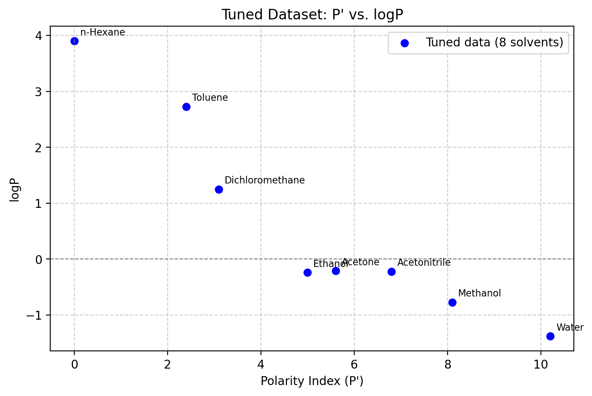
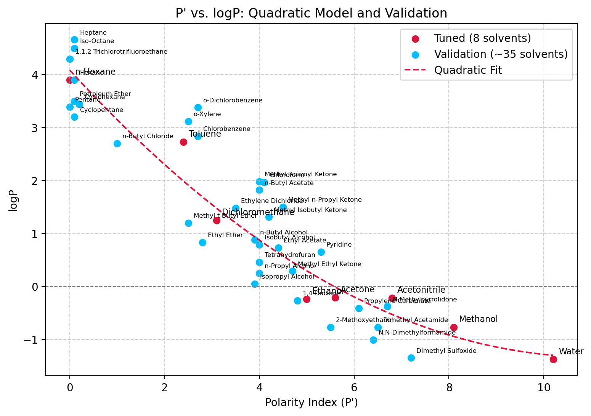
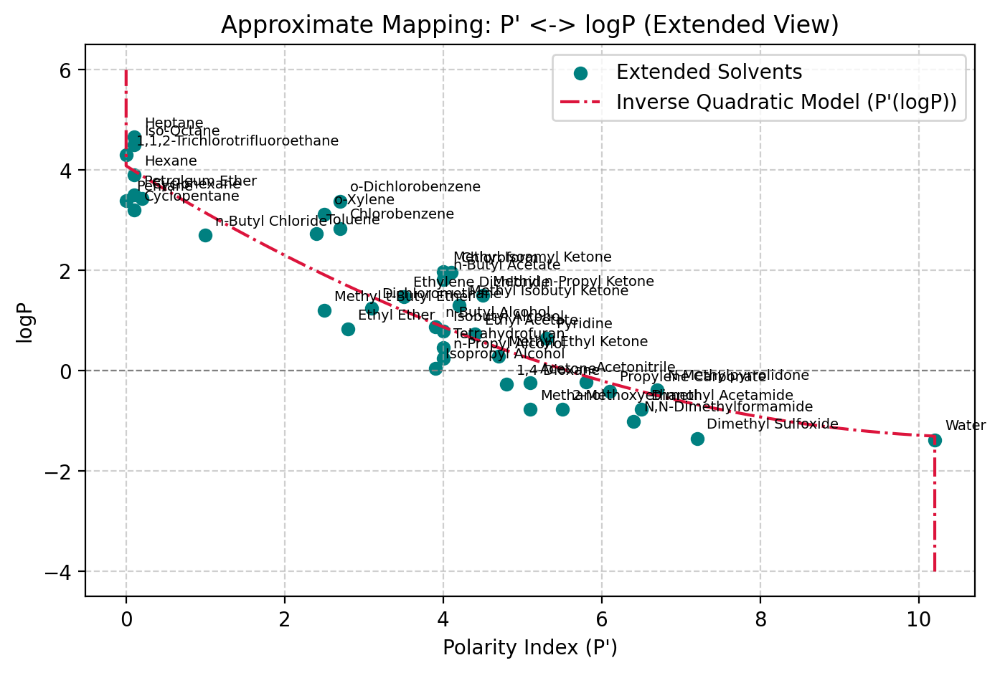

# SFPPy: Approximate Correlation Between Polarity Index (P') and logP

**Author**: olivi (community)  
**Date**: 2025-02-28

---

## Overview & Motivation

We want a **qualitative** mapping between:
- A "polarity index" $\displaystyle P'$
- The octanol-water partition coefficient $\displaystyle \log P$ (often called $logK_\text{ow}$, widely available for many substances)

**Why?**  
1. $\displaystyle \log P$ data is common (e.g., in PubChem).  
2. We want to classify or rank how "polar" or "non-polar" a substance is, within the SFPPy framework (e.g., for approximating Henry-like or partition coefficients in `patankar.layer` or `patankar.food`).

**Approach**  
- Use a **small "tuned" dataset** of 8 solvents spanning from **n-Hexane** (non-polar) to **Water** (very polar).  
- Fit a **simple quadratic** model:

$$
\log P \;=\; a\,(P')^2 \;+\; b\,P' \;+\; c
$$

- Compare to an **extended validation set** (~35 solvents) just to see if the shape looks reasonable.
- Invert the equation to get $P'$ from $\log P$:

$$
P' = \frac{-\,b \;-\; \sqrt{\,b^2 \;-\; 4\,a\,(\,c \;-\; \log P\,)}}{2\,a}
$$

and clamp $P'$ to $[0, 10.2]$ for extreme values.

**Disclaimer**  
- This is very approximate and **not** a rigorous universal correlation.  
- It serves as a **first-guess** or rank-based classification tool.  
- Use at your own risk for bounding or quick estimates in SFPPy.

---


## # 1. Set Up & Imports


```python
import numpy as np
import matplotlib.pyplot as plt
import pandas as pd

# For clean plots in Jupyter:
%matplotlib inline
%config InlineBackend.figure_format = 'retina'

```

## # 2. Tuned Reference Dataset (8 solvents)


```python

# Define the small, carefully chosen dataset
solvents = [
    "Water", "Methanol", "Ethanol", "Acetone", "Acetonitrile",
    "Dichloromethane", "Toluene", "n-Hexane"
]

# Polarity Index (P') with manual "tweaks" to get a smooth scale
polarity_index = [10.2,          # Water
                  8.1,           # Methanol (5.1 + 3.0)
                  5.0,           # Ethanol (4.3 + 0.7)
                  5.6,           # Acetone (5.1 + 0.5)
                  6.8,           # Acetonitrile (5.8 + 1.0)
                  3.1,           # Dichloromethane
                  2.4,           # Toluene
                  0.0            # n-Hexane
                 ]

# logP data from literature
logP_values = [-1.38,  # Water
               -0.77,  # Methanol
               -0.24,  # Ethanol
               -0.21,  # Acetone
               -0.22,  # Acetonitrile
                1.25,  # Dichloromethane
                2.73,  # Toluene
                3.90   # n-Hexane
              ]

# Put it into a small DataFrame for easy viewing
df = pd.DataFrame({
    "Solvent": solvents,
    "Polarity Index (P')": polarity_index,
    "logP": logP_values
}).sort_values(by="Polarity Index (P')", ascending=True)

df

```


<div>
<style scoped>
    .dataframe tbody tr th:only-of-type {
        vertical-align: middle;
    }

    .dataframe tbody tr th {
        vertical-align: top;
    }

    .dataframe thead th {
        text-align: right;
    }
</style>
<table border="1" class="dataframe">
  <thead>
    <tr style="text-align: right;">
      <th></th>
      <th>Solvent</th>
      <th>Polarity Index (P')</th>
      <th>logP</th>
    </tr>
  </thead>
  <tbody>
    <tr>
      <th>7</th>
      <td>n-Hexane</td>
      <td>0.0</td>
      <td>3.90</td>
    </tr>
    <tr>
      <th>6</th>
      <td>Toluene</td>
      <td>2.4</td>
      <td>2.73</td>
    </tr>
    <tr>
      <th>5</th>
      <td>Dichloromethane</td>
      <td>3.1</td>
      <td>1.25</td>
    </tr>
    <tr>
      <th>2</th>
      <td>Ethanol</td>
      <td>5.0</td>
      <td>-0.24</td>
    </tr>
    <tr>
      <th>3</th>
      <td>Acetone</td>
      <td>5.6</td>
      <td>-0.21</td>
    </tr>
    <tr>
      <th>4</th>
      <td>Acetonitrile</td>
      <td>6.8</td>
      <td>-0.22</td>
    </tr>
    <tr>
      <th>1</th>
      <td>Methanol</td>
      <td>8.1</td>
      <td>-0.77</td>
    </tr>
    <tr>
      <th>0</th>
      <td>Water</td>
      <td>10.2</td>
      <td>-1.38</td>
    </tr>
  </tbody>
</table>
</div>


## # 3. Extended Validation Dataset (~35 solvents)


```python

ext_solvents = [
    "Pentane", "1,1,2-Trichlorotrifluoroethane", "Cyclopentane", "Heptane", "Hexane",
    "Iso-Octane", "Petroleum Ether", "Cyclohexane", "n-Butyl Chloride", "Toluene",
    "Methyl t-Butyl Ether", "o-Xylene", "Chlorobenzene", "o-Dichlorobenzene", "Ethyl Ether",
    "Dichloromethane", "Ethylene Dichloride", "n-Butyl Alcohol", "Isopropyl Alcohol",
    "n-Butyl Acetate", "Isobutyl Alcohol", "Methyl Isoamyl Ketone", "n-Propyl Alcohol",
    "Tetrahydrofuran", "Chloroform", "Methyl Isobutyl Ketone", "Ethyl Acetate",
    "Methyl n-Propyl Ketone", "Methyl Ethyl Ketone", "1,4-Dioxane", "Acetone", "Methanol",
    "Pyridine", "2-Methoxyethanol", "Acetonitrile", "Propylene Carbonate", "N,N-Dimethylformamide",
    "Dimethyl Acetamide", "N-Methylpyrrolidone", "Dimethyl Sulfoxide", "Water"
]

ext_polarity_index = [
    0.0, 0.0, 0.1, 0.1, 0.1, 0.1, 0.1, 0.2, 1.0, 2.4, 2.5, 2.5, 2.7, 2.7, 2.8,
    3.1, 3.5, 3.9, 3.9, 4.0, 4.0, 4.0, 4.0, 4.0, 4.1, 4.2, 4.4, 4.5, 4.7, 4.8,
    5.1, 5.1, 5.3, 5.5, 5.8, 6.1, 6.4, 6.5, 6.7, 7.2, 10.2
]

ext_logP_values = [
    3.39, 4.30, 3.20, 4.66, 3.90, 4.50, 3.50, 3.44, 2.70, 2.73, 1.20, 3.12, 2.84, 3.38, 0.83,
    1.25, 1.48, 0.88, 0.05, 1.82, 0.79, 1.98, 0.25, 0.46, 1.97, 1.31, 0.73, 1.50, 0.29, -0.27,
    -0.24, -0.77, 0.65, -0.77, -0.22, -0.41, -1.01, -0.77, -0.38, -1.35, -1.38
]

# Filter out the ones already in the "tuned" set
validation_solvents = []
validation_polarity_index = []
validation_logP_values = []

for i, solvent in enumerate(ext_solvents):
    if solvent not in solvents:
        validation_solvents.append(solvent)
        validation_polarity_index.append(ext_polarity_index[i])
        validation_logP_values.append(ext_logP_values[i])

df_validation = pd.DataFrame({
    "Solvent": validation_solvents,
    "Polarity Index (P')": validation_polarity_index,
    "logP": validation_logP_values
}).sort_values(by="Polarity Index (P')")

df_validation.head(12)

```


<div>
<style scoped>
    .dataframe tbody tr th:only-of-type {
        vertical-align: middle;
    }

    .dataframe tbody tr th {
        vertical-align: top;
    }

    .dataframe thead th {
        text-align: right;
    }
</style>
<table border="1" class="dataframe">
  <thead>
    <tr style="text-align: right;">
      <th></th>
      <th>Solvent</th>
      <th>Polarity Index (P')</th>
      <th>logP</th>
    </tr>
  </thead>
  <tbody>
    <tr>
      <th>0</th>
      <td>Pentane</td>
      <td>0.0</td>
      <td>3.39</td>
    </tr>
    <tr>
      <th>1</th>
      <td>1,1,2-Trichlorotrifluoroethane</td>
      <td>0.0</td>
      <td>4.30</td>
    </tr>
    <tr>
      <th>2</th>
      <td>Cyclopentane</td>
      <td>0.1</td>
      <td>3.20</td>
    </tr>
    <tr>
      <th>3</th>
      <td>Heptane</td>
      <td>0.1</td>
      <td>4.66</td>
    </tr>
    <tr>
      <th>4</th>
      <td>Hexane</td>
      <td>0.1</td>
      <td>3.90</td>
    </tr>
    <tr>
      <th>5</th>
      <td>Iso-Octane</td>
      <td>0.1</td>
      <td>4.50</td>
    </tr>
    <tr>
      <th>6</th>
      <td>Petroleum Ether</td>
      <td>0.1</td>
      <td>3.50</td>
    </tr>
    <tr>
      <th>7</th>
      <td>Cyclohexane</td>
      <td>0.2</td>
      <td>3.44</td>
    </tr>
    <tr>
      <th>8</th>
      <td>n-Butyl Chloride</td>
      <td>1.0</td>
      <td>2.70</td>
    </tr>
    <tr>
      <th>10</th>
      <td>o-Xylene</td>
      <td>2.5</td>
      <td>3.12</td>
    </tr>
    <tr>
      <th>9</th>
      <td>Methyl t-Butyl Ether</td>
      <td>2.5</td>
      <td>1.20</td>
    </tr>
    <tr>
      <th>11</th>
      <td>Chlorobenzene</td>
      <td>2.7</td>
      <td>2.84</td>
    </tr>
  </tbody>
</table>
</div>


## # 4. Quick Visualization of the Tuned Data


```python

plt.figure(figsize=(8, 5))
plt.scatter(polarity_index, logP_values, color='blue', label="Tuned data (8 solvents)")

for i, solvent in enumerate(solvents):
    plt.annotate(
        solvent, (polarity_index[i], logP_values[i]),
        fontsize=8, xytext=(5,5), textcoords='offset points'
    )

plt.xlabel("Polarity Index (P')")
plt.ylabel("logP")
plt.title("Tuned Dataset: P' vs. logP")
plt.axhline(0, color='gray', linestyle='--', linewidth=0.8)
plt.grid(True, linestyle='--', alpha=0.6)
plt.legend()
plt.show()

```


    

    


## # 5. Fit a Quadratic Model: logP = a (P')^2 + b (P') + c


```python

coefficients = np.polyfit(polarity_index, logP_values, 2)
quadratic_model = np.poly1d(coefficients)

a, b, c = coefficients
print(f"Fitted quadratic coefficients: a={a:.4f}, b={b:.4f}, c={c:.4f}")
print(f"Model =>  logP = {a:.4f}*(P')^2 + {b:.4f}*P' + {c:.4f}")

# For plotting:
x_range = np.linspace(min(polarity_index), max(polarity_index), 100)
y_fitted = quadratic_model(x_range)

```

    Fitted quadratic coefficients: a=0.0443, b=-0.9796, c=4.0862
    Model =>  logP = 0.0443*(P')^2 + -0.9796*P' + 4.0862


## # 6. Compare with the Extended Validation Dataset


```python

plt.figure(figsize=(9, 6))

# Plot tuned set
plt.scatter(polarity_index, logP_values, color='Crimson', label="Tuned (8 solvents)")
for i, solvent in enumerate(solvents):
    plt.annotate(
        solvent, (polarity_index[i], logP_values[i]),
        fontsize=8, xytext=(5,5), textcoords='offset points'
    )

# Plot validation set
plt.scatter(validation_polarity_index, validation_logP_values,
            color='DeepSkyBlue', label="Validation (~35 solvents)")
for i, solvent in enumerate(validation_solvents):
    plt.annotate(
        solvent, (validation_polarity_index[i], validation_logP_values[i]),
        fontsize=6, xytext=(5,5), textcoords='offset points'
    )

# Plot fitted curve
plt.plot(x_range, y_fitted, color='Crimson', linestyle='--', label="Quadratic Fit")

plt.xlabel("Polarity Index (P')")
plt.ylabel("logP")
plt.title("P' vs. logP: Quadratic Model and Validation")
plt.axhline(0, color='gray', linestyle='--', linewidth=0.8)
plt.grid(True, linestyle='--', alpha=0.6)
plt.legend()
plt.show()

```


    

    


## # 7.Implementation


```python

def polarity_index_from_logP(logP,
                             A=0.04426556625879231,
                             B=-0.9796466111259537,
                             C=4.086222276379432):
    """
    Computes the polarity index (P') from a given logP value
    as the positive root of the quadratic fitted equation:

        logP = A * (P')² + B * P' + C
        P' = (-B - sqrt(B² - 4A(C - logP))) / (2A)

    Parameters:
    ----------
    logP : float, list, or np.ndarray
        The logP value(s) for which to compute the polarity index P'.

    Returns:
    -------
    float or np.ndarray
        The calculated polarity index P' corresponding to the input logP.
        If logP is out of the valid range, returns:
        - 10.2 for very polar solvents (beyond water)
        - 0 for extremely hydrophobic solvents (beyond n-Hexane)

    Example Usage:
    -------------
    >>> polarity_index_from_logP(-0.5)
    8.34  # Example output

    >>> polarity_index_from_logP([-1.0, 0.5, 2.0])
    array([9.2, 4.5, 1.8])  # Example outputs
    """

    # Define valid logP range based on quadratic model limits
    logPmin = C - B**2 / (4*A)  # ≈ -1.334 (theoretical minimum logP)
    logPmax = C                  # 4.086 (theoretical maximum logP)
    Pmax = 10.2 # value for water

    def compute_P(logP_value):
        """Computes P' for a single logP value after input validation."""
        if logP_value < logPmin:
            return Pmax  # Most polar (beyond water)
        if logP_value > logPmax:
            return 0.0  # Most hydrophobic (beyond n-Hexane)

        discriminant = B**2 - 4*A*(C - logP_value)
        sqrt_discriminant = np.sqrt(discriminant)
        P2root = (-B - sqrt_discriminant) / (2*A)  # Always select P2
        return P2root if P2root<=Pmax else Pmax

    # Handle both single and multiple values efficiently
    if isinstance(logP, (list, tuple, np.ndarray)):
        return np.vectorize(compute_P)(logP)  # Vectorized for multiple inputs
    else:
        return compute_P(logP)
```

## # 8. Demonstration


```python

print("\n=== Demonstration of polarity_index_from_logP ===")
demo_values = [-1.5, -0.5, 0.5, 5.0]
results = polarity_index_from_logP(demo_values)
for lv, r in zip(demo_values, results):
    print(f"logP={lv:>5.2f} => P'={r:>5.2f}")
```

    
    === Demonstration of polarity_index_from_logP ===
    logP=-1.50 => P'=10.20
    logP=-0.50 => P'= 6.73
    logP= 0.50 => P'= 4.63
    logP= 5.00 => P'= 0.00


## # 9. Final Plot - Extended


```python

plt.figure(figsize=(8, 5))
plt.scatter(ext_polarity_index, ext_logP_values, color='Teal', label="Extended Solvents")
for i, solvent in enumerate(ext_solvents):
    plt.annotate(solvent, (ext_polarity_index[i], ext_logP_values[i]),
                 fontsize=7, xytext=(5,5), textcoords='offset points')

logP_range = np.linspace(-4, 6, 1000)
p_estimated = polarity_index_from_logP(logP_range)
plt.plot(p_estimated, logP_range, color='Crimson', linestyle='-.',
         label="Inverse Quadratic Model (P'(logP))")

plt.xlabel("Polarity Index (P')")
plt.ylabel("logP")
plt.title("Approximate Mapping: P' <-> logP (Extended View)")
plt.axhline(0, color='gray', linestyle='--', linewidth=0.8)
plt.grid(True, linestyle='--', alpha=0.6)
plt.legend()
plt.show()
```


    

    

