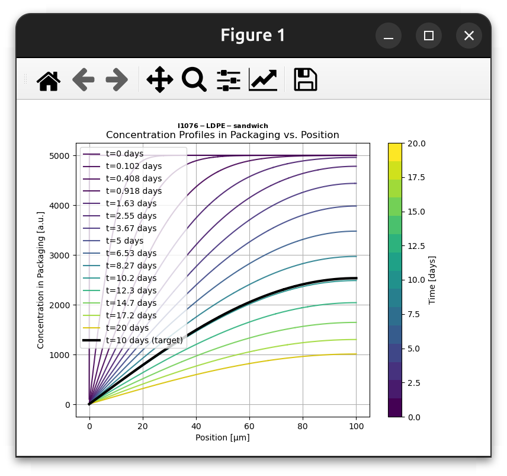
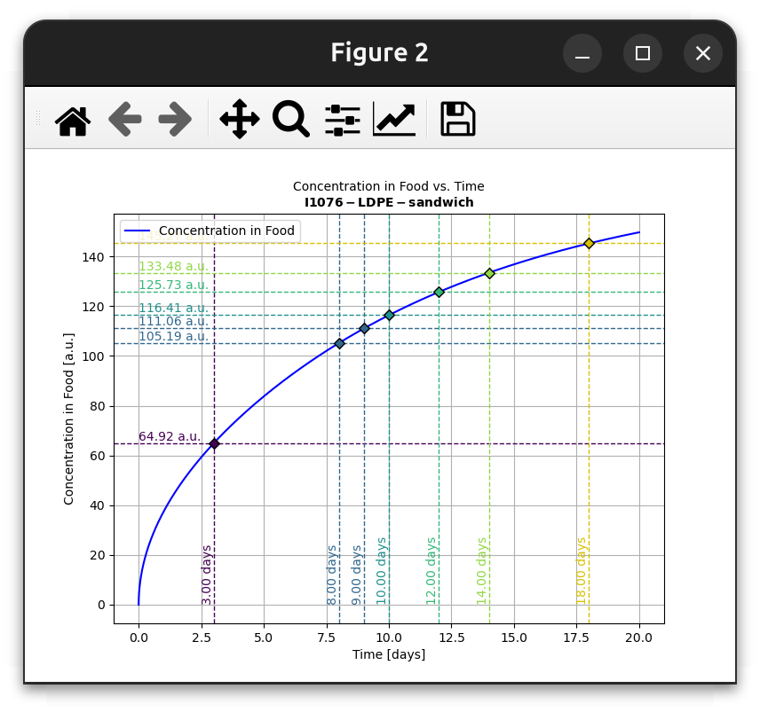
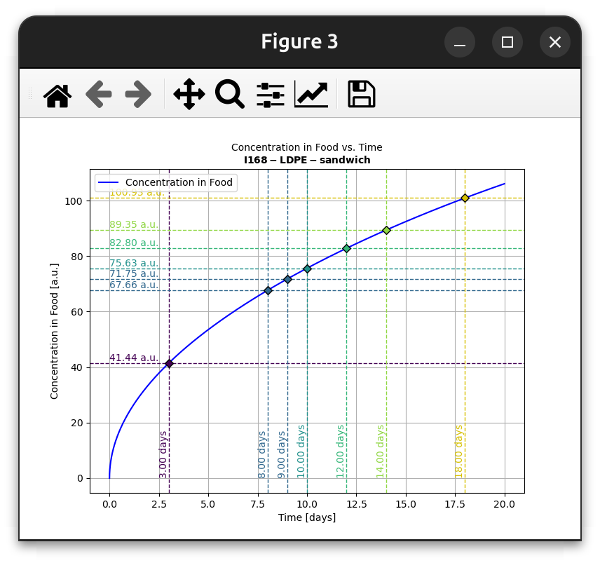
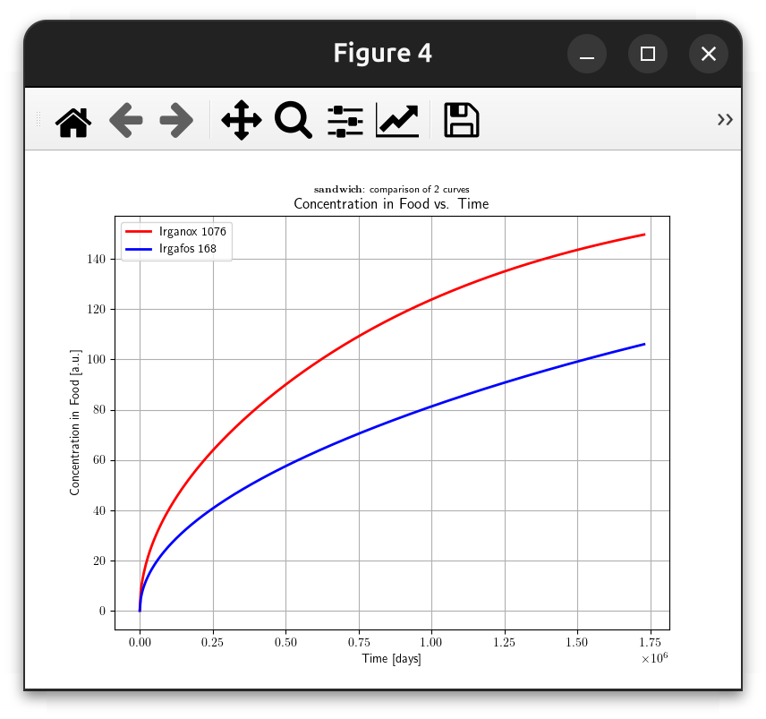

# 🍱🔬SFPPy Example 1: Mass Transfer from Monolayer Materials 🍏⏩🍎

> **Synopsis**
>
> This example demonstrates **1D mass transfer** of **Irganox 1076** and **Irgafos 168** from a **100 µm LDPE film** into a **fatty sandwich** over **10 days at 7°C**.
>
> > <small> 💡 **Example 1** showcases functional syntax (low-level), providing direct and transparent access to simulation details. If you prefer higher-level syntax with less coding effort and fewer dependencies, check out [Example 3](example3.html) and [Example 4](example4.html), which leverage operator overloading and advanced methods for a more streamlined experience.</small>

***

[TOC]

***

## Overview 📌

### Simulation Steps 🔢
1. **Define the sandwich geometry** (cylindrical shape).
2. **Set up the polymer layer** (LDPE with additives).
3. **Define the food properties** (real, semisolid, fatty).
4. **Simulate mass transfer** for:
   - **Irganox 1076 in LDPE**.
   - **Irgafos 168 in LDPE**.
5. **Compare migration kinetics** between both cases.
6. **Save and print all simulation results**.

### Expected Outcomes ✅
- **Comparison of migration kinetics** for both additives.
- **Understanding of additive behavior in food packaging**.
- **Ready-to-use figures and reports for food safety analysis**.

## Dependencies 📦
This script relies on several **SFPPy** modules:

| Module                            | Purpose                                                      |
| --------------------------------- | ------------------------------------------------------------ |
| `patankar.loadpubchem`            | Retrieves chemical properties of migrants from PubChem. 🧪    |
| `patankar.geometry`               | Defines the 3D geometry of the packaging. 📏                  |
| `patankar.food`                   | Models the food layer and its interaction with packaging. 🍔  |
| `patankar.layer`                  | Provides polymer layer properties and diffusion parameters. 🎭 |
| `patankar.migration`              | Simulates mass transfer using a **finite-volume solver**. 🔄  |
| `patankar.migration.print_figure` | Exports and saves migration results. 📊                       |

## Code Breakdown 📝

### 1️⃣ Define Contact Conditions
```python
contactTemperature = (7, "degC")  # Temperature of the sandwich
contactTime = (10, "days")  # Contact duration
```

### 2️⃣ Define Sandwich Geometry 🥪
```python
sandwich_geom = Packaging3D(
    'Cylinder',
    height=(19, "cm"),  # 19 cm height (length=height)
    radius=(6, "mm")    # 6 mm radius
)
internalvolume, contactsurface = sandwich_geom.get_volume_and_area()
```

### 3️⃣ Define the Migrant (<kbd>Irganox 1076</kbd>) 🏭
```python
m1 = migrant("irganox 1076")
```

### 4️⃣ Create the LDPE Film 📜
```python
LDPElayer_with_m1 = polymer.LDPE(
    l=(100, "um"),    # Thickness: 100 µm
    substance=m1,
    C0=5000,  # Initial concentration (arbitrary units, but let's assume 5000 mg/kg)
    T=contactTemperature
)
```

### 5️⃣ Define Food Properties 🍔
```python
class sandwich(food.realfood, food.semisolid, food.fat):
    name = "sandwich"

FOODlayer = sandwich(
    volume=internalvolume,
    surfacearea=contactsurface,
    contacttime=contactTime,
    contacttemperature=contactTemperature,
    substance=m1,  # Required for partition coefficient prediction
    simulant="ethanol" # a simulant is required to predict partition coefficients
)
```

### 6️⃣ Run Migration Simulation 🚀
```python
simulation = solver(
    LDPElayer_with_m1,  # LDPE containing Irganox 1076
    FOODlayer,  # Fatty sandwich (here with m1)
    name="I1076-LDPE-sandwich"
) # run the simulation

# Display simulation details
print(simulation)
# Retrieve concentration at target time in SI units
print("CF at time t=", simulation.ttarget, "[s] = ", simulation.CFtarget, "[a.u.]")

# Interpolate Concentrations at Specific Times
tnew = _toSI(([3, 8, 9, 10, 12, 14, 18], "days")).flatten()
CF = simulation.interpolate_CF(tnew).flatten()

# Concentration profiles at ttarget
simulation.plotCx()
```

`<SensPatankarResult:I1076-LDPE-sandwich: CF(10 [days]) = 116.4 [a.u.]>
CF at time t= [864000] [s] =  [116.40897281] [a.u.]`



### 7️⃣ Compare Migration for Two Additives: <kbd>Irganox 1076</kbd> (`m1`) and <kbd>Irgafos 168</kbd> (`m2`) 📊

```python
# define m2
m2 = migrant("irgafos 168")
# update the formulation of the film
LDPElayer_with_m2 = polymer.LDPE(
    l=(100, "um"),
    substance=m2,
    C0=5000,
    T=contactTemperature
)
simulation2 = solver(
    LDPElayer_with_m2,              # contact material
    FOODlayer.update(substance=m2), # contact medium
    name="I168-LDPE-sandwich"       # simulation name
) # run for m2

# Add the new simulation (Irgafos 168) to the results store
allCF.add(simulation2, "Irgafos 168", "b")  # Assign blue color "b"

# Generate the corresponding plot
hfig2 = simulation2.plotCF(t=tnew) # hfig2 = figure handle

# Compare CF vs time for Irganox 1076 (m1) and Irgafos 168 (m2)
hfig12 = allCF.plotCF() # hfig12 figure handle for the comparison
```

### 8️⃣ Save and Print Figures 📑

```python
print_figure(simulation.plotCF(), **printconfig)   # plot and print
print_figure(simulation2.plotCF(), **printconfig)  # plot and print
```

For `Irganox 1076`:



For `Irgafos 168`:



### 9️⃣ **Results** 📉

📌 **Estimated partition coefficients:**

> 💡 Since partition coefficients are estimated in a conservative manner, substances with similar molar volume and polarity are likely to be represented with similar partition coefficients.
*Food-to-packaging* partition coefficient reads:
$$
C_{F/P}=\frac{C_F^{eq}}{C_P^{eq}}=\frac{k}{k_0}
$$

```python
KFP_m1 = LDPElayer_with_m1.k / FOODlayer.update(substance=m1).k0
KFP_m2 = LDPElayer_with_m2.k / FOODlayer.update(substance=m2).k0
print(f"m1:I1076 KF/P = {KFP_m1}", "\n", f"m2:I168 KF/P = {KFP_m2}")
```

`m1:I1076 KF/P = [24.5896934] 
 m2:I168 KF/P = [24.5896934]`

📌 **Kinetic Comparison**

```python
allCF = store(name="sandwich")
allCF.add(simulation, "Irganox 1076", "r") # Assign red color "r" to I1076
allCF.add(simulation2, "Irgafos 168", "b") # Assign blue color "b" to I168
hfig12 = allCF.plotCF() # hfig12 figure handle for the comparison
```




---
> **This example is part of the SFPPy project, developed for food packaging safety modeling.** 🎯


***

<div style="border: 2px solid #4CAF50; border-radius: 8px; padding: 10px; background: linear-gradient(to right, #4CAF50, #FF4D4D); color: white; text-align: center; font-weight: bold;">
  <span style="font-size: 20px;">🍏⏩🍎 <strong>SFPPy for Food Contact Compliance and Risk Assessment</strong></span><br>
  Contact <a href="mailto:olivier.vitrac@gmail.com" style="color: #fff; text-decoration: underline;">Olivier Vitrac</a> for questions |
  <a href="https://github.com/ovitrac/SFPPy" style="color: #fff; text-decoration: underline;">Website</a> |
  <a href="https://ovitrac.github.io/SFPPy/" style="color: #fff; text-decoration: underline;">Documentation</a>
</div>