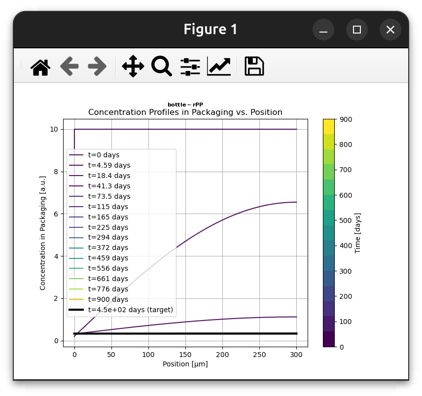
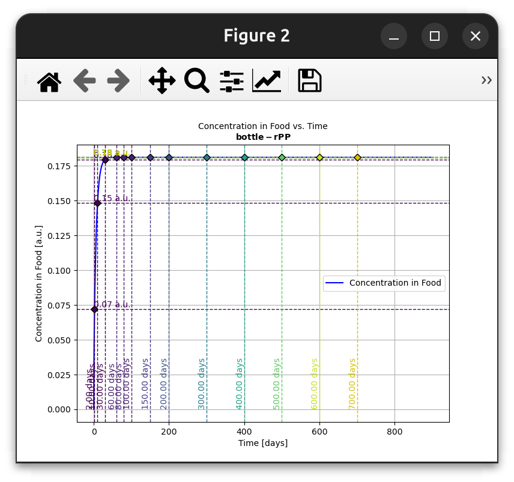
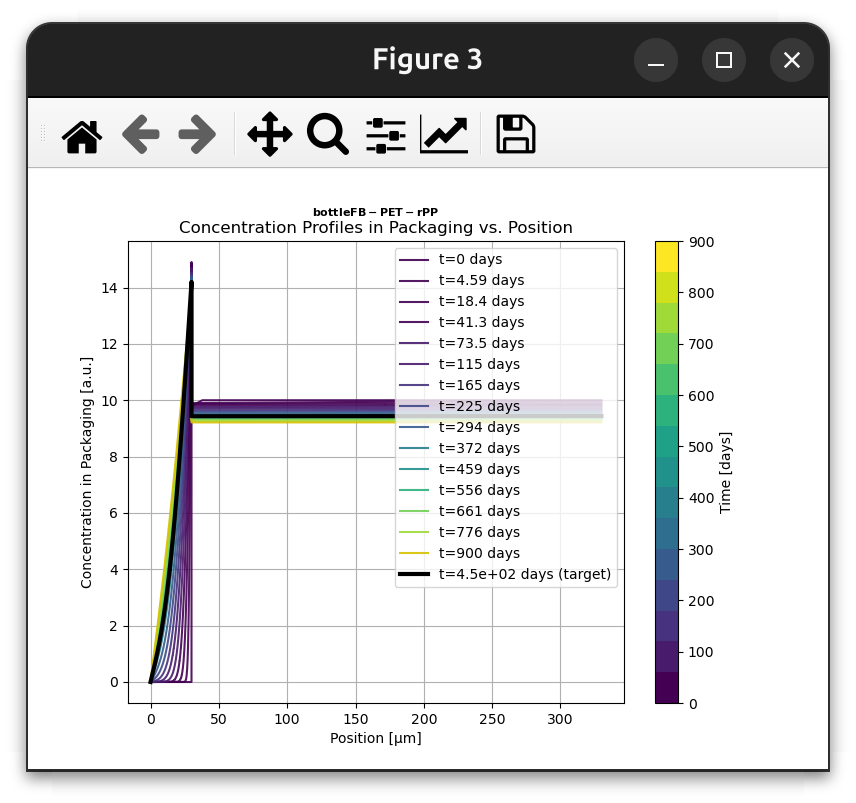
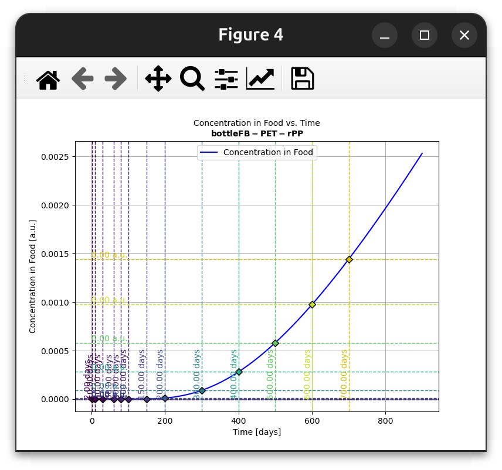
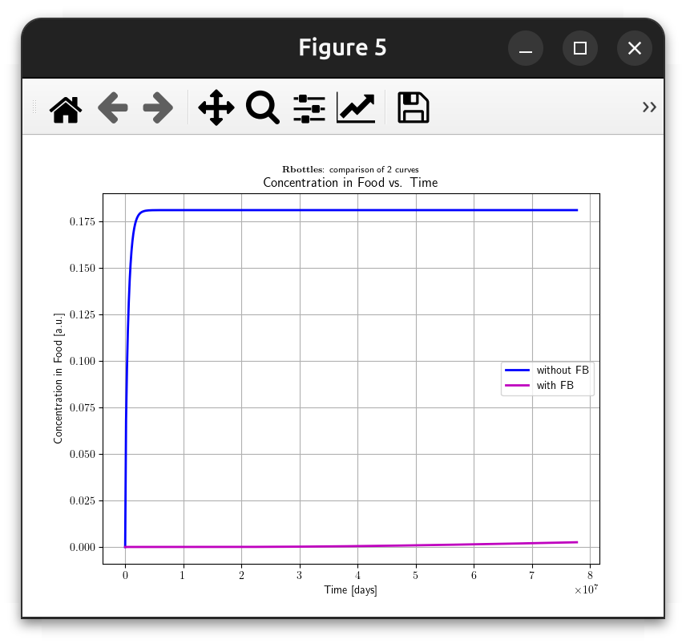
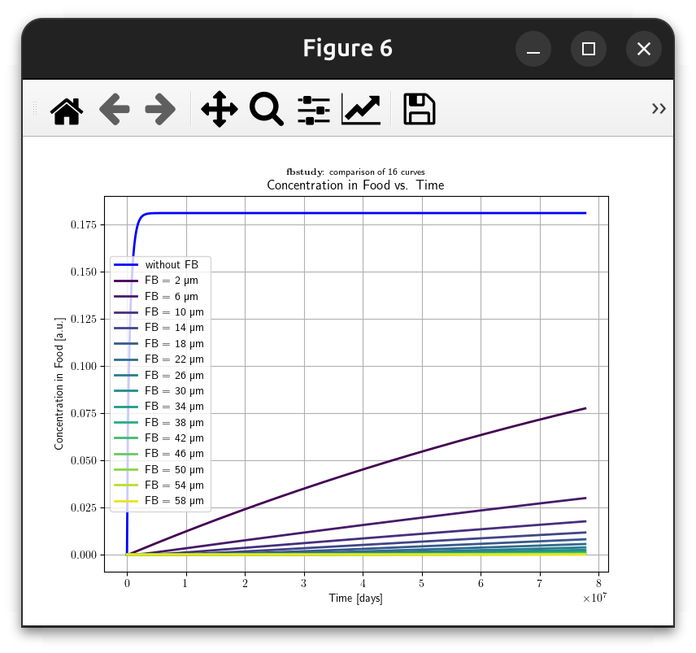

# ♻️🛡️ 🥤🧴 Example 2: Mass Transfer Simulation in Recycled PP Bottles 🍏⏩🍎

> **Synopsis**
>
> SFPPy Example: Simulating **1D mass transfer** of **toluene** from a **300 µm recycled PP bottle** into **fatty liquid food**, with and without a **PET functional barrier (FB)**.
>
> > <small>💡 **Example 2** showcases functional syntax (low-level), providing direct and transparent access to simulation details. If you prefer higher-level syntax with less coding effort and fewer dependencies, check out [Example 3](example3.html) and [Example 4](example4.html), which leverage operator overloading and advanced methods for a more streamlined experience.</small>

***

[TOC]

---

## 📝 Overview

This simulation evaluates the **migration kinetics** of **toluene** from **recycled polypropylene (PP)** into a **fatty liquid food**. We also analyze the **effectiveness of a PET functional barrier (FB)** in reducing migration.

### 🔬 **Simulation Steps**
1️⃣ **Define bottle geometry**: A **1L bottle** with a **body** and **neck**.  
2️⃣ **Set up polymer layers**: PP containing **toluene**, with/without PET FB.  
3️⃣ **Define liquid food properties**: Fatty liquid, storage conditions.  
4️⃣ **Run mass transfer simulations**:
   - 🔵 **Without a functional barrier**.
   - 🟣 **With a 30 µm PET FB**.  
5️⃣ **Compare migration kinetics** between both cases.  
6️⃣ **Perform a systematic study** on **FB thickness** (2 µm to 60 µm).  
7️⃣ **Save and print all simulation results**.  

### 🎯 **Expected Outcomes**
✅ **Analysis of migration kinetics** (with and without FB).  
✅ **Determine optimal PET thickness** for reducing migration.  
✅ **Generate plots and reports** for food safety analysis.  

---

## ⚙️ Dependencies

This example requires the following **SFPPy modules**:

| 🏷️ Module               | 📖 Description                                                |
| ---------------------- | ------------------------------------------------------------ |
| `patankar.loadpubchem` | Retrieves **molecular properties** from PubChem.             |
| `patankar.geometry`    | Defines **packaging geometry** (e.g., bottles, cans).        |
| `patankar.food`        | Provides **food layer properties** for migration simulations. |
| `patankar.layer`       | Defines **polymer materials** (PP, PET, etc.).               |
| `patankar.migration`   | Implements **1D finite-volume solvers** for mass transfer.   |
| `matplotlib.pyplot`    | Used for **plotting results**.                               |

### 🔌 **Installation**
If not installed, ensure you have the SFPPy framework in your environment:

```bash
pip install sfppy
```

---

## 📏 **Step 1: Define Contact Conditions**

- **Temperature**: **20°C**  
- **Contact duration**: **450 days**  
- **Maximum initial concentration in polymer**: **10 mg/kg**  

```python
contactTemperature = (20, "degC")
contactTime = (450, "days")
maxConcentration = 10  # mg/kg
```

---

## 🏺 **Step 2: Define Bottle Geometry**
We model a **1L bottle** using the `Packaging3D` class.

```python
from patankar.geometry import Packaging3D

bottle = Packaging3D(
    "bottle",
    body_radius=(40, "mm"),
    body_height=(0.2, "m"),
    neck_radius=(1.8, "cm"),
    neck_height=0.05
)
```

🔹 **Computed values**:  
📦 **Volume** = 1L  
📏 **Contact surface area** = Calculated automatically  

---

## 🔬 **Step 3: Define Migrant (Toluene)**

Retrieve the **chemical properties** of **toluene** from **PubChem**:

```python
from patankar.loadpubchem import migrant
surrogate = migrant("toluene")
```

---

## 🎭 **Step 4: Define PP Bottle Walls**

Create a **300 µm PP layer** containing **toluene**:

```python
from patankar.layer import PP

PPwalls_with_toluene = PP(
    l=(300, "um"),   
    substance=surrogate,  
    C0=maxConcentration,  
    T=contactTemperature  
)
```

---

## 🥤 **Step 5: Define Liquid Food Properties**

Create a **fatty liquid food** model using inheritance:

```python
import patankar.food as food

class liquidFood(food.realfood, food.liquid, food.fat):
    name = "liquidFood"

FOODlayer = liquidFood(
    volume=bottle.get_volume_and_area()[0],  
    surfacearea=bottle.get_volume_and_area()[1],  
    contacttime=contactTime,
    contacttemperature=contactTemperature
)
```

---

## ⚗️ **Step 6: Run Migration Simulation (No Functional Barrier)**

Run the **mass transfer simulation** for **toluene migration from PP into food**:

```python
from patankar.migration import senspatankar as solver

ref_simulation = solver(
    PPwalls_with_toluene,  # PP containing toluene
    FOODlayer,             # Fatty liquid food
    name="bottle-rPP"
)
```

🖼️ **Plot concentration profiles**:

```python
ref_simulation.plotCx()
```



📈 **Plot migration kinetics**:

```python
ref_simulation.plotCF()
```




---

## 🛡️ **Step 7: Add a PET Functional Barrier (FB)**

Introduce a **30 µm PET barrier layer**:

```python
from patankar.layer import gPET

PET_functionalBarrier = gPET(
    l=(30, "um"),
    substance=surrogate,
    C0=0,  # Virgin PET (no migrant)
    T=contactTemperature
)

# Combine PET + PP
FBwalls_with_toluene = PET_functionalBarrier + PPwalls_with_toluene
```

---

## 🚀 **Step 8: Run Simulation with Functional Barrier**

Re-run the simulation **with the PET FB**:

```python
fb_simulation = solver(
    FBwalls_with_toluene,
    FOODlayer,
    name="bottleFB-PET-rPP"
)
fb_simulation.plotCx()
```



📈 **Compare migration kinetics**:

```python
fb_simulation.plotCF()
```




---

## 📊 **Step 9: Compare Migration (With vs Without FB)**

```python
from patankar.migration import CFSimulationContainer as store

allCF = store(name="Rbottles")
allCF.add(ref_simulation, "without FB", "b")  # Reference case (blue)
allCF.add(fb_simulation, "with FB", "m")      # Functional barrier case (magenta)

# Plot both cases
allCF.plotCF()
```

---



## 🧪 **Step 10: Study FB Thickness (2 µm to 60 µm)**

```python
fullcomparison = store(name="fb study")
fullcomparison.add(ref_simulation, "without FB", "b")

# Vary PET thickness from 2 µm to 60 µm
for fb_thickness in range(2, 61, 4):
    print(f"Solving for FB = {fb_thickness} µm")
    
    FBwalls_with_toluene.l[0] = (fb_thickness, "um")  # Update thickness
    
    sim = solver(FBwalls_with_toluene, FOODlayer, name=f"FB-{fb_thickness}um")
    
    fullcomparison.add(sim, f"FB = {fb_thickness} µm")

# 📈 Plot all FB thickness scenarios
fullcomparison.plotCF()
```



---

## 🖨️ **Step 11: Save and Print Figures**

```python
from patankar.migration import print_figure

outputfolder = "tmp"
printconfig = {"destinationfolder": outputfolder, "overwrite": True}

print_figure(allCF.plotCF(), **printconfig)
print_figure(fullcomparison.plotCF(), **printconfig)
```

---

## 🏆 **Conclusion**
- ✅ **PET functional barriers reduce migration.**
- ✅ **Increasing PET thickness further reduces migration.**
- ✅ **SFPPy enables precise simulation and analysis.**

🚀 **Next Steps:** Extend the study with different **storage conditions**, **food types**, or **migrants**.

---

This document is based on **Example 2** from the **SFPPy project**. For more details, check the full documentation. 📖

***

<div style="border: 2px solid #4CAF50; border-radius: 8px; padding: 10px; background: linear-gradient(to right, #4CAF50, #FF4D4D); color: white; text-align: center; font-weight: bold;">
  <span style="font-size: 20px;">🍏⏩🍎 <strong>SFPPy for Food Contact Compliance and Risk Assessment</strong></span><br>
  Contact <a href="mailto:olivier.vitrac@gmail.com" style="color: #fff; text-decoration: underline;">Olivier Vitrac</a> for questions |
  <a href="https://github.com/ovitrac/SFPPy" style="color: #fff; text-decoration: underline;">Website</a> |
  <a href="https://ovitrac.github.io/SFPPy/" style="color: #fff; text-decoration: underline;">Documentation</a>
</div>