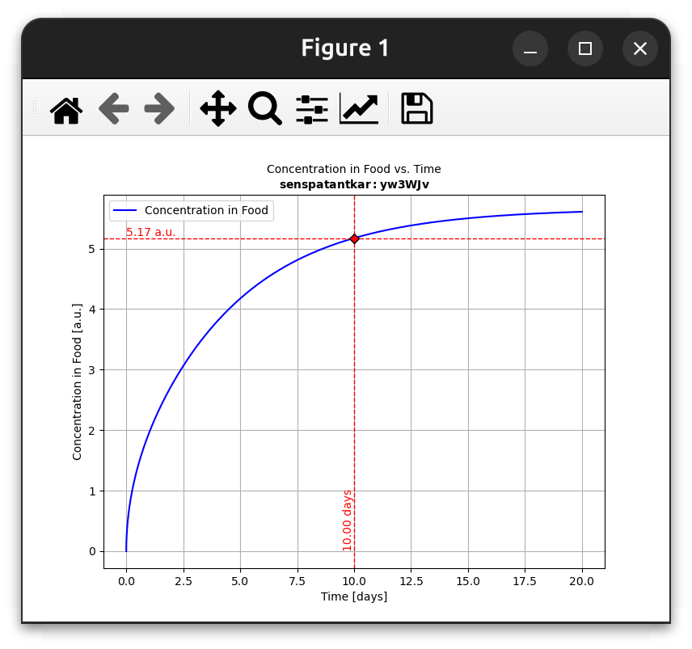
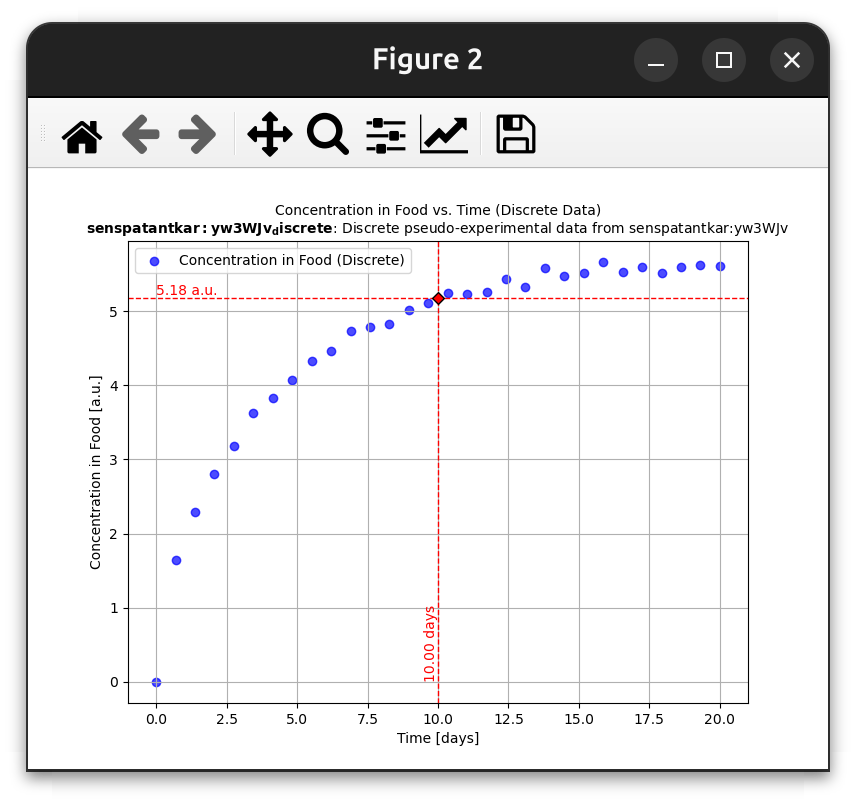
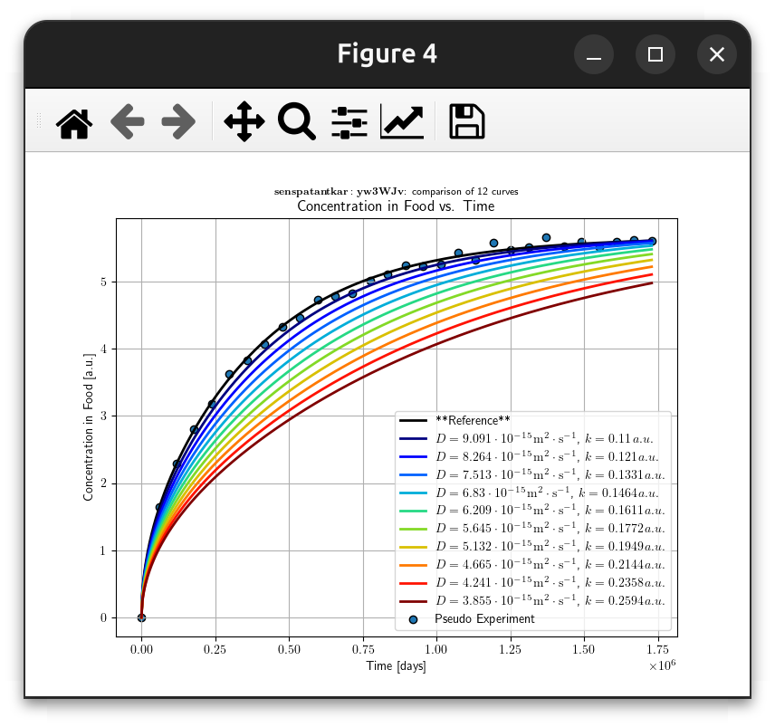
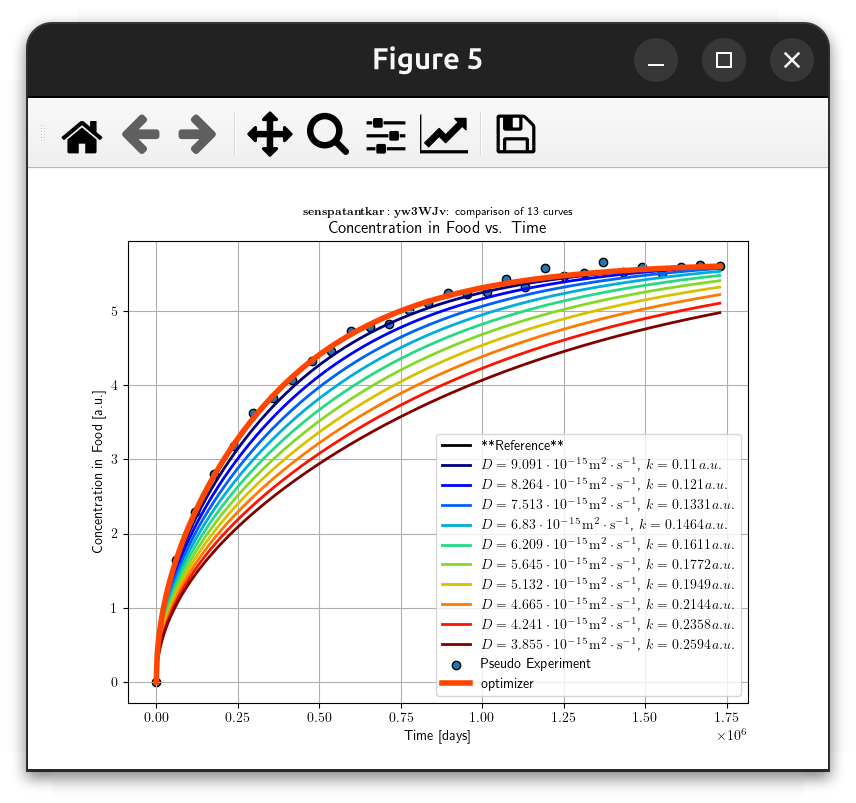

# 📌 Example 4: Estimating $D$ and $k$ from Concentration Kinetics in Food Simulants🍏⏩🍎


> This example illustrates how the diffusion coefficient (**$D$**) and partition coefficient (**$k$**) can be estimated from concentration kinetics in food simulants. 🧪

[TOC]

## 🔑 Key Concepts

The concept of **free parameters** is enforced by creating `layerLink` objects for specific layers and properties. `layerLink` enables modifying simulations with minimal code changes, making it ideal for **sensitivity analysis**. 📊

The showcase describes the **desorption** from a **monolayer material (<kbd>P</kbd>)** into a **food simulant (<kbd>F</kbd>)**. By fixing an arbitrary **$k = 1$** for the food simulant (i.e., $k_F$), we can consider **$k$ in the material ($k_P$)** as the partition coefficient between **<kbd>F</kbd> and <kbd>P</kbd>**:

$$
K_{F/P} = \frac{C_{Feq}}{C_{Peq}} = \frac{k_P}{k_F}
$$


Since:
$$
C_{Feq} = k_F \cdot p_{eq}, \quad C_{Peq} = k_P \cdot p_{eq}
$$
Where $p_{eq}$ is the equilibrium partial pressure of the substance in P and F. ⚖️

The `layerLink` mechanism also provides the flexibility to **optimize** `D` and `k` in arbitrary layers, enabling forensic exploration of migration processes. 🔍

---

### 📚 What You Will Learn

### 🏗️ Creating and Running Simulations

1. **Define a monolayer material (<kbd>P</kbd>) and a food layer (<kbd>F</kbd>)** with numerical data.
  
   - If a substance is inserted, all properties not defined by links are automatically calculated. 🤖
2. **Define and attach **`layerLink`** objects** to an existing simulation.
3. **Run a migration simulation** using:
   ```python
   R = F.migration(P)  # Or alternatively: R = P.migration(F)
   ```

### 📊 Data Analysis and Sensitivity Testing

4. **Create a pseudo-experiment dataset** using:
   ```python
   E = R.pseudoexperiment()
   ```
   - You can also provide your own data. 📝
5. **Compute a distance function**:
   ```python
   d2 = R - E  # Squared distance function between R and E
   ```
6. **Perform sensitivity analysis** by changing the `layerLink` values of `D` and `k`. 🎯
7. **Rerun simulations** with updated parameters:
   ```python
   R.rerun()
   ```
8. **Compare different scenarios** using:
   ```python
   R.comparison.plotCF()
   ```

### 🔬 Parameter Fitting and Model Evaluation

9. **Fit **`D`** and **`k`** simultaneously** to recover original values:
   ```python
   R.fit(E)  # Fits R against experimental E values
   ```
10. **Measure fit quality** and assess the risk of overfitting. 🚦

---

## ⚙️ Example Workflow

### 📦 Required Dependencies (minimal)

```python
from patankar.layer import layer, layerLink
from patankar.food import foodlayer
```

### 🏗️ Defining the Monolayer Material (<kbd>P</kbd>)

```python
P = layer(l=(100, "um"),
          D=(1e-10, "cm**2/s"), # note that non SI units will be converted automatically
          C0=1000,
          k=0.1) # k=0.1 means KF/P=0.1 by setting k=1 in Food
```

### 🥣 Defining the Food Layer (<kbd>F</kbd>)

```python
F = foodlayer(contacttime=(10, "days"),
              volume=(1, "L"),
              surfacearea=(6, "dm**2"), # remember **2 means ^2 in Python (do not use ^)
              h=(1e-6, "m/s"),
              CF0=0,
              k=1)
```

### 🔗 Creating and Attaching `layerLink` Objects

```python
Dreference, kreference = P.D, P.k
D = layerLink("D", indices=0, values=Dreference) # D links P.D[0] with 0 = layer 1
k = layerLink("k", indices=0, values=kreference) # k links P.k[0]
P.Dlink = D # we attach the Dlink to P
P.klink = k # we attach the klink to P
```

### 🚀 Running the Initial Migration Simulation

```python
R = F.migration(P) # R = P.migration(F) works also, R = P >> F is another option
R.plotCF()
```



### 🎭 Generating Pseudo-Experimental Data

```python
E = R.pseudoexperiment(npoints=30, std_relative=0.01) # +/- 2% errors
E.plotCF()
```



### 📏 Evaluating the Distance Function

```python
d2 = R - E # "minus" means sum of squared errors (in this context)
print(f"Initial squared distance (E - R)**2: {d2()}")
```

`output`

```python
Initial squared distance (E-R)**2: 1.4563863866984994
```


### 🎯 Sensitivity Analysis

```python
niterations = 10 # number of iterations for the sensitivty analysis
cmap = R.comparison.jet(niterations)

for i in range(1, niterations + 1):
    D[0] /= 1.1  # Decrease D by 10%
    k[0] *= 1.1  # Increase k by 10%
    name = f"{P.Dlatex()[0]},{P.klatex()[0]}"
    R.rerun(name=name, color=cmap[i-1])
    print(f"[{i}/{niterations}]: Distance variation = {100 * d2() / d2_original - 100}%")
```

`output`

```python
[1/10]: Distance variation = 472.22%
[2/10]: Distance variation = 2064.67%
[3/10]: Distance variation = 4976.16%
[4/10]: Distance variation = 9413.49%
[5/10]: Distance variation = 15587.15%
[6/10]: Distance variation = 23706.21%
[7/10]: Distance variation = 33972.40%
[8/10]: Distance variation = 46573.86%
[9/10]: Distance variation = 61678.86%
[10/10]: Distance variation = 79430.02%
```


### 📌 Adding Pseudo-Experiment to Comparison

```python
R.comparison.add(E, label='pseudo experiment', discrete=True)
R.comparison.plotCF()
```



### 🎯 Fitting `D` and `k` to Recover Original Values

```python
d2beforeOptim = d2()
resfit = R.fit(E) # fitting is performed using the Nelder and Mead simplex method
d2afterOptim = d2()

print(f"BEFORE OPTIMIZATION: (E - R)**2 = {d2beforeOptim}")
print(f"AFTER OPTIMIZATION: (E - R)**2 = {d2afterOptim}")
print(f"Variation from original = {100 * d2afterOptim / d2_original - 100:.4g}%")

print(f'Dfitted = {D.values} [m²/s] vs. Doriginal = {Dreference} [m²/s]')
print(f'kfitted = {k.values} [a.u.] vs. koriginal = {kreference} [a.u.]')
```

`Output`

```python
Fitting Iteration:
 D=[2.02660678e-14] [m²/s]
 k=[0.24245056] [a.u.]

Fitting Iteration:
 D=[2.02660678e-14] [m²/s]
 k=[0.24245056] [a.u.]

Fitting Iteration:
 D=[8.83937014e-15] [m²/s]
 k=[0.25503568] [a.u.]

Fitting Iteration:
 D=[8.83937014e-15] [m²/s]
 k=[0.23839508] [a.u.]
    ............... omitted lines .................
Fitting Iteration:
 D=[9.98539667e-15] [m²/s]
 k=[0.09908638] [a.u.]

Fitting Iteration:
 D=[9.98612124e-15] [m²/s]
 k=[0.09901856] [a.u.]

Fitting Iteration:
 D=[9.98612124e-15] [m²/s]
 k=[0.09901856] [a.u.]

Optimization terminated successfully.
         Current function value: 1.449892
         Iterations: 36
         Function evaluations: 69
BEFORE OPTIMIZATION: Distance (E-R)**2 = 1158.2644200304899
AFTER OPTIMIZATION: Distance (E-R)**2 = 1.4498919527284508
Variation with original = -0.4459% [Overfitting detected]

Fitted D = [9.98612124e-15] [m²/s] vs. Original D = [1.e-14] [m²/s]
Fitted k = [0.09901856] [a.u.] vs. Original k = [0.1] [a.u.]
```


### 📊 Final Comparison Plot

```python
R.comparison.plotCF()
```



---

> By following these steps, you can analyze how diffusion and partition coefficients impact migration behavior in food simulants and optimize these parameters for forensic or predictive modeling. 🔍📈

***

<div style="border: 2px solid #4CAF50; border-radius: 8px; padding: 10px; background: linear-gradient(to right, #4CAF50, #FF4D4D); color: white; text-align: center; font-weight: bold;">
  <span style="font-size: 20px;">🍏⏩🍎 <strong>SFPPy for Food Contact Compliance and Risk Assessment</strong></span><br>
  Contact <a href="mailto:olivier.vitrac@gmail.com" style="color: #fff; text-decoration: underline;">Olivier Vitrac</a> for questions |
  <a href="https://github.com/ovitrac/SFPPy" style="color: #fff; text-decoration: underline;">Website</a> |
  <a href="https://ovitrac.github.io/SFPPy/" style="color: #fff; text-decoration: underline;">Documentation</a>
</div>
