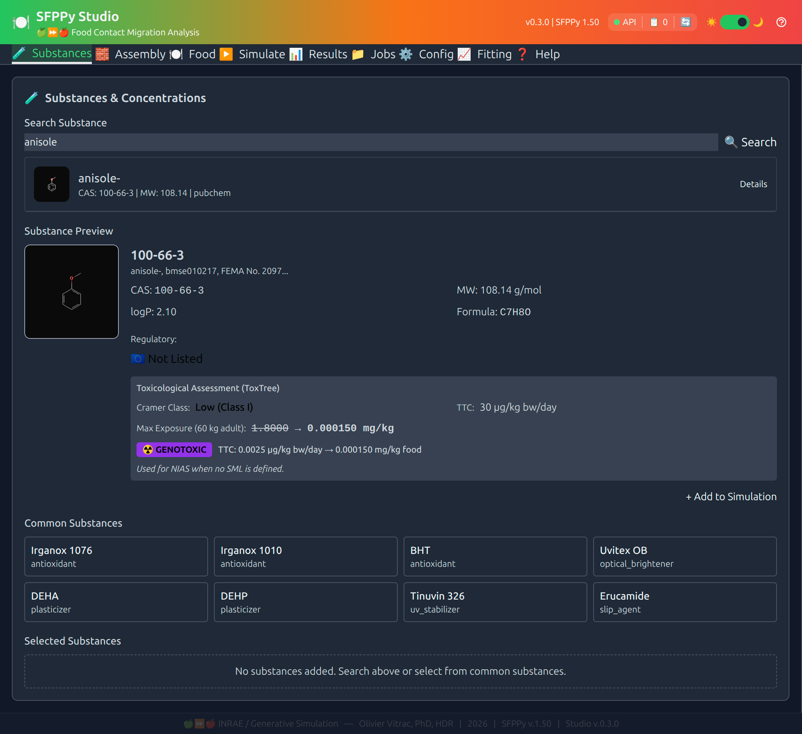
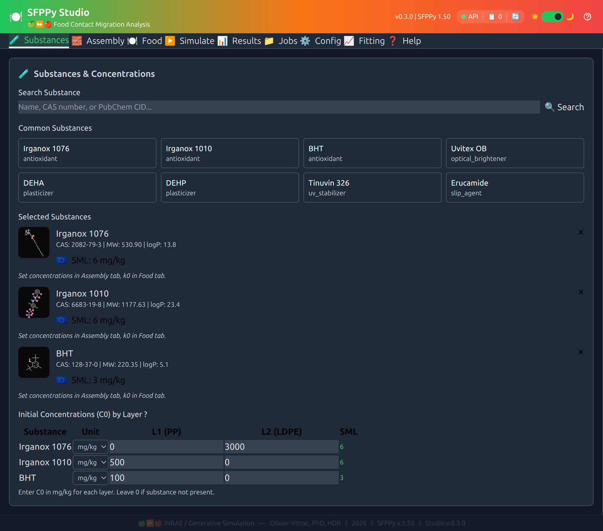
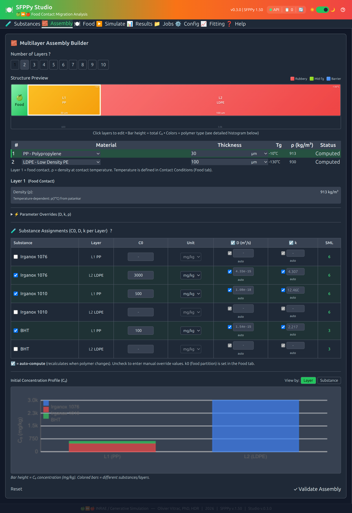
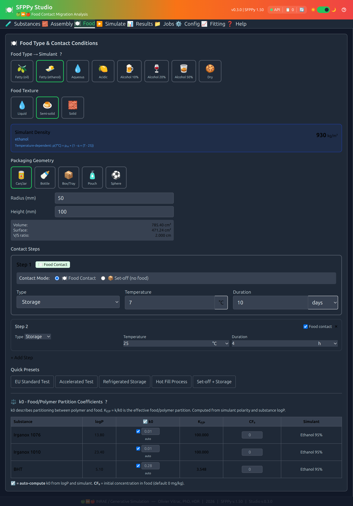
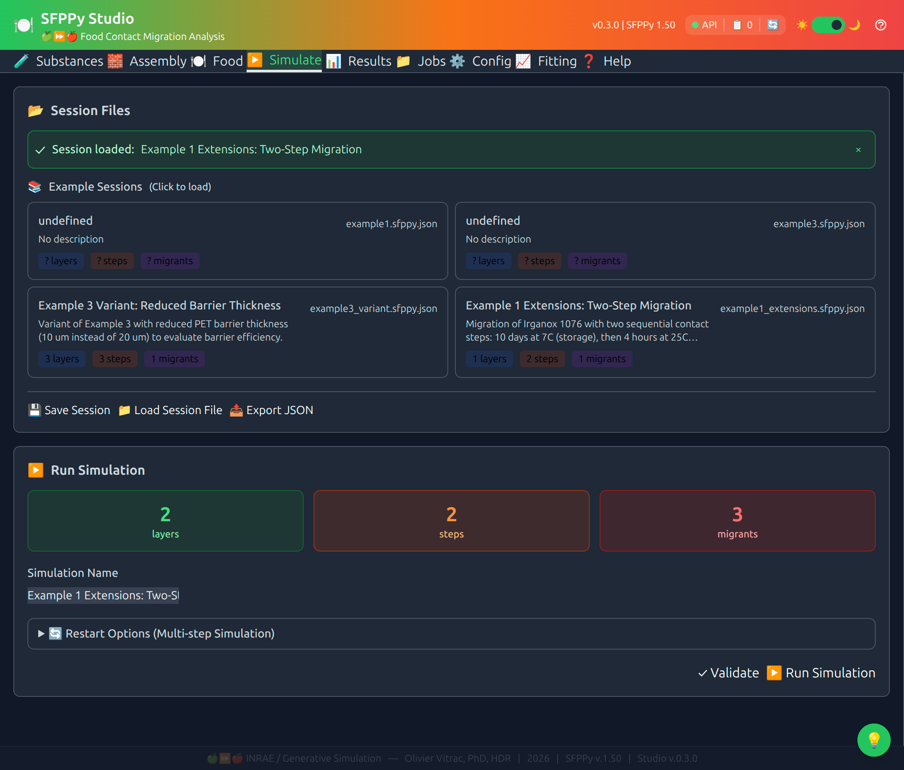
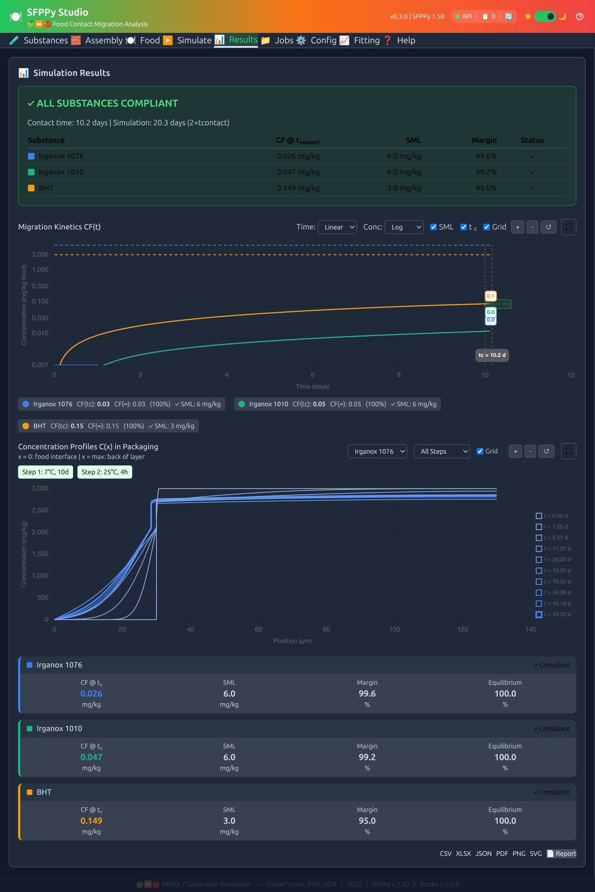
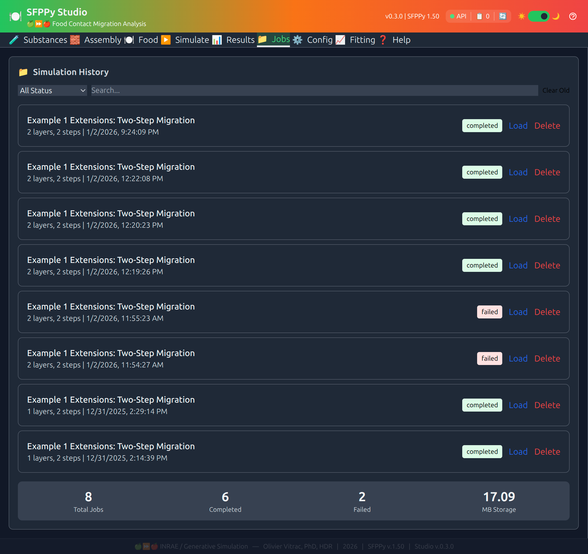
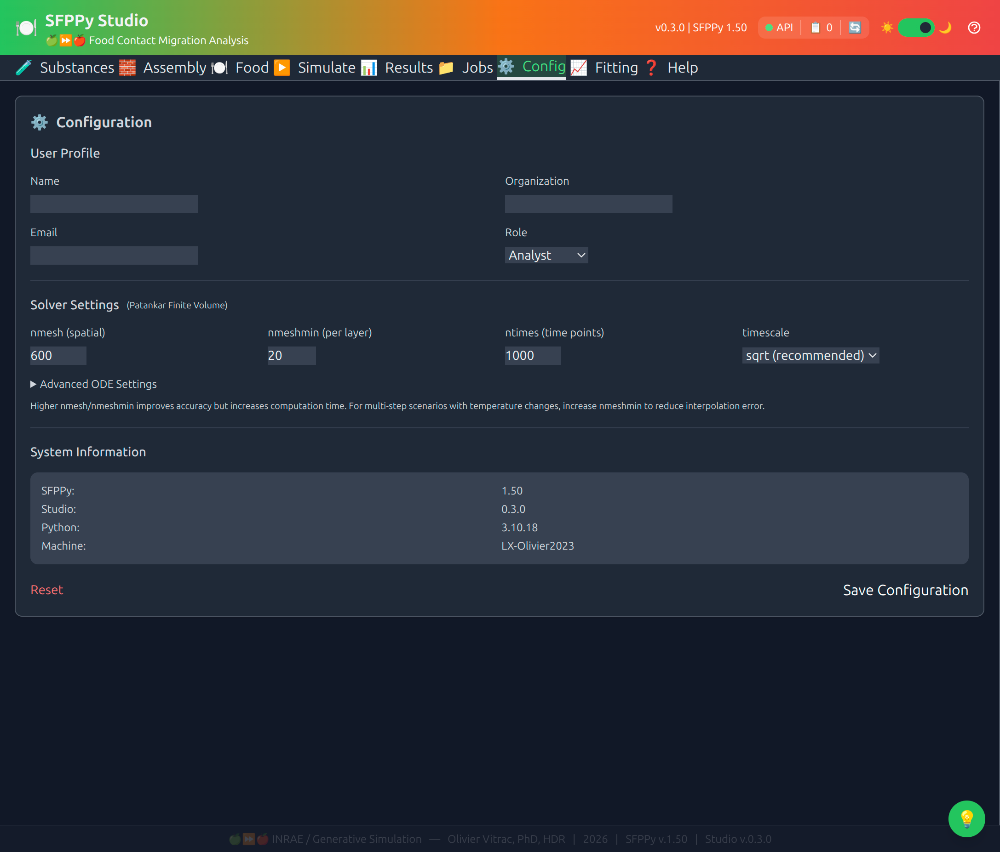
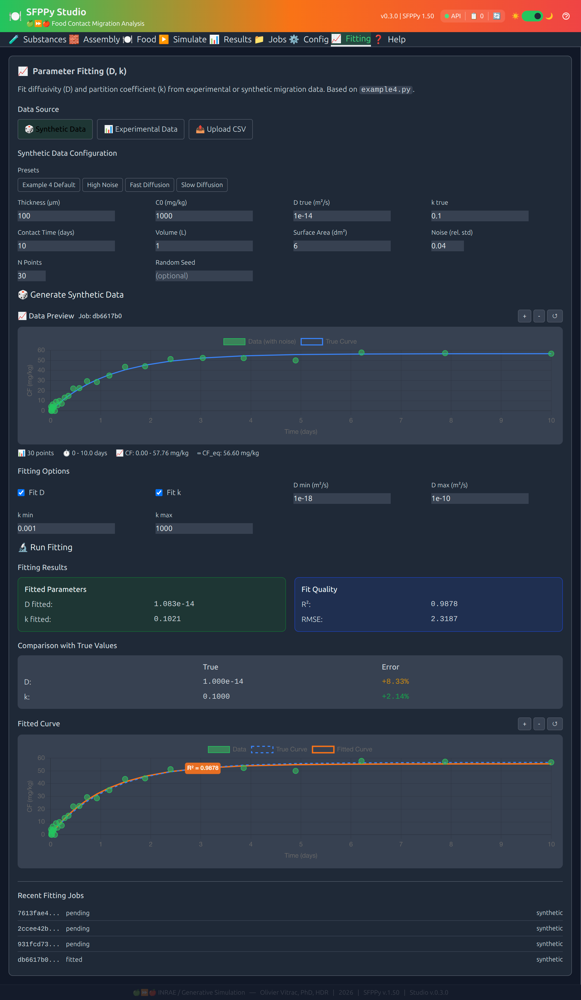
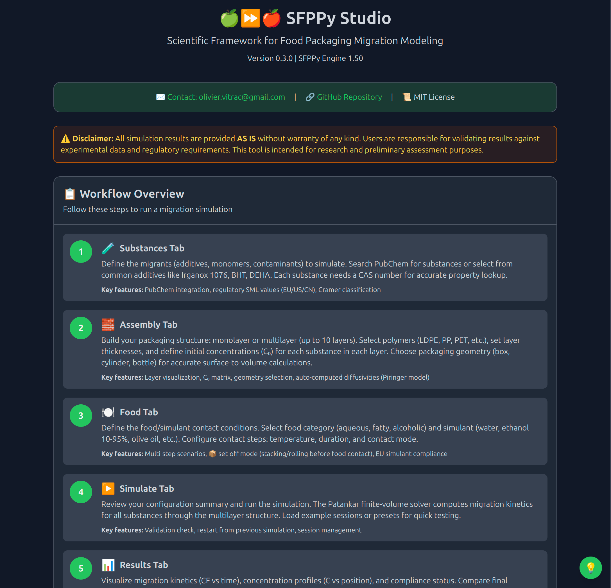

# SFPPy Studio - User Manual


**Version:** 0.3.0
**Author:** Olivier Vitrac, PhD, HDR
**Organization:** INRAE + Generative Simulation
**Last Updated:** January 2026

> NOTE: `Survey` is a companion module of `SFPPy` to offer a graphical user interface (web) equivalent to [SFPP3](https://sfpp3-simulation.contactalimentaire.fr/cgi-bin/login.cgi), with several extensions (multiple steps and substances, queuing system, reporting, all `SFPPy` functionalities). It has been originally designed to run locally, but it can be deployed remotely (*note that users and shared projects are not managed in the current version*).  The installation of `SFPPy` requires additional steps, in particular, for running the frontend interface.

---

## Table of Contents

1. [Overview](#overview)
2. [Features at a Glance](#features-at-a-glance)
3. [Installation & Launch](#installation--launch)
4. [User Interface Guide](#user-interface-guide)
5. [Tab Reference](#tab-reference)
6. [Session Files](#session-files)
7. [REST API Reference](#rest-api-reference)
8. [Export & Reports](#export--reports)
9. [Offline Operation](#offline-operation)
10. [Workflow Examples](#workflow-examples)
11. [Validation Against SFPPy Core](#validation-against-sfppy-core)
12. [Known Limitations](#known-limitations)
13. [Troubleshooting](#troubleshooting)

---

## Overview

SFPPy Studio is a web-based graphical user interface for the SFPPy (Safe Food Packaging in Python) framework. It provides an intuitive interface for food contact migration simulation and compliance checking, with support for **offline operation** and comprehensive **safety assessment** via ToxTree integration.

### Key Capabilities

| Capability | Description |
|------------|-------------|
| **Multi-substance simulation** | Simulate multiple migrants simultaneously with individual SML tracking |
| **Multilayer packaging** | Support for functional barriers, ABA structures, up to 5+ layers |
| **Multi-step scenarios** | Hot-fill → storage, set-off → contact, and complex temperature profiles |
| **Restart functionality** | Chain simulations from previous results |
| **Parameter fitting** | Fit D and k from experimental or synthetic migration data |
| **Compliance checking** | Automated SML comparison with margin calculations |
| **Safety assessment** | ToxTree Cramer class, genotoxicity alerts, DNA binding potential |
| **Offline operation** | Work without internet using cached substance data and images |
| **Export & Reports** | PDF reports, PNG/SVG plots with contact time markers, CSV, XLSX, JSON |

### Architecture

```
studio/
├── app/
│   ├── main.py              # FastAPI application entry point
│   ├── routes/
│   │   ├── assembly.py      # Layer & material management
│   │   ├── substances.py    # PubChem integration, ToxTree, C0 management
│   │   ├── food.py          # Food categories, simulants, geometry
│   │   ├── simulation.py    # Patankar solver interface
│   │   ├── jobs.py          # Background job management
│   │   ├── config.py        # User preferences, solver settings
│   │   ├── exports.py       # Multi-format export (CSV, XLSX, PDF, PNG, SVG)
│   │   ├── sessions.py      # Session file management
│   │   └── fitting.py       # Parameter fitting (D, k) from data
│   ├── templates/
│   │   └── index.html       # Single-page application UI
│   └── static/
│       ├── js/
│       │   ├── app.js           # Frontend JavaScript logic
│       │   ├── service-worker.js # Offline caching
│       │   └── offline-manager.js # Offline state management
│       ├── vendor/              # Vendored CDN dependencies
│       │   ├── chart.min.js     # Chart.js for visualizations
│       │   ├── tailwind-offline.css # Offline CSS fallback
│       │   └── manifest.json    # Vendor dependency manifest
│       └── img/             # Static images
├── data/
│   ├── polymers.yaml        # Polymer database (Tg, Tm, Piringer params)
│   └── examples/            # Example .sfppy.json session files
├── config/                  # User configuration storage
├── jobs/                    # Simulation job storage
├── exports/                 # Generated export files
├── tests/                   # Test suite
├── launcher.py              # CLI launcher script
└── version.py               # Version information
```

---

## Features at a Glance

### Simulation Features

| Feature | Status | Description |
|---------|--------|-------------|
| Multi-substance simulation | ✅ | Simulate multiple migrants with individual tracking |
| Multilayer assembly (1-5+ layers) | ✅ | Define complex packaging structures |
| Multi-step contact scenarios | ✅ | Hot-fill, storage, set-off sequences |
| Restart from previous results | ✅ | Chain simulations for complex scenarios |
| Real Patankar solver | ✅ | Finite-volume method for mass transfer |
| Mock results fallback | ✅ | Testing when SFPPy unavailable |
| CF₀ support | ✅ | Initial concentration in food |
| Background job execution | ✅ | Async simulation with progress tracking |

### Safety Assessment Features

| Feature | Status | Description |
|---------|--------|-------------|
| ToxTree Cramer classification | ✅ | Class I/II/III toxicological concern |
| Genotoxicity alerts | ✅ | Structural alerts for genotoxic potential |
| DNA binding potential | ✅ | Prediction of DNA-reactive structures |
| TTC compliance | ✅ | Threshold of Toxicological Concern checking |
| Regulatory flags | ✅ | EU 10/2011, US FDA, CN GB authorization |

### User Interface Features

| Feature | Status | Description |
|---------|--------|-------------|
| **9-tab interface** | ✅ | Substances, Assembly, Food, Simulate, Results, Jobs, Config, Fitting, Help |
| Server health indicator | ✅ | Real-time API status (green/yellow/red) |
| Task queue counter | ✅ | Shows pending/running jobs |
| Server restart button | ✅ | Quick server restart from UI |
| Dark/Light theme | ✅ | User preference toggle |
| Interactive charts | ✅ | Chart.js with zoom, pan, tooltips |
| Print-ready report modal | ✅ | White background for printing |
| Session load/save | ✅ | JSON session file management |
| Example sessions | ✅ | Built-in example configurations |
| Offline indicator | ✅ | Visual status when offline |

### Export Features

| Feature | Status | Description |
|---------|--------|-------------|
| CSV export | ✅ | Time series data |
| JSON export | ✅ | Complete simulation data |
| XLSX export | ✅ | Multi-sheet Excel workbook |
| PDF report | ✅ | Multi-page report with assumptions, plots, profiles |
| PNG export | ✅ | Raster plot with contact time markers |
| SVG export | ✅ | Vector plot with contact time markers |
| Report modal | ✅ | Browser-printable summary |

### Visualization Features

| Feature | Status | Description |
|---------|--------|-------------|
| CF(t) kinetics chart | ✅ | Migration concentration over time |
| C(x) profile chart | ✅ | Concentration distribution in layers |
| Multi-substance colors | ✅ | Distinct colors per substance |
| Contact time markers | ✅ | Vertical/horizontal lines with CF values |
| SML threshold lines | ✅ | Dashed lines showing limits |
| Compliance indicators | ✅ | Green/red status badges |

### Transport Parameters

| Feature | Status | Description |
|---------|--------|-------------|
| Auto-compute $D$ | ✅ | Piringer model from polymer/T/MW |
| Auto-compute $k$ | ✅ | Partition coefficient estimation |
| Auto-compute $k_0$ | ✅ | Food partition from logP/simulant |
| Manual override $D$ | ✅ | Enter measured diffusivity |
| Manual override $k$ | ✅ | Enter measured partition coefficient |
| $K_{F/P}$ display | ✅ | Shows k/k₀ partition coefficient |
| $K_{F/P}$ tooltip | ✅ | Hover shows k, k₀, K_{F/P} values |

---

## Installation & Launch

### Prerequisites

- **Python 3.10+** (required by SFPPy core)
- **SFPPy core library** (patankar module)

### Option 1: Docker (Recommended for Industry)

No Python installation required — just Docker.

```bash
# From SFPPy root directory
docker-compose -f docker/docker-compose.yml up sfppy-studio
```

Access at: **http://localhost:8002**

> 📌 Port can be changed in `docker/docker-compose.yml` or via:
> ```bash
> docker run -p 9002:8002 sfppy-studio
> ```

### Option 2: pip Install (Recommended)

```bash
# Clone SFPPy
git clone https://github.com/ovitrac/SFPPy.git
cd SFPPy

# Install with Studio dependencies
pip install -e ".[studio]"

# Launch
python studio/launcher.py
```

### Option 3: Modular Requirements

```bash
# Install core + studio requirements
pip install -r requirements/core.txt
pip install -r requirements/studio.txt
```

### Option 4: Conda + pip

```bash
# Create environment
conda create -n sfppy python=3.10 numpy scipy matplotlib pandas -y
conda activate sfppy

# Clone and install
git clone https://github.com/ovitrac/SFPPy.git
cd SFPPy
pip install -e ".[studio]"
```

### Dependencies

**Core SFPPy** (see `requirements/core.txt`):

| Package | Purpose |
|---------|---------|
| `numpy` | Numerical computation |
| `scipy` | Scientific computing (ODE solvers) |
| `matplotlib` | Visualization and PDF export |
| `pandas` | Data manipulation |
| `openpyxl` | Excel file support |
| `pillow` | Image processing |

**Studio Web Application** (see `requirements/studio.txt`):

| Package | Purpose |
|---------|---------|
| `fastapi` | Web API framework |
| `uvicorn` | ASGI server |
| `pydantic` | Data validation |
| `jinja2` | HTML templating |
| `pyyaml` | YAML configuration parsing |
| `requests` | PubChem API access |

### Launching the Application

```bash
# From the SFPPy root directory
python studio/launcher.py

# With custom port
python studio/launcher.py --port 9002

# With auto-reload for development
python studio/launcher.py --reload
```

**Options:**

| Option | Default | Description |
|--------|---------|-------------|
| `--port` | 8002 | Server port (reconfigurable) |
| `--host` | 127.0.0.1 | Host binding |
| `--reload` | off | Enable auto-reload for development |

**Default URL:** http://127.0.0.1:8002

---

## User Interface Guide

The UI is organized into **nine main tabs** plus a top banner with status indicators:

### Top Banner

| Element | Description |
|---------|-------------|
| Health indicator | Green (healthy), Yellow (checking), Red (offline) |
| Queue counter | Number of pending/running simulation jobs |
| Restart button | Click to restart the server |
| Theme toggle | Switch between light/dark modes |
| Offline indicator | Shows when operating in offline mode |

### Tab Navigation

| Tab | Icon | Purpose |
|-----|------|---------|
| **Substances** | 🧪 | Search, select, and configure chemical migrants |
| **Assembly** | 🧱 | Define multilayer packaging structure |
| **Food** | 🍽️ | Configure food type, geometry, and conditions |
| **Simulate** | ▶️ | Run simulation and manage sessions |
| **Results** | 📊 | View charts, compliance status, export data |
| **Jobs** | 📁 | Manage background simulation jobs |
| **Config** | ⚙️ | User preferences and solver settings |
| **Fitting** | 📈 | Fit D and k from experimental data |
| **Help** | ❓ | Documentation and contextual help |

---

## Tab Reference

### 🧪 Substances Tab

|  |  |
| ---------------------------------------------------- | ---------------------------------------------------- |

**Purpose:** Search, select, and configure chemical migrants with safety assessment.

| Feature | Description |
|---------|-------------|
| PubChem Search | Search by name, CAS, or CID with autocomplete |
| Substance Cards | Display structure image, MW, logP, formula |
| Safety Assessment | ToxTree Cramer class, genotoxicity, DNA binding alerts |
| Regulatory Flags | Shows EU 10/2011, US FDA, CN GB authorization |
| C0 Matrix | Initial concentration per substance per layer |
| CF₀ Input | Initial concentration in food |
| D, k, k₀ Overrides | Override computed values with measured data |
| K_{F/P} Display | Hover shows partition coefficient breakdown |
| Structure Images | Local cache with PubChem fallback (offline-ready) |

**Safety indicators displayed:**
- **Cramer Class**: I (low), II (medium), III (high) toxicological concern
- **Genotoxicity**: Structural alerts for genotoxic potential
- **DNA Binding**: Prediction of DNA-reactive structures
- **TTC Value**: Threshold of Toxicological Concern (µg/person/day)

### 🧱 Assembly Tab



**Purpose:** Define the multilayer packaging structure from food-contact to outer layer.

| Feature | Description |
|---------|-------------|
| Layer Count | 1-5+ layers supported |
| Material Selection | All polymers from patankar.layer database |
| Thickness Input | Value + unit selector (nm, µm, mm) |
| Tg Indicator | Glass transition temperature display |
| Layer Visualization | Color-coded by Tg (rubbery vs. glassy) |
| Substance Assignments | D, k per layer with auto/manual toggle |
| Presets | Monolayer, Bilayer, Trilayer quick-start examples |
| Drag/Reorder | Visual layer ordering from food contact to outer |

**Layer order convention:**
- Layer 1 = Food contact layer (nearest to food)
- Layer N = Outer layer (furthest from food)

### 🍽️ Food Tab



**Purpose:** Configure food type, simulant, geometry, and contact conditions.

| Feature | Description |
|---------|-------------|
| Food Categories | Fatty, Aqueous, Acidic, Alcoholic, Dry |
| EU Simulants | A (ethanol 10%), B (acetic acid 3%), C (ethanol 20%), D1 (ethanol 50%), D2 (vegetable oil), E (MPPO) |
| Geometry Shapes | Cylinder, Bottle, Rectangle, Pouch, Sphere |
| Dimensions | Automatic V/S ratio calculation |
| Multi-step Contacts | Define temperature/time profiles |
| Condition Presets | EU Standard (10d/40°C), Accelerated, Hot-fill, etc. |

**Geometry parameters:**
- Volume (V): Total food volume in contact
- Surface (S): Contact surface area
- V/S ratio: Critical parameter for migration calculation

### ▶️ Simulate Tab



**Purpose:** Configure and launch simulation runs.

| Feature | Description |
|---------|-------------|
| Session Management | Load/save .sfppy.json configurations |
| Example Sessions | Built-in example configurations to load |
| Restart Control | Enable chaining from previous simulation results |
| Solver Settings | Time steps, mesh refinement, tolerance |
| Run Button | Start async simulation with progress tracking |
| Validation Check | Pre-run validation of configuration |

### 📊 Results Tab



**Purpose:** Visualize simulation results and assess compliance.

| Feature | Description |
|---------|-------------|
| CF(t) Kinetics | Migration concentration over time chart |
| C(x) Profiles | Concentration distribution across layers |
| Compliance Status | Green/red badges per substance vs. SML |
| Key Value Cards | Per-substance CF, SML, margin summary |
| Contact Markers | Vertical/horizontal lines at t_contact |
| Export Buttons | CSV, XLSX, JSON, PDF, PNG, SVG |
| Report Modal | Print-ready detailed report |

**Compliance calculation:**
- Margin = (SML - CF) / SML × 100%
- Green: CF < SML (compliant)
- Red: CF ≥ SML (non-compliant)

### 📁 Jobs Tab



**Purpose:** Manage background simulation jobs.

| Feature | Description |
|---------|-------------|
| Job List | All simulation jobs with status |
| Status Indicators | Pending, Running, Completed, Failed |
| Progress Bar | Real-time progress for running jobs |
| Delete Jobs | Clean up old/unwanted jobs |
| Job Details | Full configuration and results access |
| Auto-refresh | Automatic status updates |

### ⚙️ Config Tab



**Purpose:** User preferences and solver configuration.

| Feature | Description |
|---------|-------------|
| Theme Selection | Light/Dark mode preference |
| Default Polymer | Pre-selected material for new layers |
| Solver Precision | Time step and mesh settings |
| Cache Management | Clear local caches |
| Version Info | Studio and SFPPy version display |
| Traceability | Machine info for audit trails |

### 📈 Fitting Tab



**Purpose:** Fit diffusion (D) and partition (k) coefficients from data.

| Feature | Description |
|---------|-------------|
| Synthetic Data | Generate CF(t) with known D, k plus noise |
| Experimental Data | Enter time-concentration pairs manually |
| CSV Upload | Load data from file |
| Parameter Fitting | L-BFGS-B optimization algorithm |
| Initial Guesses | Configure starting values |
| Fit Quality | R², RMSE metrics display |
| Comparison Plot | Data points vs. fitted curve |

**Fitting workflow:**
1. Load or generate reference data
2. Set initial guesses for D and k
3. Run optimization
4. Review fit quality and residuals
5. Apply fitted values to simulation

### ❓ Help Tab



**Purpose:** Documentation and contextual assistance.

| Feature | Description |
|---------|-------------|
| Quick Start Guide | Step-by-step getting started |
| Tab Documentation | Context-sensitive help per tab |
| Keyboard Shortcuts | Available shortcuts list |
| API Documentation | Link to Swagger UI |
| Example Walkthroughs | Guided example sessions |
| Troubleshooting | Common issues and solutions |

---

## Session Files

### Format

SFPPy Studio uses `.sfppy.json` files for saving/loading complete configurations:

```json
{
  "version": "1.0",
  "metadata": {
    "name": "Example 1: LDPE Film Migration",
    "description": "Migration from 100 um LDPE film",
    "author": "INRAE/olivier.vitrac@agroparistech.fr"
  },
  "geometry": {...},
  "substances": [...],
  "layers": [...],
  "food": {...},
  "contact_steps": [...],
  "simulation_config": {...},
  "results": {...},
  "restart_state": {...}
}
```

### Built-in Examples

| Example | Description | Layers | Steps |
|---------|-------------|--------|-------|
| Example 1 | LDPE Film Migration | 1 | 1 |
| Example 1 Extensions | Two-Step Migration | 1 | 2 |
| Example 3 | Trilayer ABA Migration | 3 | 3 |

---

## REST API Reference

Base URL: `http://127.0.0.1:8002/api`

Interactive documentation: `http://127.0.0.1:8002/docs` (Swagger UI)

### Core Endpoints

| Method | Endpoint | Description |
|--------|----------|-------------|
| GET | `/` | Main application HTML |
| GET | `/api/info` | API version and module info |
| GET | `/api/health` | Health check (status, response time) |
| GET | `/api/debug/pubchem-cache` | Debug PubChem cache status |

### Assembly Endpoints (`/api/assembly`)

| Method | Endpoint | Description |
|--------|----------|-------------|
| GET | `/polymers` | List all polymers |
| GET | `/polymers/{code}` | Polymer details |
| GET | `/materials` | List all materials |
| GET | `/materials/{code}` | Material details |
| GET | `/materials/{code}/tg` | Glass transition temperature |
| POST | `/validate` | Validate assembly |
| POST | `/estimate` | Estimate D, k |

### Substances Endpoints (`/api/substances`)

| Method | Endpoint | Description |
|--------|----------|-------------|
| GET | `/search?q=...` | PubChem search |
| GET | `/common` | Common food contact substances |
| GET | `/pubchem/{cid}` | Substance by CID |
| GET | `/detail/{query}` | Full details + ToxTree assessment |
| GET | `/regulatory/{query}` | EU/US/CN authorization |
| GET | `/sml/{cas}` | SML by CAS number |
| GET | `/thumbnail/{cid}` | Structure image (PubChem) |
| GET | `/structure/{cid}.png` | Structure image (local cache) |
| GET | `/structure/available` | List cached structure CIDs |

### Food Endpoints (`/api/food`)

| Method | Endpoint | Description |
|--------|----------|-------------|
| GET | `/categories` | Food categories |
| GET | `/simulants` | All simulants |
| GET | `/simulants/{category}` | Simulants for category |
| GET | `/shapes` | Geometry shapes |
| GET | `/conditions/presets` | Condition presets |
| POST | `/geometry/calculate` | Calculate V, S, V/S |

### Simulation Endpoints (`/api/simulation`)

| Method | Endpoint | Description |
|--------|----------|-------------|
| POST | `/run` | Start simulation (async) |
| GET | `/status/{job_id}` | Job status |
| GET | `/results/{job_id}` | Full results |
| DELETE | `/cancel/{job_id}` | Cancel job |
| GET | `/presets` | Simulation presets |

### Jobs Endpoints (`/api/jobs`)

| Method | Endpoint | Description |
|--------|----------|-------------|
| GET | `/list` | List all jobs |
| GET | `/detail/{job_id}` | Job details |
| DELETE | `/delete/{job_id}` | Delete job |
| DELETE | `/clear` | Delete old jobs |
| GET | `/stats` | Job statistics |

### Export Endpoints (`/api/export`)

| Method | Endpoint | Description |
|--------|----------|-------------|
| GET | `/formats` | Available formats |
| GET | `/{job_id}/csv` | Export CSV |
| GET | `/{job_id}/json` | Export JSON |
| GET | `/{job_id}/xlsx` | Export Excel |
| GET | `/{job_id}/pdf` | Export PDF report |
| GET | `/{job_id}/png` | Export PNG plot |
| GET | `/{job_id}/svg` | Export SVG plot |

### Sessions Endpoints (`/api/sessions`)

| Method | Endpoint | Description |
|--------|----------|-------------|
| POST | `/create` | Create session |
| GET | `/list` | List sessions |
| GET | `/{session_id}` | Session details |
| DELETE | `/{session_id}` | Delete session |
| POST | `/{session_id}/substances` | Add substance |
| POST | `/{session_id}/assignments` | Set C0 assignment |
| POST | `/{session_id}/layers` | Add layer |
| POST | `/{session_id}/steps` | Add contact step |
| GET | `/files/examples` | List examples |
| GET | `/files/load/{name}` | Load example |
| GET | `/compute/diffusivity` | Compute D |

### Fitting Endpoints (`/api/fitting`)

| Method | Endpoint | Description |
|--------|----------|-------------|
| POST | `/synthetic/generate` | Generate synthetic data |
| POST | `/experimental/load` | Load experimental data |
| POST | `/fit` | Run fitting optimization |
| GET | `/job/{job_id}` | Fitting job results |
| GET | `/jobs` | List fitting jobs |
| GET | `/presets` | Fitting presets |

### Config Endpoints (`/api/config`)

| Method | Endpoint | Description |
|--------|----------|-------------|
| GET | `/` | Full configuration |
| PUT | `/` | Update configuration |
| GET | `/user` | User profile |
| GET | `/solver` | Solver settings |
| GET | `/traceability` | Version info |

---

## Export & Reports

### PDF Report Structure

The PDF export generates a multi-page report:

| Page | Content |
|------|---------|
| 1 | Summary: Job info, results table, assembly config, geometry, food simulant |
| 2 | Detailed Assumptions: C0 per layer, D, k, k₀, K_{F/P} per substance |
| 3 | Migration Kinetics: CF(t) plot with contact time markers |
| 4+ | Concentration Profiles: C(x) plots per substance |

### Contact Time Markers

All exports (PDF, PNG, SVG) include:
- **Vertical line** from x-axis to CF curve at t_contact
- **Horizontal line** from curve to y-axis at CF(t_contact)
- **Dot** at the intersection point
- **Labels** showing CF value near y-axis and t_c near x-axis

### Report Modal

The in-browser report modal includes:
- Substances table with C0, D, k, safety assessment
- Layers table with polymers and thicknesses
- Food & Geometry section with V, S, V/S ratio
- Print-ready white background

---

## Offline Operation

SFPPy Studio v0.3.0 introduces full offline capability for environments without internet access.

### Offline Features

| Feature | Description |
|---------|-------------|
| Service Worker | Caches static assets and API responses |
| Local Structure Images | ~950 cached structure images from PubChem |
| Offline CSS | Pre-compiled Tailwind CSS fallback |
| Vendored Chart.js | Local Chart.js library |
| Offline Indicator | Visual status in UI header |

### Caching Strategies

| Strategy | Used For |
|----------|----------|
| **CacheFirst** | Static assets, substance data, polymer lists |
| **NetworkFirst** | Jobs, sessions (dynamic but cached) |
| **NetworkOnly** | Simulation runs, fitting (must execute on server) |

### Structure Images

Structure images are served from:
1. **Local cache**: `patankar/cache.PubChem/thumbs/{cid}.png`
2. **Fallback**: PubChem CDN (if online)

To check available cached images:
```bash
curl http://127.0.0.1:8002/api/substances/structure/available
```

### Cache Management

Clear caches via the Config tab or programmatically:
```javascript
// From browser console
navigator.serviceWorker.controller.postMessage({type: 'CLEAR_CACHE'});
```

---

## Workflow Examples

### Example 1: Multi-Substance Simulation

1. **Substances Tab**: Add "Irganox 1076" and "BHT"
2. **Assembly Tab**: Select "Monolayer LDPE" preset
3. **Substances Tab**: Set C0 = 1000 mg/kg for both in Layer 1
4. **Food Tab**: Select "Fatty foods" → "EU Standard Test"
5. **Simulate Tab**: Click "Run Simulation"
6. **Results Tab**: View both substances in CF(t) chart with individual colors

### Example 2: Functional Barrier

1. **Assembly Tab**: Add 2 layers
   - Layer 1: gPET, 20 µm (barrier)
   - Layer 2: LDPE, 100 µm
2. **Substances Tab**: Set C0 = 0 for L1, C0 = 1000 for L2
3. Run simulation and observe lag time

### Example 3: Hot-Fill + Storage

1. **Food Tab**: Use "Hot Fill" preset
   - Step 1: 30 min at 85°C
   - Step 2: 6 months at 25°C
2. Run simulation with multi-step scenario

### Example 4: Safety Assessment Workflow

1. **Substances Tab**: Search and add substance
2. Review ToxTree assessment:
   - Cramer Class (I/II/III)
   - Genotoxicity alerts
   - DNA binding potential
3. Check TTC compliance
4. Proceed with simulation if safe

---

## Validation Against SFPPy Core

SFPPy Studio has been validated against the SFPPy core examples to ensure numerical accuracy. All simulations use `CFtarget` (concentration at the specified contact time) for consistency.

### Validation Results (January 2026)

| Example | Test Case | Core CF (mg/kg) | Studio CF (mg/kg) | Error |
|---------|-----------|-----------------|-------------------|-------|
| **Example 1** | Monolayer LDPE, 10d @ 7°C | 5.2269 | 5.2269 | **<0.01%** |
| **Example 1 Ext** | + 4h @ 25°C (chained) | 5.5643 | 5.5643 | **<0.01%** |
| **Example 2** | PP 300µm, no FB, 450d @ 20°C | 0.1827 | 0.1836 | **0.46%** |
| **Example 2** | With 30µm PET barrier | 0.1080 | 0.1082 | **0.21%** |
| **Example 3** | Trilayer ABA, 3-step | 0.9730 | 0.9543 | **1.92%** |

**Legend:**
- **Example 1**: Irganox 1076 in LDPE film migrating to fatty food
- **Example 1 Ext**: Two-step simulation with temperature change (chained using `>>` operator)
- **Example 2**: Toluene surrogate in PP bottle with/without PET functional barrier
- **Example 3**: Limonene in wPET/PP/gPET trilayer with set-off → hot-fill → storage sequence

### Key Implementation Details

1. **Simulation Chaining**: Multi-step scenarios use the `>>` operator pattern from SFPPy core
   - Step 1: `multilayer >> food` (initial simulation)
   - Step 2+: `previous_result >> food` (chains with CF0 propagation)

2. **Set-off Boundary Conditions**: Stacked/rolled configurations supported via `setoff` classes

3. **Temperature-Dependent D**: Diffusivity is recalculated at each step's temperature via the `food >> layer` operator

4. **CFtarget vs CF[-1]**: Studio uses `CFtarget` (concentration at contact time) for all compliance calculations, matching the scientific kernel's intended behavior

### Running Validation Tests

```bash
cd studio
python tests/test_validation.py
```

---

## Known Limitations

### Current Limitations

| Area | Limitation |
|------|------------|
| D computation | Temperature from first step only |
| Materials | Some paper/board materials incomplete |
| Simulants | Fixed list, no custom simulants |
| Fitting | Single-layer only (the core tools of `SFPPy` are not limited) |
| UI | No layer drag-and-drop reordering |
| Offline | ToxTree requires initial online query to cache |

### Planned Features

- [ ] Temperature-dependent D per time step
- [ ] Batch simulation mode
- [ ] Uncertainty analysis (Monte Carlo)
- [ ] Database of measured D, k values
- [ ] Integration with EU FCM database
- [ ] Full offline ToxTree with local SMARTS rules

---

## Troubleshooting

### Common Issues

**Server won't start: "Port already in use"**
```bash
lsof -i :8002  # Find process
python studio/launcher.py --port 8003  # Use different port
```

**Substance search returns nothing**
- Check internet connection (PubChem API)
- Try CID directly: "7519" instead of name
- Use offline cached substances if available

**Structure images not loading**
- Check local cache: `ls patankar/cache.PubChem/thumbs/`
- Verify API: `curl http://127.0.0.1:8002/api/substances/structure/available`

**Export fails**
- Check matplotlib for PNG/SVG
- Check openpyxl for XLSX

**Offline mode not working**
- Ensure service worker is registered (check browser DevTools)
- Clear browser cache and reload

### Debug Mode

```bash
python studio/launcher.py --reload
```

API docs: `http://127.0.0.1:8002/docs`

Debug endpoint: `http://127.0.0.1:8002/api/debug/pubchem-cache`

---

## Contact & Support

**Author:** Olivier Vitrac, PhD, HDR
**Email:** olivier.vitrac@gmail.com
**Organization:** INRAE + Generative Simulation

---

*SFPPy Studio v0.3.0 - January 2026*
