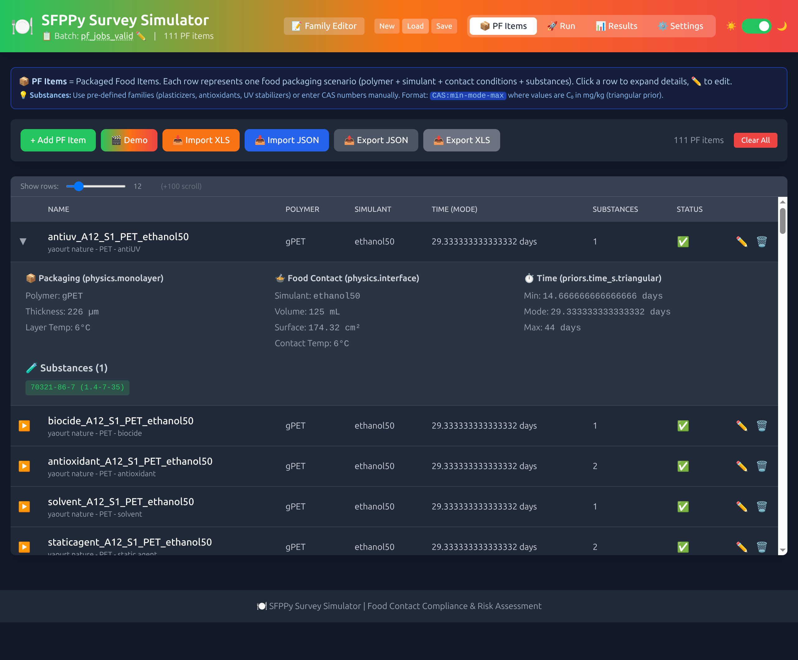
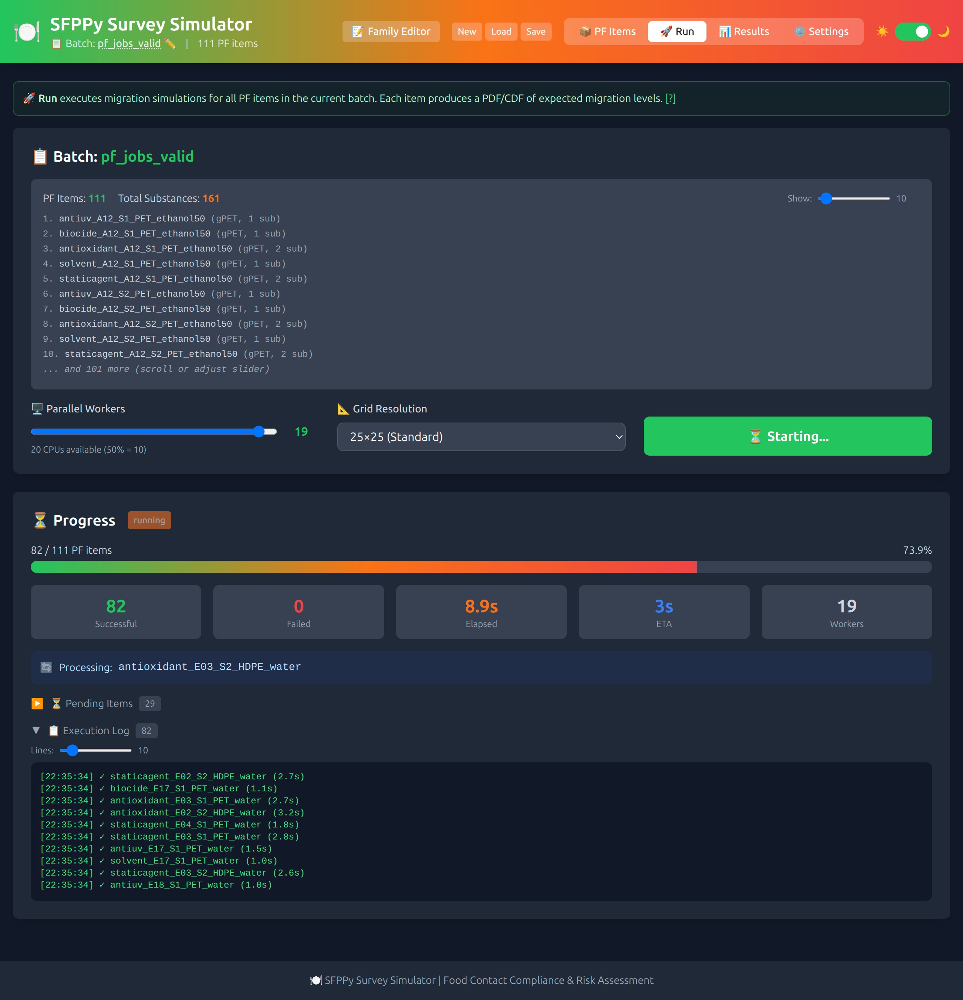
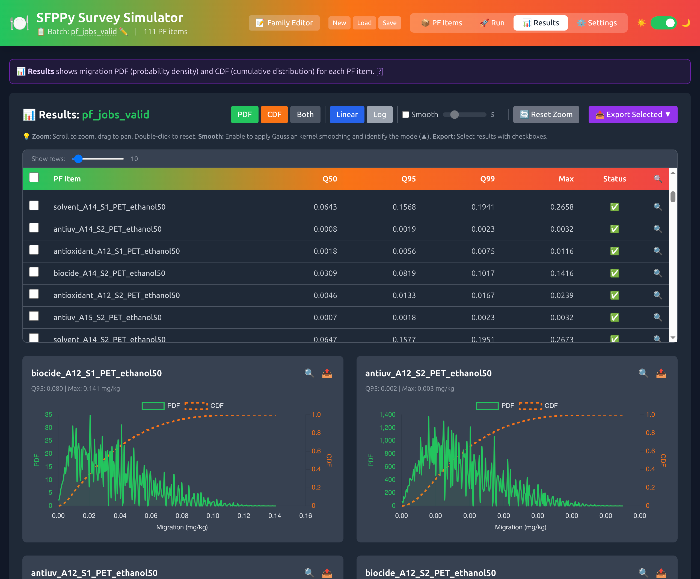
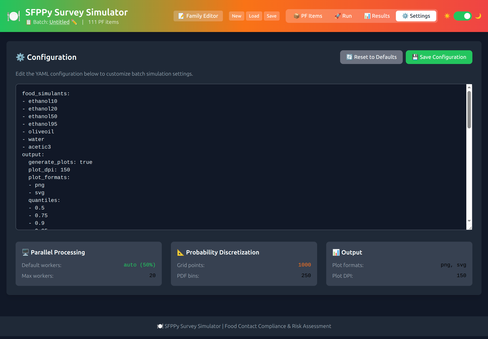
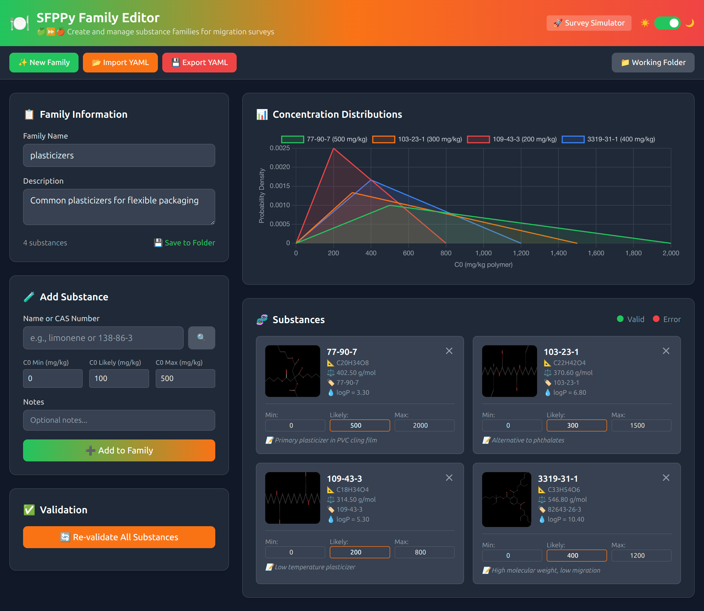

# Survey — Production Survey Module for SFPPy

**Survey-scale exposure estimation with deterministic uncertainty propagation**

|  |  |
| ----------------------------------- | ----------------------------------- |

> NOTE: 🍏⏩🍎`Survey` is a companion module of `SFPPy` developed under the *Generative Simulation Initiative*. It cannot be installed without `SFPPy`, which provides the necessary computational kernels (patankar modules). The installation of `Survey` requires additional steps, in particular, for running the frontend interface and parallel computations.

---

## Overview

The `survey` module provides production-grade infrastructure for estimating migration exposure across populations. It is designed for regulatory science applications where:

- **Reproducibility** is mandatory (no Monte Carlo sampling)
- **Traceability** must be complete (from input to output)
- **Auditability** requires transparent methodology
- **Scalability** enables processing of large cohort studies

### Key Features

| Feature | Description |
|---------|-------------|
| **Deterministic** | Finite-difference quadrature on triangular priors (no random sampling) |
| **Parallel** | Master curve computation distributed across workers |
| **Cached** | Content-addressed persistent cache prevents redundant computation |
| **Resumable** | Interrupted computations can be resumed from checkpoint |
| **Multilayer** | Supports functional barriers with reference layer selection |
| **Auditable** | Every output traceable to inputs via fingerprinting |

---

## Installation

### Prerequisites

- **Python 3.10+** (required by SFPPy core)
- **SFPPy core library** (patankar module)

### Option 1: Docker (Recommended for Industry)

No Python installation required — just Docker.

```bash
# From SFPPy root directory - start both Survey apps
docker-compose -f docker/docker-compose.yml up sfppy-survey-editor sfppy-survey-simulator
```

**Access the applications:**

| Service | URL | Default Port |
|---------|-----|--------------|
| **Family Editor** | http://localhost:8000 | 8000 |
| **Survey Simulator** | http://localhost:8001 | 8001 |

> 📌 Ports can be changed in `docker/docker-compose.yml` or via command line:
> ```bash
> docker run -p 9000:8000 sfppy-survey python -m uvicorn survey.app.main:app --host 0.0.0.0 --port 8000
> ```

### Option 2: pip Install (Recommended)

```bash
# Clone SFPPy
git clone https://github.com/ovitrac/SFPPy.git
cd SFPPy

# Install with Survey dependencies
pip install -e ".[survey]"

# Launch both apps
python survey/launcher.py
```

### Option 3: Modular Requirements

```bash
# Install core + survey requirements
pip install -r requirements/core.txt
pip install -r requirements/survey.txt
```

### Option 4: Conda + pip

```bash
# Create environment
conda create -n sfppy python=3.10 numpy scipy matplotlib pandas -y
conda activate sfppy

# Clone and install
git clone https://github.com/ovitrac/SFPPy.git
cd SFPPy
pip install -e ".[survey]"
```

### Dependencies

**Core SFPPy** (see `requirements/core.txt`):

| Package | Purpose |
|---------|---------|
| `numpy` | Numerical computation |
| `scipy` | Scientific computing (ODE solvers) |
| `matplotlib` | Visualization |
| `pandas` | Data manipulation |
| `openpyxl` | Excel file support |
| `pillow` | Image processing |

**Survey Web Applications** (see `requirements/survey.txt`):

| Package | Purpose |
|---------|---------|
| `fastapi` | Web API framework |
| `uvicorn` | ASGI server |
| `pydantic` | Data validation |
| `jinja2` | HTML templating |
| `pyyaml` | YAML configuration parsing |
| `requests` | PubChem API access |
| `odfpy` | ODS spreadsheet support |
| `aiofiles` | Async file operations |

### Launching the Applications

```bash
# Launch both apps (Editor on 8000, Simulator on 8001)
python survey/launcher.py

# Launch only the Family Editor
python survey/launcher.py --app editor

# Launch only the Simulator
python survey/launcher.py --app simulator

# Custom ports
python survey/launcher.py --editor-port 9000 --simulator-port 9001
```

**Options:**

| Option | Default | Description |
|--------|---------|-------------|
| `--app` | both | Which app to launch: `editor`, `simulator`, or `both` |
| `--editor-port` | 8000 | Port for Family Editor (reconfigurable) |
| `--simulator-port` | 8001 | Port for Survey Simulator (reconfigurable) |
| `--no-reload` | off | Disable auto-reload |
| `--no-browser` | off | Don't open browser automatically |
| `--check` | off | Check dependencies and exit |

### Dependency Checker

Use the built-in dependency checker to verify your installation:

```bash
# Check all dependencies
python survey/check_dependencies.py

# Show install commands for missing packages
python survey/check_dependencies.py --install

# Run functionality tests
python survey/check_dependencies.py --test
```

---

## Quick Start

### Basic Usage

```python
from survey import Survey

# Load scenario from YAML
survey = Survey.from_scenario("scenario.yml")

# Preview configuration
print(survey.preview())

# Compute PDF (parallel master curves)
survey.compute(parallel=True)

# Get results
print(survey.summary())
q95 = survey.quantile(0.95)

# Save outputs
survey.save("results.npz")
survey.save_manifest("manifest.json")
```

### Scenario YAML Format

```yaml
name: example_survey

physics:
  monolayer:
    polymer: PP                    # Polymer identifier
    thickness_m: 50e-6             # 50 µm
    temperature_degC: 40.0         # Storage temperature

  interface:
    h_m_s: 1e-7                    # Mass transfer coefficient
    surface_area_m2: 0.06          # Contact surface (6 dm²)
    food_volume_m3: 0.001          # Food volume (1 L)
    contact_temperature_degC: 40.0
    cf0: 0.0                       # Initial food concentration
    food_simulant: oliveoil        # EU simulant D

family:
  masses_g_mol: [100.0, 150.0, 200.0]  # Molar masses

priors:
  time_s:
    triangular:
      min: 0.0
      mode: 2592000.0              # 30 days (likely)
      max: 7776000.0               # 90 days (max)
    grid:
      nlow: 15
      nhigh: 15

  cp0_av:
    triangular:
      min: 0.0
      mode: 20.0                   # 20 mg/kg (likely)
      max: 50.0                    # 50 mg/kg (max)
    grid:
      nlow: 15
      nhigh: 15

solver:
  pdf_bins: 250
  fo_grid:
    n_fo: 200
    fo_max_factor: 1.5
```

---

## Scientific Background

### Migration Model

The survey module implements the migration model described in:

> Vitrac, O. & Hayert, M. (2005). Risk assessment of migration from packaging materials into foodstuffs. *AIChE Journal*, 51(4), 1080-1095.

For a monolayer packaging in contact with food:

$$
\frac{\partial C_P}{\partial t} = D \frac{\partial^2 C_P}{\partial x^2}
$$

with boundary conditions:
- At polymer/food interface: $-D \frac{\partial C_P}{\partial x} = h(C_P/k - C_F/k_0)$
- At outer surface: $\frac{\partial C_P}{\partial x} = 0$

### Master Curve Normalization

Master curves are computed in dimensionless form:

$$
g(Fo) = \frac{C_F}{C_P^0}
$$

where the Fourier number is:

$$
Fo = \frac{D \cdot t}{l_P^2}
$$

The normalization preserves physics by maintaining:
1. **Volume ratio**: $\frac{V_F}{V_P}$ preserved
2. **Biot number**: $Bi = \frac{h \cdot l}{D}$ preserved

### Uncertainty Propagation

No Monte Carlo sampling is used. Instead, triangular priors are discretized deterministically:

$$
Pr(CF_f) = \sum_{i,j} w_i^{(t)} \cdot w_j^{(C)} \cdot \delta(CF_f - g(Fo_i) \cdot C_{P,j}^0)
$$

where weights $w$ are cell-integrated probabilities from the triangular CDF.

### Multilayer Reference Layer Selection

For multilayer packaging, the reference layer is selected as:

$$
i_{ref} = \arg\min_i \left( \frac{D_i}{k_i \cdot l_i} \right)
$$

This identifies the rate-limiting barrier (lowest permeability proxy).

---

## API Reference

### Survey Class

```python
class Survey:
    """Survey-scale migration estimation with caching."""

    @classmethod
    def from_scenario(cls, path: str) -> Survey:
        """Create Survey from YAML scenario file."""

    def add_substance(self, substance: SubstanceSpec) -> None:
        """Add substance to survey (triggers inference)."""

    def remove_substance(self, substance_id: str) -> bool:
        """Remove substance by ID."""

    def compute(self, parallel: bool = True, max_workers: int = None) -> None:
        """Compute master curves and PDF."""

    def quantile(self, q: float) -> float:
        """Get quantile value from computed CDF."""

    def summary(self) -> str:
        """Get formatted summary of results."""

    def preview(self) -> str:
        """Get configuration preview."""

    def save(self, path: str) -> None:
        """Save results to NPZ file."""

    def save_manifest(self, path: str) -> None:
        """Save manifest (metadata) to JSON."""

    def compare(self, reference_path: str,
                tol_pdf_l1: float = 1e-3,
                tol_q_abs: float = 1e-3) -> dict:
        """Compare results with reference fixture."""

    def save_state(self) -> str:
        """Save state for resume capability."""

    @classmethod
    def load_state(cls, survey_id: str, config: SurveyConfig) -> Survey:
        """Resume from saved state."""
```

### Data Models

```python
from survey.models import (
    LayerSpec,        # Single layer specification
    PackagingSpec,    # Mono/multilayer packaging
    SubstanceSpec,    # Substance with inferred parameters
    PriorSpec,        # Triangular prior specification
    SurveyConfig,     # Full survey configuration
    SubstanceModel,   # Inference hooks for D, k, k0
)
```

### LayerSpec

```python
@dataclass(frozen=True)
class LayerSpec:
    polymer: str              # e.g., 'PP', 'LDPE', 'gPET'
    thickness_m: float        # meters
    C0: float = 0.0           # initial concentration
    temperature_degC: float = 40.0
```

### PackagingSpec

```python
@dataclass
class PackagingSpec:
    layers: List[LayerSpec]
    h_m_s: float = 1e-7              # mass transfer coef
    surface_area_m2: float = 0.06    # contact area
    food_volume_m3: float = 0.001    # food volume
    contact_temperature_degC: float = 40.0
    cf0: float = 0.0
    food_simulant: str = "oliveoil"
```

### SubstanceSpec

```python
@dataclass
class SubstanceSpec:
    id: str                      # unique identifier
    mass_g_mol: float            # molar mass
    name: str = None             # human-readable name
    cas: str = None              # CAS registry number
    D: float = None              # diffusivity (inferred)
    k: float = None              # partition coef (inferred)
    k0: float = None             # k0 parameter (inferred)
```

### PriorSpec

```python
@dataclass
class PriorSpec:
    mode: float          # mode of triangular distribution
    max_val: float       # maximum value
    n_low: int = 15      # grid points below mode
    n_high: int = 15     # grid points above mode
    name: str = "prior"
```

---

## Caching System

### Cache Architecture

```
.survey_cache/
├── master_curves/
│   ├── <hash>.npz          # Cached master curve
│   ├── <hash>.json         # Metadata
│   └── <hash>.lock         # Computation lock
├── pdf_cache/
│   ├── <fingerprint>.npz   # Cached PDF/CDF
│   └── <fingerprint>.json  # Metadata
└── survey_state/
    └── <survey_id>.json    # Resume checkpoint
```

### Cache Key Components

Master curve cache key includes:
- `polymer`, `mass_g_mol`, `D`, `k`, `k0`
- `lP_m`, `Fo_max`, `n_fo`
- `h`, `surface_area`, `food_volume`
- `contact_temperature_degC`, `CF0`

Any change to these parameters invalidates the cache entry.

### Fingerprinting

Content-addressed storage via SHA-256:

```python
from survey.fingerprints import fingerprint_physics, fingerprint_probability

# Physics fingerprint (for master curves)
fp_phys = fingerprint_physics(
    polymer="PP", mass_g_mol=136.23, D=1e-13, ...
)

# Probability fingerprint (for PDF cache)
fp_prob = fingerprint_probability(
    substances, packaging, time_prior, conc_prior, i_ref
)
```

---

## Supported Polymers

| Polymer | Description | Tg (°C) | Notes |
|---------|-------------|---------|-------|
| PP | Polypropylene | -10 | Common packaging |
| LDPE | Low-density polyethylene | -120 | Films |
| HDPE | High-density polyethylene | -120 | Bottles |
| PET | Polyethylene terephthalate | 76 | Bottles |
| gPET | Glassy PET | 76 | Below Tg |
| wPET | Plasticized PET | 46 | Near Tg |
| PS | Polystyrene | 100 | Foam packaging |

## Supported Food Simulants

| Simulant | EU Reference | Description |
|----------|--------------|-------------|
| `oliveoil` | Simulant D | Fatty foods |
| `ethanol50` | Simulant D1 | Dairy products |
| `water` | Simulant A | Aqueous foods |
| `water3aceticacid` | Simulant B | Acidic foods |
| `ethanol` | Simulant C | Alcoholic beverages |
| `tenax` | Simulant E | Dry foods |
| `isooctane` | — | Alternative fat simulant |

---

## Examples

### Example 1: Monolayer PP Film

```python
from survey import Survey
from survey.models import (
    LayerSpec, PackagingSpec, SubstanceSpec,
    PriorSpec, SurveyConfig
)

# Define packaging
layer = LayerSpec(polymer="PP", thickness_m=50e-6, temperature_degC=40)
packaging = PackagingSpec(
    layers=[layer],
    h_m_s=1e-7,
    surface_area_m2=0.06,
    food_volume_m3=0.001,
    food_simulant="oliveoil",
)

# Define priors
time_prior = PriorSpec(mode=30*86400, max_val=90*86400, name="contact_time")
conc_prior = PriorSpec(mode=20.0, max_val=50.0, name="initial_conc")

# Define substances
substances = [
    SubstanceSpec.from_mass(100.0, idx=0),
    SubstanceSpec.from_mass(150.0, idx=1),
    SubstanceSpec.from_mass(200.0, idx=2),
]

# Create config
config = SurveyConfig(
    name="pp_film_example",
    packaging=packaging,
    time_prior=time_prior,
    conc_prior=conc_prior,
)

# Create and compute survey
survey = Survey(config=config, substances=substances)
survey.compute()

print(survey.summary())
print(f"95th percentile: {survey.quantile(0.95):.4f} mg/kg")
```

### Example 2: Multilayer Functional Barrier

```yaml
# multilayer_scenario.yml
name: functional_barrier_example

physics:
  multilayer:
    temperature_degC: 40.0
    layers:
      - polymer: gPET        # Functional barrier (food contact)
        thickness_m: 30e-6
        C0: 0.0
      - polymer: PP          # Recycled layer
        thickness_m: 200e-6
        C0: 100.0            # Contaminated

  interface:
    h_m_s: 1e-7
    surface_area_m2: 0.06
    food_volume_m3: 0.001
    food_simulant: oliveoil

family:
  substances:
    - name: limonene
    - name: benzaldehyde
    - name: BHT

priors:
  time_s:
    triangular: {min: 0, mode: 2592000, max: 7776000}
    grid: {nlow: 15, nhigh: 15}
  cp0_av:
    triangular: {min: 0, mode: 50, max: 100}
    grid: {nlow: 15, nhigh: 15}
```

```python
survey = Survey.from_scenario("multilayer_scenario.yml")
print(f"Reference layer: {survey._i_ref} ({survey.ref_layer.polymer})")
survey.compute()
```

### Example 3: Cache Demonstration

```python
from survey import Survey

# First run: computes all curves
survey1 = Survey.from_scenario("scenario.yml")
survey1.compute()
# Output: Master Curves [...] cache hit/miss: 0/3

# Second run: reuses cached curves
survey2 = Survey.from_scenario("scenario.yml")
survey2.compute()
# Output: Master Curves [...] cache hit/miss: 3/0
```

---

## Output Format

### NPZ Results File

```python
import numpy as np

data = np.load("results.npz")

# PDF/CDF
pdf_x = data['pdf_bin_centers']   # (n_bins,)
pdf_y = data['pdf']               # (n_bins,)
cdf = data['cdf']                 # (n_bins,)

# Raw tensor
CF_tensor = data['CF_tensor']     # (n_time, n_conc)
weights = data['weights']         # (n_time * n_conc,)

# Inferred parameters
D_vals = data['D_vals']           # (n_substances,)
k_vals = data['k_vals']           # (n_substances,)
```

### JSON Manifest

```json
{
  "name": "survey_name",
  "fingerprint": "sha256_hash",
  "config": { ... },
  "substances": [ ... ],
  "i_ref": 0,
  "ref_layer_details": [ ... ],
  "cache_stats": {"hits": 3, "misses": 0}
}
```

---

## Validation

### Comparing with Reference

```python
result = survey.compare(
    "reference_fixture.npz",
    tol_pdf_l1=1e-3,    # PDF L1 distance tolerance
    tol_q_abs=1e-3,     # Quantile absolute tolerance
)

print(f"PDF L1: {result['pdf_l1']:.6f}")
print(f"q50: ref={result['q50_ref']:.4f}, ours={result['q50_ours']:.4f}")
print(f"q95: ref={result['q95_ref']:.4f}, ours={result['q95_ours']:.4f}")
print(f"Overall: {'PASS' if result['pass'] else 'FAIL'}")
```

### Validation Metrics

| Metric | Formula | Tolerance |
|--------|---------|-----------|
| PDF L1 | $\int |p_1(x) - p_2(x)| dx$ | < 1e-3 |
| Quantile | $|q_{ref} - q_{prod}|$ | < 1e-3 |

---

## Performance

### Parallelization

Master curve computation is parallelized across substances:

```python
survey.compute(parallel=True, max_workers=8)
```

Each worker:
1. Checks cache for existing curve
2. Acquires lock if computing
3. Computes using Patankar solver
4. Saves to cache
5. Releases lock

### Memory Optimization

- Master curves are not held in memory after PDF computation
- Cache uses compressed NPZ format
- PDF computation is vectorized

---

## Regulatory Context

This module supports compliance assessment for:

| Regulation | Region | Application |
|------------|--------|-------------|
| EU 10/2011 | Europe | Plastic FCM |
| FDA 21 CFR | USA | Food contact substances |
| GB 9685 | China | Food contact materials |

### Audit Trail

Every computation maintains:
- Input fingerprint (scenario hash)
- Output fingerprint (result hash)
- Timestamp and duration
- Cache hit/miss statistics
- Software version

---

## Troubleshooting

### Common Issues

**"Fixture not found"**
```
Run the reference implementation first to generate fixtures.
```

**"Duplicate substance"**
```
Substances must have unique canonical IDs (CAS or mass).
```

**"Degenerate triangular weights"**
```
Check that mode > 0 and mode <= max_val.
```

### Debug Mode

```python
import logging
logging.basicConfig(level=logging.DEBUG)

survey = Survey.from_scenario("scenario.yml")
survey.compute()
```

---

---

## Web Applications

The survey module includes two FastAPI-based web applications for interactive use.

### Launching Applications

```bash
# Launch both apps
python survey/launcher.py

# Launch only specific app
python survey/launcher.py --app editor     # Family Editor (port 8000)
python survey/launcher.py --app simulator  # Survey Simulator (port 8001)

# Check dependencies
python survey/check_dependencies.py --test
```

### Survey Simulator (port 8001)

Interactive web interface for batch migration simulations with uncertainty propagation.

**Features:**
- **PF Items (Packaged Food Items)** — Define packaging scenarios with:
  - Polymer type, thickness, temperature
  - Food simulant and contact conditions
  - Substances with triangular concentration priors (min-mode-max in mg/kg)
- **Pre-defined Substance Families** — Quick population from common additive groups:
  - PVC/PP Plasticizers (DEHP, DINP, ATBC, DEHA...)
  - PE/PP/PET Antioxidants (Irganox 1076, BHT...)
  - UV Stabilizers, Slip Agents
- **Import/Export** — Multiple formats supported:
  - JSON import/export (PF Jobs format)
  - XLSX import from Family Editor
  - Link to Family Editor for substance management
- **Batch Management** — Save/load/rename batches on server
- **Parallel Simulation** — Run with configurable worker count
- **Interactive Results** — PDF/CDF charts with:
  - Zoom (scroll/drag), Linear/Log scale toggle
  - **Fullscreen mode** (🔍) for detailed analysis
  - **Per-result export** (📤 dropdown): PNG, PDF, CSV, JSON, XLSX
- **Bulk Export** — Select multiple results with checkboxes:
  - PNG/SVG/PDF/CSV/JSON as ZIP archive
  - XLSX with multi-sheet workbook (Summary + individual sheets)

**Workflow:**
1. Create PF Items (packaging + substances) or import from JSON/XLSX
2. Save batch with a name
3. Run simulation (parallel execution)
4. View PDF/CDF results with quantiles (Q50, Q95, Q99)
5. Export results individually or in bulk

### Family Editor (port 8000)

Spreadsheet-style editor for substance families and packaging configurations.

**Features:**
- Add/edit/remove families (packaging configurations)
- Add/edit/remove substances per family
- PubChem integration for substance validation
- Import/Export XLSX files

---

## Tab Reference — Survey Simulator

The Survey Simulator interface is organized into **four main tabs** for the complete workflow from data entry to results export.

### Tab Navigation

| Tab | Icon | Purpose |
|-----|------|---------|
| **PF Items** | 📦 | Define Packaged Food items (packaging + substances) |
| **Run** | 🚀 | Execute batch migration simulations |
| **Results** | 📊 | View PDF/CDF distributions and export |
| **Settings** | ⚙️ | Configure simulation parameters |

---

### 📦 PF Items Tab

<p align="center"></p> 

**Purpose:** Define Packaged Food (PF) items — each representing a complete packaging scenario with polymer, food contact conditions, and migrating substances.

| Feature | Description |
|---------|-------------|
| Add PF Item | Create new packaging scenario with all parameters |
| Demo Button | Load example items (yogurt cup, olive oil bottle, water bottle) |
| Import JSON | Load PF Jobs from exported JSON file |
| Import XLS | Import from Family Editor spreadsheet format |
| Export JSON | Export all items to PF Jobs JSON format |
| Export XLS | Export all items to Excel spreadsheet |
| Batch Management | Save/Load/Rename batches on server |
| Row Visibility | Slider to control displayed rows (5-50) |
| Expand Details | Click row to view/edit substance details |

**PF Item Parameters:**
- **Polymer**: Material type (PP, PET, LDPE, HDPE, etc.)
- **Simulant**: Food simulant (water, ethanol50, oliveoil, etc.)
- **Thickness**: Layer thickness with unit selection (nm, µm, mm)
- **Temperature**: Contact temperature (°C)
- **Time**: Triangular distribution (min-mode-max) with unit (days/months/years)
- **Surface/Volume**: Contact geometry parameters
- **Substances**: List with C₀ triangular priors (min-mode-max in mg/kg)

**Pre-defined Substance Families:**
| Family | Examples |
|--------|----------|
| Plasticizers (PVC/PP) | DEHP, DINP, ATBC, DEHA |
| Antioxidants (PE/PP/PET) | Irganox 1076, Irgafos 168, BHT |
| UV Stabilizers | Tinuvin 234, Chimassorb 81 |
| Slip Agents | Oleamide, Erucamide |

---

### 🚀 Run Tab

<p align="center"></p>

**Purpose:** Configure and execute batch migration simulations for all PF items.

| Feature | Description |
|---------|-------------|
| Batch Summary | Shows batch name, PF item count, total substances |
| Items Preview | Scrollable list of items to be processed |
| Parallel Workers | Slider to configure worker count (1 to CPU count) |
| Grid Resolution | Dropdown for discretization precision (15×15 to 50×50) |
| Run Button | Start batch execution |
| Progress Section | Real-time progress bar with statistics |
| Pending Items | Collapsible panel showing queued items |
| Execution Log | Terminal-style log of simulation progress |

**Progress Indicators:**
- **Successful**: Green counter of completed items
- **Failed**: Red counter of failed items
- **Elapsed**: Timer showing computation time
- **ETA**: Estimated time remaining
- **Current Task**: Name of item being processed

**Grid Resolution Options:**
| Setting | Grid Size | Use Case |
|---------|-----------|----------|
| Quick test | 15×15 | Development, debugging |
| Fast | 20×20 | Quick estimates |
| Standard | 25×25 | Normal production use |
| Precise | 30×30 | High-quality results |
| High precision | 50×50 | Publication quality |

---

### 📊 Results Tab

<p align="center"></p>

**Purpose:** Visualize migration probability distributions and export results.

| Feature | Description |
|---------|-------------|
| Display Mode | Toggle between PDF, CDF, or Both views |
| Scale Toggle | Linear or Logarithmic X-axis |
| Smoothing | Gaussian kernel smoothing with adjustable bandwidth |
| Zoom Controls | Scroll to zoom, drag to pan, double-click to reset |
| Bulk Export | Export multiple selected results at once |
| Results Table | Summary with Q50, Q95, Q99, Max values |
| Interactive Charts | Zoomable PDF/CDF charts with tooltips |
| Fullscreen Mode | 🔍 button for detailed chart analysis |

**Results Table Columns:**
| Column | Description |
|--------|-------------|
| Checkbox | Select for bulk export |
| PF Item | Packaged Food item name |
| Q50 | Median (50th percentile) — half of cases below |
| Q95 | 95th percentile — typical regulatory threshold |
| Q99 | 99th percentile — worst-case realistic |
| Max | Maximum observed migration level |
| Status | ✅ Success or ❌ Failed |
| 🔍 | Open in fullscreen modal |

**Export Options (per result):**
| Format | Description |
|--------|-------------|
| PNG | Raster image of chart |
| SVG | Vector image (scalable) |
| PDF | Document with chart |
| CSV | Raw data (CF values, PDF, CDF) |
| JSON | Complete result data |

**Bulk Export Options:**
| Format | Output |
|--------|--------|
| PNG (ZIP) | All selected charts as PNG images |
| SVG (ZIP) | All selected charts as SVG vectors |
| PDF (ZIP) | All selected charts as PDF documents |
| CSV (ZIP) | All selected data as CSV files |
| JSON (ZIP) | All selected data as JSON files |
| XLSX | Multi-sheet workbook (Summary + individual sheets) |

---

### ⚙️ Settings Tab

<p align="center"></p>

**Purpose:** Configure simulation parameters and view system information.

| Feature | Description |
|---------|-------------|
| YAML Editor | Full configuration in editable YAML format |
| Reset to Defaults | Restore default configuration |
| Save Configuration | Persist changes |
| Quick Settings Cards | Visual summary of key parameters |

**Configuration Cards:**

| Card | Parameters |
|------|------------|
| 🖥️ Parallel Processing | Default workers, Max workers |
| 📐 Probability Discretization | Grid points, PDF bins |
| 📊 Output | Plot formats, Plot DPI |

**YAML Configuration Options:**
```yaml
batch:
  n_workers: 10          # Parallel workers
  n_samples: 1000        # Grid points

solver:
  pdf_bins: 250          # Histogram resolution
  fo_grid:
    n_fo: 200            # Fourier number points
    fo_max_factor: 1.5   # Safety margin

output:
  formats: [png, svg]    # Plot formats
  dpi: 150               # Plot resolution
```

---

## Tab Reference — Family Editor

The Family Editor provides a simpler single-page interface for managing substance families.

### 📋 Family Editor Interface

<p align="center"></p>

**Purpose:** Create and manage substance families for use in the Survey Simulator.

| Feature | Description |
|---------|-------------|
| New Family | Create empty family definition |
| Import YAML | Load family from YAML file |
| Export YAML | Save family to YAML file |
| Working Folder | Set folder for family discovery |
| Discover | Scan folder for existing family YAML files |
| Link to Simulator | Direct link to Survey Simulator (port 8001) |

**Family Information Panel:**
| Field | Description |
|-------|-------------|
| Family Name | Unique identifier (e.g., "plasticizers") |
| Description | Human-readable description |
| Substance Count | Number of substances in family |

**Add Substance Panel:**
| Feature | Description |
|---------|-------------|
| PubChem Search | Search by name, CAS, or CID |
| Autocomplete | Suggestions from PubChem database |
| Validation | Real-time CAS/structure validation |
| Molecule Preview | 2D structure image from PubChem |

**Substance Cards Display:**
| Information | Source |
|-------------|--------|
| Name | PubChem compound name |
| CAS Number | Registry number |
| Molecular Weight | From PubChem |
| Formula | Molecular formula |
| Structure Image | 2D depiction |
| Status | ✅ Valid or ⚠️ Needs attention |

**Workflow Integration:**
1. Create/edit families in Family Editor
2. Export to YAML or XLSX
3. Import into Survey Simulator
4. Run batch simulations

---

## Batch Processing

The survey module supports batch processing of multiple scenarios from various input formats.

### Command-Line Batch Runner

```bash
# Run all YAML scenarios in a directory
python survey/run_batch.py scenarios/

# Run a single YAML scenario
python survey/run_batch.py scenario.yml

# Run from XLSX spreadsheet (Family Editor format)
python survey/run_batch.py families.xlsx

# Run from PF Jobs JSON (Survey Simulator export)
python survey/run_batch.py pf_jobs.json

# Custom output directory and parallel workers
python survey/run_batch.py scenarios/ -o results/ -w 4

# Quiet mode (no progress output)
python survey/run_batch.py scenarios/ -q

# Skip plot generation (faster)
python survey/run_batch.py scenarios/ --no-plots
```

### Supported Input Formats

| Format | Extension | Description |
|--------|-----------|-------------|
| YAML Scenarios | `.yml`, `.yaml` | Direct Survey.from_scenario() format |
| XLSX Spreadsheet | `.xlsx` | Family Editor export format |
| PF Jobs JSON | `.json` | Survey Simulator export format |
| Directory | (folder) | Process all YAML files in directory |

### Output Structure

```
output_dir/
├── SUMMARY.md              # Markdown report with all results
├── SUMMARY.json            # Machine-readable summary
├── scenario_name_1/
│   ├── scenario_name_1.npz        # Raw results (PDF, CDF, samples)
│   ├── scenario_name_1_manifest.json  # Metadata and fingerprints
│   ├── scenario_name_1.pdf        # PDF plot
│   ├── scenario_name_1.png        # PNG plot
│   └── scenario_name_1.svg        # SVG plot
├── scenario_name_2/
│   └── ...
└── ...
```

### Example YAML Scenario

```yaml
name: dairy_PET_pot

physics:
  monolayer:
    polymer: gPET
    thickness_m: 200e-6          # 200 µm
    temperature_degC: 6.0        # Refrigerated

  interface:
    h_m_s: 1e-7
    surface_area_m2: 0.014       # 140 cm²
    food_volume_m3: 125e-6       # 125 mL
    contact_temperature_degC: 6.0
    cf0: 0.0
    food_simulant: ethanol50     # EU Simulant D1

family:
  substances:
    - cas: "70321-86-7"          # Tinuvin 234
    - cas: "872-50-4"            # NMP
    - cas: "301-02-0"            # Oleamide

priors:
  time_s:
    triangular:
      min: 0.0
      mode: 2592000.0            # 30 days
      max: 5184000.0             # 60 days
    grid: {nlow: 15, nhigh: 15}

  cp0_av:
    triangular:
      min: 0.0
      mode: 50.0
      max: 200.0
    grid: {nlow: 15, nhigh: 15}

solver:
  pdf_bins: 250
  fo_grid: {n_fo: 200, fo_max_factor: 1.5}
```

### Example PF Jobs JSON

```json
[
  {
    "name": "yogurt_PET_125g",
    "polymer": "gPET",
    "thickness_value": 200,
    "thickness_unit": "µm",
    "layer_temperature_C": 6,
    "simulant": "ethanol50",
    "surface_area_value": 140,
    "surface_area_unit": "cm²",
    "food_volume_value": 125,
    "food_volume_unit": "mL",
    "time_mode": 30,
    "time_max": 60,
    "time_unit": "days",
    "substances": [
      {"identifier": "70321-86-7", "c0_min": 3.5, "c0_mode": 7, "c0_max": 14},
      {"identifier": "872-50-4", "c0_min": 40, "c0_mode": 80, "c0_max": 160}
    ]
  }
]
```

### Batch Workflow Integration

The batch runner integrates with both web applications:

1. **From Family Editor (XLSX)**:
   - Create families in the web editor
   - Export to XLSX
   - Run: `python survey/run_batch.py families.xlsx`

2. **From Survey Simulator (JSON)**:
   - Create PF Items in the web simulator
   - Export PF Jobs JSON
   - Run: `python survey/run_batch.py pf_jobs.json`

3. **From YAML scenarios**:
   - Write YAML scenario files directly
   - Run: `python survey/run_batch.py scenarios/`

### Pre-built Example Scenarios

The `examples/batch_scenarios/` directory contains ready-to-use scenarios:

| Scenario | Polymer | Simulant | Use Case |
|----------|---------|----------|----------|
| `dairy_PET_pot.yml` | gPET | ethanol50 | Yogurt, cream dessert |
| `water_PET_bottle.yml` | gPET | water | Mineral/spring water |
| `water_HDPE_cap.yml` | HDPE | water | Bottle caps |
| `fatty_PP_tray.yml` | PP | oliveoil | Cheese, ready meals |
| `hot_fill_PET.yml` | PET | water3aceticacid | Juice, tea |
| `example_pf_jobs.json` | Various | Various | JSON format example |

Run all examples:
```bash
python survey/run_batch.py survey/examples/batch_scenarios/
```

---

## Known Limitations & Open Issues

### logP Dependency for Flory-Huggins k/k0 Computation

The partition coefficients `k` (polymer-side) and `k0` (food-side) are computed using **Flory-Huggins theory** via the SFPPy layer and food classes. This computation requires the **polarity index** of the migrant, which is derived from `logP` (octanol-water partition coefficient).

**Scientific basis:**
- `logP` is used to estimate the Flory-Huggins interaction parameter `χ` by applying FH theory to the water/octanol partitioning system
- From `χ`, activity coefficients and Henry-like coefficients (`k`, `k0`) are derived
- This approach is based on: *Vitrac, O. (2009). Estimation of solubility parameters from logP values.*

**Limitation:**
When PubChem lacks `XLogP` data for a compound, the polarity index cannot be computed, and the FH calculation fails. In such cases, `k` and `k0` fall back to **1.0** (neutral partitioning assumption).

**Affected compound types:**
- Organometallic compounds (organotin, lead compounds)
- Complex salts and ionic species
- Polymeric additives (e.g., PE wax)
- Some industrial chemicals with limited characterization

**Example — Dibutyltin dilaurate (CAS 77-58-7):**

```python
from patankar.loadpubchem import migrant
from patankar import layer, food

m = migrant('77-58-7')
print(f"logP: {m.logP}")  # None - missing from PubChem

# FH computation fails:
try:
    lay = layer.HDPE(substance=m, T=25)
    print(f"k = {lay.k}")
except RuntimeError as e:
    print(f"Error: {e}")
# Error: At least one of the elements lacks chemical information.
```

**Current behavior:**
- Substances with missing logP get `k=k0=1.0`
- This affects ~1.7% of substances in typical production runs
- Results remain conservative (neutral partitioning)

**Potential future improvements:**
1. Estimate logP from SMILES using fragment-based methods (requires additional dependencies)
2. Use molecular weight correlations for specific compound classes
3. Allow manual logP override in scenario files
4. Maintain a curated lookup table for common industrial chemicals

> **Note:** RDKit could provide logP estimation from SMILES but is intentionally not included as a dependency to keep SFPPy lightweight and focused on its own validated approaches.

---

## License

MIT License. See LICENSE file in repository root.

## Author

**Olivier Vitrac, PhD, HDR**
- Email: olivier.vitrac@gmail.com
- Affiliation: INRAE / Generative Simulation

## Citation

If using this module in academic work, please cite:

```bibtex
@software{sfppy_survey,
  author = {Vitrac, Olivier},
  title = {SFPPy Survey Module: Survey-scale Migration Estimation},
  year = {2025},
  url = {https://github.com/ovitrac/SFPPy}
}
```
