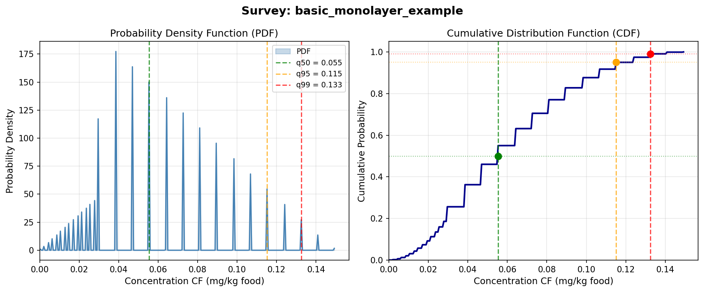
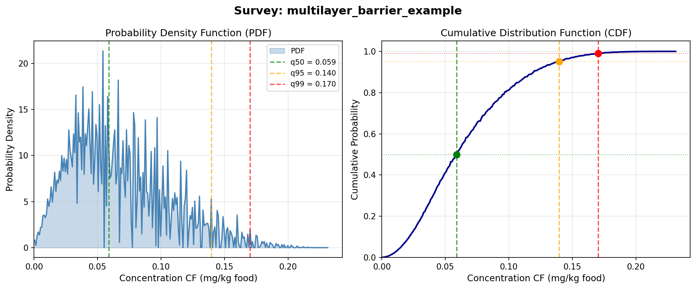

# Survey Examples — Batch Results

Generated: 2025-12-18 16:24:29

---

## Survey Inputs

| Scenario | Polymer | Thickness (µm) | Area (dm²) | Volume (L) | Temp (°C) | Simulant | Layers | t_mode (d) | t_max (d) | C0_mode | C0_max | N_sub |
|----------|---------|----------------|------------|------------|-----------|----------|--------|------------|-----------|---------|--------|-------|
| basic_monolayer_example | PP | 50.0 | 6.00 | 1.000 | 40 | oliveoil | 1 | 7.0 | 30.0 | 10.0 | 50.0 | 4 |
| multilayer_barrier_example | gPET | 230.0 | 6.00 | 1.000 | 40 | oliveoil | 2 | 30.0 | 90.0 | 50.0 | 200.0 | 3 |

---

## Survey Results — Migration Quantiles (mg/kg food)

| Scenario | Mean | q50 | q75 | q90 | q95 | q99 | Max |
|----------|------|-----|-----|-----|-----|-----|-----|
| basic_monolayer_example | 0.0598 | 0.0553 | 0.0811 | 0.1068 | 0.1152 | 0.1325 | 0.1496 |
| multilayer_barrier_example | 0.0657 | 0.0589 | 0.0885 | 0.1201 | 0.1395 | 0.1701 | 0.2318 |

---

## Substances per Scenario

| Scenario | N | Substances |
|----------|---|------------|
| basic_monolayer_example | 4 | M100.0_0, M150.0_1, M200.0_2, M250.0_3 |
| multilayer_barrier_example | 3 | 138-86-3, 55279-75-9, 75-07-0 |

---

## Visualizations

### basic_monolayer_example

### multilayer_barrier_example

---

*Generated by SFPPy Survey Module*