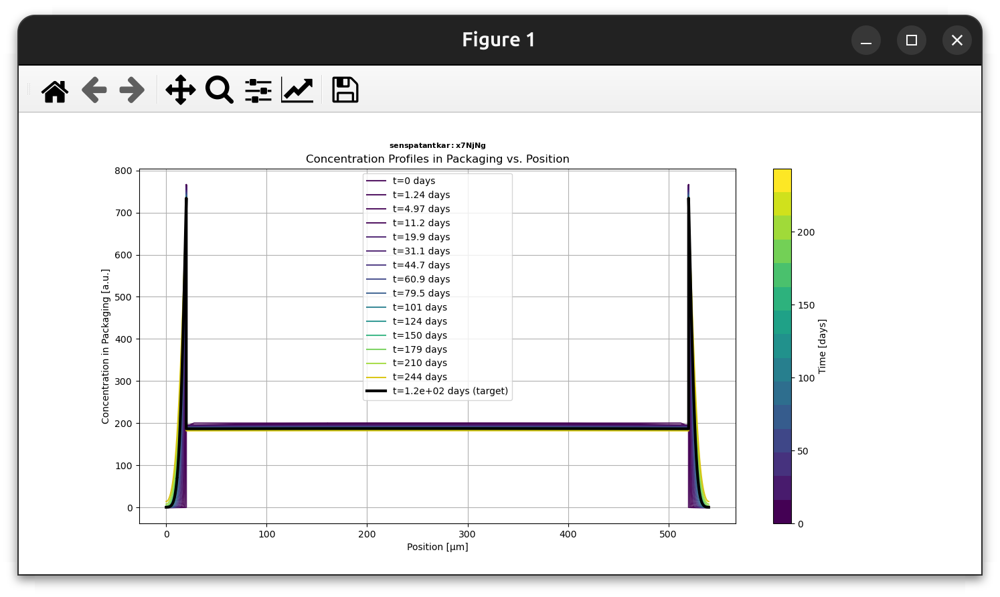
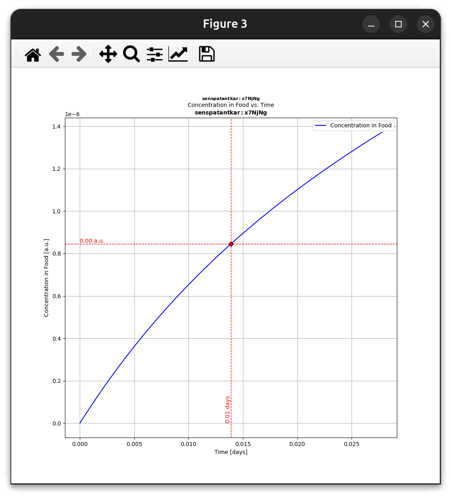
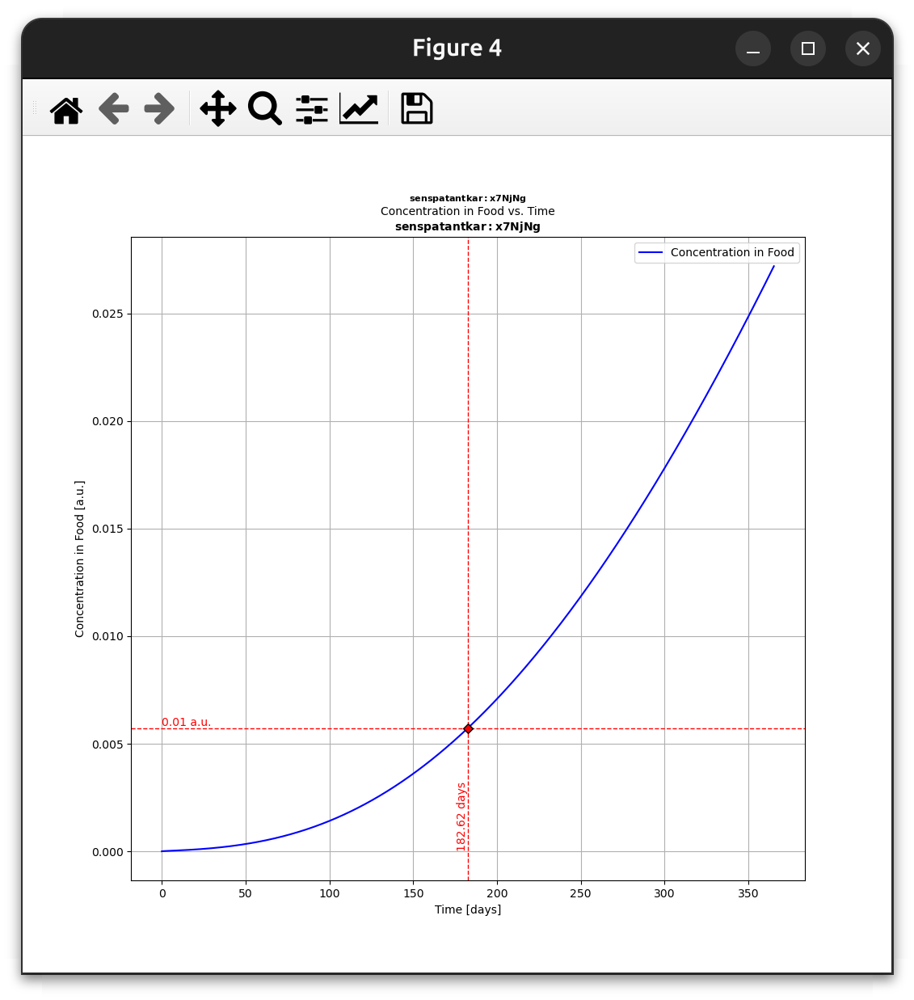
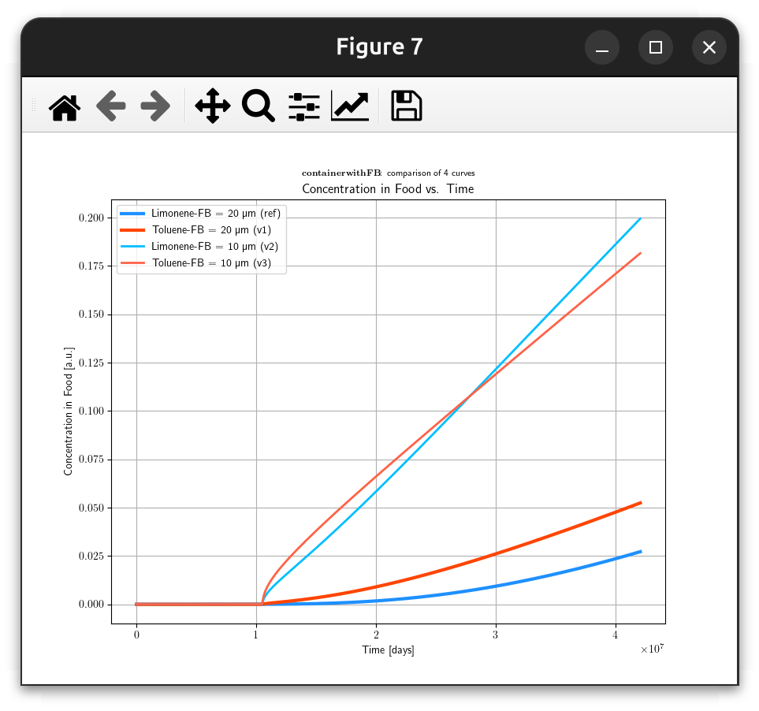
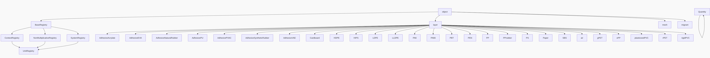
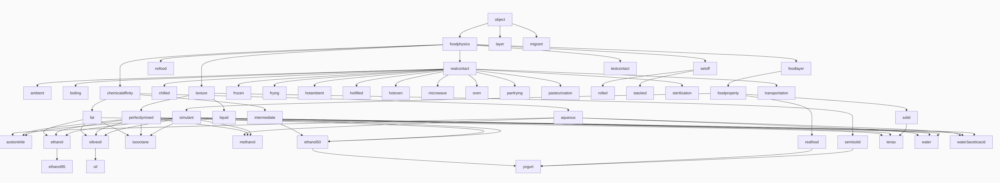

# 🔬📦**SFPPy Example 3: Advanced Migration Simulation with Variants** 🍏⏩🍎


***

[TOC]

***


## **Overview** 📖  

This example simulates the migration of **limonene** from a **recycled polypropylene (PP) core** to food, using a **trilayer packaging (ABA structure)** where **A = PET** and **B = PP**.  
The study follows **three consecutive storage and processing steps**:

1️⃣ **Storage at ambient temperature (20°C) for 4 months**  
2️⃣ **Hot-filling at 90°C with a fatty food**  
3️⃣ **Storage at 30°C for 6 months**  

The migration process is tracked for various conditions, including different **migrants (limonene/toluene)** and **layer thicknesses**.

### **Variants Studied** 🎭
- **Variant 1:** Replace **limonene** with **toluene**  
- **Variant 2:** Reduce **B’s thickness** from **20 µm to 10 µm**  
- **Variant 3:** Combine **Variant 1 and Variant 2**  

The results are compared in a **single figure** and exported to **Excel/CSV** for further analysis.

---

## **Key Features of SFPPy in This Example** 🚀
1. **Database Interactions** 📚
   - **3D geometries** (predefined packaging shapes) 📦  
   - **Chemical substances** (via PubChem) 🧪  
   - **Food contact conditions** 🍽️  
   - **Polymers and materials** 🔬  

2. **Pythonic Syntax & Operators** ⚡  
   - **`>>` Operator for Process Chaining**:
     - `mypackaging >> myfood >> mymaterial >> myfood`  
     - Transfers **geometry, temperature, and mass transfer** in a single step.
   - **`+` Operator for Combining Results**:
     - Merge layers (`ABA = A + B + A`)  
     - Combine simulation results (`fullsolution = foodcontact1.lastsimulation + foodcontact2.lastsimulation`)  

3. **Comprehensive Outputs** 📊
   - **Visual plots** 📈  
   - **Data export to Excel/CSV** 💾  

---

## **Step-by-Step Implementation** 🛠️

### **1️⃣ Define the Packaging Geometry** 📦
```python
from patankar.geometry import Packaging3D

container = Packaging3D('box_container', height=(8, "cm"), width=(10, "cm"), length=(19, "cm"))
```
🔹 **3D shape:** Open rectangular prism  
🔹 **Computed parameters:** **Volume & Contact Surface Area**  

---

### **2️⃣ Define the Migrant (Chemical Substance)** 🧪
```python
from patankar.loadpubchem import migrant

m = migrant("limonene")  # Retrieve properties from PubChem
```
🔹 **Chemical:** Limonene  
🔹 **Alternative (Variant 1):** Toluene  

---

### **3️⃣ Define the Polymer Layers** 🔬
```python
from patankar.layer import gPET, PP

A = gPET(l=(20, "um"), migrant=m, C0=0)       # PET layer (no initial migrant)
B = PP(l=(0.5, "mm"), migrant=m, CP0=200)    # PP layer with 200 mg/kg limonene

ABA = A + B + A  # Create trilayer structure
```
🔹 **Structure:** **ABA (PET-PP-PET)**  
🔹 **Thicknesses:** **PET = 20 µm**, **PP = 500 µm**  

> All layers are automatically populated with $D$ and $k$ values based on the chemical information available from **`m`** (migrant). Type `ABA` in the command line to see the details of the ABA structure.

```python
[LAYER object version=1, contact=olivier.vitrac@agroparistech.fr]
3-multilayer of LAYER object:
-- [ layer 1 of 3 ] ---------- barrier rank=2 --------------
      name: "layer in gPET"
      type: "polymer"
  material: "glassy PET"
      code: "PET"
         l: 2e-05 [meter]
         D: 1.933e-17 [m**2/s]
          = Dpiringer(gPET,<migrant: DA-75016 - M=136.23 g/mol>,T=40.0 degC)
         k: 0.5494 [a.u.]
          = kFHP(<ethylene terephthalate>,<migrant: DA-75016 - M=136.23 g/mol>)
        C0: 0 [a.u.]
         T: 40 [degC]
-- [ layer 2 of 3 ] ---------- barrier rank=3 --------------
      name: "layer in PP"
      type: "polymer"
  material: "isotactic polypropylene"
      code: "PP"
         l: 0.0005 [meter]
         D: 4.258e-13 [m**2/s]
          = Dpiringer(PP,<migrant: DA-75016 - M=136.23 g/mol>,T=40.0 degC)
         k: 2.161 [a.u.]
          = kFHP(<propylene>,<migrant: DA-75016 - M=136.23 g/mol>)
        C0: 200 [a.u.]
         T: 40 [degC]
-- [ layer 3 of 3 ] ---------- barrier rank=1 --------------
      name: "layer in gPET"
      type: "polymer"
  material: "glassy PET"
      code: "PET"
         l: 2e-05 [meter]
         D: 1.933e-17 [m**2/s]
          = Dpiringer(gPET,<migrant: DA-75016 - M=136.23 g/mol>,T=40.0 degC)
         k: 0.5494 [a.u.]
          = kFHP(<ethylene terephthalate>,<migrant: DA-75016 - M=136.23 g/mol>)
        C0: 0 [a.u.]
         T: 40 [degC]

Our ABA technology
 <multilayer with 3 layers: ['layer in gPET', 'layer in PP', 'layer in gPET']>
```


---

### **4️⃣ Define Food Contact Conditions** 🍽️
```python
from patankar.food import realfood, liquid, fat, ambient, hotfilled, stacked

class contact1(stacked, ambient):
    name = "1:setoff"
    *`contacttemperature`* = (20, "degC")
    *`contacttime`* = (3, "months")

class contact2(hotfilled, realfood, liquid, fat):
    name = "2:hotfilling"

class contact3(ambient, realfood, liquid, fat):
    name = "3:storage"
    *`contacttime`* = (6, "months")
```
🔹 **Three contact phases:**  
   - `contact1`: **Storage (20°C, 4 months)**  
   - `contact2`: **Hot-filling (90°C)**  
   - `contact3`: **Storage (30°C, 6 months)**  

---

### **5️⃣ Chain the Food with the Packaging** 🔗
```python
container >> contact1 >> contact2 >> contact3
```
🔹 **Automatically propagates packaging *`volume`* and surface area to food contact conditions.**  

---

### **6️⃣ Simulate Mass Transfer Step-by-Step** 🏁
```python
contact1 >> ABA >> contact1 >> contact2 >> contact3
```
🔹 **Performs:**  
   - **Transfers temperature** to the packaging  
   - **Simulates mass transfer**  
   - **Propagates results to next steps**  

📈 **Plot migration kinetics:**  
```python
contact1.lastsimulation.plotCx() # setoff condition
contact2.lastsimulation.plotCF() # hot-filling
contact3.lastsimulation.plotCF() # food storage
```








---

## **Variants & Comparisons** 🆚

### **🟢 Variant 1: Replace Limonene with Toluene**
```python
m2 = migrant("toluene")  
contact1 @ ABA.update(solute=m2) >> contact1 >> contact2 >> contact3
```

### **🟠 Variant 2: Reduce PP Thickness**
```python
newthickness = ABA.l.copy()
newthickness[[0, -1]] /= 2  # Reduce PET layers

contact1 >> ABA.copy(l=newthickness, migrant=m) >> contact1 >> contact2 >> contact3
```

### **🔴 Variant 3: Combine Both**
```python
contact1 @ ABA.copy(l=newthickness, migrant=m2) >> contact1 >> contact2 >> contact3
```

### **📊 Compare All Conditions**
```python
from patankar.migration import CFSimulationContainer as store

collection = store(name="comparison")
collection.add(contact1.lastsimulation + contact2.lastsimulation + contact3.lastsimulation, "Reference")
collection.add(contact1.lastsimulation + contact2.lastsimulation + contact3.lastsimulation, "Variant 1")
collection.add(contact1.lastsimulation + contact2.lastsimulation + contact3.lastsimulation, "Variant 2")
collection.add(contact1.lastsimulation + contact2.lastsimulation + contact3.lastsimulation, "Variant 3")

collection.plotCF()  # Plot all cases together
```



---

## **🛠️ Dependencies**
This example **relies on several SFPPy modules**:  

| Module                 | Purpose                                           |
| ---------------------- | ------------------------------------------------- |
| `patankar.loadpubchem` | Retrieves chemical properties from PubChem 🧪      |
| `patankar.geometry`    | Defines 3D packaging geometries 📦                 |
| `patankar.food`        | Models food properties and storage conditions 🍽️   |
| `patankar.layer`       | Defines polymer layers and migration parameters 🔬 |
| `patankar.migration`   | Solves mass transfer equations 📈                  |

🔹 **Install required dependencies:**  
```bash
pip install numpy scipy pandas matplotlib
```

---

## **📌 Summary**
✅ **Automated simulation chaining using `>>`**  
✅ **Comparison of different migrants & thicknesses**  
✅ **Dynamic updates using `update()`**  
✅ **Plotting & exporting results**  

This example showcases **SFPPy’s flexibility** in handling **multi-step migration simulations** with **minimal coding effort**. 🚀

🔗 **Next Steps:**  
- Run the code and explore **different materials, geometries, and food conditions**!  
- Modify thicknesses and simulate new **barrier efficiency scenarios**.  


## **Appendices**

### Appendix 1️⃣. Available Geometries 🥤🍹📦 in Module `geometry.py`

> 🏗️📏3**D geometries are calculated by combining basic shapes covering:**
>
> | Shape Type                | Examples |
> | ------------------------- | -------- |
> | **Basic Shapes**          | 🔺⚪🔷      |
> | **Cylindrical Shapes**    | 🍹🥤🥛      |
> | **Open Containers**       | 🏺🛢️🥡      |
> | **Prisms & Boxes**        | 📦🏠📚      |
> | **Spheres & Hemispheres** | 🌎⚽🏀      |
> | **Pyramids**              | 🏜️🔼🎪      |

```python
help_geometry()
```

| **Shape Class**      | **Synonyms**                                | **Required Params**         | **Description**                                              |
| -------------------- | ------------------------------------------- | --------------------------- | ------------------------------------------------------------ |
| **Cone**             | `cone`                                      | `radius`, `height`          | A full cone with a closed circular base.<br>**Volume:** (1/3) π r² h.<br>**Surface Area:** Base + lateral area. |
| **Cylinder**         | `can`, `cylinder`                           | `radius`, `height`          | A standard cylinder with top and bottom faces.<br>**Volume:** π r² h.<br>**Surface Area:** Includes top and bottom disks. |
| **Hemisphere**       | `bowl`, `hemisphere`                        | `radius`                    | A hemisphere (half a sphere) typically open at the flat side.<br>**Volume:** (2/3) π r³.<br>**Surface Area:** 3π r² (2πr² curved + πr² open). |
| **OpenCone**         | `open_cone`                                 | `radius`, `height`          | A cone with its base removed, leaving a single open circular face.<br>**Volume:** (1/3) π r² h.<br>**Surface Area:** π r * slant (no base). |
| **OpenCylinder1**    | `glass`, `jar`, `open_cylinder_1`, `pot`    | `radius`, `height`          | A cylinder with exactly one open end (like a glass).<br>**Volume:** π r² h.<br>**Surface Area:** 2πrh + πr². |
| **OpenCylinder2**    | `open_cylinder_2`, `straw`                  | `radius`, `height`          | A cylinder with two open ends (like a straw).<br>**Volume:** π r² h.<br>**Surface Area:** 2πrh (no top or bottom). |
| **OpenPrism1**       | `box_container`, `open_prism1`              | `length`, `width`, `height` | A rectangular prism with ONE open face (e.g., open top).<br>**Volume:** l * w * h.<br>**Surface Area:** 2(lw + lh + wh) - lw (remove top). |
| **OpenPrism2**       | `open_prism2`                               | `length`, `width`, `height` | A rectangular prism with TWO open faces (no top, no bottom).<br>**Volume:** l * w * h.<br>**Surface Area:** 2(lw + lh + wh) - 2(lw). |
| **OpenSquare1**      | `open_square1`                              | `side`, `height`            | A square-based box with ONE open face (like an open-top box).<br>**Volume:** side² * height.<br>**Surface Area:** side² + 4 * side * height. |
| **OpenSquare2**      | `open_square2`                              | `side`, `height`            | A square-based box with TWO open faces (no top, no bottom).<br>**Volume:** side² * height.<br>**Surface Area:** 4 * side * height. |
| **RectangularPrism** | `box`, `cube`, `prism`, `rectangular_prism` | `length`, `width`, `height` | A rectangular prism with all faces closed.<br>**Volume:** l * w * h.<br>**Surface Area:** 2(lw + lh + wh). |
| **Sphere**           | `sphere`                                    | `radius`                    | A full sphere.<br>**Volume:** (4/3) π r³.<br>**Surface Area:** 4π r². |
| **SquarePyramid**    | `square_pyramid`                            | `side`, `height`            | A square-based pyramid.<br>**Volume:** (side² * height) / 3.<br>**Surface Area:** Base + 4 triangles. |


### Appendix 2️⃣.  Implemented Layers Table🔬 in module `layer.py`

> **The concept of `layer` refers to materials (usually dense materials), where mass transfer occurs by diffusion.** Mass transfer in `layer` are described in <kbd>1D</kbd> by assuming that the packaging thickness is small comparatively to the food dimensions. Materials can associated in multiple layers and composite systems.
>
> | Layer Type               | Included                                                     |
> | ------------------------ | ------------------------------------------------------------ |
> | **Polymers & Materials** | 🏗️🛢️📜: thermoplastics (mono and copolymers)                    |
> | **Adhesives**            | 🩹🧴🛠️: thermoplastics and thermosets                           |
> | **Multilayers**          | 🏛️🔄📊: laminates, coated with an arbitrary number of layers and thicknesses |
> | **Packaging Layers**     | 📦🔗: assembly potentially separated with an air layer         |
>
> > 💡**Note 1**. that layers can combined with operator `+`. The layer on the most left is assumed to be contact with food (food is on the left).
> >
> > 🚨**Note 2**. For risk assessment, we assume that properties $D$ and $k$ are set in a way the risk of mass transfer (*i.e.*, the value of the concentration in the food layer $C_F$) is maximized.
> >
> > 📝**Note 3.** Food contact layers (🍽️🥗🥩) are described in <kbd>0D</kbd> with the class `foodlayer` from the module `food.py`.


```python
help_layer() # shows the table below
```

|                  Class Name |   Type   | Material                        |  Code   |
| --------------------------: | :------: | ------------------------------- | :-----: |
|        **AdhesiveAcrylate** | adhesive | acrylate adhesive               |  Acryl  |
|             **AdhesiveEVA** | adhesive | EVA adhesive                    |   EVA   |
|   **AdhesiveNaturalRubber** | adhesive | natural rubber adhesive         | rubber  |
|              **AdhesivePU** | adhesive | polyurethane adhesive           |   PU    |
|            **AdhesivePVAC** | adhesive | PVAc adhesive                   |  PVAc   |
| **AdhesiveSyntheticRubber** | adhesive | synthetic rubber adhesive       | sRubber |
|             **AdhesiveVAE** | adhesive | VAE adhesive                    |   VAE   |
|               **Cardboard** |  paper   | cardboard                       |  board  |
|                    **HDPE** | polymer  | high-*`density`* polyethylene       |  HDPE   |
|                    **HIPS** | polymer  | high-impact polystyrene         |  HIPS   |
|                    **LDPE** | polymer  | low-*`density`* polyethylene        |  LDPE   |
|                   **LLDPE** | polymer  | linear low-*`density`* polyethylene |  LLDPE  |
|                     **PA6** | polymer  | polyamide 6                     |   PA6   |
|                        PA66 | polymer  | polyamide 6,6                   |  PA6,6  |
|                     **PBT** | polymer  | polybutylene terephthalate      |   PBT   |
|                     **PEN** | polymer  | polyethylene naphthalate        |   PEN   |
|                      **PP** | polymer  | isotactic polypropylene         |   PP    |
|                **PPrubber** | polymer  | atactic polypropylene           |   aPP   |
|                      **PS** | polymer  | polystyrene                     |   PS    |
|                   **Paper** |  paper   | paper                           |  paper  |
|                     **SBS** | polymer  | styrene-based polymer SBS       |   SBS   |
|                     **air** |   air    | ideal gas                       |   gas   |
|                    **gPET** | polymer  | glassy PET                      |   PET   |
|                     **oPP** | polymer  | bioriented polypropylene        |   oPP   |
|          **plasticizedPVC** | polymer  | plasticized PVC                 |  pPVC   |
|                    **rPET** | polymer  | rubbery PET                     |  rPET   |
|                **rigidPVC** | polymer  | rigid PVC                       |   PVC   |

**Graphical representation of classes dependence:**



### Appendix 3️⃣. Food Contact Properties Table 🍽️  in module `foodlayer.py`

> The 🍞 food, 🍽️🥣 contact conditions and ❄️use are defined via keywords **`foodphysics`**  🧪⚙️, **`fat`** 🍶🥩, **`hotfilled`**🔥🥣, **`sterilization`**  🏥♨️ covering;
>
> | Category                | Suggested Emojis |
> | ----------------------- | ---------------- |
> | **General Physics**     | 🧪⚙️🌡️              |
> | **Chemical Affinity**   | 🧲🔬🧫              |
> | **Food Types**          | 🍎🥩🍗 🥛🍞🍕🧈🧀 🍦      |
> | **Storage Conditions**  | ❄️🔥🌡️📦             |
> | **Simulants**           | 🥃🧴🍷🌊             |
> | **Boundary Conditions** | 🚧🔗⚡              |
>
> > 💡**Note**. The `foodphysics` and `foodlayer` classes are the parent classes for all keywords. Several keywords can be combined together to generate new classes of food or food conditions. New classes can be derived directly by the user.  

```python
help_foodlayer()
```

|           Class Name |         Name          | Description                                                  |  Level   |                 Inheritance                  | Init Params                                                  |
| -------------------: | :-------------------: | ------------------------------------------------------------ | :------: | :------------------------------------------: | :----------------------------------------------------------- |
|      **foodphysics** |     food physics      | Root physics class<br>used to implement<br>food and mass<br>transfer physics |   base   |                    object                    |                                                              |
|          **aqueous** |    aqueous contact    | minimize mass<br>transfer                                    |   root   |               chemicalaffinity               | $k$                                                          |
| **chemicalaffinity** |       undefined       | default chemical<br>affinity                                 |   root   |                 foodphysics                  | $k$                                                          |
|              **fat** |      fat contact      | maximize mass<br>transfer                                    |   root   |               chemicalaffinity               | $k$                                                          |
|        **foodlayer** |  generic food layer   | root food class                                              |   root   |                 foodphysics                  | *`volume`*, *`surfacearea`*,<br>*`density`*, $C_F0$,<br>*`contacttime`* |
|     **intermediate** |     intermediate      | intermediate<br>chemical affinity                            |   root   |               chemicalaffinity               | $k$                                                          |
|           **liquid** |      liquid food      | liquid food products                                         |   root   |                   texture                    | $h$                                                          |
|           **nofood** |       undefined       | impervious boundary<br>condition                             |   root   |                 foodphysics                  | $h$                                                          |
|   **perfectlymixed** |    perfectly mixed    | maximize mixing,<br>minimize the mass<br>transfer boundary<br>layer |   root   |                   texture                    | $h$                                                          |
|      **realcontact** |  contact conditions   | real storage<br>conditions                                   |   root   |                 foodphysics                  | *`contacttemperature`*,<br>*`contacttime`*                   |
|        **semisolid** |      solid food       | solid food products                                          |   root   |                   texture                    | $h$                                                          |
|           **setoff** |        setoff         | periodic boundary<br>conditions                              |   root   |                 foodphysics                  | $h$                                                          |
|      **testcontact** |   migration testing   | migration testing<br>conditions                              |   root   |                 foodphysics                  | *`contacttemperature`*,<br>*`contacttime`*                   |
|          **texture** |       undefined       | default class<br>texture                                     |   root   |                 foodphysics                  | $h$                                                          |
|     **foodproperty** |  generic food layer   | root food class                                              | property |                  foodlayer                   | *`volume`*, *`surfacearea`*,<br>*`density`*, $C_F0$,<br>*`contacttime`* |
|         **realfood** |  generic food layer   | real food class                                              | property |                 foodproperty                 | *`volume`*, *`surfacearea`*,<br>*`density`*, $C_F0$,<br>*`contacttime`* |
|         **simulant** | generic food simulant | food simulant                                                | property |                 foodproperty                 | *`volume`*, *`surfacearea`*,<br>*`density`*, $C_F0$,<br>*`contacttime`* |
|            **solid** |      solid food       | solid food products                                          | property |                 foodproperty                 | *`volume`*, *`surfacearea`*,<br>*`density`*, $h$, $C_F0$,<br>*`contacttime`* |
|          **ambient** |        ambient        | ambient storage<br>conditions                                | contact  |                 realcontact                  | *`contacttemperature`*,<br>*`contacttime`*                   |
|          **boiling** |        boiling        | boiling conditions                                           | contact  |                 realcontact                  | *`contacttemperature`*,<br>*`contacttime`*                   |
|          **chilled** |        ambient        | ambient storage<br>conditions                                | contact  |                 realcontact                  | *`contacttemperature`*,<br>*`contacttime`*                   |
|           **frozen** |        frozen         | freezing storage<br>conditions                               | contact  |                 realcontact                  | *`contacttemperature`*,<br>*`contacttime`*                   |
|           **frying** |        frying         | frying conditions                                            | contact  |                 realcontact                  | *`contacttemperature`*,<br>*`contacttime`*                   |
|       **hotambient** |      hot ambient      | hot ambient storage<br>conditions                            | contact  |                 realcontact                  | *`contacttemperature`*,<br>*`contacttime`*                   |
|        **hotfilled** |       hotfilled       | hot-filling<br>conditions                                    | contact  |                 realcontact                  | *`contacttemperature`*,<br>*`contacttime`*                   |
|          **hotoven** |       hot oven        | hot oven conditions                                          | contact  |                 realcontact                  | *`contacttemperature`*,<br>*`contacttime`*                   |
|        **microwave** |       microwave       | microwave-oven<br>conditions                                 | contact  |                 realcontact                  | *`contacttemperature`*,<br>*`contacttime`*                   |
|             **oven** |         oven          | oven conditions                                              | contact  |                 realcontact                  | *`contacttemperature`*,<br>*`contacttime`*                   |
|        **panfrying** |       panfrying       | panfrying conditions                                         | contact  |                 realcontact                  | *`contacttemperature`*,<br>*`contacttime`*                   |
|   **pasteurization** |    pasteurization     | pasteurization<br>conditions                                 | contact  |                 realcontact                  | *`contacttemperature`*,<br>*`contacttime`*                   |
|    **sterilization** |     sterilization     | sterilization<br>conditions                                  | contact  |                 realcontact                  | *`contacttemperature`*,<br>*`contacttime`*                   |
|   **transportation** |  hot transportation   | hot transportation<br>storage conditions                     | contact  |                 realcontact                  | *`contacttemperature`*,<br>*`contacttime`*                   |
|     **acetonitrile** |     acetonitrile      | acetonitrile                                                 |   user   |   simulant,<br>perfectlymixed,<br>aqueous    | *`volume`*, *`surfacearea`*,<br>*`density`*, $h$, $k$, $k_0$,<br>$C_F0$, *`contacttime`* |
|          **ethanol** |        ethanol        | ethanol = from pure<br>ethanol down to<br>ethanol 95%        |   user   |       simulant,<br>perfectlymixed, fat       | *`volume`*, *`surfacearea`*,<br>*`density`*, $h$, $k$, $k_0$,<br>$C_F0$, *`contacttime`* |
|        **ethanol50** |      ethanol 50       | ethanol 50, food<br>simulant of dairy<br>products            |   user   | simulant,<br>perfectlymixed,<br>intermediate | *`volume`*, *`surfacearea`*,<br>*`density`*, $h$, $k$, $k_0$,<br>$C_F0$, *`contacttime`* |
|        **ethanol95** |        ethanol        | ethanol = from pure<br>ethanol down to<br>ethanol 95%        |   user   |                   ethanol                    | *`volume`*, *`surfacearea`*,<br>*`density`*, $h$, $k$, $k_0$,<br>$C_F0$, *`contacttime`* |
|        **isooctane** |       isooctane       | isooctane food<br>simulant                                   |   user   |       simulant,<br>perfectlymixed, fat       | *`volume`*, *`surfacearea`*,<br>*`density`*, $h$, $k$, $k_0$,<br>$C_F0$, *`contacttime`* |
|         **methanol** |       methanol        | methanol                                                     |   user   |   simulant,<br>perfectlymixed,<br>aqueous    | *`volume`*, *`surfacearea`*,<br>*`density`*, $h$, $k$, $k_0$,<br>$C_F0$, *`contacttime`* |
|              **oil** |       olive oil       | olive oil food<br>simulant                                   |   user   |                  oiliveoil                   | *`volume`*, *`surfacearea`*,<br>*`density`*, $h$, $k$, $k_0$,<br>$C_F0$, *`contacttime`* |
|        **oiliveoil** |       olive oil       | olive oil food<br>simulant                                   |   user   |       simulant,<br>perfectlymixed, fat       | *`volume`*, *`surfacearea`*,<br>*`density`*, $h$, $k$, $k_0$,<br>$C_F0$, *`contacttime`* |
|           **rolled** |        rolled         | storage in rolls                                             |   user   |                    setoff                    | $h$                                                          |
|          **stacked** |        stacked        | storage in stacks                                            |   user   |                    setoff                    | $h$                                                          |
|            **tenax** |         Tenax         | simulant of dry food<br>products                             |   user   |             simulant, solid, fat             | *`volume`*, *`surfacearea`*,<br>*`density`*, $h$, $k$, $k_0$,<br>$C_F0$, *`contacttime`* |
|            **water** |         water         | water food simulant                                          |   user   |   simulant,<br>perfectlymixed,<br>aqueous    | *`volume`*, *`surfacearea`*,<br>*`density`*, $h$, $k$, $k_0$,<br>$C_F0$, *`contacttime`* |
| **water3aceticacid** | water 3% acetic acid  | water 3% acetic acid<br>- simulant for<br>acidic aqueous foods |   user   |   simulant,<br>perfectlymixed,<br>aqueous    | *`volume`*, *`surfacearea`*,<br>*`density`*, $h$, $k$, $k_0$,<br>$C_F0$, *`contacttime`* |
|           **yogurt** |      solid food       | yogurt                                                       |   user   |      realfood, semisolid,<br>ethanol50       | *`volume`*, *`surfacearea`*,<br>*`density`*, $h$, $k$, $k_0$,<br>$C_F0$, *`contacttime`* |

**Graphical representation of the classes dependence:**




---
✨ **Happy Simulating!** 🎉🔬

***

<div style="border: 2px solid #4CAF50; border-radius: 8px; padding: 10px; background: linear-gradient(to right, #4CAF50, #FF4D4D); color: white; text-align: center; font-weight: bold;">
  <span style="font-size: 20px;">🍏⏩🍎 <strong>SFPPy for Food Contact Compliance and Risk Assessment</strong></span><br>
  Contact <a href="mailto:olivier.vitrac@gmail.com" style="color: #fff; text-decoration: underline;">Olivier Vitrac</a> for questions |
  <a href="https://github.com/ovitrac/SFPPy" style="color: #fff; text-decoration: underline;">Website</a> |
  <a href="https://ovitrac.github.io/SFPPy/" style="color: #fff; text-decoration: underline;">Documentation</a>
</div>
